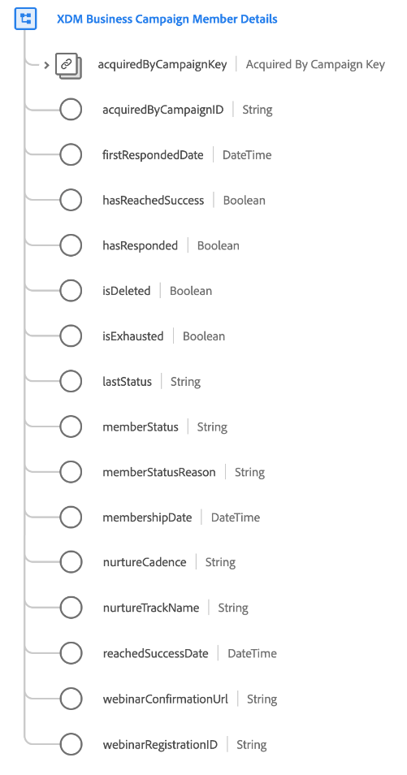

# [!UICONTROL XDM Business Campaign成員詳細資訊] 方案欄位組

[!UICONTROL XDM Business Campaign成員詳細資訊] 是的標準架構欄位組 [[!UICONTROL XDM Business Campaign成員] 類](../../classes/b2b/business-campaign-members.md)，可擷取有關商業促銷活動的詳細資訊。

| 屬性 | 資料類型 | 說明 |
| --- | --- | --- |
| `acquiredByCampaignKey` | [[!UICONTROL B2B源]](../../data-types/b2b-source.md) | 獲得此促銷活動成員的促銷活動的複合ID。 |
| `acquiredByCampaignID` | [!UICONTROL 字串] | 獲取此促銷活動成員的促銷活動的字串標識符。 |
| `firstRespondedDate` | [!UICONTROL DateTime] | 人員首次回應促銷活動時的ISO 8601時間戳記。 |
| `hasReachedSuccess` | [!UICONTROL 布林值] | 指出此促銷活動成員是否成功轉換。 |
| `hasResponded` | [!UICONTROL 布林值] | 指出此促銷活動成員是否已回應促銷活動。 |
| `isDeleted` | [!UICONTROL 布林值] | 指示是否已在Marketo Engage中刪除此促銷活動成員。  使用 [Marketo來源連接器](../../../sources/connectors/adobe-applications/marketo/marketo.md),Marketo中刪除的任何記錄都會自動反映在即時客戶個人檔案中。 不過，與這些設定檔相關的記錄仍可能會保留在Data Lake。 設定 `isDeleted` to `true`，您可以使用欄位來篩選已在查詢資料湖時從來源刪除的記錄。 |
| `isExhausted` | [!UICONTROL 布林值] | 指出此促銷活動成員是否已用盡所有促銷活動互動。 |
| `lastStatus` | [!UICONTROL 字串] | 促銷活動成員的最後狀態。 |
| `memberStatus` | [!UICONTROL 字串] | 促銷活動成員的當前狀態。 |
| `memberStatusReason` | [!UICONTROL 字串] | 促銷活動成員當前狀態背後的原因。 |
| `membershipDate` | [!UICONTROL DateTime] | 促銷活動成員當前狀態背後的原因。 |
| `nurtureCadence` | [!UICONTROL 字串] | 向促銷活動成員呈現促銷活動相關資訊的時間範圍。 |
| `nurtureTrackName` | [!UICONTROL 字串] | 該競選成員所接受的培養計畫的名稱。 |
| `reachedSuccessDate` | [!UICONTROL DateTime] | 促銷活動成員成功轉換時的ISO 8601時間戳記。 |
| `webinarConfirmationUrl` | [!UICONTROL 字串] | 促銷活動成員的網路研討會確認URL。 |
| `webinarRegistrationID` | [!UICONTROL 字串] | 促銷活動成員的網路研討會註冊ID。 |

{style="table-layout:auto"}

如需欄位群組的詳細資訊，請參閱公用XDM存放庫：

* [填入範例](https://github.com/adobe/xdm/blob/master/components/fieldgroups/campaign-member/campaign-member-details.example.1.json)
* [完整結構](https://github.com/adobe/xdm/blob/master/components/fieldgroups/campaign-member/campaign-member-details.schema.json)
