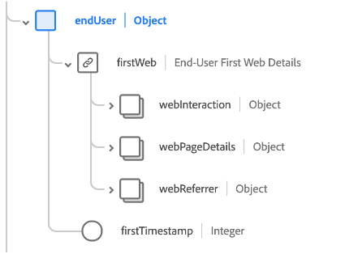
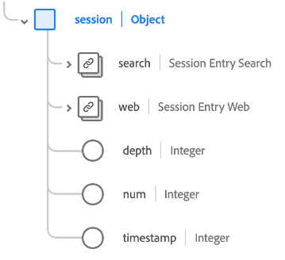

# [!UICONTROL Adobe Analytics ExperienceEvent完整擴充功能]結構描述欄位群組

[!UICONTROL Adobe Analytics ExperienceEvent Full Extension]是[[!DNL XDM ExperienceEvent] 類別](../../classes/experienceevent.md)的標準結構描述欄位群組，可擷取Adobe Analytics所收集的一般量度。

本檔案說明Analytics擴充功能欄位群組的結構和使用案例。

>[!NOTE]
>
>由於此欄位群組中重複元素的大小和數量，本指南中顯示的許多欄位已收合以節省空間。 若要探索此欄位群組的完整結構，您可以[在Platform UI](../../ui/explore.md)中查詢它，或在[公用XDM存放庫](https://github.com/adobe/xdm/blob/master/extensions/adobe/experience/analytics/experienceevent-all.schema.json)中檢視完整的結構描述。

## 欄位群組結構

欄位群組提供單一`_experience`物件給結構描述，其本身包含單一`analytics`物件。

| 屬性 | 資料類型 | 說明 |
| --- | --- | --- |
| `customDimensions` | 物件 | 擷取Analytics追蹤的自訂維度。 如需此物件內容的詳細資訊，請參閱](#custom-dimensions)下方的[子區段。 |
| `endUser` | 物件 | 擷取觸發事件之一般使用者的網頁互動細節。 如需此物件內容的詳細資訊，請參閱](#end-user)下方的[子區段。 |
| `environment` | 物件 | 擷取關於觸發事件的瀏覽器和作業系統的資訊。 如需此物件內容的詳細資訊，請參閱](#environment)下方的[子區段。 |
| `event1to100`  `event101to200`  `event201to300`  `event301to400`  `event401to500`  `event501to100`  `event601to700`  `event701to800`  `event801to900`  `event901to1000` | 物件 | 欄位群組提供物件欄位，用以擷取最多1000個自訂事件。 如需這些欄位的詳細資訊，請參閱](#events)下方的[子區段。 |
| `session` | 物件 | 擷取觸發事件的工作階段相關資訊。 如需此物件內容的詳細資訊，請參閱](#session)下方的[子區段。 |

{style="table-layout:auto"}

## `customDimensions` {#custom-dimensions}

`customDimensions`擷取Analytics追蹤的自訂[維度](https://experienceleague.adobe.com/docs/analytics/components/dimensions/overview.html)。

| 屬性 | 資料類型 | 說明 |
| --- | --- | --- |
| `eVars` | 物件 | 擷取最多250個轉換變數([eVars](https://experienceleague.adobe.com/docs/analytics/components/dimensions/evar.html?lang=zh-Hant))的物件。 此物件的屬性是以`eVar1`為`eVar250`的鍵值，而且只接受其資料型別的字串。 |
| `hierarchies` | 物件 | 擷取最多五個自訂階層變數（[階層](https://experienceleague.adobe.com/docs/analytics/implementation/vars/page-vars/hier.html)）的物件。 此物件的屬性是以`hier1`為`hier5`的鍵值，這些物件本身就是具有下列子屬性的物件：<ul><li>`delimiter`：用來產生`values`下所提供清單的原始分隔符號。</li><li>`values`：階層層級名稱的分隔清單，以字串表示。</li></ul> |
| `listProps` | 物件 | 擷取最多75個[清單prop](https://experienceleague.adobe.com/docs/analytics/implementation/vars/page-vars/prop.html#list-props)的物件。 此物件的屬性是以`prop1`為`prop75`的鍵值，這些物件本身就是具有下列子屬性的物件：<ul><li>`delimiter`：用來產生`values`下所提供清單的原始分隔符號。</li><li>`values`： prop的分隔值清單，以字串表示。</li></ul> |
| `lists` | 物件 | 擷取最多三個[清單](https://experienceleague.adobe.com/docs/analytics/implementation/vars/page-vars/list.html)的物件。 此物件的屬性是以`list1`為`list3`的鍵值。 每個屬性都包含單一`list`陣列，內含[[!UICONTROL 機碼值組]](../../data-types/key-value-pair.md)資料型別。 |
| `props` | 物件 | 擷取最多75個[prop](https://experienceleague.adobe.com/docs/analytics/implementation/vars/page-vars/prop.html)的物件。 此物件的屬性是以`prop1`為`prop75`的鍵值，而且只接受其資料型別的字串。 |
| `postalCode` | 字串 | 使用者端提供的郵遞區號。 |
| `stateProvince` | 字串 | 使用者端提供的州或省位置。 |

{style="table-layout:auto"}

## `endUser` {#end-user}

`endUser`會擷取觸發事件之一般使用者的網頁互動詳細資料。

| 屬性 | 資料類型 | 說明 |
| --- | --- | --- |
| `firstWeb` | [[!UICONTROL 網頁資訊]](../../data-types/web-information.md) | 和來自此一般使用者的第一個體驗事件的網頁、連結及反向連結相關的資訊。 |
| `firstTimestamp` | 整數 | 此一般使用者的第一個ExperienceEvent的Unix時間戳記。 |

## `environment` {#environment}

`environment`會擷取觸發事件的瀏覽器和作業系統的相關資訊。

| 屬性 | 資料類型 | 說明 |
| --- | --- | --- |
| `browserIDStr` | 字串 | 所用瀏覽器的Adobe Analytics識別碼（亦稱為[瀏覽器型別維度](https://experienceleague.adobe.com/docs/analytics/components/dimensions/browser-type.html)）。 |
| `operatingSystemIDStr` | 字串 | 所使用作業系統的Adobe Analytics識別碼（亦稱為[作業系統型別維度](https://experienceleague.adobe.com/docs/analytics/components/dimensions/operating-system-types.html)）。 |

## 自訂事件欄位 {#events}

Analytics擴充功能欄位群組提供10個物件欄位，每個欄位最多可擷取100個[自訂事件量度](https://experienceleague.adobe.com/docs/analytics/components/metrics/custom-events.html)，總計為1000個。

每個頂層事件物件包含其各自範圍的個別事件物件。 例如，`event101to200`包含從`event101`輸入至`event200`的事件。

每個偶數物件都使用[[!UICONTROL Measure]](../../data-types/measure.md)資料型別，提供唯一識別碼和可量化的值。

## `session` {#session}

`session`擷取觸發事件的工作階段相關資訊。

| 屬性 | 資料類型 | 說明 |
| --- | --- | --- |
| `search` | [[!UICONTROL 搜尋]](../../data-types/search.md) | 擷取與工作階段專案的網頁或行動搜尋相關的資訊。 |
| `web` | [[!UICONTROL 網頁資訊]](../../data-types/web-information.md) | 擷取有關工作階段專案的連結點按次數、網頁詳細資料、反向連結資訊和瀏覽器詳細資訊。 |
| `depth` | 整數 | 一般使用者目前的作業階段深度（例如頁碼）。 |
| `num` | 整數 | 一般使用者目前的作業階段編號。 |
| `timestamp` | 整數 | 工作階段專案的Unix時間戳記。 |

## 後續步驟

本檔案說明Analytics擴充功能欄位群組的結構和使用案例。 如需欄位群組本身的詳細資訊，請參閱[公用XDM存放庫](https://github.com/adobe/xdm/blob/master/extensions/adobe/experience/analytics/experienceevent-all.schema.json)。

如果您使用此欄位群組來使用Adobe Experience Platform Web SDK收集Analytics資料，請參閱[設定資料流](../../../datastreams/overview.md)的指南，以瞭解如何將資料對應到伺服器端的XDM。
