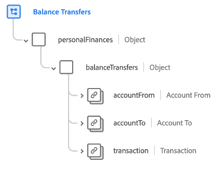

# [!UICONTROL 餘額轉帳] 結構描述欄位群組

[!UICONTROL 餘額轉帳] 是的標準結構描述欄位群組 [[!DNL XDM ExperienceEvent] 類別](../../classes/experienceevent.md). 欄位群組提供單一 `personalFinances.balanceTransfers` 物件至結構描述，擷取帳戶間財務餘額轉帳的詳細資料。

| 屬性 | 資料類型 | 說明 |
| --- | --- | --- |
| `accountFrom` | [[!UICONTROL 財務帳戶]](../../data-types/financial-account.md) | 說明餘額轉移來源的財務帳戶。 |
| `accountTo` | [[!UICONTROL 財務帳戶]](../../data-types/financial-account.md) | 描述餘額將轉移到的財務帳戶。 |
| `transaction` | [[!UICONTROL 交易]](../../data-types/transaction.md) | 描述與餘額拋轉相關的財務交易。 |

{style="table-layout:auto"}

如需欄位群組的詳細資訊，請參閱 [公用XDM存放庫](https://github.com/adobe/xdm/blob/master/docs/reference/fieldgroups/experience-event/industry-verticals/experienceevent-balance-transfers.schema.json).
