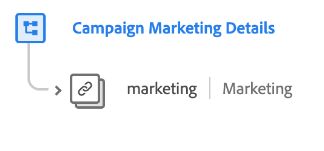

# [!UICONTROL 行銷活動行銷細節] 結構描述欄位群組

>[!NOTE]
>
>數個結構描述欄位群組的名稱已變更。 檢視檔案： [欄位群組名稱更新](../name-updates.md) 以取得詳細資訊。

[!UICONTROL 行銷活動行銷細節] 是的標準結構描述欄位群組 [[!DNL XDM ExperienceEvent] 類別](../../classes/experienceevent.md)，用於說明行銷活動資訊，例如行銷活動群組、名稱和追蹤代碼。

| 屬性 | 資料型別 | 說明 |
| --- | --- | --- |
| `marketing` | [行銷](../../data-types/marketing.md) | 說明行銷活動資訊（例如，行銷活動群組、名稱和追蹤代碼）的物件。 |

{style="table-layout:auto"}

如需欄位群組的詳細資訊，請參閱公用XDM存放庫：

* [填入範例](https://github.com/adobe/xdm/blob/master/components/fieldgroups/experience-event/experienceevent-marketing.example.1.json)
* [完整結構描述](https://github.com/adobe/xdm/blob/master/components/fieldgroups/experience-event/experienceevent-marketing.schema.json)
