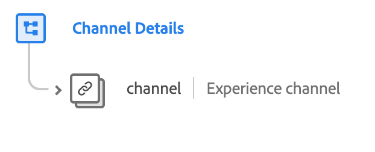

# [!UICONTROL Channel Details] schema field group

>[!NOTE]
>
>數個架構欄位組的名稱已變更。 See the document on [field group name updates](../name-updates.md) for more information.

[!UICONTROL 管道] 詳細資訊：類別的標準架 [[!DNL XDM ExperienceEvent] 構欄位群組](../../classes/experienceevent.md)，用來說明管道資訊，例如ID、管道類型、媒體類型和位置類型。

| 屬性 | 資料類型 | 說明 |
| --- | --- | --- |
| `channel` | [體驗管道](../../data-types/experience-channel.md) | 描述產品退貨、保修註冊和購物車/訂單流程的對象。 |

{style=&quot;table-layout:auto&quot;}

For more details on the field group, refer to the public XDM repository:

* [填入範例](https://github.com/adobe/xdm/blob/master/components/fieldgroups/experience-event/experienceevent-channel.example.1.json)
* [完整結構](https://github.com/adobe/xdm/blob/master/components/fieldgroups/experience-event/experienceevent-channel.schema.json)
