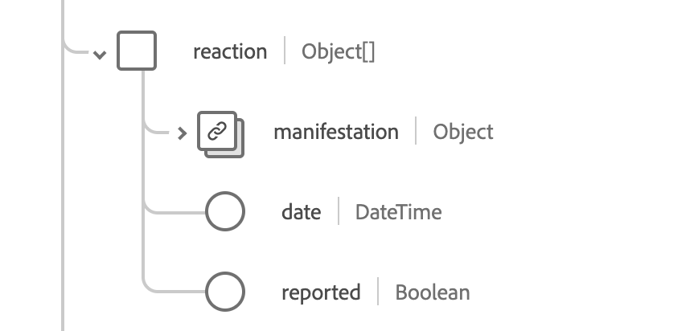

# [!UICONTROL 免疫]結構描述欄位群組

[!UICONTROL 免疫]是[[!DNL XDM Experience Event] 類別](../../classes/experienceevent.md)的標準結構描述欄位群組。 它提供單一物件型別欄位`healthcareImmunization`，以擷取免疫接種事件資訊。

| 顯示名稱 | 屬性 | 資料類型 | 說明 |
| --- | --- | --- | --- |
| [!UICONTROL 管理的產品] | `administeredProduct` | [[!UICONTROL 可程式碼參考]](../../data-types/healthcare/codeable-reference.md) | 受管理的產品。 |
| [!UICONTROL 根據] | `basedOn` | [[!UICONTROL 參考]](../../data-types/healthcare/reference.md)的陣列 | 免疫事件所依據的許可權。 |
| [!UICONTROL 劑量數量] | `doseQuantity` | [[!UICONTROL 簡單數量]](../../data-types/healthcare/simple-quantity.md) | 接種疫苗的量。 |
| [!UICONTROL 相遇] | `encounter` | [[!UICONTROL 參考]](../../data-types/healthcare/reference.md) | 免疫接種是其中一部份。 |
| [!UICONTROL 為Source提供資金] | `fundingSource` | [[!UICONTROL 可程式碼概念]](../../data-types/healthcare/codeable-concept.md) | 疫苗的資金來源。 |
| [!UICONTROL 識別碼] | `identifier` | [[!UICONTROL 識別碼]](../../data-types/healthcare/identifier.md)的陣列 | 商業識別碼。 |
| [!UICONTROL 資訊Source] | `informationSource` | [[!UICONTROL 可程式碼參考]](../../data-types/healthcare/codeable-reference.md) | 表示報告記錄的來源。 |
| [!UICONTROL 位置] | `location` | [[!UICONTROL 參考]](../../data-types/healthcare/reference.md) | 發生免疫接種的位置。 |
| [!UICONTROL 製造商] | `manufacturer` | [[!UICONTROL 可程式碼參考]](../../data-types/healthcare/codeable-reference.md) | 疫苗製造商。 |
| [!UICONTROL 備註] | `note` | [[!UICONTROL 註解]](../../data-types/healthcare/annotation.md)的陣列 | 其他免疫接種注意事項。 |
| [!UICONTROL 病人] | `patient` | [[!UICONTROL 參考]](../../data-types/healthcare/reference.md) | 誰已接受免疫。 |
| [!UICONTROL 批次] | `performer` | 物件陣列 | 誰執行了免疫接種事件。 如需詳細資訊，請參閱](#performer)下方的[區段。 |
| [!UICONTROL 方案資格] | `programEligibility` | 物件陣列 | 患者符合特定疫苗接種計畫的資格。 如需詳細資訊，請參閱](#program-eligibility)下方的[區段。 |
| 已套用[!UICONTROL 通訊協定] | `protocolApplied` | 物件陣列 | 提供者提供的通訊協定。 如需詳細資訊，請參閱](#protocol-applied)下方的[區段。 |
| [!UICONTROL 回應] | `reaction` | 物件陣列 | 免疫接種後的反應細節。 如需詳細資訊，請參閱](#reaction)下方的[區段。 |
| [!UICONTROL 原因] | `reason` | [[!UICONTROL 可程式碼參考的陣列]](../../data-types/healthcare/codeable-reference.md) | 免疫接種的原因。 |
| [!UICONTROL 路由] | `route` | [[!UICONTROL 可程式碼概念]](../../data-types/healthcare/codeable-concept.md) | 疫苗如何進入人體。 |
| [!UICONTROL 網站] | `site` | [[!UICONTROL 可程式碼概念]](../../data-types/healthcare/codeable-concept.md) | 接種疫苗的身體網站 |
| [!UICONTROL 狀態原因] | `statusReason` | [[!UICONTROL 可程式碼概念]](../../data-types/healthcare/codeable-concept.md) | 目前狀態的原因。 |
| [!UICONTROL 次冪原因] | `subpotentReason` | [[!UICONTROL 可程式碼概念]](../../data-types/healthcare/codeable-concept.md)的陣列 | 疫苗具有潛能性的原因。 |
| [!UICONTROL 支援資訊] | `supportingInformation` | [[!UICONTROL 參考]](../../data-types/healthcare/reference.md)的陣列 | 支援免疫接種的其他資訊。 |
| [!UICONTROL 疫苗代碼] | `vaccineCode` | [[!UICONTROL 可程式碼概念]](../../data-types/healthcare/codeable-concept.md) | 所接種疫苗的程式碼。 |
| [!UICONTROL 到期日] | `expirationDate` | 日期 | 疫苗的有效期。 |
| [!UICONTROL 是次冪] | `isSubpotent` | 布林值 | 指示疫苗是否為潛能疫苗。 |
| [!UICONTROL 批號] | `lotNumber` | 字串 | 疫苗的批號。 |
| [!UICONTROL 發生日期時間] | `occurenceDateTime` | 日期時間 | 疫苗管理日期。 |
| [!UICONTROL 出現字串] | `occurenceString` | 字串 | 疫苗管理日期。 |
| [!UICONTROL 主要Source] | `primarySource` | 布林值 | 表示資料是否從主要來源擷取。 |
| [!UICONTROL 狀態] | `status` | 字串 | 免疫接種的狀態。 此屬性的值必須等於下列其中一個已知列舉值。 <li> `completed` </li> <li> `entered-in-error` </li> <li> `not-done` </li> |

如需欄位群組的詳細資訊，請參閱公用XDM存放庫：

* [已填入範例](https://github.com/adobe/xdm/blob/master/extensions/industry/healthcare/fhir/fieldgroups/immunization.example.1.json)
* [完整結構描述](https://github.com/adobe/xdm/blob/master/extensions/industry/healthcare/fhir/fieldgroups/immunization.schema.json)

## `performer` {#performer}

`performer`是以物件陣列的形式提供。 每個物件的結構如下所述。

| 顯示名稱 | 屬性 | 資料類型 | 說明 |
| --- | --- | --- | --- |
| [!UICONTROL 執行者] | `actor` | [[!UICONTROL 參考]](../../data-types/healthcare/reference.md) | 執行任務的個人或組織。 |
| [!UICONTROL 函式] | `function` | [[!UICONTROL 可程式碼概念]](../../data-types/healthcare/codeable-concept.md) | 完成的效能型別。 |

## `programEligibility` {#program-eligibility}

`programEligibility`是以物件陣列的形式提供。 每個物件的結構如下所述。

| 顯示名稱 | 屬性 | 資料類型 | 說明 |
| --- | --- | --- | --- |
| [!UICONTROL 方案] | `program` | [[!UICONTROL 可程式碼概念]](../../data-types/healthcare/codeable-concept.md) | 宣告資格的程式。 |
| [!UICONTROL 程式狀態] | `programStatus` | [[!UICONTROL 可程式碼概念]](../../data-types/healthcare/codeable-concept.md) | 患者對方案的資格狀態。 |

## `protocolApplied` {#protocol-applied}

`protocolApplied`是以物件陣列的形式提供。 每個物件的結構如下所述。

| 顯示名稱 | 屬性 | 資料類型 | 說明 |
| --- | --- | --- | --- |
| [!UICONTROL 授權] | `authority` | [[!UICONTROL 參考]](../../data-types/healthcare/reference.md) | 負責發佈建議的人員。 |
| [!UICONTROL 目標疾病] | `targetDisease` | [[!UICONTROL 可程式碼概念]](../../data-types/healthcare/codeable-concept.md)的陣列 | 疫苗所針對的可預防疾病。 |
| [!UICONTROL 劑量編號] | `doseNumber` | 字串 | 系列中的劑量編號。 |
| [!UICONTROL 系列] | `series` | 字串 | 疫苗系列的名稱。 |
| [!UICONTROL 系列劑量] | `seriesDoses` | 字串 | 建議的免疫劑量數量。 |

## `reaction` {#reaction}

`reaction`是以物件陣列的形式提供。 每個物件的結構如下所述。

| 顯示名稱 | 屬性 | 資料類型 | 說明 |
| --- | --- | --- | --- |
| [!UICONTROL 顯示方式] | `manifestation` | [[!UICONTROL 可程式碼參考]](../../data-types/healthcare/codeable-concept.md) | 反應的其他資訊。 |
| [!UICONTROL 日期] | `date` | 日期時間 | 反應開始的時間。 |
| [!UICONTROL 已回報] | `reported` | 字串 | 指出回應是否為自我報告。 |

