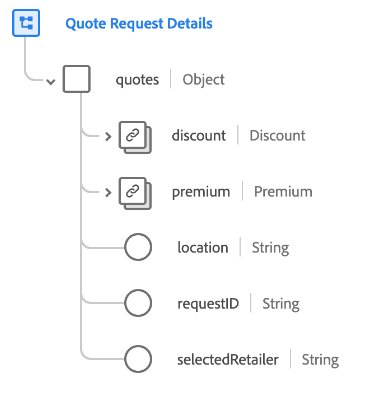

# [!UICONTROL 報價請求詳細資訊] 架構欄位組

[!UICONTROL 報價請求詳細資訊] 是標準架構欄位組 [[!DNL XDM ExperienceEvent] 類](../../classes/experienceevent.md)。 欄位組提供單個 `quotes` 對象到架構，它捕獲各種類型報價（包括保險單、醫療保健、製造訂單和高科技訂單）的請求流程詳細資訊。

| 屬性 | 資料類型 | 說明 |
| --- | --- | --- |
| `discount` | [[!UICONTROL 貨幣]](../../data-types/currency.md) | The discount amount for a quote displayed to a visitor. |
| `premium` | [[!UICONTROL 貨幣]](../../data-types/currency.md) | The premium amount for a quote displayed to a visitor. |
| `location` | [!UICONTROL 字串] | The postal code used for finding retailers near the visitor&#39;s location. |
| `requestID` | [!UICONTROL 字串] | A unique identifier for the quote request. |
| `selectedRetailer` | [!UICONTROL 字串] | 報價請求的選定零售商（如果適用）。 |

{style=&quot;table-layout:auto&quot;}

有關欄位組的詳細資訊，請參閱 [公共XDM儲存庫](https://github.com/adobe/xdm/blob/master/docs/reference/fieldgroups/experience-event/experienceevent-quote-request-details.schema.json)。
