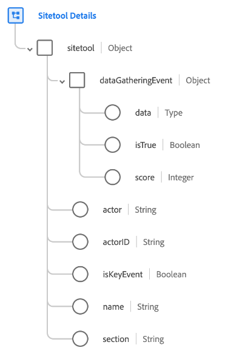

# [!UICONTROL 網站工具詳細資訊] 方案欄位組

[!UICONTROL 網站工具詳細資訊] 是的標準架構欄位組 [[!DNL XDM ExperienceEvent] 類](../../classes/experienceevent.md). 欄位群組提供單一 `sitetool` 物件，可擷取網站工具所收集的資訊。

| 屬性 | 資料類型 | 說明 |
| --- | --- | --- |
| `dataGatheringEvent` | 物件 | 指出此事件是否為資料收集事件以及其他相關詳細資料。 包含下列屬性：<ul><li>`data`:（對應）包含在測驗、調查或民調問答提交事件中收集並提交的JSON資料。</li><li>`isTrue`:（布林值）指出此事件是否為資料收集事件，例如測驗、調查或民調問答。</li><li>`score`:（整數）由執行者根據事件回應所保護的分數。</li></ul> |
| `actor` | 字串 | 執行此動作的人員/成員。 |
| `actorID` | 字串 | 執行動作之人員/成員的唯一識別碼。 |
| `isKeyEvent` | 布林值 | 指出此事件是否為關鍵事件。 |
| `name` | 字串 | 網站工具的名稱，例如查特機器人、調查等。 |
| `section` | 字串 | 網站工具的相關區段，如主要或子項。 |

{style="table-layout:auto"}

如需欄位群組的詳細資訊，請參閱 [公用XDM存放庫](https://github.com/adobe/xdm/blob/master/components/fieldgroups/experience-event/industry-verticals/experienceevent-healthcare-sitetool.schema.json).
