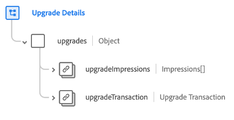

# [!UICONTROL 升級詳細資料] 結構描述欄位群組

[!UICONTROL 升級詳細資料] 是的標準結構描述欄位群組 [[!DNL XDM ExperienceEvent] 類別](../../classes/experienceevent.md) 用於擷取有關升級行銷事件的資訊，包括有關交易的詳細資訊和向客戶顯示優惠的不同方式。

欄位群組提供單一物件型別欄位， `upgrades`. 此物件中包含的屬性說明如下。

| 屬性 | 資料型別 | 說明 |
| --- | --- | --- |
| `upgradeImpressions` | 陣列 [曝光次數](../../data-types/impressions.md) | 列出客戶錄製的印象（數位檢視或升級優惠方案的參與）的陣列。 |
| `upgradeTransaction` | [交易](../../data-types/transaction.md) | 說明升級的貨幣交易。 |

{style="table-layout:auto"}

如需欄位群組的詳細資訊，請參閱公用XDM存放庫：

* [填入範例](https://github.com/adobe/xdm/blob/master/components/fieldgroups/experience-event/industry-verticals/experienceevent-upgrade-details.example.1.json)
* [完整結構描述](https://github.com/adobe/xdm/blob/master/components/fieldgroups/experience-event/industry-verticals/experienceevent-upgrade-details.schema.json)
