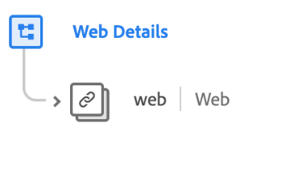

# [!UICONTROL Web詳細資訊] 方案欄位組

>[!NOTE]
>
>數個架構欄位組的名稱已變更。 請參閱 [欄位群組名稱更新](../name-updates.md) 以取得更多資訊。

[!UICONTROL Web詳細資訊] 是的標準架構欄位組 [[!DNL XDM ExperienceEvent] 類](../../classes/experienceevent.md)，用於說明網頁詳細資料事件的相關資訊，例如互動、頁面詳細資料和反向連結。

| 屬性 | 資料類型 | 說明 |
| --- | --- | --- |
| `web` | [網路資訊](../../data-types/web-information.md) | 說明連結點按、網頁詳細資訊、反向連結資訊和瀏覽器詳細資訊。 |

{style="table-layout:auto"}

如需欄位群組的詳細資訊，請參閱公用XDM存放庫：

* [填入範例](https://github.com/adobe/xdm/blob/master/components/fieldgroups/experience-event/experienceevent-web.example.1.json)
* [完整結構](https://github.com/adobe/xdm/blob/master/components/fieldgroups/experience-event/experienceevent-web.schema.json)
