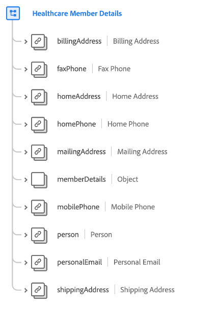

# [!UICONTROL 醫療保健會員詳細資訊] 結構描述欄位群組

[!UICONTROL 醫療保健會員詳細資訊] 是的標準結構描述欄位群組 [[!DNL XDM Individual Profile] 類別](../../classes/individual-profile.md) 擷取已經或將會接受醫療服務或照護的人員的詳細資訊，例如聯絡資訊、初級保健醫生和計畫資訊。

| 屬性 | 資料型別 | 說明 |
| --- | --- | --- |
| `billingAddress` | [[!UICONTROL 郵寄地址]](../../data-types/postal-address.md) | 個人的帳單地址。 |
| `faxPhone` | [[!UICONTROL 電話號碼]](../../data-types/phone-number.md) | 個人的傳真電話號碼。 |
| `homeAddress` | [[!UICONTROL 郵寄地址]](../../data-types/postal-address.md) | 個人的住家地址。 |
| `homePhone` | [[!UICONTROL 電話號碼]](../../data-types/phone-number.md) | 個人的住家電話號碼。 |
| `mailingAddress` | [[!UICONTROL 郵寄地址]](../../data-types/postal-address.md) | 個人的郵寄地址。 |
| `memberDetails` | 物件 | 此物件包含有關個人醫療保健相關屬性和關係的詳細資訊。 請參閱 [下方的子區段](#memberDetails) 以取得物件結構的詳細資訊。 |
| `mobilePhone` | [[!UICONTROL 電話號碼]](../../data-types/phone-number.md) | 個人的行動電話號碼。 |
| `person` | [[!UICONTROL 「人」]](../../data-types/person.md) | 與個人的醫療保健會籍相關的個人執行者、聯絡人或擁有者。 |
| `personalEmail` | [[!UICONTROL 電子郵件地址]](../../data-types/email-address.md) | 個人的個人電子郵件地址。 |
| `shippingAddress` | [[!UICONTROL 郵寄地址]](../../data-types/postal-address.md) | 個人的送貨地址。 |

{style="table-layout:auto"}

## `memberDetails` {#memberDetails}

`memberDetails` 是一個物件，其中包含有關個人的醫療保健相關屬性和關係的詳細資訊。 的結構 `memberDetails` 如下所述。

| 屬性 | 資料型別 | 說明 |
| --- | --- | --- |
| `emergencyContact` | 物件 | 擷取此人的下列緊急聯絡詳細資料： <ul><li>`fullName`：（字串）緊急聯絡人的全名。</li><li>`phone`：（字串）緊急聯絡人的電話號碼。</li><li>`relationshipToMember`：（字串）緊急聯絡人與個人的關係。</li></ul> |
| `medications` | 物件陣列 | 列出與個人相關之目前和過去藥物的詳細資訊。 每個陣列專案都是一個物件，可擷取以下詳細資訊： <ul><li>`refillLocation`： ([[!UICONTROL 郵寄地址]](../../data-types/postal-address.md))重新填滿藥物的位置。</li><li>`ID`：（字串）藥物ID。</li><li>`isCurrent`：（布林值）指出藥物為目前或過去。</li><li>`numberOfRefills`：（整數）此藥物提供者所指定的重新填入次數。</li><li>`startDate`：(DateTime)人員開始接受藥物的日期。</li></ul> |
| `multipleBirth` | 物件 | 擷取與多胞胎相關的細節： <ul><li>`isMultipleBirth`：（布林值）指出此人是否生過多個孩子。</li><li>`multipleBirthNumber`：（整數）在下列情況下出生的嬰兒數： `isMultipleBirth` 為true。</li></ul> |
| `plans` | 物件陣列 | 列出與個人相關的目前和過去醫療計畫的詳細資訊。 每個陣列專案都是一個物件，可擷取以下詳細資訊： <ul><li>`coverageEndDate`：（日期時間）計畫涵蓋範圍結束的日期。</li><li>`coverageStartDate`：（日期時間）計畫涵蓋範圍的開始日期。</li><li>`isActive`：（布林值）指出計畫是否作用中。</li><li>`planId`：（字串）計畫ID。</li></ul> |
| `primaryCarePhysicians` | 物件陣列 | 列出與個人相關的初級保健醫生的詳細資訊。 每個陣列專案都是一個物件，可擷取以下詳細資訊： <ul><li>`endDate`：（日期時間）基層照護醫師終止對個人的照護的日期。</li><li>`fullname`：（字串）醫師的全名。</li><li>`providerId`：（字串）醫師的唯一識別碼。</li><li>`startDate`：（日期時間）基層照護醫師開始照護該人的日期。</li></ul> |
| `specialists` | 物件陣列 | 列出與個人相關的醫療保健專家的詳細資訊。 每個陣列專案都是一個物件，可擷取以下詳細資訊： <ul><li>`fullname`：（字串）專員的全名。</li><li>`providerId`：（字串）專員的唯一識別碼。</li><li>`specialty`：（字串）提供者的專長（例如麻醉科、泌尿科、放射科、皮膚科等）。</li></ul> |
| `beneficiaryRelationship` | 字串 | 如果人員是受撫養人（例如自己、配偶、子女等），則為與醫療保健會員的受益人關係。 |
| `billingAccountID` | 字串 | 個人帳單帳戶的唯一識別碼。 |
| `dateAgeCollected` | 日期時間 | 收集個人年齡的日期。 |
| `deceasedDate` | 日期時間 | 如果人員已死亡，則為死亡日期。 |
| `isDeceased` | 布林值 | 指出人員是否已死亡。 |
| `isDependent` | 布林值 | 指出此人是否為受撫養人。 |
| `nationality` | 字串 | 個人與其狀態之間的法律關係，使用ISO 3166-1 Alpha-2代碼表示。 |
| `preferredAvailability` | 字串 | 個人對約會偏好的日期和時間。 |
| `primaryMemberID` | 字串 | 如果個人是受撫養人，則為主要訂閱者的唯一識別碼。 |

{style="table-layout:auto"}

如需欄位群組的詳細資訊，請參閱公用XDM存放庫：

* [填入範例](https://github.com/adobe/xdm/blob/master/components/fieldgroups/profile/profile-healthcare-member.example.1.json)
* [完整結構描述](https://github.com/adobe/xdm/blob/master/components/fieldgroups/profile/profile-healthcare-member.schema.json)

如需有關如何使用此欄位群組來提供常見服務的詳細資訊，請參閱產業結構描述檔案 [醫療保健產業使用案例](../../schema/industries/healthcare.md).
