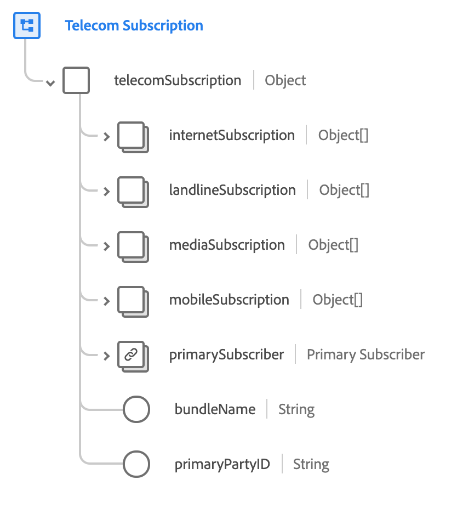

# [!UICONTROL 電信訂閱] 架構欄位組

>[!NOTE]
>
>多個架構欄位組的名稱已更改。 查看上的文檔 [欄位組名稱更新](../name-updates.md) 的子菜單。

[!UICONTROL 電信訂閱] 是標準架構欄位組 [[!DNL XDM Individual Profile] 類](../../classes/individual-profile.md) 它描述了客戶的電信訂購計畫，包括定價、包和單個產品訂購。

欄位組提供單個對象類型欄位， `telecomSubscription`，其屬性如下所述。

| 屬性 | 資料類型 | 說明 |
| --- | --- | --- |
| `internetSubscription` | 對象陣列 | 描述Internet訂閱計畫詳細資訊，如資料上限、連接類型和速度詳細資訊。 查看 [下面](#internetSubscription) 的子菜單。 |
| `landlineSubscription` | 對象陣列 | 描述固定電話訂閱計畫詳細資訊，包括所選功能、分鐘和撥號計畫。 查看 [下面](#landlineSubscription) 的子菜單。 |
| `mediaSubscription` | 對象陣列 | 描述媒體訂閱計畫詳細資訊，包括頻道數和包括的流式服務。 查看 [下面](#mediaSubscription) 的子菜單。 |
| `mobileSubscription` | 對象陣列 | 描述移動訂閱計畫詳細資訊，包括行數、資料費率、成本等。 查看 [下面](#mobileSubscription) 的子菜單。 |
| `primarySubscriber` | [[!UICONTROL 「人」]](../../data-types/person.md) | 描述訂閱的所有者。 |
| `bundleName` | 字串 | 捕獲客戶註冊的任何類型訂閱包的名稱，如 `Internet + Media`。 |
| `primaryPartyID` | 字串 | 負責訂閱的主要人員的標識符，通常可能是其設備電話號碼。 |

{style="table-layout:auto"}

有關欄位組的詳細資訊，請參閱公共XDM儲存庫：

* [填充示例](https://github.com/adobe/xdm/blob/master/components/fieldgroups/profile/profile-personal-details.example.1.json)
* [完整架構](https://github.com/adobe/xdm/blob/master/components/fieldgroups/profile/profile-personal-details.schema.json)

## `internetSubscription` {#internetSubscription}

`internetSubscription` 作為對象陣列提供。 每個對象的結構如下所述。

| 屬性 | 資料類型 | 說明 |
| --- | --- | --- |
| `subscriptionDetails` | [[!UICONTROL 電信訂閱]](../../data-types/telecom-subscription.md) | 描述有關訂閱的一般詳細資訊，包括訂閱長度、費用、狀態等。 描述有關訂閱的一般詳細資訊，包括訂閱長度、費用、狀態等。 |
| `connectionType` | 字串 | 訂閱的連接類型。 |
| `dataCap` | 整數 | 帳戶的資料上限限制(MB)。 |
| `downloadSpeed` | 整數 | 訂閱的最大下載速度(MB)。 |
| `selfSetup` | 布林值 | 指示客戶是否有資格在沒有技術人員訪問的情況下進行網際網路設定。 |
| `uploadSpeed` | 整數 | 訂閱的可用最大上載速度(MB)。 |

{style="table-layout:auto"}

## `landlineSubscription` {#landlineSubscription}

`landlineSubscription` 作為對象陣列提供。 每個對象的結構如下所述。

| 屬性 | 資料類型 | 說明 |
| --- | --- | --- |
| `phoneNumber` | [[!UICONTROL 電話號碼]](../../data-types/telecom-subscription.md) | 分配給此訂閱的電話號碼。 |
| `subscriptionDetails` | [[!UICONTROL 電信訂閱]](../../data-types/telecom-subscription.md) | 描述有關訂閱的一般詳細資訊，包括訂閱長度、費用、狀態等。 |
| `callBlocking` | 布林值 | 指示固定電話訂閱功能是否包括呼叫阻止。 |
| `callForwarding` | 布林值 | 指示固定電話訂閱功能是否包括呼叫轉發。 |
| `callWaiting` | 布林值 | 指示座機訂閱功能是否包括呼叫等待。 |
| `callerID` | 布林值 | 指示固定電話訂閱功能是否包括呼叫者ID。 |
| `internationalCalling` | 布林值 | 指示固定電話訂閱功能是否包括國際呼叫。 |
| `minutes` | 整數 | 訂閱內每月可用的分鐘數。 |
| `threeWayCalling` | 布林值 | 指示固定電話訂閱功能是否包括三向呼叫。 |
| `unlimitedDomesticLongDistance` | 布林值 | 指示固定電話訂閱功能是否包括無限制的國內長途呼叫。 |
| `unlimitedLocalCalling` | 布林值 | 指示固定電話訂閱功能是否包括無限制的本地呼叫。 |
| `voicemail` | 布林值 | 指示固定電話訂閱功能是否包括語音郵件。 |

{style="table-layout:auto"}

## `mediaSubscription` {#mediaSubscription}

`mediaSubscription` 作為對象陣列提供。 每個對象的結構如下所述。

| 屬性 | 資料類型 | 說明 |
| --- | --- | --- |
| `streamingServices` | 物件陣列 | 訂閱包含的所有流服務的清單。 每個陣列項都包括以下屬性： <ul><li>`promotionLength`:如果將流式服務添加為促銷的一部分，則促銷的時長（以月為單位）。</li><li>`promotionalAddition`:指示是否將流服務添加為促銷的一部分。</li><li>`serviceName`:流服務的名稱。</li></ul> |
| `subscriptionDetails` | [[!UICONTROL 電信訂閱]](../../data-types/telecom-subscription.md) | 描述有關訂閱的一般詳細資訊，包括訂閱長度、費用、狀態等。 |
| `channels` | 整數 | 介質訂閱中包含的頻道數。 |

{style="table-layout:auto"}

## `mobileSubscription` {#mobileSubscription}

`mobileSubscription` 作為對象陣列提供。 每個對象的結構如下所述。

| 屬性 | 資料類型 | 說明 |
| --- | --- | --- |
| `phoneNumber` | [[!UICONTROL 電話號碼]](../../data-types/telecom-subscription.md) | 分配給此訂閱的電話號碼。 |
| `subscriptionDetails` | [[!UICONTROL 電信訂閱]](../../data-types/telecom-subscription.md) | 描述有關訂閱的一般詳細資訊，包括訂閱長度、費用、狀態等。 |
| `earlyUpgradeEnrollment` | 布林值 | 指示客戶是否選擇提前升級。 |
| `planLevel` | 字串 | 分配給此訂閱的移動計畫的名稱。 |
| `portedNumber` | 布林值 | 指示客戶是否從另一運營商埠其號碼。 |

{style="table-layout:auto"}
