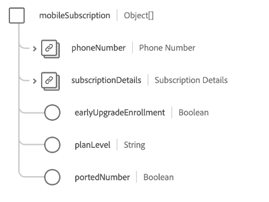

# [!UICONTROL 電信訂閱] 方案欄位組

>[!NOTE]
>
>數個架構欄位組的名稱已變更。 請參閱 [欄位群組名稱更新](../name-updates.md) 以取得更多資訊。

[!UICONTROL 電信訂閱] 是的標準架構欄位組 [[!DNL XDM Individual Profile] 類](../../classes/individual-profile.md) 說明客戶的電信訂閱計畫，包括定價、套件和個別產品訂閱。

欄位組提供單個對象類型欄位， `telecomSubscription`，其屬性說明如下。

| 屬性 | 資料類型 | 說明 |
| --- | --- | --- |
| `internetSubscription` | 物件陣列 | 說明網際網路訂閱計畫詳細資訊，如資料上限、連線類型和速度詳細資訊。 請參閱 [下文](#internetSubscription) 以取得更多資訊。 |
| `landlineSubscription` | 物件陣列 | 說明固定電話訂購計畫詳細資訊，包括選定的功能、分鐘數和撥號計畫。 請參閱 [下文](#landlineSubscription) 以取得更多資訊。 |
| `mediaSubscription` | 物件陣列 | 說明媒體訂閱計畫的詳細資訊，包括頻道數和包含的串流服務。 請參閱 [下文](#mediaSubscription) 以取得更多資訊。 |
| `mobileSubscription` | 物件陣列 | 說明行動訂閱計畫詳細資訊，包括行數、資料費率、成本等。 請參閱 [下文](#mobileSubscription) 以取得更多資訊。 |
| `primarySubscriber` | [[!UICONTROL 「人」]](../../data-types/person.md) | 說明訂閱的擁有者。 |
| `bundleName` | 字串 | 擷取客戶已註冊之任何類型訂閱套件的名稱，例如 `Internet + Media`. |
| `primaryPartyID` | 字串 | 負責訂閱之主要人員的識別碼，通常可能是其裝置電話號碼。 |

{style="table-layout:auto"}

如需欄位群組的詳細資訊，請參閱公用XDM存放庫：

* [填入範例](https://github.com/adobe/xdm/blob/master/components/fieldgroups/profile/profile-personal-details.example.1.json)
* [完整結構](https://github.com/adobe/xdm/blob/master/components/fieldgroups/profile/profile-personal-details.schema.json)

## `internetSubscription` {#internetSubscription}

`internetSubscription` 是以物件陣列的形式提供。 每個物件的結構說明如下。

| 屬性 | 資料類型 | 說明 |
| --- | --- | --- |
| `subscriptionDetails` | [[!UICONTROL 電信訂閱]](../../data-types/telecom-subscription.md) | 說明訂閱的一般詳細資訊，包括訂閱長度、費用、狀態等。 說明訂閱的一般詳細資訊，包括訂閱長度、費用、狀態等。 |
| `connectionType` | 字串 | 訂閱的連接類型。 |
| `dataCap` | 整數 | 帳戶的資料上限限制(MB)。 |
| `downloadSpeed` | 整數 | 訂閱的最大可用下載速度(MB)。 |
| `selfSetup` | 布林值 | 指示客戶是否有資格進行網際網路設定，而無需技術人員的訪問。 |
| `uploadSpeed` | 整數 | 訂閱的可用上載速度上限(MB)。 |

{style="table-layout:auto"}

## `landlineSubscription` {#landlineSubscription}

`landlineSubscription` 是以物件陣列的形式提供。 每個物件的結構說明如下。

| 屬性 | 資料類型 | 說明 |
| --- | --- | --- |
| `phoneNumber` | [[!UICONTROL 電話號碼]](../../data-types/telecom-subscription.md) | 分配給此訂閱的電話號碼。 |
| `subscriptionDetails` | [[!UICONTROL 電信訂閱]](../../data-types/telecom-subscription.md) | 說明訂閱的一般詳細資訊，包括訂閱長度、費用、狀態等。 |
| `callBlocking` | 布林值 | 指示固定電話訂閱功能是否包括呼叫阻塞。 |
| `callForwarding` | 布林值 | 指示固定電話訂閱功能是否包括呼叫轉發。 |
| `callWaiting` | 布林值 | 指示固定電話訂閱功能是否包括等待呼叫。 |
| `callerID` | 布林值 | 指示固定電話訂閱功能是否包括呼叫者ID。 |
| `internationalCalling` | 布林值 | 指示固定電話訂閱功能是否包括國際呼叫。 |
| `minutes` | 整數 | 訂閱內每月可用的分鐘數。 |
| `threeWayCalling` | 布林值 | 指示固定電話訂閱功能是否包括三向呼叫。 |
| `unlimitedDomesticLongDistance` | 布林值 | 指示固定電話訂購功能是否包括無限制的國內長途電話。 |
| `unlimitedLocalCalling` | 布林值 | 指示固定電話訂閱功能是否包括無限的本地呼叫。 |
| `voicemail` | 布林值 | 指示固定電話訂閱功能是否包括語音郵件。 |

{style="table-layout:auto"}

## `mediaSubscription` {#mediaSubscription}

`mediaSubscription` 是以物件陣列的形式提供。 每個物件的結構說明如下。

| 屬性 | 資料類型 | 說明 |
| --- | --- | --- |
| `streamingServices` | 物件陣列 | 訂閱中包含的所有串流服務清單。 每個陣列項目都包含下列屬性： <ul><li>`promotionLength`:如果促銷活動中新增了串流服務，則促銷的時間長度（以月為單位）。</li><li>`promotionalAddition`:指出是否已將串流服務新增為促銷活動的一部分。</li><li>`serviceName`:串流服務的名稱。</li></ul> |
| `subscriptionDetails` | [[!UICONTROL 電信訂閱]](../../data-types/telecom-subscription.md) | 說明訂閱的一般詳細資訊，包括訂閱長度、費用、狀態等。 |
| `channels` | 整數 | 媒體訂閱包含的頻道數。 |

{style="table-layout:auto"}

## `mobileSubscription` {#mobileSubscription}

`mobileSubscription` 是以物件陣列的形式提供。 每個物件的結構說明如下。

| 屬性 | 資料類型 | 說明 |
| --- | --- | --- |
| `phoneNumber` | [[!UICONTROL 電話號碼]](../../data-types/telecom-subscription.md) | 分配給此訂閱的電話號碼。 |
| `subscriptionDetails` | [[!UICONTROL 電信訂閱]](../../data-types/telecom-subscription.md) | 說明訂閱的一般詳細資訊，包括訂閱長度、費用、狀態等。 |
| `earlyUpgradeEnrollment` | 布林值 | 指出客戶是否選擇提前升級。 |
| `planLevel` | 字串 | 指派給此訂閱的行動計畫名稱。 |
| `portedNumber` | 布林值 | 指示客戶是否從另一個電信商埠號。 |

{style="table-layout:auto"}
