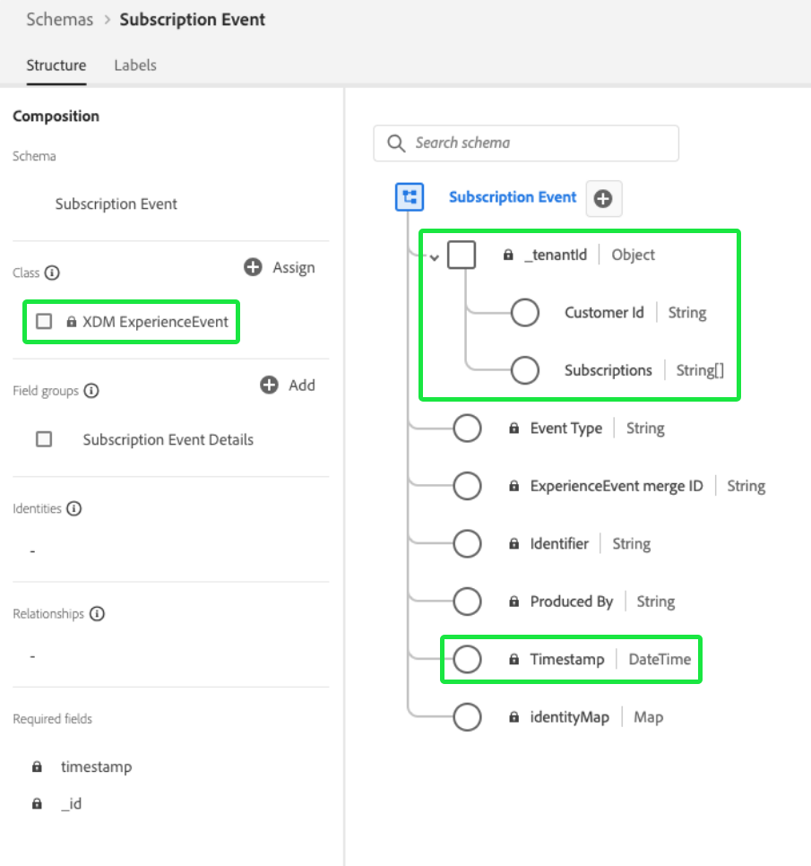

# 資料模型最佳實務

[!DNL Experience Data Model] (XDM)是核心架構，可借由提供通用結構和定義以用於下游Adobe Experience Platform服務，將客戶體驗資料標準化。 遵循XDM標準，所有客戶體驗資料皆可整合至通用表示法，讓您從客戶動作中獲得寶貴的深入分析、透過區段定義客戶受眾，以及為個人化目的表達客戶屬性。

由於XDM的用途極廣，且可由設計自訂，因此在設計結構時，務必遵循資料模型的最佳實務。 本檔案說明將客戶體驗資料對應至XDM時，您必須做出的重要決策和考量。

## 快速入門

閱讀本指南之前，請先檢閱 [XDM系統概觀](../home.md) 概略介紹XDM及其在Experience Platform中的角色。

此外，本指南專注於架構設計的重要考量事項。 因此，強烈建議您參閱 [綱要構成基本知識](./composition.md) 以取得本指南中提及之個別架構元素的詳細說明。

## 最佳實務摘要

設計資料模型以供Experience Platform使用的建議方法總結如下：

1. 了解您資料的業務使用案例。
1. 識別應帶入的主要資料來源 [!DNL Platform] 來解決這些使用案例。
1. 識別可能也感興趣的任何次要資料來源。 例如，如果貴組織中目前只有一個業務單位想要將其資料移植到 [!DNL Platform]，類似的業務單位未來可能也會有興趣移植類似資料。 考慮到這些次要來源有助於標準化整個組織的資料模型。
1. 為已識別的資料源建立高級實體關係圖(ERD)。
1. 將高級ERD轉換為 [!DNL Platform]-centric ERD（包括配置檔案、體驗事件和查閱實體）。

識別執行業務使用案例所需的適用資料來源的相關步驟因組織而異。 本文檔的其餘部分集中在確定資料源後組織和構建ERD的後續步驟，但圖表各組成部分的說明可能會為您決定應將哪些資料源遷移到哪個資料源提供資訊 [!DNL Platform].

## 建立高級ERD

決定您要帶入的資料來源後 [!DNL Platform]，請建立高階ERD來協助指導將資料對應至XDM結構的程式。

下列範例代表想要將資料帶入的公司的簡化ERD [!DNL Platform]. 此圖表會反白顯示應排序為XDM類別的基本實體，包括客戶帳戶、飯店、地址和數種常見的電子商務事件。

## 將實體排序至設定檔、查詢和事件類別

建立ERD以確定要帶入的基本實體後 [!DNL Platform]，這些實體必須分類為設定檔、查詢和事件類別：

| 類別 | 說明 |
| --- | --- |
| 設定檔實體 | 設定檔實體代表與個別人員（通常為客戶）相關的屬性。 屬於此類別的實體應由結構來表示，其基礎為 **[!DNL XDM Individual Profile]類**. |
| 查閱實體 | 查詢實體代表可與個別人員相關的概念，但無法直接用於識別個人。 屬於此類別的實體應由結構來表示，其基礎為 **自定義類**，並透過連結至設定檔和事件 [模式關係](../tutorials/relationship-ui.md). |
| 事件實體 | 事件實體代表與客戶可採取的動作、系統事件或您想追蹤隨時間變更的任何其他概念相關的概念。 屬於此類別的實體應由結構來表示，其基礎為 **[!DNL XDM ExperienceEvent]類**. |

{style="table-layout:auto"}

### 實體排序的考量事項

以下各節提供如何將實體分類為上述類別的進一步指引。

#### 可變和不可變資料

實體類別之間排序的主要方式是要擷取的資料是否可變動。

屬於設定檔或查閱實體的屬性通常可變動。 例如，客戶的偏好可能會隨著時間而改變，而訂閱計畫的參數可能會根據市場趨勢而更新。

相較之下，事件資料通常不可變。 由於事件附加至特定時間戳記，因此事件提供的「系統快照」不會變更。 例如，事件可在客戶結帳購物車時擷取其偏好設定，而且即使客戶偏好設定稍後變更，也不會變更。 事件資料記錄後即無法變更。

總之，設定檔和查詢實體包含可變屬性，並代表其所擷取主題的最新資訊，而事件則是系統在特定時間不可變的記錄。

#### 客戶屬性

如果實體包含任何與個別客戶相關的屬性，則很可能是設定檔實體。 客戶屬性的範例包括：

* 個人詳細資訊，例如姓名、出生日期、性別和帳戶ID。
* 位置資訊，如地址和GPS資訊。
* 聯繫資訊，如電話號碼和電子郵件地址。

#### 隨時間追蹤資料

如果您想要分析實體內的特定屬性隨時間的變化，最可能是事件實體。 例如，將產品項目新增至購物車，可在 [!DNL Platform]:

| Customer ID | 類型 | 產品 ID | 數量 | 時間戳記 |
| --- | --- | --- | --- | --- |
| 1234567 | 新增 | 275098 | 2 | 10月1日，上午10點32分 |
| 1234567 | 移除 | 275098 | 1 | 10月1日，上午10點33分 |
| 1234567 | 新增 | 486502 | 1 | 10月1日，上午10點41分 |
| 1234567 | 新增 | 910482 | 5 | 10月3日，下午2:15 |

{style="table-layout:auto"}

#### 區段使用案例

將實體分類時，請務必考慮您要建立的對象區段，以處理特定的業務使用案例。

例如，某公司想要了解其忠誠計畫中所有「金」或「白金」會員，這些會員去年已購買超過5次。 根據此分段邏輯，可就如何呈現相關實體得出以下結論：

* 「金級」和「白金級」代表適用於個別客戶的忠誠度狀態。 由於區段邏輯僅與客戶的目前忠誠度狀態有關，因此此資料可建模為設定檔結構的一部分。 如果您想要追蹤一段時間內忠誠度狀態的變更，您也可以建立其他忠誠度狀態變更事件結構。
* 購買是在特定時間發生的事件，而區段邏輯與指定時間範圍內的購買事件有關。 因此，此資料應建模為事件結構。

#### 啟動使用案例

除了區段使用案例的考量事項外，您也應該檢閱這些區段的啟用使用案例，以識別其他相關屬性。

例如，公司已根據以下規則建立受眾區隔： `country = US`. 然後，在將該區段啟用至特定的下游目標時，公司想要根據首頁狀態篩選所有匯出的設定檔。 因此， `state` 屬性也應在適用的設定檔實體中擷取。

#### 匯總值

您應根據資料的使用案例和粒度，決定特定值在納入設定檔或事件實體之前是否需要預先匯總。

例如，公司想要根據購物車購買次數來建立區段。 您可以將每個時間戳記購買事件納入為自己的實體，以最低精細度併入此資料。 不過，這有時會以指數方式增加記錄的事件數。 若要減少擷取的事件數，您可以選取建立匯總值 `numberOfPurchases` 一週或一個月。 其他匯總函式(如MIN和MAX)也可適用於這些情況。

>[!CAUTION]
>
>Experience Platform目前不執行自動值匯總，不過這已規劃用於未來發行。 如果您選擇使用匯總值，則必須在外部執行計算，再將資料傳送至 [!DNL Platform].

#### 基數

在ERD中建立的基數也可以提供關於如何對實體進行分類的一些線索。 如果兩個實體之間有一對多關係，代表「多」的實體可能會是事件實體。 不過，在某些情況下，「許多」是一組查詢實體，在設定檔實體內以陣列形式提供。

>[!NOTE]
>
>由於沒有通用方法來適合所有使用案例，因此根據基數分類實體時，請務必考慮每種情況的優缺點。 請參閱 [下一節](#pros-and-cons) 以取得更多資訊。

下表列出了一些通用實體關係以及可從它們派生的類別：

| 關係 | 基數 | 實體類別 |
| --- | --- | --- |
| 客戶和購物車結帳 | 一對多 | 單一客戶可能有許多購物車結帳，這些事件可隨時間而追蹤。 因此，客戶將是設定檔實體，而購物車結帳則是事件實體。 |
| 客戶和忠誠度帳戶 | 一對一 | 單一客戶只能有一個忠誠帳戶，反之亦然。 由於關係是一對一，因此「客戶」和「忠誠帳戶」都代表設定檔實體。 |
| 客戶與訂閱 | 一對多 | 單一客戶可能有許多訂閱。 由於公司只關注客戶的目前訂閱，因此「客戶」是設定檔實體，而「訂閱」是查閱實體。 |

{style="table-layout:auto"}

### 不同實體類的優點和缺點 {#pros-and-cons}

雖然上一節提供一些決定如何分類實體的一般准則，但請務必了解在選擇一個實體類別而非另一個實體類別時，通常會有優缺點。 以下案例研究旨在說明在這些情況下如何考慮您的選項。

公司會追蹤客戶的有效訂閱，而一個客戶可擁有許多訂閱。 該公司也想納入分段使用案例的訂閱，例如尋找所有具有作用中訂閱的使用者。

在此案例中，公司有兩個潛在選項可在其資料模型中代表客戶的訂閱：

1. [使用設定檔屬性](#profile-approach)
1. [使用事件實體](#event-approach)

#### 方法1:使用設定檔屬性 {#profile-approach}

第一種方法是在客戶的設定檔實體內，將訂閱陣列納入為屬性。 此陣列中的對象將包含 `category`, `status`, `planName`, `startDate`，和 `endDate`.

 

**優點**

* 分段適用於預期的使用案例。
* 結構將僅保留客戶的最新訂閱記錄。

**缺點**

* 每次對陣列中的任何欄位進行更改時，必須重列整個陣列。
* 如果不同的資料源或業務單元正在將資料送入陣列，則跨所有通道保持最新更新的陣列同步將變得困難。

#### 方法2:使用事件實體 {#event-approach}

第二種方式是使用事件結構來表示訂閱。 這需要擷取與第一種方法相同的訂閱欄位，並加上訂閱ID、客戶ID以及訂閱事件發生時的時間戳記。

 

**優點**

* 區段規則可以更具彈性（例如找出所有在過去30天內變更訂閱的客戶）。
* 當客戶的訂閱狀態改變時，您不再需要更新客戶設定檔屬性中長且可能複雜的陣列。 如果客戶的訂閱清單同時發生來自多個來源的變更，這個功能就特別實用。

**缺點**

* 原始預定使用案例的細分變得更為複雜（識別客戶最近訂閱的狀態）。 區段現在需要其他邏輯來標籤客戶的最後一個訂閱事件，以檢查其狀態。
* 事件有較高的風險，會自動到期並從設定檔存放區清除。 請參閱 [體驗事件過期](../../profile/event-expirations.md) 以取得更多資訊。

## 根據分類的實體建立結構

將實體排序為設定檔、查詢和事件類別後，您就可以開始將資料模型轉換為XDM結構。 為了示範，先前顯示的範例資料模型已在下圖中分類為適當類別：

 

實體已排序的類別，應會決定您建立其架構的XDM類別。 重申：

* 設定檔實體應使用 [!DNL XDM Individual Profile] 類別。
* 事件實體應使用 [!DNL XDM ExperienceEvent] 類別。
* 查詢實體應使用貴組織定義的自訂XDM類別。 然後，設定檔和事件實體便可透過結構關係參考這些查閱實體。

>[!NOTE]
>
>雖然事件實體幾乎一律會以不同的結構表示，但設定檔或查詢類別中的實體可能會根據其基數，在單一XDM結構中結合在一起。
>
>例如，由於「客戶」實體與「忠誠帳戶」實體具有一對一關係，因此「客戶」實體的結構也可能包括 `LoyaltyAccount` 物件，包含每個客戶的適當忠誠度欄位。 但是，如果關係是一對多，則代表「許多」的實體可以由單獨的架構或配置檔案屬性陣清單示，具體取決於其複雜性。

以下各節提供根據ERD建構結構的一般指引。

### 採用迭代建模方法

此 [模式演化規則](./composition.md#evolution) 指定在架構實作後，只能進行非破壞性的變更。 換言之，一旦您新增欄位至結構，且已對該欄位擷取資料，該欄位便無法再移除。 因此，首先建立結構描述時，必須採用迭代建模方法，首先是簡化實作，這會隨著時間逐漸增加複雜性。

如果您不確定是否需要將特定欄位納入架構中，最佳作法是將其排除在外。 如果稍後確定該欄位是必要的，則始終可以在架構的下一個小版本中添加該欄位。

### 身分欄位

在Experience Platform中，標示為身分的XDM欄位可匯整來自多個資料來源之個別客戶的相關資訊。 雖然架構可以有多個欄位標示為身分，但必須定義單一主要身分，才能啟用架構以用於 [!DNL Real-Time Customer Profile]. 請參閱 [身分欄位](./composition.md#identity) 以取得這些欄位使用案例的詳細資訊，請參閱結構構成基本知識。

在設計結構時，關係資料庫表中的任何主鍵都可能是主標識的候選項。 適用身分欄位的其他範例包括客戶電子郵件地址、電話號碼、帳戶ID以及 [ECID](../../identity-service/ecid.md).

### Adobe應用程式架構欄位組

Experience Platform提供數個現成可用的XDM架構欄位群組，用於擷取與下列Adobe應用程式相關的資料：

* Adobe Analytics
* Adobe Audience Manager
* Adobe Campaign
* Adobe Target

例如， [[!UICONTROL Adobe Analytics ExperienceEvent範本] 欄位群組](https://github.com/adobe/xdm/blob/master/extensions/adobe/experience/analytics/experienceevent-all.schema.json) 可讓您對應 [!DNL Analytics]-XDM結構的特定欄位。 根據您使用的Adobe應用程式，您應在結構中使用這些Adobe提供的欄位群組。

 

Adobe應用程式欄位組會使用 `identityMap` 欄位，此欄位是系統產生的唯讀物件，會映射個別客戶的標準身分值。

若為Adobe Analytics,ECID為預設主要身分。 如果客戶未提供ECID值，則主要身分會預設為AAID。

>[!IMPORTANT]
>
>使用Adobe應用程式欄位群組時，不應將其他欄位標示為主要身分。 如果有其他屬性需要標示為身分，則這些欄位需改為指派為次要身分。

## 後續步驟

本檔案說明設計資料模型以供Experience Platform的一般准則和最佳作法。 總結：

* 使用由上而下的方法，在建構結構之前，先將資料表格排序為設定檔、查詢和事件類別。
* 針對不同用途設計結構時，通常有多種方法和選項。
* 您的資料模型應可支援您的業務使用案例，例如細分或客戶歷程分析。
* 讓您的結構盡可能簡單，並只在絕對需要時新增欄位。

準備就緒後，請參閱 [在UI中建立結構](../tutorials/create-schema-ui.md) 有關如何建立架構、為實體指派適當類，以及新增欄位以將資料映射到的逐步說明。
