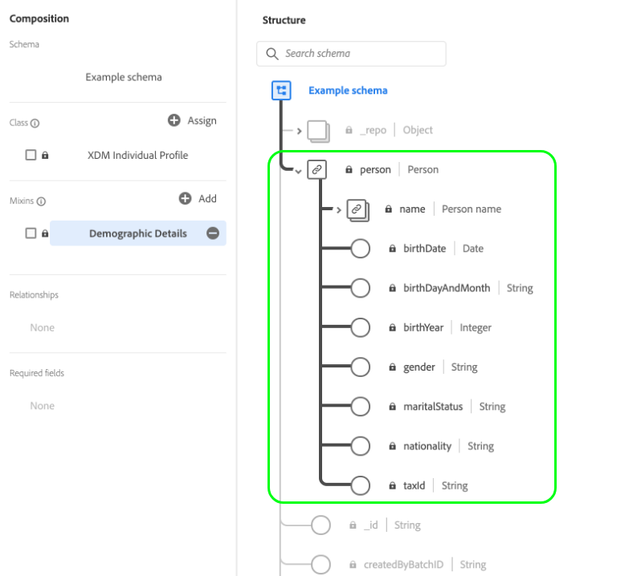

# 架構構成基礎

本文檔介紹了[!DNL Experience Data Model](XDM)架構，以及用於構成要在Adobe Experience Platform使用的架構的構建塊、原則和最佳做法。 有關XDM的一般資訊以及在[!DNL Platform]中如何使用它，請參見[XDM系統概述](../home.md)。

## 瞭解結構

架構是一組規則，用於表示和驗證資料的結構和格式。 高層次上，結構描述提供實際物件（例如人）的抽象定義，並概述該物件每個例項中應包含的資料（例如名字、姓氏、生日等）。

除了描述資料的結構外，模式還對資料應用約束和期望，以便在系統之間移動時驗證它。 這些標準定義允許一致地解釋資料，而不論其來源為何，並消除跨應用程式翻譯的需要。

[!DNL Experience Platform] 通過使用模式來維護此語義規範化。方案是描述[!DNL Experience Platform]中資料的標準方式，允許所有符合方案的資料在組織中重複使用，而不發生衝突，甚至在多個組織之間共用。

XDM模式最適合以獨立格式儲存大量複雜資料。 有關XDM如何做到這一點的詳細資訊，請參閱本文檔附錄中[嵌入對象](#embedded)和[ big data](#big-data)的章節。

### [!DNL Experience Platform]中的架構式工作流程

標準化是[!DNL Experience Platform]背後的一個關鍵概念。 XDM受Adobe驅動，旨在標準化客戶體驗資料，並定義客戶體驗管理的標準架構。

建立[!DNL Experience Platform]的基礎架構（稱為[!DNL XDM System]）有助於架構式工作流程，並包含[!DNL Schema Registry]、[!DNL Schema Editor]、架構中繼資料和服務使用模式。 有關詳細資訊，請參閱[XDM系統概述](../home.md)。

在[!DNL Experience Platform]中構建和利用方案有幾項主要優點。 首先，模式允許更好的資料治理和資料最小化，這在隱私法規中尤其重要。 其次，使用Adobe的標準元件構建模式允許立即可用的見解和使用AI/ML服務，並將定制降至最低。 最後，架構提供資料分享見解和有效協調的基礎架構。

## 規劃您的架構

建立架構的第一步是決定您要在架構中擷取的概念或實際物件。 一旦您確定要描述的概念，您就可以開始規劃您的架構，包括資料類型、潛在識別欄位，以及架構未來的演變方式等。

### [!DNL Experience Platform]中的資料行為

用於[!DNL Experience Platform]的資料被分為兩種行為類型：

* **記錄資料**:提供主題屬性的相關資訊。主題可以是組織或個人。
* **時間系列資料**:提供記錄主體直接或間接採取操作時系統的快照。

所有XDM結構描述的資料可以分類為記錄或時間序列。 架構的資料行為由架構的類定義，該類在初次建立時被分配給架構。 本文稍後將對XDM類作進一步的詳細說明。

記錄和時間序列模式都包含身份映射(`xdm:identityMap`)。 此欄位包含主題的身分表示法，其取自標示為「身分」的欄位，如下一節所述。

### [!UICONTROL Identity] {#identity}

結構用於將資料提取到[!DNL Experience Platform]中。 此資料可跨多個服務使用，以建立個別實體的單一統一檢視。 因此，在考慮結構時，請務必考慮客戶身分，以及哪些欄位可用來識別主題，而不論資料來自何處。

為了協助此程式，您的架構中的關鍵欄位可標示為身分。 在擷取資料時，這些欄位中的資料會插入該個人的「[!UICONTROL Identity Graph]」。 然後，[[!DNL Real-time Customer Profile]](../../profile/home.md)和其他[!DNL Experience Platform]服務可以訪問圖表資料，以提供每個客戶的拼接視圖。

通常標示為&quot;[!UICONTROL Identity]&quot;的欄位包括：電子郵件地址、電話號碼、[[!DNL Experience Cloud ID (ECID)]](https://experienceleague.adobe.com/docs/id-service/using/home.html)、CRM ID或其他唯一ID欄位。 您也應考慮組織專屬的任何唯一識別碼，因為這些識別碼可能也是好的「[!UICONTROL Identity]」欄位。

在方案規劃階段，務必考慮客戶身份，以協助確保資料匯整在一起，以建立最強穩的個人檔案。 請參閱[Adobe Experience Platform身分服務](../../identity-service/home.md)的概觀，進一步瞭解身分資訊如何協助您為客戶提供數位體驗。

#### `xdm:identityMap` {#identityMap}

`xdm:identityMap` 是映射類型欄位，它描述單個的各種標識值及其關聯的名稱空間。此欄位可用於為方案提供身份資訊，而不是在方案本身的結構中定義身份值。

簡單身份映射的示例如下所示：

```json
"identityMap": {
  "email": [
    {
      "id": "jsmith@example.com",
      "primary": false
    }
  ],
  "ECID": [
    {
      "id": "87098882279810196101440938110216748923",
      "primary": false
    },
    {
      "id": "55019962992006103186215643814973128178",
      "primary": false
    }
  ],
  "loyaltyId": [
    {
      "id": "2e33192000007456-0365c00000000000",
      "primary": true
    }
  ]
}
```

如上例所示，`identityMap`物件中的每個索引鍵代表識別名稱空間。 每個索引鍵的值是對象的陣列，代表各個命名空間的標識值(`id`)。 請參閱[!DNL Identity Service]檔案，以取得Adobe應用程式所識別的標準身分名稱空間清單](../../identity-service/troubleshooting-guide.md#standard-namespaces)。[

>[!NOTE]
>
>也可以為每個標識值提供一個布爾值，用於該值是否為主標識(`primary`)。 僅需為[!DNL Real-time Customer Profile]中要使用的方案設定主標識。 如需詳細資訊，請參閱[union結構描述](#union)一節。

### 模式演化原則{#evolution}

隨著數位體驗的性質不斷演變，用來代表體驗的架構也必須不斷演變。 因此，精心設計的架構能夠根據需要調整和演化，而不會對舊版架構造成破壞性的改變。

由於保持向後相容性對於模式演化至關重要，[!DNL Experience Platform]會執行純粹的加性版本化原則，以確保對模式的任何修訂只會導致非破壞性的更新和更改。 換言之，**不支援中斷變更。**

| 支援的變更 | 中斷變更（不支援） |
|------------------------------------|---------------------------------|
| <ul><li>將新欄位添加到現有模式</li><li>將強制欄位設為選填</li></ul> | <ul><li>移除先前定義的欄位</li><li>推出新的必填欄位</li><li>更名或重定義現有欄位</li><li>移除或限制先前支援的欄位值</li><li>將屬性移動到樹中的不同位置</li></ul> |

>[!NOTE]
>
>如果尚未使用架構將資料嵌入[!DNL Experience Platform]中，則可能會對該架構引入中斷更改。 但是，在[!DNL Platform]中使用架構後，它必須遵守附加版本控制策略。

### 結構描述與資料擷取

為了將資料內嵌至[!DNL Experience Platform]，必須先建立資料集。 資料集是[[!DNL Catalog Service]](../../catalog/home.md)資料轉換和追蹤的建置區塊，通常代表包含收錄資料的表格或檔案。 所有資料集都基於現有的XDM模式，這為所提取的資料應包含的內容以及其結構提供了約束。 如需詳細資訊，請參閱[Adobe Experience Platform資料擷取](../../ingestion/home.md)的概觀。

## 架構的構建塊

[!DNL Experience Platform] 使用組合方法，其中組合標準構建塊以建立模式。此方法可促進現有元件的可重用性，並推動業界標準化，以支援[!DNL Platform]中的供應商模式和元件。

方案使用下列公式組成：

**類+混音(&amp;A);= XDM方案**

&amp;ast；模式由類和零個或多個混合組成。 這表示您完全不需使用mixin就可以合成資料集架構。

### {#class}類

構成模式的開始方法是分配類。 類定義模式將包含的資料的行為方面（記錄或時間序列）。 此外，類還描述了基於該類的所有方案需要包含的最小公共屬性數，並為合併多個相容資料集提供了一種方法。

架構的類決定哪些混合符合在該架構中使用的資格。 這將在[下一節](#mixin)中詳細討論。

Adobe提供數種標準（「核心」）XDM類。 幾乎所有下游平台進程都需要其中兩個類[!DNL XDM Individual Profile]和[!DNL XDM ExperienceEvent]。 除了這些核心類別外，您也可以建立自己的自訂類別，以說明組織的更多特定使用案例。 當沒有Adobe定義的核心類可用於描述唯一使用案例時，自定義類由組織定義。

下列螢幕擷取說明如何在平台UI中呈現類別。 由於顯示的示例架構不包含任何混音，所以所有顯示的欄位都由架構的類([!UICONTROL XDM Individual Profile])提供。


有關可用標準XDM類的最新清單，請參閱[正式的XDM儲存庫](https://github.com/adobe/xdm/tree/master/components/classes)。 或者，如果希望在UI中查看資源，可參閱[瀏覽XDM元件](../ui/explore.md)上的指南。

### Mixin {#mixin}

混音是可重複使用的元件，其定義可實作特定功能（例如個人詳細資料、飯店偏好設定或位址）的一或多個欄位。 Mixin是作為實現相容類的模式的一部分而包括的。

Mixins會根據所代表資料的行為（記錄或時間系列）來定義與哪些類別相容。 這表示並非所有混音都可用於所有類別。

[!DNL Experience Platform] 包括許多標準的Adobe混搭，同時允許廠商為其使用者定義混搭，以及個別使用者為其特定概念定義混搭。

例如，若要針對您的&quot;[!UICONTROL Loyalty Members]&quot;架構擷取詳細資訊，例如&quot;[!UICONTROL First Name]&quot;和&quot;[!UICONTROL Home Address]&quot;，您可以使用定義這些常見概念的標準混音。 但是，針對較不常見使用案例（例如&quot;[!UICONTROL Loyalty Program Level]&quot;）的概念通常沒有預先定義的混音。 在這種情況下，您必須定義自己的混音，才能擷取此資訊。

請記住，結構描述是由「零個或更多」混合組成，因此這表示您無需使用任何混合即可合成有效結構描述。

下列螢幕擷取說明mixin如何在平台UI中呈現。 在本例中，單個混音([!UICONTROL Demographic Details])被添加到模式，該模式為模式結構提供欄位分組。



有關可用標準XDM混合的最新清單，請參閱[正式的XDM儲存庫](https://github.com/adobe/xdm/tree/master/components/mixins)。 或者，如果希望在UI中查看資源，可參閱[瀏覽XDM元件](../ui/explore.md)上的指南。

### 資料類型{#data-type}

資料類型與基本常值欄位的使用方式相同，在類或方案中用作參考欄位類型。 關鍵區別在於資料類型可以定義多個子欄位。 與混音類似，資料類型允許一致地使用多欄位結構，但比混音更具靈活性，因為通過將資料類型添加為欄位的「資料類型」，資料類型可以包括在模式中的任意位置。

[!DNL Experience Platform] 提供了一些常用資料類型作為的一部分，以 [!DNL Schema Registry] 支援使用標準模式來描述常用資料結構。這在[!DNL Schema Registry]教學課程中有更詳細的說明，當您逐步定義資料類型時，會更清楚說明。

下列螢幕擷取顯示資料類型在平台UI中的呈現方式。 [!UICONTROL Demographic Details] mixin提供的一個欄位使用「[!UICONTROL Person name]」資料類型，如欄位名稱旁的垂直號字元(`|`)後面的文本所示。 此特定資料類型提供了與個人姓名相關的多個子欄位，此構造可以重複用於需要捕獲人員姓名的其他欄位。


有關可用標準XDM資料類型的最新清單，請參閱[正式的XDM儲存庫](https://github.com/adobe/xdm/tree/master/components/datatypes)。 或者，如果希望在UI中查看資源，可參閱[瀏覽XDM元件](../ui/explore.md)上的指南。

### 欄位

欄位是架構最基本的建置區塊。 欄位可定義特定資料類型，以限制其可包含的資料類型。 這些基本資料類型定義單一欄位，而先前提及的[資料類型](#data-type)可讓您定義多個子欄位，並在各種結構中重複使用相同的多欄位結構。 因此，除了將欄位的「資料類型」定義為註冊表中定義的其中一種資料類型外，[!DNL Experience Platform]還支援基本標量類型，例如：

* 字串
* 整數
* 雙倍
* 布林值
* 陣列
* 物件

>[!TIP]
>
>有關在對象類型欄位上使用自由格式欄位的利弊，請參見[附錄](#objects-v-freeform)。

這些標量類型的有效範圍可以進一步限制為某些模式、格式、最小值／最大值或預定義值。 使用這些約束，可以表示各種更具體的欄位類型，包括：

* Enum
* 長
* 簡短
* 位元組
* Date
* 日期時間
* 地圖

>[!NOTE]
>
>「映射」欄位類型允許鍵值對資料，包括單個鍵的多個值。 映射只能在系統級別定義，這表示您可能在行業或供應商定義的方案中遇到映射，但無法用於您定義的欄位。 [方案註冊表API開發人員指南](../api/getting-started.md)包含有關定義欄位類型的詳細資訊。

下游服務和應用程式使用的某些資料操作對特定欄位類型強制執行限制。 受影響的服務包括但不限於：

* [[!DNL Real-time Customer Profile]](../../profile/home.md)
* [[!DNL Identity Service]](../../identity-service/home.md)
* [[!DNL Segmentation]](../../segmentation/home.md)
* [[!DNL Query Service]](../../query-service/home.md)
* [[!DNL Data Science Workspace]](../../data-science-workspace/home.md)

在建立用於下游服務的架構之前，請先閱讀這些服務的適當檔案，以便更好地瞭解該架構用於資料操作的現場要求和限制。

### XDM欄位

除了基本欄位和定義您自己的資料類型外，XDM還提供了一組標準欄位和資料類型，這些欄位和資料類型皆為[!DNL Experience Platform]服務所隱含，而且當跨[!DNL Platform]元件使用時，可提供更一致性。

這些欄位（如「名字」和「電子郵件地址」）包含除基本標量欄位類型以外的附加含義，並告知[!DNL Platform]共用相同XDM資料類型的所有欄位將以相同的方式運行。 無論資料來自何處，或[!DNL Platform]服務使用資料，都可信任此行為是一致的。

有關可用XDM欄位的完整清單，請參見[XDM欄位字典](field-dictionary.md)。 建議盡可能使用XDM欄位和資料類型，以支援[!DNL Experience Platform]的一致性和標準化。

## 合成示例

結構表示將被收錄到[!DNL Platform]中並使用構圖模型構建的資料的格式和結構。 如前所述，這些模式由類和與該類相容的零個或多個混合組成。

例如，描述在零售商店購買之商品的架構可能稱為「[!UICONTROL Store Transactions]」。 該模式實現與標準[!UICONTROL Commerce] mixin和用戶定義的[!UICONTROL Product Info] mixin組合的[!DNL XDM ExperienceEvent]類。

追蹤網站流量的另一個架構可能稱為「[!UICONTROL Web Visits]」。 它也實作[!DNL XDM ExperienceEvent]類別，但這次結合了標準[!UICONTROL Web] mixin。

下圖顯示了這些方案以及每個混音所貢獻的欄位。 它還包含基於[!DNL XDM Individual Profile]類的兩個方案，包括本指南中前面提到的&quot;[!UICONTROL Loyalty Members]&quot;方案。


### Union {#union}

雖然[!DNL Experience Platform]允許您為特定使用案例合成方案，但它還允許您查看特定類型的方案「聯合」。 上圖顯示基於XDM ExperienceEvent類的兩個模式和基於[!DNL XDM Individual Profile]類的兩個模式。 聯合（如下所示）會聚合共用相同類（[!DNL XDM ExperienceEvent]和[!DNL XDM Individual Profile]）的所有方案的欄位。


通過啟用與[!DNL Real-time Customer Profile]一起使用的模式，該模式將包含在該類型的聯合中。 [!DNL Profile] 提供強穩、集中的客戶屬性描述檔，以及客戶在與之整合的任何系統上所發生之每個事件的時間戳記帳戶 [!DNL Platform]。[!DNL Profile] 使用聯合檢視來呈現此資料，並提供每位客戶的全面檢視。

有關使用[!DNL Profile]的詳細資訊，請參閱[即時客戶概要資訊概述](../../profile/home.md)。

## 將資料檔案映射到XDM模式

所有被收錄到[!DNL Experience Platform]中的資料檔案都必須符合XDM架構的結構。 有關如何格式化資料檔案以符合XDM層次（包括示例檔案）的詳細資訊，請參見[示例ETL轉換](../../etl/transformations.md)上的文檔。 有關將資料檔案提取到[!DNL Experience Platform]的一般資訊，請參見[批處理提取概述](../../ingestion/batch-ingestion/overview.md)。

## 外部區段的結構

如果您要將外部系統的區段帶入平台，您必須使用下列元件，才能在您的架構中擷取這些區段：

* [[!UICONTROL Segment definition] 類別](../classes/segment-definition.md):使用此標準類別來擷取外部區段定義的關鍵屬性。
* [[!UICONTROL Segment Membership Details] mixin](../mixins/profile/segmentation.md):將此混音新增至您的 [!UICONTROL XDM Individual Profile] 結構，以便將客戶個人檔案與特定區段建立關聯。

## 後續步驟

既然您瞭解架構構成的基本知識，就可以開始使用[!DNL Schema Registry]來探索和構建架構。

要查看兩個核心XDM類及其常用相容混音的結構，請參見以下參考文檔：

* [[!DNL XDM Individual Profile]](../classes/individual-profile.md)
* [[!DNL XDM ExperienceEvent]](../classes/experienceevent.md)

[!DNL Schema Registry]用於訪問Adobe Experience Platform的[!DNL Schema Library]，並提供用戶介面和REST風格的API，可從中訪問所有可用的庫資源。 [!DNL Schema Library]包含由Adobe定義的行業資源、由[!DNL Experience Platform]合作夥伴定義的供應商資源，以及由組織成員組成的類、混合、資料類型和方案。

要開始使用UI合成架構，請遵循[架構編輯器教程](../tutorials/create-schema-ui.md)來構建本文檔中提及的「忠誠成員」架構。

若要開始使用[!DNL Schema Registry] API，請從閱讀[方案註冊表API開發人員指南](../api/getting-started.md)開始。 閱讀開發人員指南後，請依照[教學課程中說明的步驟，使用架構註冊表API](../tutorials/create-schema-api.md)建立架構。

## 附錄

以下各節包含有關模式組合原則的其他資訊。

### 關係表與嵌入式對象{#embedded}

使用關係式資料庫時，最佳實務是標準化資料，或將實體分割為離散的部分，然後跨多個表格顯示。 為了整體讀取資料或更新實體，必須使用JOIN對許多單個表執行讀和寫操作。

XDM模式通過嵌入對象的使用，可以直接表示複雜的資料，並將其儲存在具有層次結構的自包含文檔中。 此結構的主要優點之一是，它可讓您查詢資料，而不需透過昂貴的連接來重新建構實體至多個非標準化表格。 您的架構階層可以有多少層級沒有硬性限制。

### 方案和大資料{#big-data}

現代數位系統會產生大量的行為訊號（交易資料、網路記錄、物聯網、展示等等）。 此巨量資料提供了最佳化體驗的絕佳機會，但由於資料的規模和多樣性，使用起來十分困難。 為了從資料中獲取價值，必須標準化其結構、格式和定義，以便能夠一致且有效率地處理。

結構描述可解決此問題，它允許從多個來源整合資料、透過共同結構和定義標準化資料，並跨解決方案共用。 這允許後續的流程和服務回答任何類型的資料問題，從傳統的資料建模方法轉向資料建模方法，在該方法中，將要詢問資料的所有問題都事先已知，並且資料建模以符合這些期望。

### 對象與自由格式欄位{#objects-v-freeform}

在設計方案時，在自由格式欄位上選擇物件時，需考慮一些關鍵因素：

| 物件 | 自由格式欄位 |
| --- | --- |
| 增加巢狀結構 | 少或無巢狀 |
| 建立邏輯欄位組 | 欄位會置於臨機位置 |

#### 物件

在自由格式欄位上使用物件的利弊列於下方。

**專業**:

* 當要建立特定欄位的邏輯分組時，最好使用對象。
* 對象以更結構化的方式組織模式。
* 物件間接有助於在區段產生器UI中建立良好的功能表結構。 架構內的群組欄位會直接反映在「區段產生器UI」中提供的資料夾結構中。

**缺點**:

* 欄位會變得更巢狀化。
* 使用[Adobe Experience Platform查詢服務](../../query-service/home.md)時，必須為對象中嵌套的查詢欄位提供較長的引用字串。

#### 自由格式欄位

在物件上使用自由格式欄位的利弊列於下方。

**專業**:

* 自由格式欄位直接在模式的根對象(`_tenantId`)下建立，提高了可見性。
* 使用查詢服務時，自由格式欄位的參考字串會較短。

**缺點**:

* 架構中自由格式欄位的位置是臨機的，這表示它們在架構編輯器中按字母順序顯示。 這可能會使結構描述變得不那麼結構化，而類似的自由格式欄位可能會因名稱而分離得很遠。