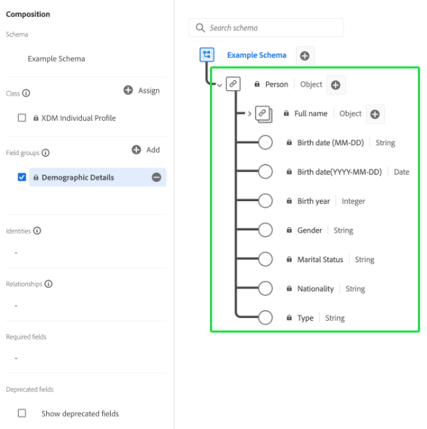

# 結構構成基本概念

本檔案提供 [!DNL Experience Data Model] (XDM)結構，以及合成結構以用於Adobe Experience Platform的結構的組成要素、原則和最佳實務。 有關XDM及其內使用方式的一般資訊 [!DNL Platform]，請參閱 [XDM系統概觀](../home.md).

## 了解結構

結構是一組規則，可代表及驗證資料的結構和格式。 從高層面來說，結構提供了真實對象 (如人) 的抽象定義，並概述應包含在該對象的每個執行個體中的資料 (如名字、姓氏、生日等)。  

除了描述資料結構外，結構還會對資料應用約束和期望，以便在系統之間移動時驗證它。 這些標準定義允許一致地解釋資料（無論來源為何），並消除跨應用程式翻譯的需要。

[!DNL Experience Platform] 使用結構來維護此語義標準化。 結構是描述資料的標準方式，位於 [!DNL Experience Platform]，可讓所有符合結構的資料在組織內重複使用，不產生衝突，甚至可在多個組織間共用。

XDM結構非常適合以獨立格式儲存大量複雜資料。 請參閱 [嵌入式對象](#embedded) 和 [巨量資料](#big-data) 以取得XDM如何完成此作業的詳細資訊。

### 中以結構描述為基礎的工作流程 [!DNL Experience Platform]

標準化是背後的一個關鍵概念 [!DNL Experience Platform]. XDM受Adobe推動，致力於標準化客戶體驗資料，並定義客戶體驗管理的標準結構。

基礎設施 [!DNL Experience Platform] 建置，稱為 [!DNL XDM System]，可簡化架構工作流程，並包含 [!DNL Schema Registry], [!DNL Schema Editor]、結構中繼資料和服務使用模式。 請參閱 [XDM系統概觀](../home.md) 以取得更多資訊。

善用中的結構有幾項主要優點： [!DNL Experience Platform]. 首先，結構可改善資料控管和資料最小化，這對隱私權法規尤其重要。 其次，使用Adobe的標準元件建立結構，可立即獲得深入分析，並使用AI/ML服務，且自訂項目最少。 最後，結構為資料共用見解和高效協調提供了基礎架構。

## 規劃您的結構

建立架構的第一步是決定您嘗試在架構中擷取的概念（或實際物件）。 識別您嘗試描述的概念後，您就可以開始規劃您的架構，思考資料類型、潛在身分欄位，以及架構未來可能如何演變等問題。

### 中的資料行為 [!DNL Experience Platform]

用於 [!DNL Experience Platform] 分為兩種行為類型：

* **記錄資料**:提供主題屬性的相關資訊。 主題可以是組織或個人。
* **時間序列資料**:提供記錄主體直接或間接執行操作時系統的快照。

所有XDM結構都說明可分類為記錄或時間序列的資料。 架構的資料行為由架構的類定義，該類在首次建立時分配給架構。 本檔案稍後會詳細說明XDM類別。

記錄和時間序列結構都包含身分對應(`xdm:identityMap`)。 此欄位包含主題的身分表示，取自標示為「身分」的欄位，如下一節所述。

### [!UICONTROL 身分] {#identity}

>[!CONTEXTUALHELP]
>id="platform_schemas_identities"
>title="結構中的身分"
>abstract="身分識別是結構中可用來識別主旨的關鍵欄位，例如電子郵件地址或行銷ID。 這些欄位可用來建構每個個人的身分圖，並建立客戶設定檔。 如需結構中身分的詳細資訊，請參閱本檔案。"

結構用於將資料擷取至 [!DNL Experience Platform]. 此資料可跨多項服務使用，以建立個別實體的單一統一檢視。 因此，思考結構時請務必考量客戶身分，以及可使用哪些欄位來識別主題（無論資料來自何處）。

若要協助進行此程式，您結構中的關鍵欄位可標示為身分。 擷取資料時，這些欄位中的資料會插入「[!UICONTROL 身分圖]」 然後，圖表資料便可透過 [[!DNL Real-Time Customer Profile]](../../profile/home.md) 其他 [!DNL Experience Platform] 提供每個個別客戶匯整檢視的服務。

通常標籤為「[!UICONTROL 身分]「包括：電子郵件地址，電話號碼， [[!DNL Experience Cloud ID (ECID)]](https://experienceleague.adobe.com/docs/id-service/using/home.html)、CRM ID或其他唯一ID欄位。 您也應考量貴組織專屬的任何唯一識別碼，因為這些識別碼可能是好的「[!UICONTROL 身分]」欄位。

在結構規劃階段期間請務必考量客戶身分，以協助確保資料匯整在一起，盡可能建立最健全的設定檔。 請參閱 [Adobe Experience Platform Identity Service](../../identity-service/home.md) 深入了解身分資訊如何協助您為客戶提供數位體驗。

有兩種方式可將身分資料傳送至Platform:

1. 將身分描述元新增至個別欄位，可透過 [結構編輯器UI](../ui/fields/identity.md) 或使用 [結構註冊表API](../api/descriptors.md#create)
1. 使用 [`identityMap` 欄位](#identityMap)

#### `identityMap` {#identityMap}

`identityMap` 是地圖類型欄位，可說明個人的各種身分值及其相關聯的命名空間。 此欄位可用來提供結構的身分資訊，而非在結構本身的結構內定義身分值。

使用 `identityMap` 身分會嵌入資料中，因此變得不那麼可見。 如果您擷取原始資料，則應改為在實際架構結構中定義個別身分欄位。

>[!NOTE]
>
>使用 `identityMap` 可以用作關係中的源架構，但不能用作引用架構。 這是因為所有參考結構必須具有可見標識，該標識可以映射到源結構內的參考欄位中。 請參閱 [關係](../tutorials/relationship-ui.md) 以取得來源和參考結構需求的詳細資訊。

不過，如果您要從將身分儲存在一起的來源匯入資料(例如 [!DNL Airship] 或Adobe Audience Manager)，或結構的身分識別數量有變數時。 此外，如果您使用 [Adobe Experience Platform Mobile SDK](https://aep-sdks.gitbook.io/docs/).

簡單身分對應的範例如下所示：

```json
"identityMap": {
  "email": [
    {
      "id": "jsmith@example.com",
      "primary": true
    }
  ],
  "ECID": [
    {
      "id": "87098882279810196101440938110216748923",
      "primary": false
    },
    {
      "id": "55019962992006103186215643814973128178",
      "primary": false
    }
  ],
  "CRMID": [
    {
      "id": "2e33192000007456-0365c00000000000",
      "primary": false
    }
  ]
}
```

如上例所示， `identityMap` 物件代表身分命名空間。 每個索引鍵的值是物件的陣列，代表身分值(`id`)取得Advertising Cloud的說明。 請參閱 [!DNL Identity Service] a [標準身分識別命名空間清單](../../identity-service/troubleshooting-guide.md#standard-namespaces) 由Adobe應用程式識別。

>[!NOTE]
>
>用於該值是否為主標識的布爾值(`primary`)也可針對每個身分值提供。 僅需針對要用於的結構設定主要身分 [!DNL Real-Time Customer Profile]. 請參閱 [聯合結構](#union) 以取得更多資訊。

### 綱要演化原則 {#evolution}

隨著數位體驗的性質不斷演化，用來代表體驗的結構也會持續演化。 因此，設計良好的架構能夠視需要調整和演變，而不會對舊版架構造成破壞性變更。

由於維持回溯相容性對於架構演變至關重要， [!DNL Experience Platform] 強制執行純附加版本設定原則。 此原則可確保對架構的任何修訂只會導致非破壞性的更新和變更。 換句話說， **不支援中斷變更。**

>[!NOTE]
>
>如果尚未使用結構來將資料內嵌至 [!DNL Experience Platform] 且尚未啟用在即時客戶設定檔中使用，您可能會對該結構進行重大變更。 不過，一旦將架構用於 [!DNL Platform]，它必須遵守附加版本設定政策。

下表劃分了編輯結構、欄位群組和資料類型時支援哪些變更：

| 支援的變更 | 中斷變更（不支援） |
| --- | --- |
| <ul><li>新增欄位至資源</li><li>將必填欄位設為選填</li><li>導入新的必填欄位*</li><li>變更資源的顯示名稱和說明</li><li>啟用結構以參與設定檔</li></ul> | <ul><li>移除先前定義的欄位</li><li>更名或重定義現有欄位</li><li>移除或限制先前支援的欄位值</li><li>將現有欄位移動到樹中的不同位置</li><li>刪除架構</li><li>停用架構參與設定檔</li></ul> |

\**請參閱下節，以了解 [設定新必填欄位](#post-ingestion-required-fields).*

### 必填欄位

個別結構欄位可以是 [標示為必要](../ui/fields/required.md)，這表示任何擷取的記錄都必須包含這些欄位中的資料，才能通過驗證。 例如，視需要設定結構的主要身分欄位，有助於確保所有擷取的記錄都參與即時客戶設定檔，同時視需要設定時間戳記欄位，以確保所有時間序列事件都能按時間順序保留。

>[!IMPORTANT]
>
>無論架構欄位是否為必要，Platform都不接受 `null` 或任何擷取欄位的空白值。 如果記錄或事件中沒有特定欄位的值，則應從擷取裝載中排除該欄位的金鑰。

#### 擷取後視需要設定欄位 {#post-ingestion-required-fields}

如果欄位已用於內嵌資料，且原本未視需要設定，則某些記錄可能會有空值。 如果您將此欄位設為擷取後的必要欄位，則即使歷史記錄可能為null，所有未來記錄都必須包含此欄位的值。

視需要設定先前的選用欄位時，請記住下列事項：

1. 如果您查詢歷史資料並將結果寫入新資料集，某些列會失敗，因為其中包含必要欄位的空值。
1. 如果欄位參與 [即時客戶個人檔案](../../profile/home.md) 而且您在視需要設定資料之前先匯出資料，某些設定檔可能為null。
1. 您可以使用結構註冊表API來檢視Platform中所有XDM資源的時間戳記變更記錄，包括新的必要欄位。 請參閱 [審核日誌終結點](../api/audit-log.md) 以取得更多資訊。

### 結構和資料擷取

將資料內嵌至 [!DNL Experience Platform]，必須先建立資料集。 資料集是資料轉換和追蹤的基礎要素 [[!DNL Catalog Service]](../../catalog/home.md)，通常表示包含所擷取資料的表格或檔案。 所有資料集皆以現有XDM結構為基礎，所擷取資料應包含的內容及其建構方式受到限制。 請參閱 [Adobe Experience Platform資料擷取](../../ingestion/home.md) 以取得更多資訊。

## 架構的建置區塊

[!DNL Experience Platform] 使用組合方法，結合標準建置區塊以建立結構。 此方法可提升現有元件的可重複使用性，並推動業界標準化，以支援供應商架構和元件 [!DNL Platform].

結構是使用下列公式組成：

**類+方案欄位組(&amp;A);= XDM結構**

架構由類和零個或多個架構欄位組組成(&amp;A)。 這表示您完全可以使用欄位群組，即可撰寫資料集結構。

### 類別 {#class}

>[!CONTEXTUALHELP]
>id="platform_schemas_class"
>title="類別"
>abstract="每個架構都以單一類別為基礎。 類定義了架構的行為以及基於該類的所有架構必須包含的公共屬性。 請參閱本檔案，進一步了解架構組成中類別的相關資訊。"

從指定類開始合成架構。 類別會定義結構將包含的資料的行為方面（記錄或時間序列）。 除此之外，類還描述了基於該類的所有結構都需要包含的最小公共屬性數，並為合併多個相容資料集提供了一種方法。

架構的類別決定了哪些欄位組有資格在該架構中使用。 有關詳細討論，請參閱 [下一節](#field-group).

Adobe提供數個標準（「核心」）XDM類別。 其中兩門課， [!DNL XDM Individual Profile] 和 [!DNL XDM ExperienceEvent]，是幾乎所有下游Platform程式的必要項目。 除了這些核心類別之外，您也可以建立自己的自訂類別，以說明貴組織更具體的使用案例。 當沒有Adobe定義的核心類可用於描述唯一的使用案例時，自定義類由組織定義。

以下螢幕擷圖示範如何在Platform UI中呈現類別。 由於顯示的範例結構不包含任何欄位群組，因此所有顯示的欄位皆由結構的類別提供([!UICONTROL XDM個別設定檔])。


如需可用標準XDM類別的最新清單，請參閱 [官方XDM存放庫](https://github.com/adobe/xdm/tree/master/components/classes). 或者，您也可以參閱上的指南 [探索XDM元件](../ui/explore.md) 如果您偏好在UI中檢視資源。

### 欄位群組 {#field-group}

>[!CONTEXTUALHELP]
>id="platform_schemas_fieldgroup"
>title="欄位群組"
>abstract="欄位群組是可重複使用的元件，可讓您使用其他屬性擴充結構。 大多數欄位組僅與某些類相容。 您可以使用由Adobe定義的標準欄位群組，或手動定義您自己的自訂欄位群組。 請參閱本檔案，進一步了解欄位群組如何參與架構組成。"

欄位群組是可重複使用的元件，定義可實作特定功能（例如個人詳細資訊、酒店偏好設定或地址）的一或多個欄位。 欄位組將作為實現相容類的架構的一部分而包含。

欄位群組會根據所代表資料的行為（記錄或時間序列），定義相容的類別。 這表示並非所有欄位組都可用於所有類別。

[!DNL Experience Platform] 包括許多標準Adobe欄位組，同時允許供應商為其用戶定義欄位組，並允許個別用戶為自己的特定概念定義欄位組。

例如，若要擷取「[!UICONTROL 名字]&quot;和&quot;[!UICONTROL 首頁]」[!UICONTROL 忠誠會員]「架構」中，您將能使用定義這些常見概念的標準欄位群組。 不過，標準欄位群組可能未涵蓋的組織專屬概念（例如自訂忠誠度計畫詳細資訊或產品屬性）。 在這種情況下，您必須定義自己的欄位群組以擷取此資訊。

>[!NOTE]
>
>強烈建議您盡可能在結構中使用標準欄位群組，因為這些欄位是隱式理解的 [!DNL Experience Platform] 提供更高的一致性 [!DNL Platform] 元件。
>
>標準元件提供的欄位（例如「名字」和「電子郵件地址」）包含除基本標量欄位類型之外的附加含義，說明 [!DNL Platform] 共用相同資料類型的任何欄位都會以相同的方式運作。 無論資料來自何處，或來自何處，都可信此行為一致 [!DNL Platform] 為正在使用的資料提供服務。

請記住，結構由「零個或更多」欄位群組組成，因此這表示您無需使用任何欄位群組即可組成有效的結構。

下列螢幕擷取示範在Platform UI中呈現欄位群組的方式。 單一欄位群組([!UICONTROL 人口統計詳細資料])新增至此範例中的架構，可將欄位分組至架構的結構。



如需可用標準XDM欄位群組的最新清單，請參閱 [官方XDM存放庫](https://github.com/adobe/xdm/tree/master/components/fieldgroups). 或者，您也可以參閱上的指南 [探索XDM元件](../ui/explore.md) 如果您偏好在UI中檢視資源。

### 資料類型 {#data-type}

資料類型與基本常值欄位的使用方式相同，可作為類別或結構中的參考欄位類型。 主要差異在於資料類型可以定義多個子欄位。 與欄位組類似，資料類型允許一致地使用多欄位結構，但比欄位組更具彈性，因為資料類型可借由將其新增為欄位的「資料類型」而包含在架構中的任何位置。

[!DNL Experience Platform] 提供許多常見的資料類型，作為 [!DNL Schema Registry] 支援使用標準模式來描述常見資料結構。 這在 [!DNL Schema Registry] 教學課程，當您逐步定義資料類型的步驟時，畫面會更清楚。

下列螢幕擷圖示範在Platform UI中呈現資料類型的方式。 提供的其中一個欄位 [!UICONTROL 人口統計詳細資料] 欄位群組使用「[!UICONTROL 人員名稱]&quot;資料類型，如垂直號字元(`|`)。 此特定資料類型提供與個人姓名相關的多個子欄位，此結構可重複用於其他需要擷取個人姓名的欄位。


如需可用標準XDM資料類型的最新清單，請參閱 [官方XDM存放庫](https://github.com/adobe/xdm/tree/master/components/datatypes). 或者，您也可以參閱上的指南 [探索XDM元件](../ui/explore.md) 如果您偏好在UI中檢視資源。

### 欄位

欄位是架構最基本的建置區塊。 欄位會定義特定資料類型，以提供與可包含的資料類型相關的限制。 這些基本資料類型定義單一欄位，而 [資料類型](#data-type) 前述內容可讓您定義多個子欄位，並在各種結構中重複使用相同的多欄位結構。 因此，除了將欄位的「資料類型」定義為註冊表中定義的其中一種資料類型外， [!DNL Experience Platform] 支援基本標量類型，例如：

* 字串
* 整數
* 雙倍
* 布林值
* 陣列
* 物件

>[!TIP]
>
>請參閱 [附錄](#objects-v-freeform) 有關在對象類型欄位上使用自由格式欄位的利弊資訊。

這些標量類型的有效範圍可以進一步限制為特定模式、格式、最小值/最大值或預定值。 使用這些限制，可以表示範圍更廣的特定欄位類型，包括：

* 列舉
* 長
* 簡短
* 位元組
* 日期
* 日期時間
* 地圖

>[!NOTE]
>
>「對應」欄位類型可用於索引鍵/值組資料，包括單一索引鍵的多個值。 地圖可在標準XDM類別和欄位群組中找到，但您也可以使用Schema Registry API定義自訂地圖。 請參閱 [定義自訂欄位](../tutorials/custom-fields-api.md#custom-maps) 以取得更多資訊。

## 合成示例

結構代表要擷取至的資料格式和結構 [!DNL Platform]，並使用合成模型建立。 如前所述，這些結構由類和與該類相容的零個或多個欄位組組成。

例如，描述在零售商店進行購買的結構可稱為「[!UICONTROL 儲存交易]」。 架構實施 [!DNL XDM ExperienceEvent] 與標準組合的類 [!UICONTROL 商務] 欄位群組和使用者定義 [!UICONTROL 產品資訊] 欄位群組。

追蹤網站流量的其他結構可稱為「[!UICONTROL 網站造訪]」。 也會實施 [!DNL XDM ExperienceEvent] 課程，但這次結合了標準 [!UICONTROL Web] 欄位群組。

下圖顯示這些結構以及每個欄位群組貢獻的欄位。 此外，它還包含兩個結構，依 [!DNL XDM Individual Profile] 類，包括&quot;[!UICONTROL 忠誠會員]」本指南中先前提及的架構。


### Union {#union}

同時 [!DNL Experience Platform] 可讓您針對特定使用案例撰寫結構，也可讓您查看特定類別類型的結構「聯合」。 上圖顯示以XDM ExperienceEvent類別為基礎的兩個結構，以及以 [!DNL XDM Individual Profile] 類別。 聯合（如下所示）會匯總共用相同類別之所有結構的欄位([!DNL XDM ExperienceEvent] 和 [!DNL XDM Individual Profile]，分別)。


啟用結構以用於 [!DNL Real-Time Customer Profile]，則會包含在該類型的聯合中。 [!DNL Profile] 提供強大且集中的客戶屬性設定檔，以及客戶在與 [!DNL Platform]. [!DNL Profile] 使用聯合檢視來呈現此資料，並提供每個個別客戶的整體檢視。

如需使用的詳細資訊 [!DNL Profile]，請參閱 [即時客戶個人檔案概觀](../../profile/home.md).

## 將資料檔案映射到XDM架構

所有已內嵌到的資料檔案 [!DNL Experience Platform] 必須符合XDM架構的結構。 有關如何格式化資料檔案以符合XDM層次結構（包括示例檔案）的詳細資訊，請參閱 [ETL轉換示例](../../etl/transformations.md). 有關將資料檔案內嵌到的一般資訊 [!DNL Experience Platform]，請參閱 [批次匯入概觀](../../ingestion/batch-ingestion/overview.md).

## 外部區段的結構

如果要將外部系統的區段帶入Platform，您必須使用下列元件來擷取其結構描述：

* [[!UICONTROL 區段定義] 類](../classes/segment-definition.md):使用此標準類可捕獲外部段定義的關鍵屬性。
* [[!UICONTROL 區段成員資格詳細資料] 欄位群組](../field-groups/profile/segmentation.md):將此欄位群組新增至 [!UICONTROL XDM個別設定檔] 結構，將客戶設定檔與特定區段建立關聯。

## 後續步驟

現在您已了解結構構成的基本概念，可以開始使用 [!DNL Schema Registry].

若要檢閱兩個核心XDM類別及其常用的相容欄位群組的結構，請參閱下列參考檔案：

* [[!DNL XDM Individual Profile]](../classes/individual-profile.md)
* [[!DNL XDM ExperienceEvent]](../classes/experienceevent.md)

此 [!DNL Schema Registry] 用於存取 [!DNL Schema Library] 在Adobe Experience Platform中，並提供使用者介面和RESTful API，所有可用的程式庫資源都可從中存取。 此 [!DNL Schema Library] 包含由Adobe定義的行業資源、由定義的供應商資源 [!DNL Experience Platform] 由貴組織成員組成的合作夥伴、類別、欄位群組、資料類型和結構。

若要開始使用UI合成架構，請遵循 [結構編輯器教學課程](../tutorials/create-schema-ui.md) 以建立本檔案中提及的「忠誠會員」結構。

若要開始使用 [!DNL Schema Registry] API，請先閱讀 [Schema Registry API開發人員指南](../api/getting-started.md). 閱讀開發人員指南後，請依照 [使用方案註冊表API建立結構](../tutorials/create-schema-api.md).

## 附錄

以下各節載有關於方案組成原則的補充資訊。

### 關係表與嵌入式對象 {#embedded}

使用關係資料庫時，最佳實務包括標準化資料，或將實體分割為離散片段，然後顯示在多個表格中。 為了整體讀取資料或更新實體，必須使用JOIN對許多單個表執行讀和寫操作。

XDM結構通過嵌入對象的使用，可以直接表示複雜的資料，並將其儲存在具有層次結構的獨立文檔中。 此結構的主要優點之一是，它允許您查詢資料，而無需通過昂貴的連接到多個非正常表來重構實體。 您的架構階層可以是多少層級沒有硬性限制。

### 結構與巨量資料 {#big-data}

現代數位系統會產生大量的行為訊號（交易資料、網頁記錄、物聯網、顯示等）。 這項大資料提供絕佳的體驗機會，但由於資料的規模和多樣性，使用起來充滿挑戰。 為了從資料中獲得價值，其結構、格式和定義必須標準化，以便能夠一致且有效地處理它。

結構允許從多個源整合資料、通過通用結構和定義進行標準化，並跨解決方案共用資料，從而解決了此問題。 這允許後續的流程和服務回答任何類型的資料問題，從傳統的資料建模方法轉向資料建模方法，即預先知道將要詢問資料的所有問題，並且資料建模以符合這些期望。

### 對象與自由格式欄位 {#objects-v-freeform}

在設計結構時，在自由格式欄位中選擇對象時，需要考慮一些關鍵因素：

| 物件 | 自由格式欄位 |
| --- | --- |
| 增加嵌套 | 少或無嵌套 |
| 建立邏輯欄位分組 | 欄位會放置在隨選位置 |

{style=&quot;table-layout:auto&quot;}

#### 物件

在自由格式欄位上使用對象的優點和缺點如下。

**優點**:

* 要建立特定欄位的邏輯分組時，最好使用對象。
* 對象以更結構化的方式組織架構。
* 物件可間接協助您在區段產生器UI中建立良好的功能表結構。 結構中的分組欄位會直接反映在「區段產生器」UI中提供的資料夾結構中。

**缺點**:

* 欄位會變得更巢狀化。
* 使用時 [Adobe Experience Platform查詢服務](../../query-service/home.md)，必須提供較長的參考字串來查詢物件中巢狀的欄位。

#### 自由格式欄位

在物件上使用自由格式欄位的優點和缺點列於下方。

**優點**:

* 自由表單欄位會直接建立在結構的根物件下(`_tenantId`)，提高可見度。
* 使用查詢服務時，自由表單欄位的參考字串往往較短。

**缺點**:

* 架構中自由表單欄位的位置是隨選的，這表示這些欄位在架構編輯器中會以字母順序顯示。 這可能會使結構變得不那麼結構化，而類似的自由格式欄位最終可能會根據其名稱而遠隔開來。
