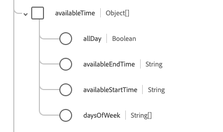

# [!UICONTROL 可用性]資料型別

[!UICONTROL 可用性]是標準的體驗資料模型(XDM)資料型別，可描述專案的可用性資料。 此資料型別是根據HL7 FHIR Release 5規格建立的。

| 顯示名稱 | 屬性 | 資料類型 | 說明 |
| --- | --- | --- | --- |
| [!UICONTROL 可用時間] | `availableTime` | 物件陣列 | 專案可用的時間。 如需詳細資訊，請參閱[&#128279;](#available-time)下方的區段。 |
| [!UICONTROL 無法使用時間] | `notAvailableTime` | 字串 | 無法使用專案的時間，並提供原因。 如需詳細資訊，請參閱[&#128279;](#not-available-time)下方的區段。 |

如需資料型別的詳細資訊，請參閱公用XDM存放庫：

* [已填入範例](https://github.com/adobe/xdm/blob/master/extensions/industry/healthcare/fhir/datatypes/availability.example.1.json)
* [完整結構描述](https://github.com/adobe/xdm/blob/master/extensions/industry/healthcare/fhir/datatypes/availability.schema.json)

## `availableTime` {#available-time}

`availableTime`是以物件陣列的形式提供。 每個物件的結構如下所述。

| 顯示名稱 | 屬性 | 資料類型 | 說明 |
| --- | --- | --- | --- |
| [!UICONTROL 全天] | `allDay` | 布林值 | 表示該專案是否永遠可用的布林值。 |
| [!UICONTROL 可用的結束時間] | `availableEndTime` | 字串 | 專案在一天中停止可用的時間。 如果`allDay`為`true`，則會忽略此專案。 |
| [!UICONTROL 可用的開始時間] | `availableStartTime` | 字串 | 專案開始可用的當日時間。 如果`allDay`為`true`，則會忽略此專案。 |
| 一週的[!UICONTROL 天] | `daysOfWeek` | 字串陣列 | 字串陣列，詳細說明可用天數。 此屬性的值必須等於下列一或多個已知列舉值。 <li> `mon` </li> <li> `tues` </li> <li> `wed` </li> <li> `thurs`</li>  <li> `fri` </li> <li> `sat`</li> <li> `sun`</li> |

## `notAvailableTime` {#not-available-time}

`notAvailableTime`是以物件陣列的形式提供。 每個物件的結構如下所述。

| 顯示名稱 | 屬性 | 資料類型 | 說明 |
| --- | --- | --- | --- |
| [!UICONTROL 期間] | `during` | [[!UICONTROL 週期]](../data-types/period.md) | 專案停止可用的時間週期。 |
| [!UICONTROL 說明] | `description` | 字串 | 專案無法使用的原因。 |
