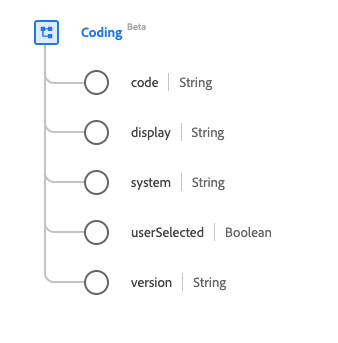

# [!UICONTROL 編碼]資料型別

[!UICONTROL 編碼]是標準的體驗資料模型(XDM)資料型別，描述術語系統所定義的程式碼參考。 此資料型別是根據HL7 FHIR Release 5規格建立的。

| 顯示名稱 | 屬性 | 資料類型 | 說明 |
| --- | --- | --- | --- |
| [!UICONTROL 代碼] | `code` | 字串 | 系統定義的語法符號。 |
| [!UICONTROL 顯示區] | `display` | 字串 | 由系統定義的表示。 |
| [!UICONTROL 系統] | `system` | 字串 | 識別碼值的名稱空間，重新顯示為URI。 |
| [!UICONTROL 已由使用者選取] | `userSelected` | 布林值 | 表示使用者是否選擇此編碼的指標。 預設值為false。 |
| [!UICONTROL 版本] | `version` | 字串 | 系統的版本。 |

如需資料型別的詳細資訊，請參閱公用XDM存放庫：

* [已填入範例](https://github.com/adobe/xdm/blob/master/extensions/industry/healthcare/fhir/datatypes/coding.example.1.json)
* [完整結構描述](https://github.com/adobe/xdm/blob/master/extensions/industry/healthcare/fhir/datatypes/coding.schema.json)
