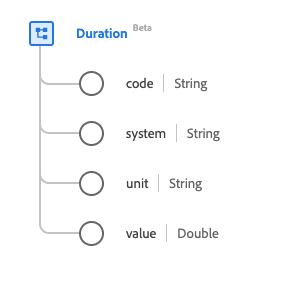

# [!UICONTROL 持續時間]資料型別

[!UICONTROL Duration]是描述時間長度的標準體驗資料模型(XDM)資料型別。 此資料型別是根據HL7 FHIR Release 5規格建立的。

| 顯示名稱 | 屬性 | 資料類型 | 說明 |
| --- | --- | --- | --- |
| [!UICONTROL 代碼] | `code` | 字串 | 時間單位的編碼形式。 |
| [!UICONTROL 系統] | `system` | 字串 | 描述編碼單位（以URI表示）的系統。 |
| [!UICONTROL 單位] | `unit` | 字串 | 以毫秒、秒、分鐘、小時、天、周、月或年表示的時間單位。 此屬性的值必須等於下列一或多個已知列舉值。 <li> `ms` （毫秒） </li> <li> `s` （秒） </li> <li> `min` （分鐘） </li> <li> `h` （小時） </li>  <li> `d` （天） </li> <li> `wk` （周） </li> <li> `mo` （月） </li> <li> `a` （年） </li> |
| [!UICONTROL 值] | `value` | 雙精度 | 時間單位的數值。 |

如需資料型別的詳細資訊，請參閱公用XDM存放庫：

* [已填入範例](https://github.com/adobe/xdm/blob/master/extensions/industry/healthcare/fhir/datatypes/duration.example.1.json)
* [完整結構描述](https://github.com/adobe/xdm/blob/master/extensions/industry/healthcare/fhir/datatypes/duration.schema.json)
