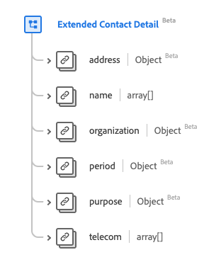

# [!UICONTROL 延伸連絡人詳細資料]資料型別

[!UICONTROL 延伸連絡人詳細資料]是描述延伸連絡人資訊的標準Experience Data Model (XDM)資料型別。 此資料型別是根據HL7 FHIR Release 5規格建立的。

| 顯示名稱 | 屬性 | 資料類型 | 說明 |
| --- | --- | --- | --- |
| [!UICONTROL 位址] | `address` | [[!UICONTROL 位址]](../data-types/address.md) | 連絡人的地址。 |
| [!UICONTROL 名稱] | `name` | [[!UICONTROL 人類名稱]](../data-types/human-name.md)的陣列 | 要聯絡的個人的名稱。 |
| [!UICONTROL 組織] | `organization` | [[!UICONTROL 參考]](../data-types/reference.md) | 處理/監控連絡人詳細資料的組織。 |
| [!UICONTROL 週期] | `period` | [[!UICONTROL 週期]](../data-types/period.md) | 連絡人有效或有效的使用期間。 |
| [!UICONTROL 用途] | `purpose` | [[!UICONTROL 可程式碼概念]](../data-types/codeable-concept.md) | 連絡人型別。 |
| [!UICONTROL 電信] | `telecom` | [[!UICONTROL 聯絡點]](../data-types/contact-point.md)的陣列 | 連絡人詳細資料。 |

如需資料型別的詳細資訊，請參閱公用XDM存放庫：

* [已填入範例](https://github.com/adobe/xdm/blob/master/extensions/industry/healthcare/fhir/datatypes/extendedcontactdetail.example.1.json)
* [完整結構描述](https://github.com/adobe/xdm/blob/master/extensions/industry/healthcare/fhir/datatypes/extendedcontactdetail.schema.json)
