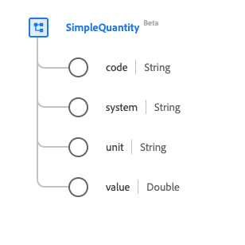

# [!UICONTROL 簡單數量]資料型別

[!UICONTROL 簡單數量]是標準的體驗資料模型(XDM)資料型別，可提供測量或可測量的數量。 此資料型別是根據HL7 FHIR Release 5規格建立的。

| 顯示名稱 | 屬性 | 資料類型 | 說明 |
| --- | --- | --- | --- |
| [!UICONTROL 代碼] | `code` | 字串 | 單位的編碼形式。 |
| [!UICONTROL 系統] | `system` | 字串 | 定義編碼單位形式的系統，以URI表示。 |
| [!UICONTROL 單位] | `unit` | 字串 | 單位的表示法。 |
| [!UICONTROL 值] | `value` | 雙精度 | 數值。 |

如需資料型別的詳細資訊，請參閱公用XDM存放庫：

* [已填入範例](https://github.com/adobe/xdm/blob/master/extensions/industry/healthcare/fhir/datatypes/simplequantity.example.1.json)
* [完整結構描述](https://github.com/adobe/xdm/blob/master/extensions/industry/healthcare/fhir/datatypes/simplequantity.schema.json)
