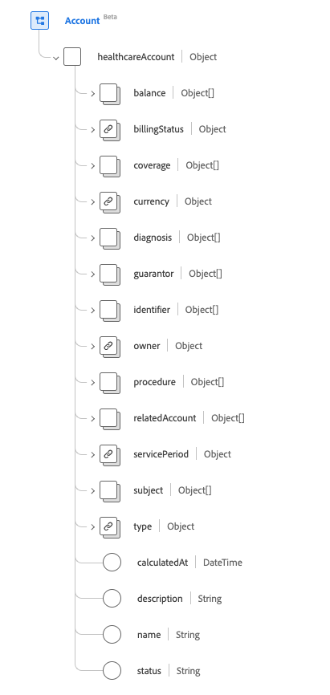
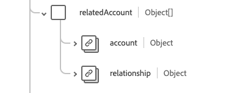

# [!UICONTROL 帳戶]結構描述欄位群組

[!UICONTROL 帳戶]是[[!DNL XDM Individual Profile] 類別](../../../classes/individual-profile.md)和[[!DNL Provider class]](../../../classes/provider.md)的標準結構描述欄位群組。 它提供單一物件型別欄位`healthcareAccount`，用來記錄交易、服務，以及與提供給病人或個人群組的醫療保健服務相關的其他財務資訊（例如保單或帳單用途）。

| 顯示名稱 | 屬性 | 資料類型 | 說明 |
| --- | --- | --- | --- |
| [!UICONTROL 餘額] | `balance` | 物件陣列 | 由財務系統計算與處理的帳戶餘額。 如需詳細資訊，請參閱下方的[區段](#balances)。 |
| [!UICONTROL 記帳狀態] | `billingStatus` | [[!UICONTROL 可程式碼概念]](../data-types/codeable-concept.md) | 這會透過計費程式追蹤帳戶的生命週期。 它指出交易配置至帳戶時的處理方式。 |
| [!UICONTROL 涵蓋範圍] | `coverage` | 物件陣列 | 負責支付此帳戶成本的一方，以及應依何種順序套用。 如需詳細資訊，請參閱[&#128279;](#coverage)下方的區段。 |
| [!UICONTROL 貨幣] | `currency` | [[!UICONTROL 可程式碼概念]](../data-types/codeable-concept.md) | 帳戶的預設貨幣。 |
| [!UICONTROL 診斷] | `diagnosis` | 物件陣列 | 與帳單相關的一組診斷會儲存在帳戶中，以便在處理之前適當地排序，以產生索賠。 如需詳細資訊，請參閱[&#128279;](#diagnosis)下方的區段。 |
| [!UICONTROL 擔保人] | `guarantor` | 物件陣列 | 若其他付款選項不足，則負責平衡科目的關係人。 如需詳細資訊，請參閱[&#128279;](#guarantor)下方的區段。 |
| [!UICONTROL 識別碼] | `identifier` | [[!UICONTROL 識別碼]](../data-types/identifier.md)的陣列 | 用於參考帳戶的唯一識別碼。 不一定是供人類使用（例如信用卡號碼）。 |
| [!UICONTROL 所有者] | `owner` | [[!UICONTROL 參考]](../data-types/reference.md) | 指示服務區域、醫院、部門等。 負責管理帳戶。 |
| [!UICONTROL 程式] | `procedure` | 物件陣列 | 帳單的相關程式集合會儲存在帳戶中，以便能夠在處理產生索賠之前適當地排序。 如需詳細資訊，請參閱[&#128279;](#procedure)下方的區段。 |
| [!UICONTROL 相關帳戶] | `relatedAccount` | 物件陣列 | 與此帳戶相關的其他關聯帳戶。 如需詳細資訊，請參閱[&#128279;](#related-account)下方的區段。 |
| [!UICONTROL 服務期間] | `servicePeriod` | [[!UICONTROL 週期]](../data-types/period.md) | 與此帳戶相關聯之服務的日期範圍。 |
| [!UICONTROL 主旨] | `subject` | [[!UICONTROL 參考]](../data-types/reference.md)的陣列 | 識別產生費用的實體。 雖然服務或商品的直接收件者可能是與主體相關的實體，但費用最終是由帳戶主體所產生。 |
| [!UICONTROL 類型] | `type` | [[!UICONTROL 可程式碼概念]](../data-types/codeable-concept.md) | 分類帳戶以用於報告和搜尋目的。 |
| [!UICONTROL 計算於] | `calculatedAt` | 日期時間 | 計算餘額的時間。 |
| [!UICONTROL 說明] | `description` | 字串 | 提供有關帳戶追蹤專案及使用方式的其他資訊。 |
| [!UICONTROL 名稱] | `name` | 字串 | 帳戶名稱。 |
| [!UICONTROL 狀態] | `status` | 字串 | 帳戶的狀態。 此屬性的值必須等於下列其中一個已知列舉值。 <li> `active` </li> <li> `inactive` </li> <li> `entered-in-error` </li> <li> `on-hold` </li> <li> `unknown`</li> |

如需欄位群組的詳細資訊，請參閱公用XDM存放庫：

* [已填入範例](https://github.com/adobe/xdm/blob/master/extensions/industry/healthcare/fhir/fieldgroups/account.example.1.json)
* [完整結構描述](https://github.com/adobe/xdm/blob/master/extensions/industry/healthcare/fhir/fieldgroups/account.schema.json)

## `balances` {#balances}

`balances`是以物件陣列的形式提供。 每個物件的結構如下所述。

| 顯示名稱 | 屬性 | 資料類型 | 說明 |
| --- | --- | --- | --- |
| [!UICONTROL 彙總] | `aggregate` | [[!UICONTROL 可程式碼概念]](../data-types/codeable-concept.md) | 誰應支付餘額的這個部分。 |
| [!UICONTROL 金額] | `amount` | [[!UICONTROL 金額]](../data-types/money.md) | 為條件屬性中定義的年齡計算的實際餘額。 |
| [!UICONTROL 字詞] | `term` | [[!UICONTROL 可程式碼概念]](../data-types/codeable-concept.md) | 帳戶的期限。 |
| [!UICONTROL 估計] | `estimate` | 布林值 | 如果金額是估計值。 |

## `coverage` {#coverage}

`coverage`是以物件陣列的形式提供。 每個物件的結構如下所述。

| 顯示名稱 | 屬性 | 資料類型 | 說明 |
| --- | --- | --- | --- |
| [!UICONTROL 涵蓋範圍] | `coverage` | [[!UICONTROL 參考]](../data-types/reference.md) | 負責支付此帳戶成本的一方，以及應依何種順序套用。 |
| [!UICONTROL 優先順序] | `priority` | 整數 | 此帳戶內容中涵蓋範圍的優先順序，最小值為`0`。 |

## `diagnosis` {#diagnosis}

`diagnosis`是以物件陣列的形式提供。 每個物件的結構如下所述。

| 顯示名稱 | 屬性 | 資料類型 | 說明 |
| --- | --- | --- | --- |
| [!UICONTROL 條件] | `condition` | [[!UICONTROL 可程式碼參考]](../data-types/codeable-reference.md) | 和帳戶相關的診斷。 |
| [!UICONTROL 封裝代碼] | `packageCode` | [[!UICONTROL 可程式碼概念]](../data-types/codeable-concept.md)的陣列 | 套件程式碼可用來將可能作為單一產品（例如DRG）定價或交付的診斷分組。 |
| [!UICONTROL 類型] | `type` | [[!UICONTROL 可程式碼概念]](../data-types/codeable-concept.md)的陣列 | 此診斷與帳戶相關的型別（例如，入境、帳單、出境……）。 |
| [!UICONTROL 診斷日期] | `dateOfDiagnosis` | 日期時間 | 診斷日期（編碼診斷時）。 |
| [!UICONTROL 正在許可] | `onAdmission` | 布林值 | 是否診斷出現在入院時。 |
| [!UICONTROL 順序] | `sequence` | 整數 | 診斷排名（針對每種型別），最小值為`0`。 |

## `guarantor` {#guarantor}

`guarantor`是以物件陣列的形式提供。 每個物件的結構如下所述。

| 顯示名稱 | 屬性 | 資料類型 | 說明 |
| --- | --- | --- | --- |
| [!UICONTROL 派對] | `party` | [[!UICONTROL 參考]](../data-types/reference.md) | 負責的實體。 |
| [!UICONTROL 週期] | `period` | [[!UICONTROL 週期]](../data-types/period.md) | 保證人接受帳戶責任的時間範圍。 |
| [!UICONTROL 保留] | `onHold` | 布林值 | 擔保人可能會被凍結或以其他方式暫停其職務。 |

## `procedure` {#procedure}

`procedure`是以物件陣列的形式提供。 每個物件的結構如下所述。

| 顯示名稱 | 屬性 | 資料類型 | 說明 |
| --- | --- | --- | --- |
| [!UICONTROL 代碼] | `code` | [[!UICONTROL 可程式碼參考]](../data-types/codeable-reference.md) | 與帳戶相關的程式。 |
| [!UICONTROL 裝置] | `device` | [[!UICONTROL 參考]](../data-types/reference.md)的陣列 | 與帳戶相關程式關聯的任何裝置。 |
| [!UICONTROL 類型] | `type` | [[!UICONTROL 可程式碼概念]](../data-types/codeable-concept.md)的陣列 | 在帳戶收費時應如何使用程式值。 |
| [!UICONTROL 封裝代碼] | `packageCode` | [[!UICONTROL 可程式碼概念]](../data-types/codeable-concept.md)的陣列 | 套件程式碼可用來將可能作為單一產品（例如DRG）定價或交付的程式分組。 |
| [!UICONTROL 服務日期] | `dateOfService` | 日期時間 | 使用編碼程式時的日期。 如果使用程式的參照，則應該使用程式的日期。 |
| [!UICONTROL 序列] | `sequence` | 整數 | 程式的排名（針對每個型別），最小值為`0`。 |

## `relatedAccount` {#related-account}

`relatedAccount`是以物件陣列的形式提供。 每個物件的結構如下所述。

| 顯示名稱 | 屬性 | 資料類型 | 說明 |
| --- | --- | --- | --- |
| [!UICONTROL 帳戶] | `account` | [[!UICONTROL 參考]](../data-types/reference.md) | 對關聯帳戶的引用。 |
| [!UICONTROL 關係] | `relationship` | [[!UICONTROL 可程式碼概念]](../data-types/codeable-concept.md) | 關聯帳戶的關係。 |
