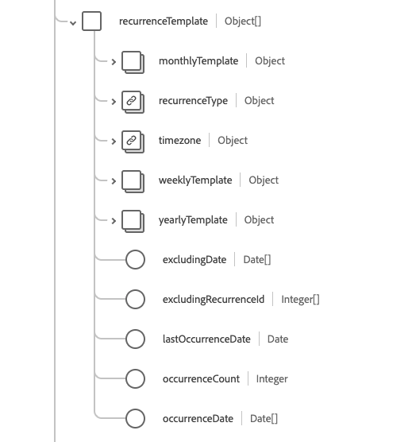
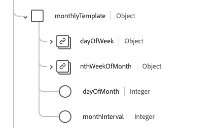

# [!UICONTROL 約會]結構描述欄位群組

[!UICONTROL 約會]是[[!DNL XDM Individual Profile] 類別](../../../classes/individual-profile.md)和[[!DNL Provider class]](../../../classes/provider.md)的標準結構描述欄位群組。 它提供單一物件型別欄位`healthcareAppointment`，其中包含有關病人、從業人員、相關人員和/或特定日期和時間之裝置預約醫療保健事件的資訊。

| 顯示名稱 | 屬性 | 資料類型 | 說明 |
| --- | --- | --- | --- |
| [!UICONTROL 帳戶] | `account` | [[!UICONTROL 參考]](../data-types/reference.md)的陣列 | 預期用於計費的帳戶集。 |
| [!UICONTROL 約會型別] | `appointmentType` | [[!UICONTROL 可程式碼概念]](../data-types/codeable-concept.md) | 已預約到插槽的預約或病人的樣式（不是服務型別）。 |
| [!UICONTROL 根據] | `basedOn` | [[!UICONTROL 參考]](../data-types/reference.md)的陣列 | 指派約會以進行評估的要求，例如程式要求。 |
| [!UICONTROL 取消原因] | `cancellationReason` | [[!UICONTROL 可程式碼概念]](../data-types/codeable-concept.md)的陣列 | 取消約會的編碼原因。 這通常用於報表、帳單或處理，以判斷是否需要進一步的動作，或是否需支付特定費用。 |
| [!UICONTROL 類別] | `class` | [[!UICONTROL 可程式碼概念]](../data-types/codeable-concept.md)的陣列 | 代表病人遭遇分類的概念，例如流動、門診、住院或急診。 |
| [!UICONTROL 識別碼] | `identifier` | [[!UICONTROL 識別碼]](../data-types/identifier.md)的陣列 | 連結至約會的不重複識別碼清單。 這些識別碼是根據商業規則指派的，或是不適合連至約會的直接URL連結時指派的。 |
| [!UICONTROL 備註] | `note` | [[!UICONTROL 註解]](../data-types/annotation.md)的陣列 | 關於約會的其他附註或註解。 |
| [!UICONTROL 原始約會] | `originatingAppointment` | [[!UICONTROL 參考]](../data-types/reference.md) | 週期性相關約會集中的原始約會。 |
| [!UICONTROL 參與者] | `participant` | 物件陣列 | 參與約會的參與者清單。 如需詳細資訊，請參閱[&#128279;](#participant)下方的區段。 |
| [!UICONTROL 病人指示] | `patientInstruction` | [[!UICONTROL 可程式碼參考的陣列]](../data-types/reference.md) | 和約會相關的診斷。 |
| [!UICONTROL 先前的約會] | `previousAppointment` | [[!UICONTROL 參考]](../data-types/reference.md) | 一系列相關約會中的前一個約會。 |
| [!UICONTROL 優先順序] | `priority` | [[!UICONTROL 可程式碼概念]](../data-types/codeable-concept.md) | 預約的優先順序，當需要重新排定預約的優先順序時，可用來做出明智的決策。 iCal Standard將`0`指定為未定義，`1`指定為最高優先順序，`9`指定為最低優先順序。 |
| [!UICONTROL 原因] | `reason` | [[!UICONTROL 可程式碼概念]](../data-types/codeable-concept.md)的陣列 | 排定約會的原因，通常是條件或程式。 |
| [!UICONTROL 週期性範本] | `recurrenceTemplate` | 物件陣列 | 包含用於建立週期性約會的週期性模式或範本的詳細資料。  如需詳細資訊，請參閱[&#128279;](#recurrence)下方的區段。 |
| [!UICONTROL 取代] | `replaces` | [[!UICONTROL 參考]](../data-types/reference.md)的陣列 | 此約會正在取代的約會。 如果有取消，可以在參考資源的`cancellationReason`屬性中找到取消的詳細資料。 |
| [!UICONTROL 要求的期間] | `requestedPeriod` | [[!UICONTROL 週期]](../data-types/period.md)的陣列 | 偏好排程約會的一組日期範圍（可能包括時間）。 |
| [!UICONTROL 服務類別] | `serviceCategory` | [[!UICONTROL 可程式碼概念]](../data-types/codeable-concept.md)的陣列 | 在約會期間要執行之服務的廣泛分類。 |
| [!UICONTROL 服務型別] | `serviceType` | [[!UICONTROL 可程式碼參考的陣列]](../data-types/codeable-reference.md) | 在約會期間要執行的特定服務。 |
| [!UICONTROL 插槽] | `slot` | [[!UICONTROL 參考]](../data-types/reference.md)的陣列 | 參與者排程中由約會填補的時段。 |
| [!UICONTROL 專業] | `speciality` | [[!UICONTROL 可程式碼概念]](../data-types/codeable-concept.md)的陣列 | 執行此約會中所要求之服務所需的從業人員專業。 |
| [!UICONTROL 主旨] | `subject` | [[!UICONTROL 參考]](../data-types/reference.md)的陣列 | 與預約相關聯的病人或群組。 |
| [!UICONTROL 支援資訊] | `supportingInformation` | [[!UICONTROL 參考]](../data-types/reference.md)的陣列 | 進行約會以支援時提供的其他資訊。 |
| [!UICONTROL 虛擬服務] | `virtualService` | [[!UICONTROL 虛擬服務詳細資料]](../data-types/virtual-service-detail.md)的陣列 | 虛擬服務的連線詳細資料，例如電話會議。 |
| [!UICONTROL 取消日期] | `cancellationDate` | 日期時間 | 取消約會的日期和時間。 |
| [!UICONTROL 已建立] | `created` | 日期時間 | 約會的建立日期和時間。 |
| [!UICONTROL 說明] | `description` | 字串 | 約會的簡短說明。 詳細或展開的資訊應放在`note`欄位中。 |
| [!UICONTROL 結束] | `end` | 日期時間 | 約會結束的日期和時間。 |
| [!UICONTROL 分鐘持續時間] | `minutesDuration` | 整數 | 約會將花費的分鐘數。 這可以小於開始和結束時間之間的持續時間。 可接受的最小值為`0`。 |
| [!UICONTROL 發生變更] | `occurenceChanged` | 布林值 | 表示此約會是否與週期性模式不同的旗標。 |
| [!UICONTROL 週期識別碼] | `RecurrenceId` | 整數 | 識別週期性模式中特定約會的序號。 最小值為`0`。 |
| [!UICONTROL 開始] | `start` | 日期時間 | 約會發生的日期和時間。 |
| [!UICONTROL 狀態] | `status` | 字串 | 約會的狀態。 此屬性的值必須等於下列其中一個已知列舉值： <li> `proposed` </li> <li> `pending` </li> <li> `booked` </li> <li> `arrived` </li> <li> `fulfilled` </li> <li> `cancelled` </li> <li> `noshow` </li> <li> `entered-in-error` </li> <li> `checked-in` </li> <li> `waitlist` </li> |

如需欄位群組的詳細資訊，請參閱公用XDM存放庫：

* [已填入範例](https://github.com/adobe/xdm/blob/master/extensions/industry/healthcare/fhir/fieldgroups/appointment.example.1.json)
* [完整結構描述](https://github.com/adobe/xdm/blob/master/extensions/industry/healthcare/fhir/fieldgroups/appointment.schema.json)

## `participant` {#participant}

`participant`是以物件陣列的形式提供。 每個物件的結構如下所述。

| 顯示名稱 | 屬性 | 資料類型 | 說明 |
| --- | --- | --- | --- |
| [!UICONTROL 執行者] | `actor` | [[!UICONTROL 參考]](../data-types/reference.md) | 參與約會的個人、裝置、地點或服務。 |
| [!UICONTROL 週期] | `period` | [[!UICONTROL 週期]](../data-types/period.md) | 參與者（執行者）參與約會的時間期間。 |
| [!UICONTROL 類型] | `type` | [[!UICONTROL 可程式碼概念]](../data-types/codeable-concept.md)的陣列 | 約會中參與者（執行者）的角色。 |
| [!UICONTROL 必要] | `required` | 布林值 | 此參與者是否需要出席。 |
| [!UICONTROL 狀態] | `status` | 字串 | 參與者的接受狀態。 此屬性的值必須等於下列其中一個已知列舉值： <li> `accepted` </li> <li> `declined` </li> <li> `tentative` </li> <li> `needs-action` </li> |

## `recurrenceTemplate` {#recurrence}

`recurrenceTemplate`是以物件陣列的形式提供。 每個物件的結構如下所述。

| 顯示名稱 | 屬性 | 資料類型 | 說明 |
| --- | --- | --- | --- |
| [!UICONTROL 每月範本] | `monthlyTemplate` | 物件陣列 | 每月週期性約會的相關資訊。 如需詳細資訊，請參閱[&#128279;](#monthly-template)下方的區段。 |
| [!UICONTROL 週期型別] | `recurrenceType` | [[!UICONTROL 可程式碼概念]](../data-types/codeable-concept.md) | 約會序列應該遞回的頻率，例如每週、每月或每年。 |
| [!UICONTROL 時區] | `timezone` | [[!UICONTROL 可程式碼概念]](../data-types/codeable-concept.md) | 週期性約會的時區。 |
| [!UICONTROL 每週範本] | `weeklyTemplate` | 物件陣列 | 每週週期性約會的相關資訊。 如需詳細資訊，請參閱[&#128279;](#weekly-template)下方的區段。 |
| [!UICONTROL 每年範本] | `yearlyTemplate` | 物件 | 每年週期性約會的相關資訊。 包含一個屬性`yearInterval`，其整數值表示約會每隔n年發生。 |
| [!UICONTROL 排除日期] | `excludingDate` | 日期陣列 | 任何應從週期中排除的日期，例如假日。 |
| [!UICONTROL 排除週期識別碼] | `excludingRecurrenceId` | 整數陣列 | 任何應從週期中排除的週期ID。 這是`excludingDate`的替代方法，您指示要排除的約會`reccurenceID`。 |
| [!UICONTROL 上次出現日期] | `lastOccurenceDate` | 日期 | 不再排程週期性約會的截止日期。 |
| [!UICONTROL 發生次數] | `occurenceCount` | 整數 | 在週期中計畫的約會數。 最小值為`0`。 |
| [!UICONTROL 發生日期] | `occurenceDate` | 日期陣列 | 排定約會的特定日期清單。 |

## `weeklyTemplate` {#weekly-template}

`weeklyTemplate`是以物件陣列的形式提供。 每個物件的結構如下所述。

| 顯示名稱 | 屬性 | 資料類型 | 說明 |
| --- | --- | --- | --- |
| [!UICONTROL 星期五] | `friday` | 布林值 | 表示週期性約會應在星期五。 |
| [!UICONTROL 星期一] | `monday` | 布林值 | 表示週期性約會應該發生在星期一。 |
| [!UICONTROL 星期六] | `saturday` | 布林值 | 表示週期性約會應在星期六發生。 |
| [!UICONTROL 星期日] | `sunday` | 布林值 | 表示週期性約會應在星期日發生。 |
| [!UICONTROL 星期四] | `thursday` | 布林值 | 表示週期性約會應該發生在星期四。 |
| [!UICONTROL 星期二] | `tuesday` | 布林值 | 表示週期性約會應該發生在星期二。 |
| [!UICONTROL 星期三] | `wednesday` | 布林值 | 表示週期性約會應該發生在星期三。 |
| [!UICONTROL 周間隔] | `weekInterval` | 整數 | 指定約會遞回的頻率（以每隔n周為單位）。 預設為每週，因此一般值為2或更高。 |

## `monthlyTemplate` {#monthly-template}

`monthlyTemplate`是以物件陣列的形式提供。 每個物件的結構如下所述。

| 顯示名稱 | 屬性 | 資料類型 | 說明 |
| --- | --- | --- | --- |
| [!UICONTROL 星期] | `dayOfWeek` | [[!UICONTROL 編碼]] | 指示約會應該發生在一週中的這個特定日。 |
| [!UICONTROL 第n周] | `nthWeekOfMonth` | [[!UICONTROL 編碼]](../data-types/coding.md) | 表示約會應在一個月的第n周。 |
| [!UICONTROL 日期] | `dayOfMonth` | 整數 | 表示約會應該發生在這個月的特定日期。 |
| [!UICONTROL 個月間隔] | `monthInterval` | 整數 | 表示週期性約會應每隔n個月發生。 |

