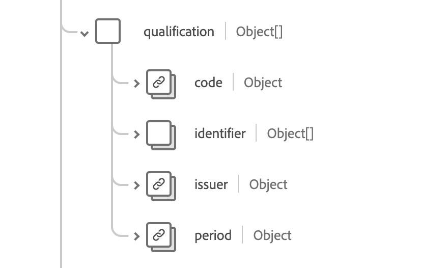

# [!UICONTROL 組織]結構描述欄位群組

[!UICONTROL 組織]是[[!DNL XDM Individual Profile] 類別](../../../classes/individual-profile.md)和[[!DNL Provider class]](../../../classes/provider.md)的標準結構描述欄位群組。 它提供單一物件型別欄位`healthcareOrganization`，其中包含有關具有共同目的之人員或組織分組的資訊。

| 顯示名稱 | 屬性 | 資料類型 | 說明 |
| ---| --- | --- | --- |
| [!UICONTROL 連絡人詳細資料] | `contact` | [[!UICONTROL 延伸連絡人詳細資料]](../data-types/extended-contact-detail.md)的陣列 | 特定組織可用的通訊裝置的聯絡詳細資訊。 其中可能包括地址、電話號碼、傳真號碼、行動電話號碼、電子郵件地址和網站。 |
| [!UICONTROL 端點] | `endpoint` | [[!UICONTROL 參考]](../data-types/reference.md)的陣列 | 可存取組織所操作服務的技術端點。 |
| [!UICONTROL 識別碼] | `indentifier` | [[!UICONTROL 識別碼]](../data-types/identifier.md)的陣列 | 用於跨多個不同系統識別組織的識別碼。 |
| [!UICONTROL 組織的一部分] | `partOf` | [[!UICONTROL 參考]](../data-types/reference.md) | 此組織所屬的組織。 |
| [!UICONTROL 資格] | `qualification` | 物件陣列 | 正式認證、認證、培訓、指派，以及授權及/或以其他方式認可組織提供照料的授權。 如需詳細資訊，請參閱[&#128279;](#qualification)下方的區段。 |
| [!UICONTROL 類型] | `type` | [[!UICONTROL 可程式碼概念]](../data-types/codeable-concept.md)的陣列 | 組織型別。 |
| [!UICONTROL 作用中] | `active` | 布林值 | 組織的記錄是否仍在使用中。 |
| [!UICONTROL 別名] | `alias` | 字串陣列 | 組織稱為或過去稱為的替代名稱清單。 |
| [!UICONTROL 說明] | `description` | 字串 | 組織的描述，可協助提供一般內容，以確保選取正確的組織。 |
| [!UICONTROL 名稱] | `name` | 字串 | 與組織相關聯的名稱。 |

如需欄位群組的詳細資訊，請參閱公用XDM存放庫：

* [已填入範例](https://github.com/adobe/xdm/blob/master/extensions/industry/healthcare/fhir/fieldgroups/coverage.example.1.json)
* [完整結構描述](https://github.com/adobe/xdm/blob/master/extensions/industry/healthcare/fhir/fieldgroups/coverage.schema.json)

## `qualification` {#qualification}

`qualification`是以物件陣列的形式提供。 每個物件的結構如下所述。

| 顯示名稱 | 屬性 | 資料類型 | 說明 |
| --- | --- | --- | --- |
| [!UICONTROL 代碼] | `code` | [[!UICONTROL 可程式碼概念]](../data-types/codeable-concept.md) | 資格的編碼表示。 |
| [!UICONTROL 識別碼] | `identifier` | [[!UICONTROL 識別碼]](../data-types/identifier.md)的陣列 | 配置給此組織之此資格的識別碼。 |
| [!UICONTROL 簽發者] | `issuer` | [[!UICONTROL 參考]](../data-types/reference.md) | 監管並簽發資格的組織。 |
| [!UICONTROL 週期] | `period` | [[!UICONTROL 週期]](../data-types/period.md) | 資格的有效期間。 |
