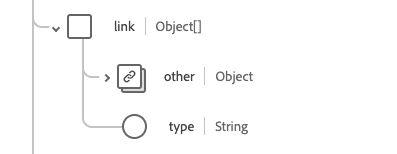

# [!UICONTROL 病人]結構描述欄位群組

[!UICONTROL 病人]是[[!DNL XDM Individual Profile] 類別](../../../classes/individual-profile.md)的標準結構描述欄位群組。 它提供單一物件型別欄位`healthcarePatient`，可擷取個人或動物接受護理或其他健康相關服務的人口統計及其他管理細節。

| 顯示名稱 | 屬性 | 資料類型 | 說明 |
| --- | --- | --- | --- |
| [!UICONTROL 位址] | `address` | [[!UICONTROL 位址]](../data-types/address.md)的陣列 | 患者的地址資訊。 |
| [!UICONTROL 通訊] | `communication` | 物件陣列 | 一種語言，可用來與病人溝通有關其健康狀況。 如需詳細資訊，請參閱](#communication)下方的[區段。 |
| [!UICONTROL 病人聯絡人] | `contact` | 物件陣列 | 患者的聯絡人，例如監護人、合作夥伴或朋友。 如需詳細資訊，請參閱](#contact)下方的[區段。 |
| [!UICONTROL 一般從業人員] | `generalPractioner` | [[!UICONTROL 參考]](../data-types/reference.md)的陣列 | 病人的主要照護提供者。 |
| [!UICONTROL 識別碼] | `identifier` | [[!UICONTROL 識別碼]](../data-types/identifier.md)的陣列 | 適用於患者的識別碼。 |
| [!UICONTROL 病人連結詳細資料] | `link` | 物件陣列 | 與同一個人相關的患者或相關人員資源的連結。 如需詳細資訊，請參閱](#link)下方的[區段。 |
| [!UICONTROL 管理組織] | `managingOrganization` | [[!UICONTROL 參考]](../data-types/reference.md) | 病人記錄的保管組織。 |
| [!UICONTROL 婚姻狀況] | `maritalStatus` | [[!UICONTROL 可程式碼概念]](../data-types/codeable-concept.md) | 患者的婚姻狀況。 |
| [!UICONTROL 名稱] | `name` | [[!UICONTROL 人類名稱]](../data-types/human-name.md)的陣列 | 與病人關聯的名稱。 |
| [!UICONTROL 連絡人詳細資料] | `telecom` | [[!UICONTROL 聯絡點]](../data-types/contact-point.md)的陣列 | 聯絡詳細資訊，例如電話號碼或電子郵件地址，可用來聯絡患者。 |
| [!UICONTROL 為作用中] | `active` | 布林值 | 表示病歷是否在使用中。 |
| [!UICONTROL 出生日期] | `birthDate` | 日期 | 病人的出生日期。 |
| [!UICONTROL 已死亡的指標] | `deceasedBoolean` | 布林值 | 指示病人是否死亡。 |
| [!UICONTROL 去世的日期時間] | `deceasedDateTime` | 日期時間 | 病人死亡的日期和時間。 |
| [!UICONTROL 性別] | `gender` | 字串 | 個人的性別識別。 此屬性的值必須等於下列其中一個已知列舉值。 <li> `female` </li> <li> `male` </li> <li> `other` </li> <li> `unknown`</li> |
| [!UICONTROL 是多胞胎]的一部分 | `multipleBirthBoolean` | 布林值 | 表示病人是否為多胞胎的一員。 |
| [!UICONTROL 出生編號] | `multipleBirthInteger` | 整數 | 順序中的出生編號。 |

如需欄位群組的詳細資訊，請參閱公用XDM存放庫：

* [已填入範例](https://github.com/adobe/xdm/blob/master/extensions/industry/healthcare/fhir/fieldgroups/patient.example.1.json)
* [完整結構描述](https://github.com/adobe/xdm/blob/master/extensions/industry/healthcare/fhir/fieldgroups/patient.schema.json)

## `communication` {#communication}

`communication`是以物件陣列的形式提供。 每個物件的結構如下所述。

| 顯示名稱 | 屬性 | 資料類型 | 說明 |
| --- | --- | --- | --- |
| [!UICONTROL 語言] | `language` | [[!UICONTROL 可程式碼概念]](../data-types/codeable-concept.md) | 可用來與個人溝通其健康狀況的語言。 |
| [!UICONTROL 是慣用語言] | `preferred` | 布林值 | 指示語言是否為他們的偏好語言。 |

## `contact` {#contact}

`contact`是以物件陣列的形式提供。 每個物件的結構如下所述。

| 顯示名稱 | 屬性 | 資料類型 | 說明 |
| --- | --- | --- | --- |
| [!UICONTROL 連絡人地址] | `address` | [[!UICONTROL 位址]](../data-types/address.md) | 聯絡人的地址。 |
| [!UICONTROL 連絡人姓名] | `name` | [[!UICONTROL 人名]](../data-types/human-name.md) | 聯絡人的名稱。 |
| [!UICONTROL 連絡組織] | `organization` | [[!UICONTROL 參考]](../data-types/reference.md) | 與聯絡人相關聯的組織。 |
| [!UICONTROL 聯絡期間] | `period` | [[!UICONTROL 週期]](../data-types/period.md) | 連絡人過去或現在使用的時段。 |
| [!UICONTROL 關聯性&#39;] | `relationship` | [[!UICONTROL 可程式碼概念]](../data-types/codeable-concept.md) | 病患與聯絡人之間的關係。 |
| [!UICONTROL 連絡人詳細資料] | `telecom` | 物件陣列 | 聯絡人的聯絡詳細資料。 如需詳細資訊，請參閱](#telecom)下方的[區段。 |
| [!UICONTROL 性別] | `gender` | 字串 | 個人的性別識別。 此屬性的值必須等於下列其中一個已知列舉值。 <li> `female` </li> <li> `male` </li> <li> `other` </li> <li> `unknown`</li> |

### `telecom` {#telecom}

`telecom`是以物件陣列的形式提供。 每個物件的結構如下所述。

| 顯示名稱 | 屬性 | 資料類型 | 說明 |
| --- | --- | --- | --- |
| [!UICONTROL 聯絡視窗] | `contactPoint` | [[!UICONTROL 聯絡視窗]](../data-types/contact-point.md) | 此人的聯絡詳細資訊。 |

## `link` {#link}

`link`是以物件陣列的形式提供。 每個物件的結構如下所述。

| 顯示名稱 | 屬性 | 資料類型 | 說明 |
| --- | --- | --- | --- |
| [!UICONTROL 其他] | `other` | [[!UICONTROL 參考]](../data-types/reference.md) | 與同一個人相關的患者或相關人員資源的連結。 |
| [!UICONTROL 類型] | `type` | 字串 | 兩個患者資源之間的連結型別。 |
