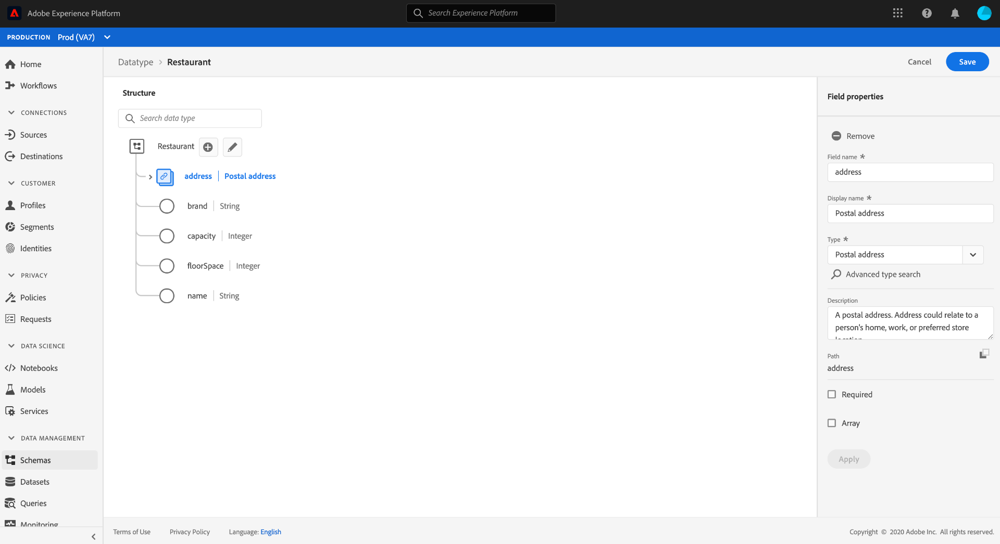

# 使用Experience Platform UI建立和編輯資料類型

在Experience Data Model(XDM)中，資料類型會以與基本常值欄位相同的方式，用作類別或混合的參考類型欄位，主要差異在於資料類型可定義多個子欄位。 雖然與允許一致使用多欄位結構的混音類似，但資料類型更具彈性，因為它們可以包含在架構結構中的任何位置，而混音只能在根層級新增。

Adobe Experience Platform提供許多標準資料類型，可用於涵蓋各種常見的體驗管理使用案例。 不過，您也可以定義您自己的自訂資料類型，以滿足您獨特的業務需求。

本教學課程涵蓋在平台使用者介面中建立和編輯自訂資料類型的步驟。

## 必要條件

本教學課程需要對XDM System有充分的瞭解。 請參閱 [XDM概觀](../home.md) ，以瞭解XDM在Experience Platform生態系統中的角色，以及架構構 [成的基本概念](../schema/composition.md) ，以瞭解資料類型對XDM架構的貢獻。

雖然本教學課程不需要，但建議您也要遵循在UI中 [構成架構的教學課程](./-schema-ui.md) ，以熟悉本課程的各種功能 [!DNL Schema Editor]。

## 開啟 [!DNL Schema Editor] 資料類型

在平台UI中，選擇左 **[!UICONTROL 側導航中的]** 「方案」以開啟「方案 [!UICONTROL 」工作區，然後選擇「] 資料類型 **** 」頁籤。 隨即顯示可用資料類型的清單，包括Adobe所定義的資料類型以及您組織所建立的資料類型。

從這裡，您有兩個選擇：

* [建立新的資料類型](#create)
* [選擇要編輯的現有資料類型](#edit)

### 建立新的資料類型 {#create}

從「資料 **[!UICONTROL 類型」標籤]** ，選取「 **[!UICONTROL 建立資料類型」]**。

此時 [!DNL Schema Editor] 會出現，顯示畫布中新資料類型的目前結構。 在編輯器的右側，可提供顯示名稱及資料類型的選用說明。 確保為資料類型提供唯一且簡潔的名稱，這是將資料類型添加到架構時如何標識的名稱。

本教學課程會建立描述餐廳屬性的資料類型，因此資料類型的顯示名稱為「Restaurant」。

跳至下一 [節](#add-fields) ，開始新增欄位至資料類型。

### 編輯現有的資料類型

只能編輯您組織定義的自訂資料類型。 若要縮小顯示的清單，請選取篩選圖示()，以根據擁有者顯示篩選控 [!UICONTROL 制項]。 選擇「 **[!UICONTROL 客戶]** 」以僅顯示您組織擁有的自訂資料類型。

從清單中選取您要編輯的資料類型，以開啟右側邊欄，顯示資料類型的詳細資訊。 在右側導軌中選擇資料類型的名稱，以在中開啟其結構 [!DNL Schema Editor]。

## 新增欄位至資料類型 {#add-fields}

若要開始新增欄位至資料類型，請選 **取畫布中根層級欄位旁的加號(+)** 圖示。 下方會顯示新欄位，右側欄位會更新以顯示新欄位的控制項。

使用右側欄控制項來提供欄 **[!UICONTROL 位名稱]**、 **[!UICONTROL 顯示名稱]**, **** 以及欄位類型。 請注意，欄位的類型可能是基本標量類型（例如字串、整數或布林），或可代表Adobe或您的組織所定義的其他多欄位資料類型。

餐廳資料類型需要字串欄位來代表餐廳的名稱。 因此，欄位 [!UICONTROL 名稱會設] 為&quot;name&quot;，而 [!UICONTROL Type] 則會設為字 [!UICONTROL 串]。 選擇 **[!UICONTROL 應用]** ，將更改應用到欄位。

繼續執行相同的新增欄位程式，從選取根層級欄位旁的加號( **+)** 圖示，並在右側欄位中提供設定詳細資訊開始。

餐廳資料類型現在有品牌、座位容量和佔地面積的額外欄位。

除了基本欄位外，您也可以在自訂資料類型中巢狀內嵌其他資料類型。 例如，Restaurant資料類型需要一個代表屬性實際位址的欄位。 在此案例中，您可以新增新的「地址」欄位，此欄位會指派標準資料類型「郵[!UICONTROL 遞區號]」。

這說明在描述資料時，資料類型有多靈活：資料類型可以採用欄位，這些欄位也是資料類型，而這些欄位本身可以包含其他資料類型，依此類推。 這可讓您在XDM架構中抽象和重複使用常用資料模式，以更輕鬆地呈現複雜的資料結構。

在將欄位添加到資料類型後，選擇「 **[!UICONTROL Save]** 」（保存）以保存更改並將資料類型添加到中 [!DNL Schema Library]。

## 將資料類型新增至混音

建立資料類型後，您就可以開始在結構中使用它。 由於XDM模式由類和零個或多個混合組成，因此不能直接將資料類型提供的欄位添加到模式。 而必須包含在類別或混音中。

>[!NOTE]
>
>本節著重於將資料類型新增至混音，因為這是自訂資料類型最常見的模式。 不過，您也可以套用相同的步驟，將資料類型新增至類別。

您可以將資料類型新增至現有混音，或完全建立新混音。 無論是哪種情況，您都必須開啟 [!DNL Schema Editor] 計畫將新資料類型添加到的方案(通過從 **[!UICONTROL Browse]** （瀏覽）頁籤中選擇現有方案或通過完全建立新方案)。

在中開啟架構後， [!DNL Schema Editor]選擇要將資料類型添加到左側導軌中的混合。 如果架構沒有適當的混音，請依照步驟建立新 [混音](./create-schema-ui.md#define-mixin) ，以改為新增至架構，並確定已在左側導軌中選取混音。

選擇 **方案名稱旁的加號(+)** 圖示，以新增欄位至選取的混音。 為欄位選 **[!UICONTROL 擇Type]** 屬性時，您以前建立的資料類型的名稱現在可以在下拉清單中使用。 您可以開始輸入資料類型的名稱，以協助您更輕鬆找到。

從清單中選取您的資料類型，然後選取「套 **[!UICONTROL 用」]**。 畫布中的模式欄位會更新，以顯示資料類型提供的結構化子欄位。 如果通過選擇「保存 ****」來保存模式，則混音也會保存，允許在屬於同一類的其他方案中重複使用混音。

>[!NOTE]
>
>Mixin只與一個類別相容。 如果您希望根據不同類別在其他結構中使用您的資料類型，則必須依照上述步驟，將資料類型新增至其他混合，以延伸這些類別。

## 後續步驟

本教學課程涵蓋如何建立和編輯資料類型，以及如何使用新增資料類型至混合 [!DNL Schema Editor]。 若要進一步瞭解如何在UI中使用資料類型，包括如何將多欄位物件轉換為資料類型，請參閱架構建 [立教學課程](./create-schema-ui.md#datatype)。

要瞭解如何使用方案註冊表API建立資料類型，請參閱數 [據類型端點指南](../api/data-types.md#create)。