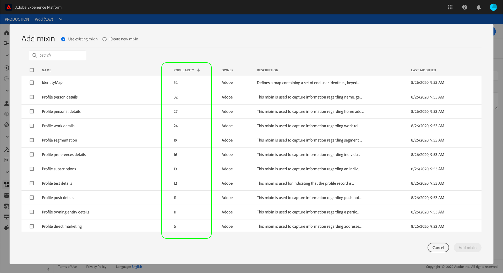
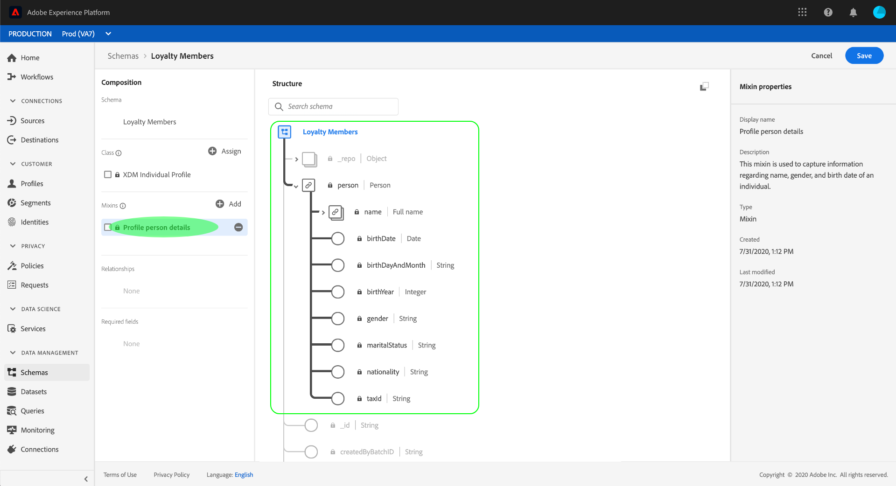

# 使用[!DNL Schema Editor]建立模式

Adobe Experience Platform用戶介面允許您在稱為[!DNL Schema Editor]的互動式可視畫布中建立和管理[!DNL Experience Data Model](XDM)模式。 本教程介紹如何使用[!DNL Schema Editor]建立模式。

>[!NOTE]
>
>為了進行示範，本教學課程中的步驟包括建立描述客戶忠誠度方案成員的範例架構。 雖然您可以使用這些步驟為自己建立不同的架構，但建議您先遵循建立範例架構，以瞭解[!DNL Schema Editor]的功能。

如果您偏好使用[!DNL Schema Registry] API來編寫架構，請先閱讀[[!DNL Schema Registry] 開發人員指南](../api/getting-started.md)，再嘗試使用API](create-schema-api.md)建立架構的教學課程。[

## 快速入門

本教學課程需要對Adobe Experience Platform在模式建立中涉及的各個方面有深入的瞭解。 在開始本教學課程之前，請先閱讀說明檔案，瞭解下列概念：

* [[!DNL Experience Data Model (XDM)]](../home.md):組織客戶體驗資 [!DNL Platform] 料的標準化架構。
   * [架構構成基礎](../schema/composition.md):概述XDM結構描述及其構建塊，包括類、混合、資料類型和欄位。
* [[!DNL Real-time Customer Profile]](../../profile/home.md):根據來自多個來源的匯整資料，提供統一、即時的消費者個人檔案。

## 開啟[!UICONTROL Schemas]工作區{#browse}

[!DNL Platform] UI中的[!UICONTROL Schemas]工作區提供[!DNL Schema Library]的視覺化效果，可讓您檢視管理組織可用的結構。 工作區也包含[!DNL Schema Editor]，您可在此教學課程中組合架構的畫布。

登入[!DNL Experience Platform]後，在左側導覽中選取&#x200B;**[!UICONTROL Schemas]**&#x200B;以開啟&#x200B;**[!UICONTROL Schemas]**&#x200B;工作區。 **[!UICONTROL Browse]**&#x200B;頁籤顯示可查看和自定義的方案清單（[!DNL Schema Library]的表示法）。 該清單包括方案所基於的名稱、類型、類和行為（記錄或時間序列），以及上次修改方案的日期和時間。

如需詳細資訊，請參閱UI](../ui/explore.md)中[探索現有XDM資源的指南。

## 建立並命名方案{#create}

要開始合成方案，請在&#x200B;**[!UICONTROL Schemas]**&#x200B;工作區右上角選擇&#x200B;**[!UICONTROL Create schema]**。 此時會出現下拉式功能表，提供您選擇核心類別[!UICONTROL XDM Individual Profile]和[!UICONTROL XDM ExperienceEvent]的選項。 如果這些類不符合您的目的，您也可以選擇&#x200B;**[!UICONTROL Browse]**&#x200B;以從其他可用類中選擇，或選擇[建立新類](#create-new-class)。

在本教程中，請選擇&#x200B;**[!UICONTROL XDM Individual Profile]**。

由於您選擇了標準XDM類作為模式的基礎，因此將出現&#x200B;**[!UICONTROL Add mixin]**&#x200B;對話框，允許您立即開始向模式添加欄位。 目前，請選擇&#x200B;**[!UICONTROL Cancel]**&#x200B;退出對話方塊。

出現[!DNL Schema Editor]。 這是您將在其中構成架構的畫布。 當您進入編輯器時，未命名的架構會自動在畫布的&#x200B;**[!UICONTROL Structure]**&#x200B;區段中建立，並根據該類別在所有架構中包含的標準欄位。 在&#x200B;**[!UICONTROL Composition]**&#x200B;節的&#x200B;**[!UICONTROL Class]**&#x200B;下還列出了為模式分配的類。

>[!NOTE]
>
>在保存模式之前的初始合成過程中，[可以在任意點更改模式](#change-class)的類，但應該非常小心。 Mixins僅與特定類別相容，因此變更類別會重設畫布和您新增的任何欄位。

使用編輯器右側的欄位，提供架構的顯示名稱和選用說明。 輸入名稱后，畫布會更新以反映架構的新名稱。

在決定架構的名稱時，需要考慮幾個重要事項：

* 架構名稱應簡短且具說明性，以便稍後可輕鬆找到架構。
* 架構名稱必須是唯一的，這表示它也應足夠具體，以免日後重複使用。 例如，如果您的組織針對不同品牌有不同的忠誠度方案，最好將方案命名為「品牌A忠誠度成員」，以便輕鬆區分您稍後可能定義的其他忠誠度相關方案。
* 您也可以使用結構描述來提供與結構描述相關的任何其他上下文資訊。

本教程將構建一個方案，以便接收與忠誠度方案成員相關的資料，因此，該方案名為「忠誠度成員」。

## 新增mixin {#mixin}

您現在可以新增mix，開始將欄位新增至您的架構。 混音是一組一個或多個欄位，通常一起用於描述特定概念。 本教學課程使用mixin來描述忠誠度計畫的成員，並擷取關鍵資訊，例如姓名、生日、電話號碼、地址等。

要添加混音，請在&#x200B;**[!UICONTROL Mixins]**&#x200B;子部分中選擇&#x200B;**[!UICONTROL Add]**。

隨即出現新對話方塊，顯示可用混音清單。 每個混音僅用於特定類，因此對話框僅列出與所選類（在本例中為[!DNL XDM Individual Profile]類）相容的混音。 如果您使用標準XDM類別，則會根據使用人氣，智慧地排序混合清單。

從清單中選取混音，會使混音出現在右側邊欄中。 您可以視需要選取多個混音，在確認前先將每個混音新增至右側邊欄的清單。 此外，目前選取混音的右側會出現一個圖示，可讓您預覽其提供的欄位結構。

在預覽混音時，在右側導軌中提供混音的結構的詳細描述。 您也可以瀏覽所提供畫布中的mixin欄位。 當您選取不同欄位時，右側欄位會更新，以顯示相關欄位的詳細資訊。 完成預覽後，選擇&#x200B;**[!UICONTROL Back]**&#x200B;以返回混合選擇對話框。

在本教學課程中，選擇&#x200B;**[!UICONTROL Demographic Details]** mixin，然後選擇&#x200B;**[!UICONTROL Add mixin]**。

結構畫布會重新出現。 **[!UICONTROL Mixins]**&#x200B;區段現在會列出&quot;[!UICONTROL Demographic Details]&quot;，而&#x200B;**[!UICONTROL Structure]**&#x200B;區段則包含mixin所貢獻的欄位。 您可以在&#x200B;**[!UICONTROL Mixins]**&#x200B;區段下選取mixin的名稱，以反白顯示它在畫布中提供的特定欄位。

此混音在頂層名稱`person`下包含數個欄位，資料類型為&quot;[!UICONTROL Person]&quot;。 此欄位群組說明個人的相關資訊，包括姓名、出生日期和性別。

>[!NOTE]
>
>請記住，欄位可能會使用標量類型（例如字串、整數、陣列或日期），以及[!DNL Schema Registry]中定義的任何資料類型（表示共同概念的欄位群組）。

請注意，`name`欄位的資料類型為&quot;[!UICONTROL Person name]&quot;，這表示它也說明一個通用概念，並包含與名稱相關的子欄位，例如名字、姓氏、禮貌標題和字尾。

選擇畫布中的不同欄位，以顯示它們對架構結構所貢獻的其他欄位。

## 添加另一個混音{#mixin-2}

您現在可以重複相同的步驟來新增另一個混音。 此時，當您檢視&#x200B;**[!UICONTROL Add mixin]**&#x200B;對話方塊時，請注意&quot;[!UICONTROL Demographic Details]&quot;混音已變灰，且旁邊的核取方塊無法選取。 這可防止意外複製您已包含在目前架構中的混音。

在本教程中，從對話框中選擇&quot;[!DNL Personal Contact Details]&quot; mixin，然後選擇&#x200B;**[!UICONTROL Add mixin]**&#x200B;將其添加到模式。

新增後，畫布會重新顯示。 &quot;[!UICONTROL Personal Contact Details]&quot;現在會列在&#x200B;**[!UICONTROL Composition]**&#x200B;區段的&#x200B;**[!UICONTROL Mixins]**&#x200B;下，而&#x200B;**[!UICONTROL Structure]**&#x200B;則會新增家庭位址、行動電話等欄位。

與`name`欄位類似，您剛新增的欄位代表多欄位概念。 例如，`homeAddress`的資料類型為&quot;[!UICONTROL Postal address]&quot;，而`mobilePhone`的資料類型為&quot;[!UICONTROL Phone number]&quot;。 您可以選取每個欄位以展開這些欄位，並查看資料類型中包含的其他欄位。

## 定義{#define-mixin}的自訂混音

「[!UICONTROL Loyalty Members]」架構旨在擷取與忠誠度方案成員相關的資料，因此它需要某些特定的忠誠度相關欄位。

您可以新增標準[!UICONTROL Loyalty Details]混音至結構，以擷取與忠誠度方案相關的常用欄位。 雖然我們強烈建議您使用標準混合來表示結構所擷取的概念，但標準忠誠度混合的結構可能無法擷取特定忠誠度計畫的所有相關資料。 在此案例中，您可以選擇定義新的自訂混音，以擷取這些欄位。

再次開啟&#x200B;**[!UICONTROL Add Mixin]**&#x200B;對話框，但此次在頂部附近選擇&#x200B;**[!UICONTROL Create New Mixin]**。 然後系統會要求您提供混合音效的顯示名稱和說明。

和類名一樣，混音名應簡短，說明混音對架構的貢獻。 這些名稱也是唯一的，因此您將無法重複使用名稱，因此必須確保它足夠具體。

在本教學課程中，請將新混音命名為「忠誠度詳細資訊」。

選擇&#x200B;**[!UICONTROL Add mixin]**&#x200B;返回[!DNL Schema Editor]。 &quot;[!UICONTROL Loyalty Details]&quot;現在應顯示在畫布左側的&#x200B;**[!UICONTROL Mixins]**&#x200B;下方，但目前尚無相關欄位，因此&#x200B;**[!UICONTROL Structure]**&#x200B;下方不會顯示新欄位。

## 新增欄位至mixin {#mixin-fields}

現在您已建立「忠誠度詳細資料」混音，是時候定義混音將對結構貢獻的欄位了。

若要開始，請在&#x200B;**[!UICONTROL Mixins]**&#x200B;區段中選取混音名稱。 執行此操作後，mixin的屬性會顯示在編輯器的右側，並且&#x200B;**[!UICONTROL Structure]**&#x200B;下方架構名稱旁會出現&#x200B;**加號(+)**&#x200B;圖示。

選擇&quot;[!DNL Loyalty Members]&quot;旁邊的&#x200B;**加號(+)**&#x200B;表徵圖，在結構中建立新節點。 此節點（在此範例中稱為`_tenantId`）代表您的IMS組織的租用戶ID，前面有底線。 租用戶ID的存在表示您新增的欄位包含在您組織的命名空間中。

換言之，您新增的欄位對您的組織而言是獨一無二的，而且會儲存在[!DNL Schema Registry]中，位於只有您的組織才能存取的特定區域。 您定義的欄位必須一律新增至您的租用戶名稱空間，以避免與其他標準類別、混合、資料類型和欄位的名稱產生衝突。

該命名空間節點內部是&quot;[!UICONTROL New Field]&quot;。 這是&quot;[!UICONTROL Loyalty Details]&quot;混音的開頭。

使用編輯器右側的控制項，首先建立類型為&quot;[!UICONTROL Object]&quot;的`loyalty`欄位，以用來保存您的忠誠度相關欄位。 完成後，選擇&#x200B;**[!UICONTROL Apply]**。

將應用更改並顯示新建立的`loyalty`對象。 選取物件旁的&#x200B;**加號(+)**&#x200B;圖示，以新增其他與忠誠度相關的欄位。 「[!UICONTROL New Field]」會出現，而「**[!UICONTROL Field properties]**」區段會顯示在畫布的右側。

每個欄位都需要下列資訊：

* **[!UICONTROL Field Name]:** 欄位的名稱，以駝峰大小寫寫寫。範例：loyaltyLevel
* **[!UICONTROL Display Name]:** 以標題寫入的欄位名稱。範例：忠誠度等級
* **[!UICONTROL Type]:** 欄位的資料類型。這包括基本標量類型和[!DNL Schema Registry]中定義的任何資料類型。 範例：[!UICONTROL String]、[!UICONTROL Integer]、[!UICONTROL Boolean]、[!UICONTROL Person]、[!UICONTROL Address]、[!UICONTROL Phone number]等。
* **[!UICONTROL Description]:** 欄位的選擇性說明應包含在句子中，最多200個字元。

`Loyalty`物件的第一個欄位將是名為`loyaltyId`的字串。 將新欄位的類型設定為&quot;[!UICONTROL String]&quot;時，**[!UICONTROL Field properties]**&#x200B;部分將填入幾個用於應用約束的選項，包括預設值、格式和最大長度。

根據所選資料類型，可使用不同的約束選項。 由於`loyaltyId`將是電子郵件地址，所以從&#x200B;**[!UICONTROL Format]**&#x200B;下拉式選單中選擇「[!UICONTROL email]」。 選擇&#x200B;**[!UICONTROL Apply]**&#x200B;以應用更改。

## 將更多欄位新增至mixin {#mixin-fields-2}

現在您已新增`loyaltyId`欄位，您可以新增其他欄位來擷取與忠誠度相關的資訊，例如：

* 點（整數）
* 會員登記（日期）

要將每個欄位添加到方案中，請選擇`loyalty`對象旁的&#x200B;**加號(+)**&#x200B;表徵圖並填寫所需資訊。

完成後，「忠誠度」物件將包含忠誠度ID、點數和成員間隔的欄位。

## 將列舉欄位新增至mixin {#enum}

在[!DNL Schema Editor]中定義欄位時，有一些附加選項可以應用於基本欄位類型，以便對欄位可包含的資料提供進一步的約束。 下表說明了這些約束的使用案例：

| 約束 | 說明 |
| --- | --- |
| [!UICONTROL Required] | 指出資料擷取需要此欄位。 任何根據此架構上傳至資料集且不包含此欄位的資料，在擷取時都會失敗。 |
| [!UICONTROL Array] | 指出欄位包含一組值，每個值都指定了資料類型。 例如，在資料類型為&quot;[!UICONTROL String]&quot;的欄位上使用此約束指定該欄位將包含字串陣列。 |
| [!UICONTROL Enum] | 指出此欄位必須包含可能值列舉清單中的其中一個值。 |
| [!UICONTROL Identity] | 指出此欄位是身分欄位。 有關身分欄位的更多資訊，請參閱本教學課程](#identity-field)的稍後章節。[ |
| [!UICONTROL Relationship] | 雖然架構關係可以通過使用union架構和[!DNL Real-time Customer Profile]來推斷，但這僅適用於共用相同類的架構。 [!UICONTROL Relationship]約束表示此欄位引用基於不同類的方案的主標識，這表示兩個方案之間的關係。 有關詳細資訊，請參閱[定義關係](./relationship-ui.md)的教程。 |

>[!NOTE]
>
>任何必填、身分或關係欄位都會顯示在左側導軌中，讓您不論架構的複雜性如何，都能輕鬆找到這些欄位。
>
>

在本教學課程中，架構中的[!DNL "loyalty"]物件需要新的列舉欄位，以說明客戶的「忠誠度等級」，其中值只能是四個可能選項之一。 要將此欄位添加到方案中，請選擇`loyalty`對象旁的&#x200B;**加號(+)**&#x200B;表徵圖，並填寫&#x200B;**[!UICONTROL Field name]**&#x200B;和&#x200B;**[!UICONTROL Display name]**&#x200B;的必填欄位。 針對&#x200B;**[!UICONTROL Type]**，選取 &quot;[!UICONTROL String]&quot;.

選擇欄位類型後，將顯示其他複選框，包括&#x200B;**[!UICONTROL Array]** 、 **[!UICONTROL Enum]**&#x200B;和&#x200B;**[!UICONTROL Identity]**&#x200B;的複選框。

選擇&#x200B;**[!UICONTROL Enum]**&#x200B;複選框以開啟下面的&#x200B;**[!UICONTROL Enum values]**&#x200B;部分。 您可以在這裡為每個可接受的忠誠度等級輸入&#x200B;**[!UICONTROL Value]**（在camelCase中）和&#x200B;**[!UICONTROL Label]**（在「標題大小寫」中是可選的讀者友好名稱）。

完成所有欄位屬性後，選擇&#x200B;**[!UICONTROL Apply]**&#x200B;將「[!DNL loyaltyLevel]」欄位添加到`loyalty`對象。

## 將多欄位物件轉換為資料類型{#datatype}

`loyalty`物件現在包含數個特定於忠誠度的欄位，並代表通用的資料結構，可用於其他結構。 [!DNL Schema Editor]可讓您將這些物件的結構轉換為資料類型，以輕鬆套用可重複使用的多欄位物件。

資料類型允許一致地使用多欄位結構，並提供比混音更大的靈活性，因為它們可以在架構中的任意位置使用。 這是通過將欄位的&#x200B;**[!UICONTROL Type]**&#x200B;值設定為[!DNL Schema Registry]中定義的任何資料類型的值來完成的。

要將`loyalty`對象轉換為資料類型，請選擇&#x200B;**[!UICONTROL Structure]**&#x200B;下的`loyalty`欄位，然後選擇&#x200B;**[!UICONTROL Field properties]**&#x200B;下編輯器右側的&#x200B;**[!UICONTROL Convert to new data type]**。 出現綠色快顯，確認物件已成功轉換。

現在，當您查看&#x200B;**[!UICONTROL Structure]**&#x200B;下方時，您會看到`loyalty`欄位的資料類型為&quot;[!DNL Loyalty]&quot;，欄位旁邊有小型鎖定圖示，表示這些欄位不再是個別欄位，而是多欄位資料類型的一部分。

在未來的架構中，您現在可以指派「[!DNL Loyalty]」類型的欄位，並自動包含ID、忠誠度等級、成員自身及點數的欄位。

>[!NOTE]
>
>您也可以建立和編輯自訂資料類型，而不受編輯結構描述的影響。 有關詳細資訊，請參閱[建立和編輯資料類型](../ui/resources/data-types.md)的指南。

## 搜尋和篩選結構欄位

您的架構現在除了其基本類別提供的欄位外，還包含數個混音。 使用較大的結構時，您可以選擇左側導軌中混音名稱旁的核取方塊，將顯示的欄位篩選為您感興趣的混音所提供的欄位。

如果您在架構中尋找特定欄位，也可以使用搜尋列來依名稱篩選顯示的欄位，而不論其下提供何種混音。

>[!IMPORTANT]
>
>當顯示相符欄位時，搜尋函式會將任何選取的混合篩選納入考量。 如果搜尋查詢未顯示您預期的結果，您可能需要再次檢查您是否未篩選出任何相關混音。

## 將架構欄位設定為標識欄位{#identity-field}

架構所提供的標準資料結構可用於跨多個來源識別屬於同一個人的資料，允許各種下游使用案例，例如分段、報告、資料科學分析等。 為了根據個別身分來接合資料，索引鍵欄位必須標示為適用結構圖中的[!UICONTROL Identity]欄位。

[!DNL Experience Platform] 使您可以透過使用中的核取方塊，輕鬆地標示 **[!UICONTROL Identity]** 身分欄位 [!DNL Schema Editor]。不過，您必鬚根據資料的性質，判斷哪個欄位最適合做為身分識別。

例如，可能有數千個忠誠度方案成員屬於相同的「忠誠度等級」，但忠誠度方案的每個成員都有唯一的`loyaltyId`（在此例中為個別成員的電子郵件地址）。 `loyaltyId`是每個成員的唯一標識符，這使它成為身份欄位的理想候選符，而`loyaltyLevel`則否。

>[!IMPORTANT]
>
>下面介紹的步驟介紹如何將身份描述符添加到現有模式欄位。 除了在架構本身的結構中定義身份欄位外，您還可以使用`identityMap`欄位來改為包含身份資訊。
>
>如果您打算使用`identityMap`，請記住它將覆蓋您直接添加到架構中的任何主標識。 有關詳細資訊，請參閱[架構構成指南](../schema/composition.md#identityMap)中有關`identityMap`的部分。

在編輯器的&#x200B;**[!UICONTROL Structure]**&#x200B;部分，選擇`loyaltyId`欄位，並在&#x200B;**[!UICONTROL Field properties]**&#x200B;下顯示&#x200B;**[!UICONTROL Identity]**&#x200B;複選框。 選中該框並顯示將其設定為&#x200B;**[!UICONTROL Primary identity]**&#x200B;的選項。 也選擇此框。

>[!NOTE]
>
>每個架構只能包含一個主標識欄位。 一旦將方案欄位設定為主標識，如果您稍後嘗試將方案中的另一個標識欄位設定為主標識，將會收到錯誤消息。

接著，您必須從下拉式清單中預先定義的名稱空間清單中提供&#x200B;**[!UICONTROL Identity namespace]**。 由於`loyaltyId`是客戶的電子郵件地址，因此請從下拉式清單中選擇「[!UICONTROL Email]」。 選擇&#x200B;**[!UICONTROL Apply]**&#x200B;以確認`loyaltyId`欄位的更新。

>[!NOTE]
>
>有關標準名稱空間及其定義的清單，請參見[[!DNL Identity Service] documentation](../../identity-service/troubleshooting-guide.md#standard-namespaces)。

套用變更後，`loyaltyId`的圖示會顯示指紋符號，指出它現在是識別欄位。

現在，所有收錄在`loyaltyId`欄位中的資料都將用來協助識別該個人，並將該客戶的單一檢視結合在一起。 若要進一步瞭解在[!DNL Experience Platform]中使用身分識別，請參閱[[!DNL Identity Service]](../../identity-service/home.md)檔案。

## 啟用方案以用於[!DNL Real-time Customer Profile] {#profile}

[[!DNL Real-time Customer Profile]](../../profile/home.md) 運用身分資料， [!DNL Experience Platform] 提供每位客戶的全方位檢視。此服務可建立強穩、360°的客戶屬性描述檔，以及客戶在與[!DNL Experience Platform]整合的任何系統上，所有互動的時間戳記帳戶。

要啟用與[!DNL Real-time Customer Profile]一起使用的架構，它必須定義主標識。 如果您嘗試啟用方案而未先定義主要身分，則會收到錯誤訊息。

 

要啟用[!DNL Profile]中的「忠誠成員」架構，請首先在編輯器的&#x200B;**[!UICONTROL Structure]**&#x200B;部分中選擇「[!DNL Loyalty Members]」。

在編輯器的右側，會顯示有關架構的資訊，包括其顯示名稱、說明和類型。 除了此資訊外，還有&#x200B;**[!UICONTROL Profile]**&#x200B;切換按鈕。

選擇&#x200B;**[!UICONTROL Profile]**&#x200B;並出現一個快顯窗口，要求您確認要為[!DNL Profile]啟用模式。

 

>[!WARNING]
>
>在[!DNL Real-time Customer Profile]啟用並儲存架構後，便無法停用它。

選擇&#x200B;**[!UICONTROL Enable]**&#x200B;以確認您的選擇。 如果需要，可以再次選擇&#x200B;**[!UICONTROL Profile]**&#x200B;切換以禁用模式，但在[!DNL Profile]啟用時保存模式後，就不能再禁用它。

## 後續步驟和其他資源

現在，您已完成架構合成，您就可以在畫布中看到完整的架構。 選擇&#x200B;**[!UICONTROL Save]**&#x200B;並將模式保存到[!DNL Schema Library]，使[!DNL Schema Registry]可以訪問該模式。

您的新架構現在可用來將資料內嵌至[!DNL Platform]。 請記住，一旦使用架構來收錄資料，則只能進行加性變更。 有關方案版本化的詳細資訊，請參見[架構組成的基礎](../schema/composition.md)。

您現在可以遵循[的教學課程，在UI](./relationship-ui.md)中定義結構關係，將新的關係欄位新增至「忠誠度成員」結構。

「忠誠度成員」結構也可供使用[!DNL Schema Registry] API來檢視和管理。 若要開始使用API，請先閱讀[[!DNL Schema Registry API] 開發人員指南](../api/getting-started.md)。

### 視訊資源

>[!WARNING]
>
>下列視訊中顯示的[!DNL Platform] UI已過時。 請參閱上述檔案以取得最新的UI螢幕擷取和功能。

以下視訊說明如何在[!DNL Platform] UI中建立簡單架構。

>[!VIDEO](https://video.tv.adobe.com/v/27012?quality=12&learn=on)

以下影片旨在強化您對使用混合與類別的瞭解。

>[!VIDEO](https://video.tv.adobe.com/v/27013?quality=12&learn=on)

## 附錄

以下各節提供有關[!DNL Schema Editor]使用的附加資訊。

### 建立新類{#create-new-class}

[!DNL Experience Platform] 提供了根據組織唯一的類定義方案的靈活性。要瞭解如何建立新類，請參閱UI](../ui/resources/classes.md#create)中[建立和編輯類的指南。

### 更改方案{#change-class}的類

可以在保存模式之前，在初始合成過程中的任意點更改模式的類。

>[!WARNING]
>
>重新指派架構的類別時應格外小心。 Mixins僅與特定類別相容，因此變更類別會重設畫布和您新增的任何欄位。

要瞭解如何更改架構類別，請參閱UI](../ui/resources/schemas.md)中[管理架構的指南。
