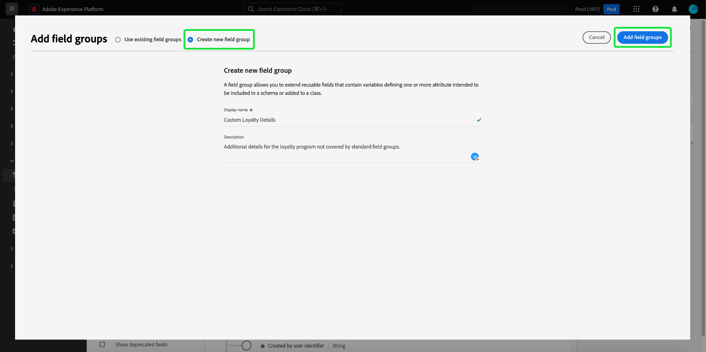
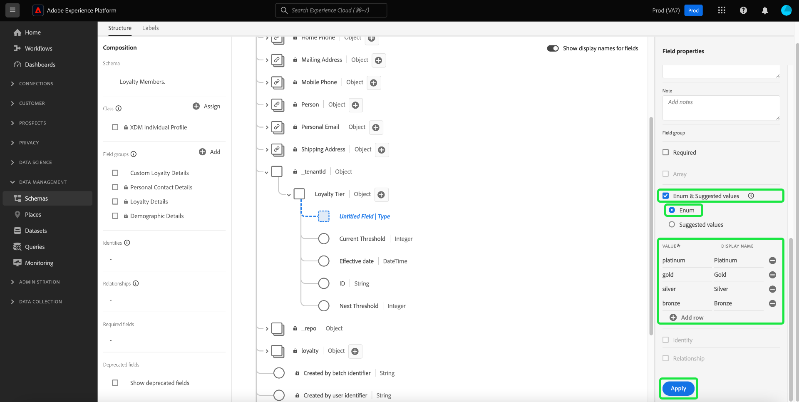

# 使用 [!DNL Schema Editor]

Adobe Experience Platform使用者介面可讓您建立和管理 [!DNL Experience Data Model] (XDM)互動式視覺畫布中的結構，稱為 [!DNL Schema Editor]. 本教學課程涵蓋如何使用 [!DNL Schema Editor].

>[!NOTE]
>
>為了示範，本教學課程中的步驟涉及建立描述客戶忠誠度計畫成員的範例結構。 雖然您可以使用這些步驟來建立不同的架構以供自己使用，但建議您先依照建立範例架構的操作，以了解 [!DNL Schema Editor].

如果您偏好使用 [!DNL Schema Registry] 請改為從閱讀 [[!DNL Schema Registry] 開發人員指南](../api/getting-started.md) 在嘗試上的教學課程之前 [使用API建立結構](create-schema-api.md).

## 快速入門

本教學課程需要妥善了解Adobe Experience Platform在架構建立中涉及的各個層面。 開始本教學課程之前，請先檢閱本檔案中的下列概念：

* [[!DNL Experience Data Model (XDM)]](../home.md):標準化框架 [!DNL Platform] 組織客戶體驗資料。
   * [結構構成基本概念](../schema/composition.md):概述XDM結構及其建置區塊，包括類別、結構欄位群組、資料類型和個別欄位。
* [[!DNL Real-Time Customer Profile]](../../profile/home.md):根據來自多個來源的匯總資料，提供統一的即時消費者設定檔。

## 開啟 [!UICONTROL 結構] 工作區 {#browse}

此 [!UICONTROL 結構] 工作區中 [!DNL Platform] UI提供 [!DNL Schema Library]，可讓您檢視管理組織可用的結構。 工作區也包含 [!DNL Schema Editor]，您可在本教學課程中撰寫架構的畫布。

登入後 [!DNL Experience Platform]，選取 **[!UICONTROL 結構]** 在左側導覽中，開啟 **[!UICONTROL 結構]** 工作區。 此 **[!UICONTROL 瀏覽]** 索引標籤會顯示結構清單(表示 [!DNL Schema Library])，您可以檢視和自訂。 該清單包括架構所基於的名稱、類型、類和行為（記錄或時間序列），以及上次修改架構的日期和時間。

請參閱 [在UI中探索現有的XDM資源](../ui/explore.md) 以取得更多資訊。

## 建立架構並命名 {#create}

要開始合成架構，請選擇 **[!UICONTROL 建立結構]** 在 **[!UICONTROL 結構]** 工作區。 畫面會顯示下拉式功能表，供您選擇核心類別 [!UICONTROL XDM個別設定檔] 和 [!UICONTROL XDM ExperienceEvent]. 如果這些類不符合您的目的，您也可以選擇 **[!UICONTROL 瀏覽]** 從其他可用類中選擇 [建立新類](#create-new-class).

在本教學課程中，請選取 **[!UICONTROL XDM個別設定檔]**.

此 [!DNL Schema Editor] 框。 這是您要在其中組成架構的畫布。 系統會自動在 **[!UICONTROL 結構]** 編輯器時顯示畫布的區段，以及根據該類別包含在所有結構中的標準欄位。 架構的指派類也列在 **[!UICONTROL 類別]** in **[!UICONTROL 組合物]** 區段。

>[!NOTE]
>
>您可以 [更改架構的類](#change-class) 在架構儲存之前的初始合成程式期間的任何時間點，都應格外小心。 欄位組僅與某些類相容，因此更改類將重置畫布和您添加的任何欄位。

在 **[!UICONTROL 架構屬性]**，提供結構的顯示名稱和可選說明。 輸入名稱后，畫布會更新，以反映架構的新名稱。

決定結構名稱時，需考量幾項重要事項：

* 架構名稱應簡短且具描述性，以便日後輕鬆找到架構。
* 架構名稱必須是唯一的，這表示其特定性也應足夠，以免日後重複使用。 例如，如果貴組織針對不同品牌有不同的忠誠計畫，最好將您的結構命名為「品牌忠誠會員」，以便輕鬆區分與其他與忠誠度相關的結構，您稍後可能會定義。
* 您也可以使用結構描述來提供與結構相關的任何其他內容資訊。

本教學課程會組成結構來擷取與忠誠計畫成員相關的資料，因此結構名為「[!DNL Loyalty Members]」。

## 新增欄位群組 {#field-group}

您現在可以透過新增欄位群組，開始將欄位新增至您的架構。 欄位群組是一或多個欄位的群組，通常搭配使用以描述特定概念。 本教學課程使用欄位群組來說明忠誠計畫的成員，並擷取關鍵資訊，例如名稱、生日、電話號碼、地址等。

若要新增欄位群組，請選取 **[!UICONTROL 新增]** 在 **[!UICONTROL 欄位群組]** 小節。

隨即出現新對話方塊，顯示可用欄位群組的清單。 每個欄位組僅用於特定類，因此對話框僅列出與所選類相容的欄位組(在本例中，為 [!DNL XDM Individual Profile] 類別)。 如果您使用標準XDM類別，欄位群組清單將會根據使用頻率聰明地排序。

您可以在左側邊欄中選取其中一個篩選器，以縮小標準欄位群組的清單，使其限定為特定 [產業](../schema/industries/overview.md) 像零售、金融服務和醫療保健。

從清單中選取欄位群組，會使其顯示在右側邊欄中。 您可以視需要選取多個欄位群組，在確認前將每個欄位新增至右側邊欄的清單。 此外，當前選定欄位組的右側將顯示一個表徵圖，該表徵圖允許您預覽它提供的欄位的結構。

預覽欄位群組時，右側邊欄會提供欄位群組架構的詳細說明。 您也可以瀏覽所提供畫布中欄位群組的欄位。 當您選取不同欄位時，右側邊欄會更新，顯示有關欄位的詳細資訊。 選擇 **[!UICONTROL 返回]** 完成預覽以返回到欄位組選擇對話框時。

在本教學課程中，請選取 **[!UICONTROL 人口統計詳細資料]** 欄位群組，然後選取 **[!UICONTROL 新增欄位群組]**.

架構畫布會重新顯示。 此 **[!UICONTROL 欄位群組]** 部分現在列出「[!UICONTROL 人口統計詳細資料]」和 **[!UICONTROL 結構]** 小節包括欄位組貢獻的欄位。 您可以在 **[!UICONTROL 欄位群組]** 區段來反白顯示其在畫布內提供的特定欄位。

此欄位群組會在頂層名稱下貢獻多個欄位 `person` 資料類型為「[!UICONTROL 人員]」。 此欄位群組說明個人的相關資訊，包括姓名、出生日期和性別。

>[!NOTE]
>
>請記住，欄位可能使用標量類型（如字串、整數、陣列或日期），以及在 [!DNL Schema Registry].

請注意， `name` 欄位的資料類型為「[!UICONTROL 全名]「，這表示它也描述了一個通用概念，並包含與名稱相關的子欄位，如名字、姓氏、字首和尾碼。

選取畫布中的不同欄位，以顯示它們對架構結構貢獻的任何其他欄位。

## 新增更多欄位群組 {#field-group-2}

您現在可以重複相同步驟來新增其他欄位群組。 當您檢視 **[!UICONTROL 新增欄位群組]** 對話方塊，請注意「[!UICONTROL 人口統計詳細資料]「 」欄位組已呈現灰色狀態，無法選中該欄位組旁邊的複選框。 這可防止您意外重複目前架構中已包含的欄位群組。

在本教學課程中，選取標準欄位群組 **[!UICONTROL 個人聯繫人詳細資訊]** 和 **[!UICONTROL 忠誠度詳細資料]** 從清單中，然後選取 **[!UICONTROL 新增欄位群組]** 將其新增至結構。

畫布會重新顯示，新增的欄位群組列在 **[!UICONTROL 欄位群組]** 在 **[!UICONTROL 組合物]** 區段，及其複合欄位新增至架構結構。

## 定義自訂欄位群組 {#define-field-group}

此 [!UICONTROL 忠誠會員] 結構用於擷取與忠誠計畫成員相關的資料，以及標準 [!UICONTROL 忠誠度詳細資料] 您新增至結構的欄位群組提供了其中的大部分內容，包括方案類型、點、加入日期等。

不過，在某種情況下，您可能會想要納入標準欄位群組未涵蓋的其他自訂欄位，以達成您的使用案例。 若是新增自訂忠誠度欄位，您有兩個選項：

1. 建立新的自訂欄位群組以擷取這些欄位。 本教學課程將涵蓋此方法。
1. 擴充標準 [!UICONTROL 忠誠度詳細資料] 欄位群組（含自訂欄位）。 原因 [!UICONTROL 忠誠度詳細資料] 要轉換為自定義欄位組，則原始標準欄位組將不再可用。 請參閱 [!UICONTROL 結構] UI指南，以取得 [將自訂欄位新增至標準欄位群組的結構](../ui/resources/schemas.md#custom-fields-for-standard-groups).

要建立新欄位組，請選擇 **[!UICONTROL 新增]** 在 **[!UICONTROL 欄位群組]** 子區段類似，但這次請選取 **[!UICONTROL 建立新欄位組]** 在出現的對話方塊頂端附近。 然後系統會要求您提供新欄位群組的顯示名稱和說明。 在本教學課程中，將新欄位群組命名為「[!DNL Custom Loyalty Details]「 」，然後選取 **[!UICONTROL 新增欄位群組]**.

>[!NOTE]
>
>與類名一樣，欄位組名應簡短，說明欄位組將對架構作何貢獻。 這些名稱也是唯一的，因此您將無法重複使用名稱，因此必須確保名稱足夠具體。

&quot;[!DNL Custom Loyalty Details]「 」現在應顯示在 **[!UICONTROL 欄位群組]** 畫布的左側，但沒有與其相關聯的欄位，因此在下方不會顯示新欄位 **[!UICONTROL 結構]**.

## 新增欄位至欄位群組 {#field-group-fields}

現在您已建立「[!DNL Custom Loyalty Details]&quot;欄位組，現在可以定義欄位組將貢獻到架構的欄位。

若要開始，請選取 **加號(+)** 圖示（位於畫布中架構名稱旁）。

An &quot;[!UICONTROL 無標題欄位]「 」預留位置會顯示在畫布中，而右側邊欄會更新以顯示欄位的設定選項。

此情境中，結構需要有物件類型欄位，以詳細說明人員目前的忠誠度層級。 使用右側邊欄中的控制項，開始建立 `loyaltyTier` 類型為&quot;的欄位[!UICONTROL 物件]「 」，以保存您的相關欄位。

在 **[!UICONTROL 指派給]**，您必須選取欄位群組，才能將欄位指派給。 請記住，所有架構欄位都屬於某個類或欄位組，並且由於此架構使用標準類，因此您唯一的選項是選擇欄位組。 開始鍵入名稱&quot;[!DNL Custom Loyalty Details]「 」，然後從清單中選取欄位群組。

完成後，請選取 **[!UICONTROL 套用]**.

會套用變更，並新建立 `loyaltyTier` 對象。 由於這是自訂欄位，因此會自動巢狀內嵌於以組織的租用戶ID命名的物件名稱內，前面加上底線(`_tenantId` 在此範例中)。

>[!NOTE]
>
>租用戶ID物件的存在表示您新增的欄位包含在組織的命名空間中。
>
>換言之，您新增的欄位對您的組織來說是唯一的，且會儲存在 [!DNL Schema Registry] 特定區域（僅限貴組織存取）。 您定義的欄位必須一律新增至租用戶命名空間，以避免與其他標準類別、欄位群組、資料類型和欄位的名稱衝突。

選取 **加號(+)** 表徵圖 `loyaltyTier` 要開始添加子欄位的對象。 新欄位預留位置隨即出現，且 **[!UICONTROL 欄位屬性]** 區段會顯示在畫布的右側。

每個欄位都需要下列資訊：

* **[!UICONTROL 欄位名稱]:** 欄位的名稱，用駝峰寫。 範例：loalytyLevel
* **[!UICONTROL 顯示名稱]:** 以標題寫入的欄位名稱。 範例：忠誠度等級
* **[!UICONTROL 類型]:** 欄位的資料類型。 這包括基本標量類型和 [!DNL Schema Registry]. 範例： [!UICONTROL 字串], [!UICONTROL 整數], [!UICONTROL 布林值], [!UICONTROL 人員], [!UICONTROL 地址], [!UICONTROL 電話號碼]、等
* **[!UICONTROL 說明]:** 欄位的選用說明最多應包含200個字元。

的第一個欄位 `loyaltyTier` 物件將是名為的字串 `id`，代表忠誠會員目前階層的ID。 每個忠誠會員的層ID都是唯一的，因為這家公司會根據不同的因素，為每個客戶設定不同的忠誠度層點數臨界值。 將新欄位的類型設定為「[!UICONTROL 字串]」和 **[!UICONTROL 欄位屬性]** 區段會填入多個套用限制的選項，包括預設值、格式和最大長度。

自 `id` 會是隨機產生的自由字串，不需要進一步限制。 選擇 **[!UICONTROL 套用]** 來套用變更。

## 新增更多欄位至欄位群組 {#field-group-fields-2}

現在您已新增 `id` 欄位中，您可以新增其他欄位來擷取忠誠度層級資訊，例如：

* 當前點閾值（整數）:成員必須維護以保持在當前層的最小忠誠點數。
* 下一層點閾值（整數）:會員必須累計以畢業至下一層的忠誠點數。
* 生效日期（日期 — 時間）:忠誠會員加入此層的日期。

若要將每個欄位新增至架構，請選取 **加號(+)** 表徵圖 `loyalty` 物件，並填入所需資訊。

完成後， `loyaltyTier` 對象將包含 `id`, `currentThreshold`, `nextThreshold`，和 `effectiveDate`.

## 將列舉欄位新增至欄位群組 {#enum}

定義 [!DNL Schema Editor]，您可以套用至基本欄位類型的一些其他選項，以對欄位可包含的資料提供進一步限制。 下表說明了這些限制的使用案例：

| 限制 | 說明 |
| --- | --- |
| [!UICONTROL 必填] | 指出資料擷取需要此欄位。 任何根據此結構上傳至資料集但不含此欄位的資料，在擷取時都會失敗。 |
| [!UICONTROL 陣列] | 指出欄位包含值的陣列，每個值都指定了資料類型。 例如，對資料類型為「」的欄位使用此限制[!UICONTROL 字串]&quot;指定欄位將包含字串的陣列。 |
| [!UICONTROL 列舉與建議的值] | 枚舉表示此欄位必須包含可能值枚舉清單中的值之一。 或者，您也可以使用此選項，只提供字串欄位的建議值清單，而不將欄位限制為這些值。 |
| [!UICONTROL 身分] | 指出此欄位是身分欄位。 提供有關身分欄位的更多資訊 [本教學課程的稍後部分](#identity-field). |
| [!UICONTROL 關係] | 而架構關係則可透過使用聯合架構和 [!DNL Real-Time Customer Profile]，此欄位僅適用於共用相同類別的結構。 此 [!UICONTROL 關係] 約束指明此欄位引用基於不同類的架構的主標識，這表示兩個架構之間的關係。 請參閱 [定義關係](./relationship-ui.md) 以取得更多資訊。 |

{style=&quot;table-layout:auto&quot;}

>[!NOTE]
>
>任何必要、身分或關係欄位都會列在左側邊欄的個別區段中，讓您無論結構的複雜性為何，都能輕鬆找到這些欄位。

在本教學課程中， `loyaltyTier` 架構中的對象需要描述層類的新枚舉欄位，其中的值只能是四個可能選項之一。 若要將此欄位新增至架構，請選取 **加號(+)** 表徵圖 `loyaltyTier` 物件，並填寫 **[!UICONTROL 欄位名稱]** 和 **[!UICONTROL 顯示名稱]**. 針對 **[!UICONTROL 類型]**，請選取「[!UICONTROL 字串]」。

選取欄位類型後，欄位會出現其他核取方塊，包括的核取方塊 **[!UICONTROL 陣列]**, **[!UICONTROL 列舉與建議的值]**, **[!UICONTROL 身分]**，和 **[!UICONTROL 關係]**.

選取 **[!UICONTROL 列舉與建議的值]** 核取方塊，然後選取 **[!UICONTROL 列舉]**. 您可以在此輸入 **[!UICONTROL 值]** （在camelCase中）和 **[!UICONTROL 顯示名稱]** （標題案例中為選用且方便閱讀的名稱），以取得每個可接受的忠誠度階層類別。

完成所有欄位屬性後，請選擇 **[!UICONTROL 套用]** 若要新增 `tierClass` 欄位至 `loyaltyTier` 物件。

## 將多欄位物件轉換為資料類型 {#datatype}

此 `loyaltyTier` 物件現在包含數個欄位，並代表一般的資料結構，在其他結構中可能會很實用。 此 [!DNL Schema Editor] 可讓您將這些物件的結構轉換為資料類型，輕鬆套用可重複使用的多欄位物件。

資料類型允許一致地使用多欄位結構，並提供比欄位組更大的靈活性，因為它們可以在架構內的任何位置使用。 若要這麼做，請設定欄位的 **[!UICONTROL 類型]** 的值轉換為 [!DNL Schema Registry].

若要轉換 `loyaltyTier` 對象，請選擇 `loyaltyTier` 欄位，然後選取 **[!UICONTROL 轉換為新資料類型]** 在編輯的右側 **[!UICONTROL 欄位屬性]**.

此時會出現通知，確認物件已成功轉換。 在畫布中，您現在可以看到 `loyaltyTier` 欄位現在有連結圖示，而右側邊欄指出其資料類型為「[!DNL Loyalty Tier]」。

在未來的架構中，您現在可以將欄位指派為「[!DNL Loyalty Tier]&quot;類型，它會自動包含ID、層類、點閾值和有效日期的欄位。

>[!NOTE]
>
>您也可以建立和編輯自訂資料類型，而不需編輯結構。 請參閱 [建立和編輯資料類型](../ui/resources/data-types.md) 以取得更多資訊。

## 搜尋及篩選結構欄位

除了基礎類提供的欄位之外，您的架構現在還包含多個欄位群組。 使用較大的結構時，您可以在左側邊欄中選取欄位群組名稱旁的核取方塊，將顯示的欄位篩選為僅限您感興趣的欄位群組所提供的欄位。

如果您在結構中尋找特定欄位，也可以使用搜尋列來依名稱篩選顯示的欄位，無論欄位底下提供的欄位群組為何。

>[!IMPORTANT]
>
>顯示相符欄位時，搜尋函式會考慮任何選取的欄位群組篩選器。 如果搜索查詢未顯示您期望的結果，則可能需要再次檢查您是否未篩選出任何相關欄位組。

## 將架構欄位設為身分欄位 {#identity-field}

結構提供的標準資料結構可運用於跨多個來源識別屬於相同個人的資料，以支援不同的下游使用案例，例如細分、報告、資料科學分析等。 若要根據個別身分匯整資料，索引鍵欄位必須標示為 [!UICONTROL 身分] 欄位。

[!DNL Experience Platform] 可透過 **[!UICONTROL 身分]** 核取方塊 [!DNL Schema Editor]. 不過，您必鬚根據資料的性質，決定要將哪個欄位當作身分的最佳候選欄位。

例如，可能有數千個忠誠計畫成員屬於相同的忠誠級別，而數個成員可能共用相同的實際地址。 不過，在此案例中，註冊忠誠計畫的每個成員都會提供其個人電子郵件地址。 由於個人電子郵件地址通常由一人管理，因此欄位 `personalEmail.address` (由 [!UICONTROL 個人聯繫人詳細資訊] 欄位群組)是身分欄位的理想候選項。

>[!IMPORTANT]
>
>以下概述的步驟說明如何將身份描述符添加到現有架構欄位。 除了在結構本身的結構內定義身分欄位外，您也可以使用 `identityMap` 欄位來改用包含身分資訊。
>
>如果您打算使用 `identityMap`，請記住，它會覆寫您直接新增至結構的任何主要身分。 請參閱 `identityMap` 在 [綱要構成指南](../schema/composition.md#identityMap) 以取得更多資訊。

選取 `personalEmail.address` 欄位，以及 **[!UICONTROL 身分]** 「 」下顯示的複選框 **[!UICONTROL 欄位屬性]**. 核取方塊和選項，將此項目設為 **[!UICONTROL 主要身分]** 框。 也選擇此框。

>[!NOTE]
>
>每個架構只能包含一個主要身分欄位。 將架構欄位設定為主要身分後，如果您稍後嘗試將架構中的另一個身分欄位設定為主要身分，將會收到錯誤訊息。

接下來，您必須提供 **[!UICONTROL 身分命名空間]** 從下拉式清單中預先定義的命名空間清單。 由於此欄位是客戶的電子郵件地址，請選擇「[!UICONTROL 電子郵件]」。 選擇 **[!UICONTROL 套用]** 確認 `personalEmail.address` 欄位。

>[!NOTE]
>
>如需標準命名空間及其定義的清單，請參閱 [[!DNL Identity Service] 檔案](../../identity-service/troubleshooting-guide.md#standard-namespaces).

套用變更後， `personalEmail.address` 顯示指紋符號，表示它現在是標識欄位。 欄位也會列在左側邊欄的下方 **[!UICONTROL 身分]**.

現在所有擷取至 `personalEmail.address` 欄位將用來協助識別該個人，並匯整該客戶的單一檢視。 若要進一步了解如何使用身分，請前往 [!DNL Experience Platform]，請檢閱 [[!DNL Identity Service]](../../identity-service/home.md) 檔案。

## 啟用架構以用於 [!DNL Real-Time Customer Profile] {#profile}

[[!DNL Real-Time Customer Profile]](../../profile/home.md) 在 [!DNL Experience Platform] 提供每個客戶的整體檢視。 此服務可建立強大的360°客戶屬性設定檔，以及客戶在與 [!DNL Experience Platform].

為了讓結構能與 [!DNL Real-Time Customer Profile]，則必須定義主要身分。 如果您未先定義主標識而嘗試啟用架構，則會收到錯誤消息。

啟用「忠誠會員」結構以用於 [!DNL Profile]，首先在畫布中選取架構標題。

在編輯器的右側，會顯示結構的相關資訊，包括其顯示名稱、說明和類型。 除了此資訊外， **[!UICONTROL 設定檔]** 切換按鈕。

選擇 **[!UICONTROL 設定檔]** 畫面隨即顯示彈出視窗，要求您確認要為 [!DNL Profile].

>[!WARNING]
>
>架構啟用後 [!DNL Real-Time Customer Profile] 和儲存時，無法加以停用。

選擇 **[!UICONTROL 啟用]** 確認您的選擇。 您可以選取 **[!UICONTROL 設定檔]** 再次切換為禁用模式（如果需要），但一旦模式在保存時 [!DNL Profile] 已啟用，則無法再停用。

## 後續步驟和其他資源

現在您完成架構撰寫後，就可以在畫布中看到完整的架構。 選擇 **[!UICONTROL 儲存]** 架構會儲存至 [!DNL Schema Library]，讓使用者方便存取 [!DNL Schema Registry].

您的新結構現在可用來將資料內嵌至 [!DNL Platform]. 請記住，一旦使用結構來內嵌資料，則只能進行加法變更。 請參閱 [綱要構成基本知識](../schema/composition.md) 以了解架構版本設定的詳細資訊。

您現在可以依照 [在UI中定義架構關係](./relationship-ui.md) 新增關係欄位至「忠誠會員」結構。

您也可以使用 [!DNL Schema Registry] API。 若要開始使用API，請先閱讀 [[!DNL Schema Registry API] 開發人員指南](../api/getting-started.md).

### 視訊資源

>[!WARNING]
>
>此 [!DNL Platform] 下列影片中顯示的UI已過期。 請參閱上述檔案，了解最新的UI螢幕擷取畫面和功能。

以下影片說明如何在 [!DNL Platform] UI。

>[!VIDEO](https://video.tv.adobe.com/v/27012?quality=12&learn=on)

以下影片旨在加強您對使用欄位群組和類別的了解。

>[!VIDEO](https://video.tv.adobe.com/v/27013?quality=12&learn=on)

## 附錄

以下各節提供有關使用 [!DNL Schema Editor].

### 建立新類 {#create-new-class}

[!DNL Experience Platform] 提供根據貴組織專屬的類別定義結構的彈性。 若要了解如何建立新類別，請參閱 [在UI中建立和編輯類](../ui/resources/classes.md#create).

### 更改架構的類 {#change-class}

您可以在儲存架構之前的初始合成程式期間的任何時間點變更架構的類別。

>[!WARNING]
>
>為架構重新指派類別時應格外小心。 欄位組僅與某些類相容，因此更改類將重置畫布和您添加的任何欄位。

若要了解如何變更結構的類別，請參閱 [在UI中管理結構](../ui/resources/schemas.md#change-class).
