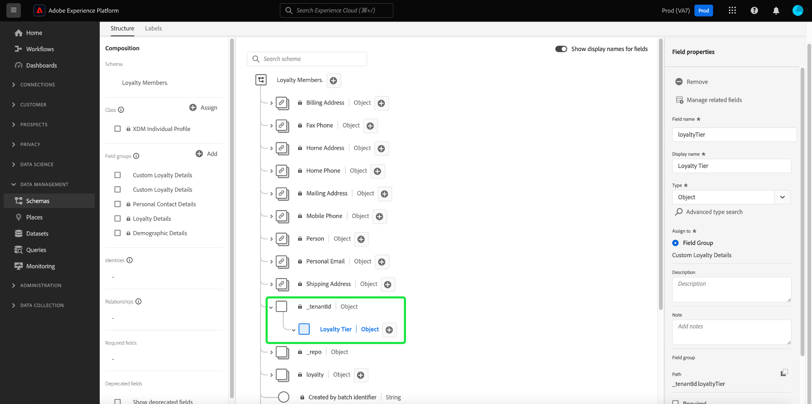

# 使用[!DNL Schema Editor]建立結構描述

Adobe Experience Platform使用者介面可讓您在名為[!DNL Schema Editor]的互動式視覺畫布中建立和管理[!DNL Experience Data Model] (XDM)結構描述。 本教學課程涵蓋如何使用[!DNL Schema Editor]建立結構描述。

為了示範，本教學課程中的步驟涉及建立範例結構描述，以說明客戶忠誠度計畫的成員。 雖然您可以使用這些步驟建立不同的結構描述以供您自己的用途，但建議您先依照建立範例結構描述以瞭解[!DNL Schema Editor]的功能。

>[!NOTE]
>
>如果您正在將CSV資料擷取至Experience Platform，您可以[將該資料對應至AI產生的建議](../../ingestion/tutorials/map-csv/recommendations.md) （目前為測試版）所建立的XDM結構描述，而不需要自行手動建立結構描述。
>
>如果您偏好使用[!DNL Schema Registry] API撰寫結構描述，請先閱讀[[!DNL Schema Registry] 開發人員指南](../api/getting-started.md)，再嘗試進行有關[使用API建立結構描述](create-schema-api.md)的教學課程。

## 快速入門

此教學課程需要您實際瞭解架構建立中Adobe Experience Platform的各個層面。 在開始本教學課程之前，請檢閱檔案以瞭解下列概念：

* [[!DNL Experience Data Model (XDM)]](../home.md)： [!DNL Experience Platform]用來組織客戶體驗資料的標準化架構。
   * [結構描述組合的基本概念](../schema/composition.md)： XDM結構描述及其建置區塊的概觀，包括類別、結構描述欄位群組、資料型別和個別欄位。
* [[!DNL Real-Time Customer Profile]](../../profile/home.md)：根據來自多個來源的彙總資料，提供統一的即時消費者設定檔。

## 開啟[!UICONTROL 結構描述]工作區 {#browse}

[!DNL Experience Platform] UI中的[!UICONTROL 結構描述]工作區提供[!DNL Schema Library]的視覺效果，可讓您檢視管理組織可用的結構描述。 工作區也包含[!DNL Schema Editor]，您可在此畫布上撰寫此教學課程的結構描述。

登入[!DNL Experience Platform]後，在左側導覽中選取&#x200B;**[!UICONTROL 結構描述]**&#x200B;以開啟&#x200B;**[!UICONTROL 結構描述]**&#x200B;工作區。 **[!UICONTROL 瀏覽]**&#x200B;索引標籤會顯示結構描述清單（[!DNL Schema Library]的表示方式），供您檢視和自訂。 此清單包括結構描述所根據的名稱、型別、類別和行為（記錄或時間序列），以及上次修改結構描述的日期和時間。

如需詳細資訊，請參閱[在UI](../ui/explore.md)中探索現有XDM資源的指南。

## 建立方案並為其命名 {#create}

若要開始撰寫結構描述，請選取&#x200B;**[!UICONTROL 結構描述]**&#x200B;工作區右上角的&#x200B;**[!UICONTROL 建立結構描述]**。

![已反白顯示[!UICONTROL 建立結構描述]的[!UICONTROL 結構描述]工作區[!UICONTROL 瀏覽]索引標籤。](../images/tutorials/create-schema/create-schema-button.png)

[!UICONTROL 建立結構描述]對話方塊就會顯示。 在此對話方塊中，您可以選擇透過新增欄位和欄位群組來手動建立結構描述，或者您可以上傳CSV檔案並使用ML演演算法來產生結構描述。 從對話方塊中選取結構描述建立工作流程。

### [!BADGE Beta]{type=Informative}手動或ML輔助的結構描述建立 {#manual-or-assisted}

若要瞭解如何使用ML演演算法根據上傳的檔案來建議結構描述結構，請參閱[機器學習輔助結構描述建立指南](../ui/ml-assisted-schema-creation.md)。 本UI指南著重於手動建立工作流程。

### 選擇基底類別 {#choose-a-class}

[!UICONTROL 建立結構描述]工作流程隨即顯示。 接著，選擇結構描述的基底類別。 您可以選擇[!UICONTROL XDM Individual Profile]與[!UICONTROL XDM ExperienceEvent]的核心類別，或是[!UICONTROL Other] （如果這些類別不適合您的用途）。 [!UICONTROL 其他]類別選項可讓您[建立新類別](#create-new-class)，或從其他預先存在的類別中選擇。

如需這些類別的詳細資訊，請參閱[[!UICONTROL XDM個別設定檔]](../classes/individual-profile.md)和[[!UICONTROL XDM ExperienceEvent]](../classes/experienceevent.md)檔案。 在本教學課程中，請選取&#x200B;**[!UICONTROL XDM個別設定檔]**，然後選取&#x200B;**[!UICONTROL 下一步]**。

![以[!UICONTROL XDM個別設定檔]選項和[!UICONTROL 下一步]醒目提示的[!UICONTROL 建立結構描述]工作流程。](../images/tutorials/create-schema/individual-profile-base-class.png)

### 命名並檢閱 {#name-and-review}

選取類別之後，[!UICONTROL 名稱和檢閱]區段就會顯示。 您可以在此段落中提供名稱和說明，以識別您的結構描述。 決定結構描述的名稱時，有幾個重要考量事項需要考慮：

* 結構描述名稱應簡短且具有描述性，以便之後可以輕鬆找到結構描述。
* 結構描述名稱必須是唯一的，這表示它也應該是足夠具體的，以使其在將來不會重複使用。 例如，如果貴組織針對不同品牌有不同的忠誠度計畫，則明智的做法是命名您的方案為「品牌A忠誠度會員」，以便輕鬆區別於您稍後可能定義的其他忠誠度相關方案。
* 您也可以使用結構描述來提供關於結構描述的任何其他內容相關資訊。

此教學課程撰寫結構描述以擷取與熟客方案成員相關的資料，因此結構描述命名為&quot;[!DNL Loyalty Members]&quot;。

結構&#x200B;描述的基本結構（由類別提供）會顯示在畫布中，供您檢閱及驗證選取的類別和結構描述結構。

在文字欄位中輸入人性化的[!UICONTROL 結構描述顯示名稱]。 接下來，輸入適當的說明來協助識別您的結構描述。 當您檢閱了結構描述結構並對您的設定感到滿意時，請選取&#x200B;**[!UICONTROL 完成]**&#x200B;以建立結構描述。

![使用[!UICONTROL 結構描述顯示名稱]、[!UICONTROL 描述]和[!UICONTROL 完成]反白顯示[!UICONTROL 建立結構描述]工作流程的[!UICONTROL 名稱和檢閱]區段。](../images/ui/resources/schemas/name-and-review.png)

### 撰寫結構描述 {#compose-your-schema}

[!DNL Schema Editor]出現。 這是您將在其中撰寫結構描述的畫布。 當您進入編輯器時，會自動在畫布的&#x200B;**[!UICONTROL 結構]**&#x200B;區段中建立自標名的結構描述，以及包含在您選取之基底類別中的標準欄位。 結構描述的指派類別也列在&#x200B;**[!UICONTROL 構成]**&#x200B;區段的&#x200B;**[!UICONTROL 類別]**&#x200B;下。

>[!NOTE]
>
您可以從&#x200B;**[!UICONTROL 結構描述屬性]**&#x200B;側邊欄更新結構描述的顯示名稱和選擇性說明。 輸入新名稱后，畫布會自動更新以反映結構描述的新名稱。

>[!NOTE]
>
在儲存結構描述之前，您可以在初始構成程式期間的任何時候[變更結構描述](#change-class)的類別，但必須非常小心。 欄位群組僅與某些類別相容，因此變更類別將會重設畫布以及您新增的任何欄位。

## 新增欄位群組 {#field-group}

您現在可以透過新增欄位群組來開始將欄位新增到結構描述。 欄位群組是一或多個欄位的群組，通常搭配使用來描述特定概念。 本教學課程使用欄位群組來說明熟客方案的成員，並擷取關鍵資訊，例如，姓名、生日、電話號碼、地址等。

若要新增欄位群組，請在&#x200B;**[!UICONTROL 欄位群組]**&#x200B;子區段中選取&#x200B;**[!UICONTROL 新增]**。

![結構描述編輯器的[新增欄位群組]按鈕反白顯示。](../images/tutorials/create-schema/add-field-group-button.png)

新的對話方塊隨即出現，顯示可用欄位群組的清單。 每個欄位群組僅供特定類別使用，因此對話方塊僅列出與您選取的類別（在此例中為[!DNL XDM Individual Profile]類別）相容的欄位群組。 如果您使用標準XDM類別，欄位群組清單將會根據使用人氣聰明地排序。

![ [!UICONTROL 新增欄位群組]對話方塊。](../images/tutorials/create-schema/field-group-popularity.png)

您可以選取左側邊欄中的其中一個篩選器，將標準欄位群組清單縮小至特定[產業](../schema/industries/overview.md)，例如零售、金融服務及醫療保健。

![與強調的產業欄位群組的[!UICONTROL 新增欄位群組]對話方塊。](../images/tutorials/create-schema/industry-field-groups.png)

從清單中選取欄位群組後，該群組就會顯示在右側邊欄中。 您可以視需要選取多個欄位群組，在確認前將每個欄位群組新增到右側欄的清單中。 此外，圖示會顯示在目前所選欄位群組的右側，可讓您預覽其所提供的欄位結構。

![反白顯示所選欄位群組預覽圖示的[!UICONTROL 新增欄位群組]對話方塊。](../images/tutorials/create-schema/preview-field-group-button.png)

預覽欄位群組時，右側邊欄會提供欄位群組的結構描述詳細資訊。 您還可以瀏覽提供的畫布中的欄位群組欄位。 當您選取不同欄位時，右側欄會更新，顯示有關問題欄位的詳細資訊。 完成預覽後選取&#x200B;**[!UICONTROL 上一步]**&#x200B;以返回欄位群組選取對話方塊。

![已預覽人口統計詳細資料欄位群組的[!UICONTROL 預覽欄位群組]對話方塊。](../images/tutorials/create-schema/preview-field-group.png)

在本教學課程中，請選取&#x200B;**[!UICONTROL 人口統計詳細資料]**&#x200B;欄位群組，然後選取&#x200B;**[!UICONTROL 新增欄位群組]**。

![已選取人口統計詳細資料欄位群組並反白顯示[!UICONTROL 新增欄位群組]的[!UICONTROL 新增欄位群組]對話方塊。](../images/tutorials/create-schema/demographic-details.png)

結構畫布會重新出現。 **[!UICONTROL 欄位群組]**&#x200B;區段現在會列出「[!UICONTROL 人口統計詳細資料]」，而&#x200B;**[!UICONTROL 結構]**&#x200B;區段包含由欄位群組貢獻的欄位。 您可以在&#x200B;**[!UICONTROL 欄位群組]**&#x200B;區段下選取欄位群組名稱，以反白顯示它在畫布中提供的特定欄位。

>[!NOTE]
>
在結構描述編輯器中，標準(Adobe產生的)類別和欄位群組會以掛鎖圖示(。掛鎖會顯示在類別或欄位群組名稱旁的左側邊欄中，也會顯示在架構圖表中，屬於系統產生資源之一部分的任何欄位旁邊。
>

此欄位群組提供頂層名稱`person`底下數個資料型別的欄位 "[!UICONTROL 人員]」。 這組欄位說明個人的相關資訊，包括姓名、出生日期和性別。

>[!NOTE]
>
請記住，欄位可使用純量型別 (such 如字串、整數、陣列或日期等)，以及任何資料型別 (a 在[!DNL Schema Registry]中定義的欄位群組（代表一般概念）。

請注意，`name`欄位具有資料型別 of 「[!UICONTROL 全名]」，表示它也描述一般概念，並包含與名稱相關的子欄位，例如名字、姓氏、禮貌標題和尾碼。

選取畫布中的不同欄位，以顯示這些欄位對結構描述結構貢獻的任何其他欄位。

## 新增更多欄位群組 {#field-group-2}

您現在可以重複相同的步驟來新增另一個欄位群組。 當您這次檢視&#x200B;**[!UICONTROL 新增欄位群組]**&#x200B;對話方塊時，請注意「[!UICONTROL 人口統計詳細資料]」欄位群組已變成灰色，且無法選取其旁邊的核取方塊。 這可防止您不小心複製已包含在目前結構描述中的欄位群組。

在本教學課程中，請從清單中選取標準欄位群組&#x200B;**[!UICONTROL 個人聯絡人詳細資料]**&#x200B;和&#x200B;**[!UICONTROL 熟客方案詳細資料]**，然後選取&#x200B;**[!UICONTROL 新增欄位群組]**&#x200B;以將其新增至結構描述。

![ [!UICONTROL 新增欄位群組]對話方塊已選取兩個新欄位群組，且[!UICONTROL 新增欄位群組]已反白顯示。](../images/tutorials/create-schema/more-field-groups.png)

畫布會重新出現，新增的欄位群組列在&#x200B;**[!UICONTROL 構成]**&#x200B;區段的&#x200B;**[!UICONTROL 欄位群組]**&#x200B;下，它們的複合欄位會新增到結構描述結構中。

## 定義自訂欄位群組 {#define-field-group}

[!UICONTROL 熟客方案成員]結構描述是用來擷取與熟客方案成員相關的資料，而您新增至結構描述的標準[!UICONTROL 熟客方案詳細資料]欄位群組提供了其中大部分資料，包括方案型別 points, 加入日期等。

但是，在某些情況下，您可能會想要包含標準欄位群組未涵蓋的其他自訂欄位，以便實現您的使用案例。 如果新增自訂忠誠度欄位，您有兩個選項：

1. 建立新的自訂欄位群組以擷取這些欄位。 本教學課程將涵蓋此方法。
1. 使用自訂欄位擴充標準[!UICONTROL 熟客方案詳細資料]欄位群組。 這會導致[!UICONTROL 熟客方案詳細資料]轉換為自訂欄位群組，且原始標準欄位群組將無法再使用。 請參閱[!UICONTROL 結構描述] UI指南，以取得有關[新增自訂欄位至標準欄位群組](../ui/resources/schemas.md#custom-fields-for-standard-groups)結構的詳細資訊。

若要建立新的欄位群組，請選取&#x200B;**[!UICONTROL 欄位群組]**&#x200B;子區段中如前一樣的&#x200B;**[!UICONTROL 新增]**，但這次請選取靠近出現的對話方塊頂端的&#x200B;**[!UICONTROL 建立新欄位群組]**。 接著，系統會要求您提供新欄位群組的顯示名稱和說明。 在本教學課程中，將新的欄位群組命名為&quot;[!DNL Custom Loyalty Details]&quot;，然後選取&#x200B;**[!UICONTROL 新增欄位群組]**。

![使用[!UICONTROL 建立新欄位群組]、[!UICONTROL 顯示名稱]和[!UICONTROL 描述]的[!UICONTROL 新增欄位群組]對話方塊已強調顯示。](../images/tutorials/create-schema/create-new-field-group.png)

>[!NOTE]
>
和類別名稱一樣，欄位群組名稱應該簡短而簡單，說明欄位群組對結構描述有哪些貢獻。 這些也是唯一的，因此您將無法重複使用名稱，因此必須確保它足夠具體。

&quot;[!DNL Custom Loyalty Details]&quot;現在應該出現在畫布左側的&#x200B;**[!UICONTROL 欄位群組]**&#x200B;下，但是還沒有任何欄位與其相關聯，因此&#x200B;**[!UICONTROL 結構]**&#x200B;下沒有新欄位出現。

## 新增欄位至欄位群組 {#field-group-fields}

現在您已建立「[!DNL Custom Loyalty Details]」欄位群組，是時候定義欄位群組將貢獻給結構描述的欄位了。

若要開始，請選取畫布中結構描述名稱旁的&#x200B;**加號(+)**&#x200B;圖示。

畫布中會出現「[!UICONTROL 未命名的欄位]」預留位置，而右邊欄會更新，顯示該欄位的設定選項。

![結構描述編輯器有[!UICONTROL 未命名的欄位]和結構描述[!UICONTROL 欄位屬性]已反白顯示。](../images/tutorials/create-schema/untitled-field.png)

此情境中，結構描述需要物件型別 field 詳細描述人員目前的熟客層級。 使用右側邊欄中的控制項，開始建立具有型別的`loyaltyTier`欄位 "將用來儲存相關欄位的[!UICONTROL 物件]。

在&#x200B;**[!UICONTROL 指派給]**&#x200B;下，您必須選取要指派欄位的欄位群組。 請記住，所有結構描述欄位都屬於類別或欄位群組，由於此結構描述使用標準類別，因此您唯一的選項是選取欄位群組。 開始輸入名稱「[!DNL Custom Loyalty Details]」，然後從清單中選取欄位群組。

完成後，選取&#x200B;**[!UICONTROL 套用]**。

![包含忠誠度層級物件的結構描述編輯器已新增到結構描述[!UICONTROL 欄位屬性]強調顯示。](../images/tutorials/create-schema/loyalty-tier-object.png)

變更已套用，且新建立的`loyaltyTier`物件隨即顯示。 由於這是自訂欄位，因此會自動巢狀內嵌在您組織租使用者ID名稱空間中的物件，前面會加上底線（在此範例中為`_tenantId`）。

>[!NOTE]
>
租使用者ID物件存在表示您新增的欄位包含在您組織的名稱空間中。
>
換言之，您新增的欄位對您的組織是唯一的，並且會儲存在僅供您的組織存取的特定區域的[!DNL Schema Registry]中。 您定義的欄位必須一律新增至租使用者名稱空間，以防止與其他標準類別、欄位群組、資料型別 and 欄位。

選取`loyaltyTier`物件旁的&#x200B;**加號(+)**&#x200B;圖示以開始新增子欄位。 新的欄位預留位置隨即出現，畫布右側會顯示&#x200B;**[!UICONTROL 欄位屬性]**&#x200B;區段。

每個欄位都需要下列資訊：

* **[!UICONTROL 欄位名稱]：**&#x200B;欄位名稱，最好是以camelCase撰寫。 不允許使用空格字元。 這是用來參照程式碼和其他下游應用程式中的欄位的名稱。
   * 範例：loyaltyLevel
* **[!UICONTROL 顯示名稱]：**&#x200B;欄位名稱，以標題大小寫撰寫。 這是檢視或編輯結構描述時，畫布中顯示的名稱。
   * 範例：忠誠度等級
* **[!UICONTROL 型別]：**&#x200B;資料型別 of 欄位。 這包括基本純量型別 and 任何資料型別 defined 在[!DNL Schema Registry]中。 範例： [!UICONTROL String]、[!UICONTROL Integer]、[!UICONTROL Boolean]、[!UICONTROL Person]、[!UICONTROL Address]、[!UICONTROL 電話號碼]等。
* **[!UICONTROL 描述]：**&#x200B;欄位的選擇性描述應包含最多200個字元。

`loyaltyTier`物件的第一個欄位將是名為`id`的字串，代表忠誠會員目前層級的ID。 每個忠誠會員的層級ID將是唯一的，因為該公司會根據不同因素為每個客戶設定不同的忠誠度層級臨界值。 設定新欄位的型別 to 「[!UICONTROL 字串]」和&#x200B;**[!UICONTROL 欄位屬性]**&#x200B;區段會填入多個套用限制的選項，包括預設值、格式和最大長度。 如需瞭解詳細資訊，請參閱[資料驗證欄位](../schema/best-practices.md#data-validation-fields)最佳實務的檔案。

由於`id`將是隨機產生的自由字串，因此不需要進一步的限制。 選取&#x200B;**[!UICONTROL 套用]**&#x200B;以套用您的變更。

## 新增更多欄位至欄位群組 {#field-group-fields-2}

現在您已新增`id`欄位，您可以新增其他欄位來擷取忠誠度等級資訊，例如：

* 目前點臨界值（整數）：成員必須維護以保留在目前層級中的最小熟客點數。
* 下一個層級點臨界值（整數）：成員要畢業到下一個層級必須累積的熟客點數。
* 生效日期（日期 — 時間）：熟客會員加入此階層的日期。

若要將每個欄位新增至結構描述，請選取`loyalty`物件旁的&#x200B;**加號(+)**&#x200B;圖示，並填入必要資訊。

完成時，`loyaltyTier`物件將包含`id`、`currentThreshold`、`nextThreshold`和`effectiveDate`的欄位。

## 新增列舉欄位至欄位群組 {#enum}

在[!DNL Schema Editor]中定義欄位時，有一些其他選項可套用至基本欄位型別 in 以便對該欄位可包含的資料提供進一步的限制。 下表說明這些限制的使用案例：

| 限制 | 說明 |
| --- | --- |
| [!UICONTROL 必要] | 表示資料擷取需要欄位。 根據此結構描述上傳到資料集，但不包含此欄位的任何資料在擷取時都會失敗。 |
| [!UICONTROL 陣列] | 表示欄位包含值的陣列，每個都具有資料型別 specified. 例如，在資料型別的欄位上使用此限制 of 「[!UICONTROL 字串]」指定欄位將包含字串陣列。 |
| [!UICONTROL 列舉與建議值] | 列舉表示此欄位必須包含可能值的列舉清單中的其中一個值。 或者，您也可以使用此選項來只提供字串欄位的建議值清單，而不用限制欄位為這些值。 |
| [!UICONTROL 身分識別] | 表示此欄位是身分欄位。 有關身分欄位的詳細資訊[稍後在本教學課程](#identity-field)中提供。 |
| [!UICONTROL 關係] | 雖然結構描述關聯性可透過使用聯合結構描述和[!DNL Real-Time Customer Profile]來推斷，但這僅適用於共用相同類別的結構描述。 [!UICONTROL Relationship]條件約束指出此欄位參考以不同類別為基礎的結構描述的主要身分，這表示兩個結構描述之間的關係。 如需詳細資訊，請參閱[定義關聯性](./relationship-ui.md)的教學課程。 |

{style="table-layout：自動"}

>[!NOTE]
>
>任何必填、身分或關係欄位都會列在左側邊欄的個別區段中，讓您輕鬆找到這些欄位，無論結構描述的複雜度為何。

在本教學課程中，結構描述中的`loyaltyTier`物件需要新的列舉欄位來說明階層類別，其中值只能是四個可能選項之一。 若要將此欄位新增至結構描述，請選取`loyaltyTier`物件旁的&#x200B;**加號(+)**&#x200B;圖示，並填入&#x200B;**[!UICONTROL 欄位名稱]**&#x200B;和&#x200B;**[!UICONTROL 顯示名稱]**&#x200B;的必要欄位。 針對&#x200B;**[!UICONTROL Type]**，選取「[!UICONTROL String]」。

![在[!UICONTROL 欄位屬性].](../images/tutorials/create-schema/tier-class-type.png)中新增並反白顯示具有階層類別物件的結構描述編輯器

選取欄位型別後，會出現其他核取方塊，包括&#x200B;**[!UICONTROL 陣列]**、**[!UICONTROL 列舉與建議值]**、**[!UICONTROL 身分]**&#x200B;和&#x200B;**[!UICONTROL 關聯性]**&#x200B;的核取方塊。

選取&#x200B;**[!UICONTROL 列舉與建議值]**&#x200B;核取方塊，然後選取&#x200B;**[!UICONTROL 列舉]**。 您可以在此輸入每個可接受的熟客層級類別的&#x200B;**[!UICONTROL 值]** （在駝峰式大小寫中）和&#x200B;**[!UICONTROL 顯示名稱]** （標題大寫中為選擇性、方便讀者的名稱）。

完成所有欄位屬性後，選取&#x200B;**[!UICONTROL 套用]**&#x200B;將`tierClass`欄位新增至`loyaltyTier`物件。

![列舉和建議值欄位屬性已完成，並反白顯示[!UICONTROL 套用]。](../images/tutorials/create-schema/tier-class-enum.png)

## 將多欄位物件轉換為資料型別 {#datatype}

`loyaltyTier`物件現在包含數個欄位，並代表在其他結構描述中可能有用的通用資料結構。 [!DNL Schema Editor]可讓您透過將這些物件的結構轉換為資料型別，輕鬆套用可重複使用的多欄位物件。

資料型別允許一致地使用多欄位結構，並且比欄位群組提供更大的彈性，因為它們可以在結構描述內的任何位置使用。 若要這麼做，請將欄位的&#x200B;**[!UICONTROL Type]**&#x200B;值設定為[!DNL Schema Registry]中定義之任何資料型別的值。

若要將`loyaltyTier`物件轉換成資料型別，請在畫布中選取`loyaltyTier`欄位，然後在&#x200B;**[!UICONTROL 欄位屬性]**&#x200B;下選取編輯器右側的&#x200B;**[!UICONTROL 轉換成新資料型別]**。

![具有loyaltyTier物件且[!UICONTROL 轉換成新資料型別]的結構描述編輯器已反白顯示。](../images/tutorials/create-schema/convert-data-type.png)

系統會顯示通知，確認物件已成功轉換。 在畫布中，您現在可以看到`loyaltyTier`欄位現在有連結圖示，而右邊欄表示它有&quot;[!DNL Loyalty Tier]&quot;資料型別。

在未來的結構描述中，您現在可以將欄位指派為「[!DNL Loyalty Tier]」型別，而且它會自動包含ID、階層類別、點臨界值和有效日期的欄位。

>[!NOTE]
>
您也可以建立及編輯自訂資料型別，與編輯結構描述無關。 如需詳細資訊，請參閱[建立和編輯資料型別](../ui/resources/data-types.md)的指南。

## 搜尋和篩選結構描述欄位

除了其基底類別提供的欄位外，您的結構描述現在包含多個欄位群組。 使用較大的結構描述時，您可以選取左側邊欄中欄位群組名稱旁邊的核取方塊，將顯示的欄位篩選為您感興趣的欄位群組所提供的欄位。

![在結構描述編輯器的[欄位群組]區段中選取了某些核取方塊，以縮小結構描述圖表的大小。](../images/tutorials/create-schema/filter-by-field-group.png)

如果您在結構描述中尋找特定欄位，也可以使用搜尋列依名稱篩選顯示的欄位，無論這些欄位是在哪個欄位群組下提供。

>[!IMPORTANT]
>
顯示相符欄位時，搜尋功能會考量任何選取的欄位群組篩選器。 如果搜尋查詢未顯示您預期的結果，您可能需要再次檢查您是否未篩選出任何相關的欄位群組。

## 將結構描述欄位設定為身分欄位 {#identity-field}

結構提供的標準資料結構可用於識別跨多個來源屬於同一個人的資料，以允許各種下游使用案例，例如細分、報表、資料科學分析等。 為了根據個別身分來拼接資料，索引鍵欄位必須在適用的結構描述中標示為[!UICONTROL 身分]欄位。

在[!DNL Schema Editor]中使用&#x200B;**[!UICONTROL 身分]**&#x200B;核取方塊，[!DNL Experience Platform]可讓您輕鬆表示身分欄位。 不過，您必須根據資料的性質，判斷哪個欄位最適合作為身分使用。

例如，可能有數千名忠誠計畫成員屬於相同的忠誠度等級，而數個成員可能共用相同的實體地址。 不過，在此案例中，註冊時，熟客方案的每位成員都會提供其個人電子郵件地址。 由於個人電子郵件地址通常由一人管理，因此欄位`personalEmail.address` （由[!UICONTROL 個人連絡人詳細資料]欄位群組提供）是身分欄位的良好候選人。

>[!IMPORTANT]
>
以下列出的步驟包括如何將身分描述項新增到現有結構描述欄位。 除了在結構描述本身的結構中定義身分識別欄位外，您也可以使用`identityMap`欄位來包含身分識別資訊。
>
如果您打算使用`identityMap`，請記住，它會覆寫您直接新增到結構描述的任何主要身分。 如需詳細資訊，請參閱[結構描述組合指南](../schema/composition.md#identityMap)中有關`identityMap`的章節。

選取畫布中的`personalEmail.address`欄位，且&#x200B;**[!UICONTROL 欄位屬性]**&#x200B;下會出現&#x200B;**[!UICONTROL 身分]**&#x200B;核取方塊。 核取方塊和選項，將此設定為&#x200B;**[!UICONTROL 主要身分]**&#x200B;出現。 也請選取此方塊。

>[!NOTE]
>
每個結構描述只能包含一個主要身分欄位。 一旦將結構描述欄位設定為主要身分，如果您稍後嘗試將結構描述中的另一個身分欄位設定為主要身分，將會收到錯誤訊息。

接下來，您必須從下拉式清單中的預先定義名稱空間清單中提供&#x200B;**[!UICONTROL 身分識別名稱空間]**。 由於此欄位是客戶的電子郵件地址，請從下拉式清單中選取「[!UICONTROL 電子郵件]」。 選取&#x200B;**[!UICONTROL 套用]**&#x200B;以確認`personalEmail.address`欄位的更新。

![結構描述編輯器，其電子郵件地址已反白並啟用[主要身分]核取方塊。](../images/tutorials/create-schema/primary-identity.png)

>[!NOTE]
>
如需標準名稱空間及其定義的清單，請參閱[[!DNL Identity Service] 檔案](../../identity-service/troubleshooting-guide.md#standard-namespaces)。

套用變更後，`personalEmail.address`的圖示會顯示指紋符號，表示它現在是身分欄位。 此欄位也會列在左側邊欄的&#x200B;**[!UICONTROL 身分]**&#x200B;下。

現在，所有擷取至`personalEmail.address`欄位的資料將用於協助識別該個人，並將該客戶的單一檢視拼接在一起。 若要進一步瞭解如何在[!DNL Experience Platform]中使用身分，請檢閱[[!DNL Identity Service]](../../identity-service/home.md)檔案。

## 啟用結構描述以用於[!DNL Real-Time Customer Profile] {#profile}

[[!DNL Real-Time Customer Profile]](../../profile/home.md)利用[!DNL Experience Platform]中的身分資料提供每個個別客戶的整體檢視。 此服務會針對客戶在與[!DNL Experience Platform]整合的任何系統中進行的每次互動，建立健全且全方位客戶屬性設定檔以及時間戳記帳戶。

若要啟用結構描述以搭配[!DNL Real-Time Customer Profile]使用，它必須定義主要身分。 如果您嘗試在未先定義主要身分的情況下啟用結構描述，將會收到錯誤訊息。

若要啟用「熟客會員」結構描述以用於[!DNL Profile]，請先在畫布中選取結構描述標題。

在編輯器的右側，會顯示有關結構的資訊，包括其顯示名稱、說明和型別。 除了此資訊之外，還有&#x200B;**[!UICONTROL 設定檔]**&#x200B;切換按鈕。

選取&#x200B;**[!UICONTROL 設定檔]**，畫面會顯示彈出視窗，要求您確認要啟用[!DNL Profile]的結構描述。

>[!WARNING]
>
在為[!DNL Real-Time Customer Profile]啟用並儲存結構描述後，將無法停用它。

選取&#x200B;**[!UICONTROL 啟用]**&#x200B;以確認您的選擇。 您可以再次選取&#x200B;**[!UICONTROL 設定檔]**&#x200B;切換來停用結構描述（如果您願意），但一旦結構描述在啟用[!DNL Profile]時儲存，就無法再停用它。

## 更多動作 {#more}

在架構編輯器中，您還可以執行快速動作以複製架構的JSON結構或刪除架構。 選取檢視頂端的[!UICONTROL 更多]，以顯示包含快速動作的下拉式清單。

![結構描述編輯器的[更多]按鈕反白顯示，並顯示下拉式選項。](../images/tutorials/create-schema/more-actions.png)

### 刪除結構描述 {#delete-a-schema}

[!CONTEXTUALHELP]
id="platform_schemas_delete_profileenabledwithdatasets"
title="無法刪除結構描述"
abstract="無法刪除結構描述，因為已針對設定檔啟用它，而且它有關聯的資料集。"

[!CONTEXTUALHELP]
id="platform_schemas_delete_profileenablednodatasets"
title="無法刪除結構描述"
abstract="無法刪除結構描述，因為已針對設定檔啟用它。"

[!CONTEXTUALHELP]
id="platform_schemas_delete_withdatasetsnotprofileenabled"
title="無法刪除結構描述"
abstract="無法刪除結構描述，因為它有關聯的資料集。"

可以使用[!UICONTROL 更多]動作從結構描述編輯器的UI中刪除結構描述，也可以從[!UICONTROL 瀏覽]索引標籤的結構描述詳細資料中刪除結構描述。 在某些情況下，無法刪除結構描述。 如果符合下列條件，則無法刪除結構描述：

* 此結構描述已針對設定檔啟用。
* 此結構描述已啟用設定檔功能，且具有關聯的資料集。
* 此結構描述有關聯的資料集，但未針對設定檔啟用。

### 複製 JSON 結構 {#copy-json-structure}

選取&#x200B;**[!UICONTROL 複製JSON結構]**&#x200B;以針對結構描述資料庫中的任何結構描述產生匯出裝載。 此動作會將JSON結構複製到剪貼簿。 接著，您就可以使用匯出的JSON將結構描述及任何相關資源匯入不同的沙箱或組織。 如此可在不同環境之間的模式輕鬆且有效率地共用和重複使用結構描述。

## 後續步驟和其他資源

現在您已經完成撰寫結構描述，您可以在畫布中看到完整的結構描述。 選取「儲存」****&#x200B;並將結構描述儲存至[!DNL Schema Library]，以供[!DNL Schema Registry]存取。

您的新結構描述現在可用於將資料內嵌至[!DNL Experience Platform]。 請記住，一旦使用結構描述來擷取資料後，只能進行加總變更。 如需結構描述版本設定的詳細資訊，請參閱結構描述組合的[基本知識](../schema/composition.md)。

您現在可以依照在[上定義結構描述關聯性的教學課程，在UI](./relationship-ui.md)中新增關聯性欄位至「忠誠會員」結構描述。

您也可以使用[!DNL Schema Registry] API來檢視及管理「忠誠會員」結構描述。 若要開始使用API，請先閱讀[[!DNL Schema Registry API] 開發人員指南](../api/getting-started.md)。

### 視訊資源

>[!WARNING]
>
下列影片中顯示的[!DNL Experience Platform] UI已過期。 請參閱上述檔案，瞭解最新的UI熒幕擷取畫面及功能。

以下影片說明如何在[!DNL Experience Platform] UI中建立簡單結構描述。

>[!VIDEO](https://video.tv.adobe.com/v/27012?quality=12&learn=on)

以下影片旨在讓您更瞭解如何使用欄位群組和類別。

>[!VIDEO](https://video.tv.adobe.com/v/27013?quality=12&learn=on)

## 附錄

下列章節提供使用[!DNL Schema Editor]的額外資訊。

### 建立新類別 {#create-new-class}

[!DNL Experience Platform]可讓您根據組織獨有的類別來定義結構描述。 若要瞭解如何建立新類別，請參閱[在UI](../ui/resources/classes.md#create)中建立和編輯類別的指南。

### 變更結構描述的類別 {#change-class}

您可以在儲存結構描述之前，在初始構成程式期間隨時變更結構描述的類別。

>[!WARNING]
>
為結構描述重新指派類別時應格外小心。 欄位群組僅與某些類別相容，因此變更類別將會重設畫布以及您新增的任何欄位。

若要瞭解如何變更結構描述的類別，請參閱[在UI中管理結構描述的指南](../ui/resources/schemas.md#change-class)。
