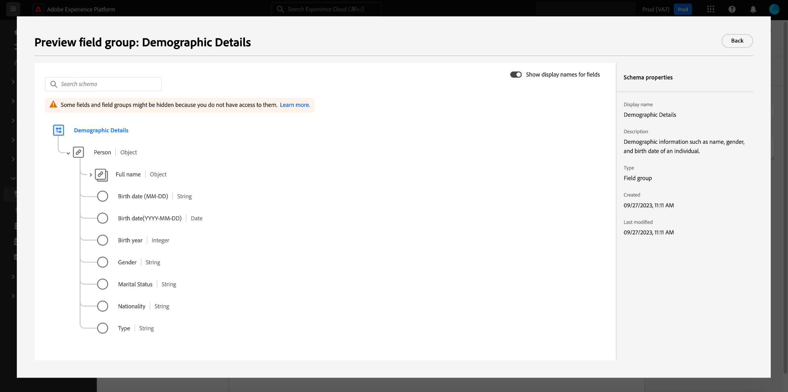
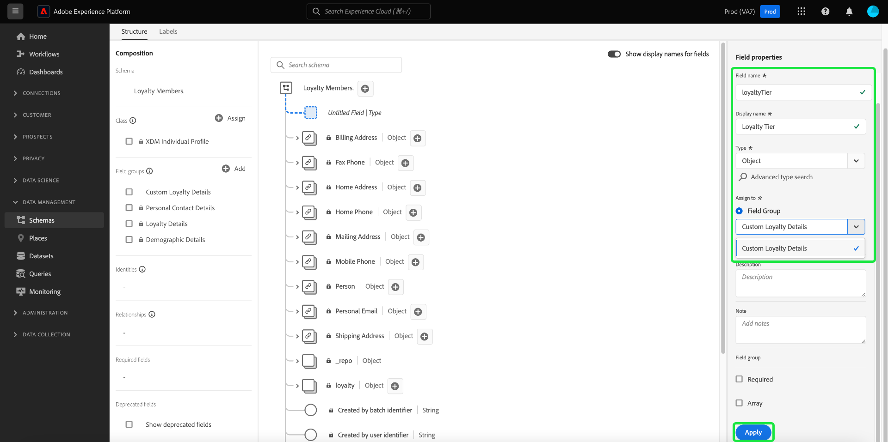
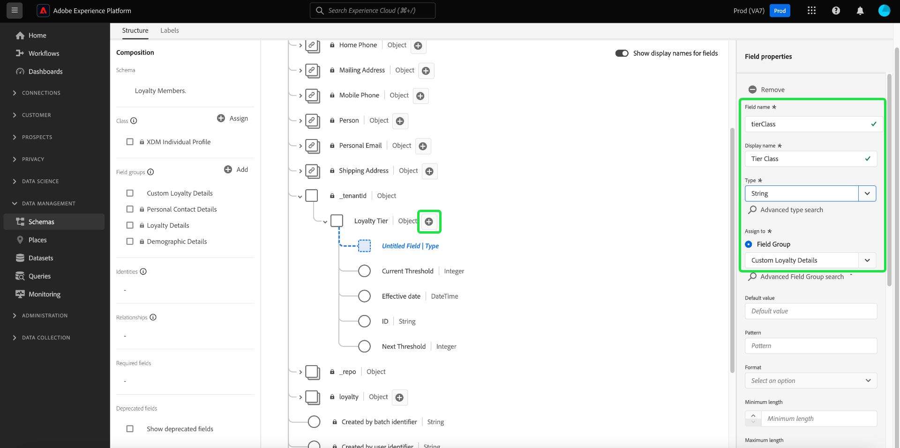

# 使用 [!DNL Schema Editor]

Adobe Experience Platform用戶介面允許您建立和管理 [!DNL Experience Data Model] (XDM)交互可視畫布中的模式，稱為 [!DNL Schema Editor]。 本教程介紹如何使用 [!DNL Schema Editor]。

為了進行演示，本教程中的步驟涉及建立一個示例架構，該架構描述客戶忠誠計畫的成員。 雖然您可以使用這些步驟為自己的目的建立不同的架構，但建議您首先遵循建立示例架構的步驟，以瞭解 [!DNL Schema Editor]。

>[!NOTE]
>
>如果要將CSV資料插入平台，則 [將資料映射到由AI生成的建議案建立的XDM模式](../../ingestion/tutorials/map-csv/recommendations.md) （當前處於beta版），無需親自手動建立架構。
>
>如果希望使用 [!DNL Schema Registry] API，從讀取 [[!DNL Schema Registry] 開發者指南](../api/getting-started.md) 在嘗試教程之前 [使用API建立架構](create-schema-api.md)。

## 快速入門

本教程要求對架構建立中涉及的Adobe Experience Platform的各個方面進行有效的理解。 在開始本教程之前，請查看文檔以瞭解以下概念：

* [[!DNL Experience Data Model (XDM)]](../home.md):標準化框架 [!DNL Platform] 組織客戶體驗資料。
   * [架構組合的基礎](../schema/composition.md):XDM架構及其構建塊的概述，包括類、架構欄位組、資料類型和單個欄位。
* [[!DNL Real-Time Customer Profile]](../../profile/home.md):基於來自多個源的聚合資料提供統一、即時的用戶配置檔案。

## 開啟 [!UICONTROL 架構] 工作區 {#browse}

的 [!UICONTROL 架構] 工作區 [!DNL Platform] UI提供 [!DNL Schema Library]，允許您查看管理組織可用的方案。 工作區還包括 [!DNL Schema Editor]，在本教程中，您可以在其中構成架構的畫布。

登錄後 [!DNL Experience Platform]選中 **[!UICONTROL 架構]** 的下界 **[!UICONTROL 架構]** 工作區。 的 **[!UICONTROL 瀏覽]** 頁籤顯示方案清單(表示 [!DNL Schema Library])，您可以查看和自定義。 該清單包括架構所基於的名稱、類型、類和行為（記錄或時間系列），以及上次修改架構的日期和時間。

請參閱上的指南 [在UI中探索現有XDM資源](../ui/explore.md) 的子菜單。

## 建立和命名架構 {#create}

要開始合成架構，請選擇 **[!UICONTROL 建立架構]** 右上角 **[!UICONTROL 架構]** 工作區。 此時將顯示下拉菜單，允許您在核心類之間進行選擇 [!UICONTROL XDM個人配置檔案] 和 [!UICONTROL XDM體驗事件]。 如果這些類不符合您的目的，您還可以選擇 **[!UICONTROL 瀏覽]** 從其他可用類中選擇 [建立新類](#create-new-class)。

為本教程的目的，請選擇 **[!UICONTROL XDM個人配置檔案]**。

的 [!DNL Schema Editor] 的子菜單。 這是將在其上構成架構的畫布。 在中自動建立無標題架構 **[!UICONTROL 結構]** 到達編輯器時的畫布部分，以及基於該類的所有架構中包含的標準欄位。 該架構的已分配類也列在 **[!UICONTROL 類]** 在 **[!UICONTROL 組合]** 的子菜單。

>[!NOTE]
>
>你可以 [更改架構的類](#change-class) 在保存架構之前的初始合成過程中的任何時間點，但應非常謹慎地執行此操作。 欄位組僅與某些類相容，因此更改該類將重置畫布和添加的任何欄位。

下 **[!UICONTROL 架構屬性]**，提供方案的顯示名稱和可選說明。 輸入名稱后，畫布將更新以反映架構的新名稱。

在確定架構名稱時，需要考慮以下幾個重要事項：

* 架構名稱應簡短且描述性強，以便以後可以輕鬆找到架構。
* 架構名稱必須唯一，這意味著它也應足夠具體，以便將來不會重用。 例如，如果您的組織針對不同的品牌有單獨的忠誠度計畫，最好將您的架構命名為「品牌A忠誠度成員」，以便能夠輕鬆地與稍後可能定義的其他與忠誠度相關的架構區分開來。
* 您還可以使用架構說明提供與架構有關的任何附加上下文資訊。

本教程將構建一個架構，以接收與會員計畫成員相關的資料，因此該架構名為「[!DNL Loyalty Members]。

## 添加欄位組 {#field-group}

現在，您可以通過添加欄位組開始向架構添加欄位。 欄位組是由一個或多個欄位組成的組，這些欄位通常一起用於描述特定概念。 本教程使用欄位組來描述會員計畫的成員並捕獲關鍵資訊，如姓名、生日、電話號碼、地址等。

要添加欄位組，請選擇 **[!UICONTROL 添加]** 的 **[!UICONTROL 欄位組]** 的下界。

將出現一個新對話框，其中顯示可用欄位組的清單。 每個欄位組僅用於特定類，因此該對話框只列出與您選擇的類相容的欄位組(在本例中， [!DNL XDM Individual Profile] 類)。 如果使用標準XDM類，將根據使用流行程度智慧地對欄位組清單進行排序。

可以在左滑軌中選取一個濾鏡，以將標準欄位組清單縮小到特定 [產業](../schema/industries/overview.md) 比如零售，金融服務和醫療。

從清單中選擇欄位組將使其顯示在右滑軌中。 如果需要，可以選擇多個欄位組，在確認前將每個欄位組添加到右欄的清單中。 此外，當前選定欄位組的右側會出現一個表徵圖，允許您預覽其提供的欄位的結構。

在預覽欄位組時，在右欄中提供了欄位組架構的詳細說明。 您還可以在提供的畫布中瀏覽欄位組的欄位。 在選擇不同欄位時，右滑軌會更新以顯示有關欄位的詳細資訊。 選擇 **[!UICONTROL 後退]** 完成預覽後返回到欄位組選擇對話框。

對於本教程，請選擇 **[!UICONTROL 人口結構詳細資訊]** 欄位組，然後選擇 **[!UICONTROL 添加欄位組]**。

重新顯示架構畫布。 的 **[!UICONTROL 欄位組]** 現在列出[!UICONTROL 人口結構詳細資訊]和 **[!UICONTROL 結構]** 部分包括由欄位組提供的欄位。 可在 **[!UICONTROL 欄位組]** 框中選擇相應的選項。

此欄位組在頂級名稱下提供多個欄位 `person` 具有資料類型&#39;[!UICONTROL 人員]。 此組欄位描述有關個人的資訊，包括姓名、出生日期和性別。

>[!NOTE]
>
>請記住，欄位可能使用在 [!DNL Schema Registry]。

請注意 `name` 欄位的資料類型為&quot;[!UICONTROL 全名]&quot; ，表示它也描述了一個通用概念，並包含與名稱相關的子欄位，如名、姓、名和尾碼。

選擇畫布中的不同欄位，以顯示它們對架構結構所貢獻的任何附加欄位。

## 添加更多欄位組 {#field-group-2}

現在，您可以重複相同的步驟來添加另一個欄位組。 查看 **[!UICONTROL 添加欄位組]** 對話框，請注意[!UICONTROL 人口結構詳細資訊]&quot;欄位組已灰顯，無法選中它旁邊的複選框。 這可以防止您意外複製當前架構中已包含的欄位組。

在本教程中，選擇標準欄位組 **[!UICONTROL 個人聯繫人詳細資訊]** 和 **[!UICONTROL 會員詳細資訊]** 從清單中，選擇 **[!UICONTROL 添加欄位組]** 將其添加到架構。

畫布重新顯示，添加的欄位組列在 **[!UICONTROL 欄位組]** 的 **[!UICONTROL 組合]** 的子目錄。

## 定義自定義欄位組 {#define-field-group}

的 [!UICONTROL 會員] 模式用於捕獲與會員計畫成員相關的資料，標準 [!UICONTROL 會員詳細資訊] 添加到架構中的欄位組提供了其中的大部分內容，包括程式類型、點、連接日期等。

但是，在某種情況下，您可能希望包括標準欄位組未涵蓋的附加自定義欄位，以便實現使用案例。 在添加自定義會員欄位時，您有兩個選項：

1. 建立新的自定義欄位組以捕獲這些欄位。 本教程將介紹這種方法。
1. 擴展標準 [!UICONTROL 會員詳細資訊] 具有自定義欄位的欄位組。 這導致 [!UICONTROL 會員詳細資訊] 將轉換為自定義欄位組，並且原始標準欄位組將不再可用。 查看 [!UICONTROL 架構] UI指南，瞭解有關 [將自定義欄位添加到標準欄位組的結構](../ui/resources/schemas.md#custom-fields-for-standard-groups)。

要建立新欄位組，請選擇 **[!UICONTROL 添加]** 的 **[!UICONTROL 欄位組]** 子節類似以前，但此次選擇 **[!UICONTROL 建立新欄位組]** 靠近顯示的對話框頂部。 然後，系統會要求您提供新欄位組的顯示名稱和說明。 在本教程中，將新欄位組命名為[!DNL Custom Loyalty Details]&quot;，然後選擇 **[!UICONTROL 添加欄位組]**。

>[!NOTE]
>
>與類名一樣，欄位組名應簡短，說明欄位組將對架構起到什麼作用。 這些名稱也是唯一的，因此您將無法重用該名稱，因此必須確保它足夠具體。

&quot;[!DNL Custom Loyalty Details]「」 **[!UICONTROL 欄位組]** 在畫布的左側，但尚未與其關聯的欄位，因此在下面不顯示新欄位 **[!UICONTROL 結構]**。

## 將欄位添加到欄位組 {#field-group-fields}

現在您已建立「[!DNL Custom Loyalty Details]&quot;欄位組，現在是定義欄位組將貢獻到架構的欄位的時候。

要開始，請選擇 **加(+)** 表徵圖，位於畫布中架構的名稱旁邊。

An &quot;[!UICONTROL 無標題欄位]»佔位符將出現在畫布中，右滑軌將更新以顯示欄位的配置選項。

在此方案中，方案需要有一個對象類型欄位，該欄位詳細描述人員的當前會員層。 使用右滑軌中的控制項，開始建立 `loyaltyTier` 類型為&quot;的欄位[!UICONTROL 對象]「 」。

下 **[!UICONTROL 分配給]**，必須選擇一個欄位組以將欄位分配給。 請記住，所有架構欄位都屬於某個類或一個欄位組，並且由於此架構使用標準類，因此您唯一的選項是選擇一個欄位組。 開始鍵入名稱&quot;[!DNL Custom Loyalty Details]，然後從清單中選擇欄位組。

完成後，選擇 **[!UICONTROL 應用]**。

將應用更改並新建 `loyaltyTier` 的子菜單。 由於這是自定義欄位，因此它會自動嵌套在與組織的租戶ID相鄰的對象名稱中，前面帶下划線(`_tenantId` )。

>[!NOTE]
>
>租戶ID對象的存在表示您正在添加的欄位包含在您組織的命名空間中。
>
>換句話說，您所添加的欄位對您的組織來說是唯一的，並將保存在 [!DNL Schema Registry] 位於僅可供您的組織訪問的特定區域。 必須始終將您定義的欄位添加到租戶命名空間中，以防止與其他標準類、欄位組、資料類型和欄位的名稱發生衝突。

選擇 **加(+)** 表徵圖 `loyaltyTier` 要開始添加子欄位的對象。 將出現新欄位佔位符， **[!UICONTROL 欄位屬性]** 部分在畫布的右側可見。

每個欄位都需要以下資訊：

* **[!UICONTROL 欄位名稱]:** 欄位的名稱，最好用camelCase寫。 不允許使用空格字元。 這是用於引用代碼和其他下游應用程式中的欄位的名稱。
   * 示例：忠誠度
* **[!UICONTROL 顯示名稱]:** 欄位名稱，以標題大寫寫。 這是在查看或編輯架構時將顯示在畫布中的名稱。
   * 示例：會員級別
* **[!UICONTROL 類型]:** 欄位的資料類型。 這包括基本標量類型和在 [!DNL Schema Registry]。 示例： [!UICONTROL 字串]。 [!UICONTROL 整數]。 [!UICONTROL 布爾型]。 [!UICONTROL 人員]。 [!UICONTROL 地址]。 [!UICONTROL 電話號碼]的子菜單。
* **[!UICONTROL 說明]:** 欄位的可選說明應包含最多200個字元。

第一個欄位 `loyaltyTier` 對象將是名為 `id`，表示會員的當前層的ID。 層ID對於每個忠誠度成員將是唯一的，因為此公司根據不同的因素為每個客戶設定不同的忠誠度層點閾值。 將新欄位的類型設定為「」[!UICONTROL 字串]&quot;和 **[!UICONTROL 欄位屬性]** 截面將填充幾個用於應用約束的選項，包括預設值、格式和最大長度。

自 `id` 將是隨機生成的自由格式字串，無需進一步約束。 選擇 **[!UICONTROL 應用]** 按鈕。

## 向欄位組添加更多欄位 {#field-group-fields-2}

現在您已添加 `id` 欄位，您可以添加附加欄位以捕獲忠誠層資訊，如：

* 當前點閾值（整數）:成員必須保持的保持在當前層中的最小會員積分數。
* 下一層點閾值（整數）:成員必須累積到下一層的會員積分數。
* 有效日期（日期 — 時間）:會員成員加入此層的日期。

要將每個欄位添加到架構，請選擇 **加(+)** 表徵圖 `loyalty` 並填寫所需資訊。

完成時， `loyaltyTier` 對象將包含欄位 `id`。 `currentThreshold`。 `nextThreshold`, `effectiveDate`。

## 將枚舉欄位添加到欄位組 {#enum}

在 [!DNL Schema Editor]，有一些附加選項可應用於基本欄位類型，以便對該欄位可以包含的資料提供進一步的約束。 下表說明了這些約束的使用情形：

| 約束 | 說明 |
| --- | --- |
| [!UICONTROL 必填] | 指示資料接收需要此欄位。 任何基於此架構上載到資料集且不包含此欄位的資料在接收時都將失敗。 |
| [!UICONTROL 陣列] | 指示欄位包含一組值，每個值都指定了資料類型。 例如，在資料類型為「」的欄位上使用此約束[!UICONTROL 字串]&quot;指定欄位將包含字串陣列。 |
| [!UICONTROL 枚舉和建議值] | 枚舉表示此欄位必須包含枚舉的可能值清單中的值之一。 或者，也可以使用此選項來僅提供字串欄位的建議值清單，而不將欄位限制為這些值。 |
| [!UICONTROL 身分] | 指示此欄位是標識欄位。 提供了有關標識欄位的詳細資訊 [本教程的後面部分](#identity-field)。 |
| [!UICONTROL 關係] | 而架構關係可通過使用聯合架構和 [!DNL Real-Time Customer Profile]，這僅適用於共用同一類的方案。 的 [!UICONTROL 關係] constraint表示此欄位引用基於不同類的架構的主標識，表示兩個架構之間的關係。 請參閱上的教程 [定義關係](./relationship-ui.md) 的子菜單。 |

{style="table-layout:auto"}

>[!NOTE]
>
>任何必需欄位、標識欄位或關係欄位都列在左側滑軌的各自部分中，使您能夠輕鬆定位這些欄位，而不管架構的複雜性如何。

對於本教程， `loyaltyTier` 架構中的對象需要一個描述層類的新枚舉欄位，其中值只能是四個可能選項之一。 要將此欄位添加到架構，請選擇 **加(+)** 表徵圖 `loyaltyTier` 對象並填寫 **[!UICONTROL 欄位名]** 和 **[!UICONTROL 顯示名稱]**。 對於 **[!UICONTROL 類型]**，選擇&quot;[!UICONTROL 字串]。

選中欄位類型後，將出現其他複選框，包括 **[!UICONTROL 陣列]**。 **[!UICONTROL 枚舉和建議值]**。 **[!UICONTROL 身份]**, **[!UICONTROL 關係]**。

選擇 **[!UICONTROL 枚舉和建議值]** 複選框，然後選擇 **[!UICONTROL 枚舉]**。 在這裡，您可以輸入 **[!UICONTROL 值]** （在camelCase中）和 **[!UICONTROL 顯示名稱]** （「標題大小寫」中的可選、方便讀者的名稱）。

完成所有欄位屬性後，選擇 **[!UICONTROL 應用]** 的 `tierClass` 的 `loyaltyTier` 的雙曲餘切值。

## 將多欄位對象轉換為資料類型 {#datatype}

的 `loyaltyTier` 現在，對象包含多個欄位，並表示可能在其他方案中有用的通用資料結構。 的 [!DNL Schema Editor] 通過將這些對象的結構轉換為資料類型，可輕鬆應用可重用的多欄位對象。

資料類型允許一致地使用多欄位結構，並提供了比欄位組更靈活的效能，因為它們可以在架構中的任何位置使用。 通過設定欄位的 **[!UICONTROL 類型]** 值到在中定義的任何資料類型的值 [!DNL Schema Registry]。

轉換 `loyaltyTier` 對象到資料類型，選擇 `loyaltyTier` 欄位，然後選擇 **[!UICONTROL 轉換為新資料類型]** 在編輯的右側 **[!UICONTROL 欄位屬性]**。

此時將顯示一則通知，確認對象已成功轉換。 在畫布中，您現在可以看到 `loyaltyTier` 欄位現在具有連結表徵圖，右滑軌表示其資料類型為「[!DNL Loyalty Tier]。

在將來的架構中，您現在可以將欄位指定為「」[!DNL Loyalty Tier]&quot;類型，並自動包括ID、層類、點閾值和有效日期的欄位。

>[!NOTE]
>
>您也可以建立和編輯自定義資料類型，而與編輯方案無關。 請參閱上的指南 [建立和編輯資料類型](../ui/resources/data-types.md) 的子菜單。

## 搜索和篩選架構欄位

您的架構現在除了基類提供的欄位之外還包含多個欄位組。 使用較大的方案時，您可以選中左滑軌中欄位組名稱旁邊的複選框，將顯示的欄位篩選為僅由您感興趣的欄位組提供的欄位。

如果您在架構中查找特定欄位，則還可以使用搜索欄按名稱篩選顯示的欄位，而不管這些欄位在下面提供哪個欄位組。

>[!IMPORTANT]
>
>搜索函式在顯示匹配欄位時會考慮任何選定的欄位組篩選器。 如果搜索查詢未顯示您期望的結果，則可能需要再次檢查您是否未過濾出任何相關欄位組。

## 將架構欄位設定為標識欄位 {#identity-field}

可以使用模式提供的標準資料結構來識別屬於同一個個體的多個源的資料，從而允許各種下游使用案例，如分段、報告、資料科學分析等。 為了根據個人身份縫合資料，鍵欄位必須標籤為 [!UICONTROL 身份] 欄位。

[!DNL Experience Platform] 通過使用 **[!UICONTROL 身份]** 複選框 [!DNL Schema Editor]。 但是，您必鬚根據資料的性質確定最適合用作標識的欄位。

例如，可能有數千個會員計畫成員屬於相同的會員級別，而幾個成員可能共用相同的物理地址。 但是，在此方案中，會員計畫的每個成員在註冊時都會提供其個人電子郵件地址。 由於個人電子郵件地址通常由一人管理，因此該欄位 `personalEmail.address` (由 [!UICONTROL 個人聯繫人詳細資訊] 欄位組)是標識欄位的好候選項。

>[!IMPORTANT]
>
>下面介紹的步驟包括如何將標識描述符添加到現有架構欄位。 作為在架構本身的結構中定義標識欄位的替代方法，還可以使用 `identityMap` 欄位以包含標識資訊。
>
>如果您計畫使用 `identityMap`，請記住，它將覆蓋您直接添加到架構的任何主標識。 請參閱 `identityMap` 的 [架構組合指南的基本知識](../schema/composition.md#identityMap) 的子菜單。

選擇 `personalEmail.address` 的 **[!UICONTROL 身份]** 複選框 **[!UICONTROL 欄位屬性]**。 選中該框和選項，將其設定為 **[!UICONTROL 主標識]** 的子菜單。 也選擇此框。

>[!NOTE]
>
>每個架構只能包含一個主標識欄位。 將架構欄位設定為主標識後，如果稍後嘗試將架構中的另一個標識欄位設定為主標識，則將收到一條錯誤消息。

接下來，必須提供 **[!UICONTROL 標識命名空間]** 從下拉清單中的預定義命名空間清單中。 由於此欄位是客戶的電子郵件地址，請選擇「」[!UICONTROL 電子郵件]」。 選擇 **[!UICONTROL 應用]** 確認更新 `personalEmail.address` 的子菜單。

>[!NOTE]
>
>有關標準命名空間及其定義的清單，請參見 [[!DNL Identity Service] 文檔](../../identity-service/troubleshooting-guide.md#standard-namespaces)。

應用更改後， `personalEmail.address` 顯示指紋符號，表示它現在是標識欄位。 該欄位也列在左滑軌的下方 **[!UICONTROL 身份]**。

現在所有資料都被攝入 `personalEmail.address` 欄位將用於幫助識別該個人，並將該客戶的單個視圖拼接在一起。 瞭解有關使用身份的詳細資訊，請參閱 [!DNL Experience Platform]，請查看 [[!DNL Identity Service]](../../identity-service/home.md) 文檔。

## 啟用方案以用於 [!DNL Real-Time Customer Profile] {#profile}

[[!DNL Real-Time Customer Profile]](../../profile/home.md) 利用身份資料 [!DNL Experience Platform] 提供每個客戶的整體視圖。 該服務構建了強健的、360°的客戶屬性描述，以及客戶在與之整合的任何系統中進行的每個交互的時間戳帳戶 [!DNL Experience Platform]。

為了使架構能夠與 [!DNL Real-Time Customer Profile]，必須定義主標識。 如果嘗試在未先定義主標識的情況下啟用架構，則會收到錯誤消息。

啟用「會員」架構以用於 [!DNL Profile]，首先在畫布中選擇架構標題。

在編輯器的右側顯示有關架構的資訊，包括其顯示名稱、說明和類型。 除此資訊外， **[!UICONTROL 配置檔案]** 切換按鈕。

選擇 **[!UICONTROL 配置檔案]** 出現跨距，要求您確認要為 [!DNL Profile]。

>[!WARNING]
>
>在為 [!DNL Real-Time Customer Profile] 並保存，無法禁用。

選擇 **[!UICONTROL 啟用]** 確認你的選擇。 可以選擇 **[!UICONTROL 配置檔案]** 如果需要，再次切換以禁用模式，但在保存模式時 [!DNL Profile] 已啟用，無法再禁用它。

## 後續步驟和其他資源

現在，您已完成構建架構，可以在畫布中看到完整的架構。 選擇 **[!UICONTROL 保存]** 並將架構保存到 [!DNL Schema Library]讓它能被 [!DNL Schema Registry]。

您的新架構現在可用於將資料插入 [!DNL Platform]。 請記住，一旦使用架構來接收資料，則只能進行附加更改。 查看 [架構組合基礎](../schema/composition.md) 的子菜單。

現在，您可以繼續學習本教程 [在UI中定義架構關係](./relationship-ui.md) 將新關係欄位添加到「會員」架構。

「會員」架構也可使用 [!DNL Schema Registry] API。 要開始使用API，請從讀取 [[!DNL Schema Registry API] 開發者指南](../api/getting-started.md)。

### 視頻資源

>[!WARNING]
>
>的 [!DNL Platform] 以下視頻中顯示的UI已過期。 有關最新的UI螢幕截圖和功能，請參閱上面的文檔。

以下視頻顯示如何在 [!DNL Platform] UI。

>[!VIDEO](https://video.tv.adobe.com/v/27012?quality=12&learn=on)

以下視頻旨在增強您對使用現場小組和班級的瞭解。

>[!VIDEO](https://video.tv.adobe.com/v/27013?quality=12&learn=on)

## 附錄

以下各節提供了有關使用 [!DNL Schema Editor]。

### 建立新類 {#create-new-class}

[!DNL Experience Platform] 提供了基於組織唯一的類定義方案的靈活性。 要瞭解如何建立新類，請參閱上的指南 [在UI中建立和編輯類](../ui/resources/classes.md#create)。

### 更改架構的類 {#change-class}

在保存架構之前，可以在初始合成過程中的任何時刻更改架構的類。

>[!WARNING]
>
>為架構重新指派類應非常謹慎。 欄位組僅與某些類相容，因此更改該類將重置畫布和添加的任何欄位。

要瞭解如何更改架構的類，請參見上的指南 [管理UI中的架構](../ui/resources/schemas.md#change-class)。
