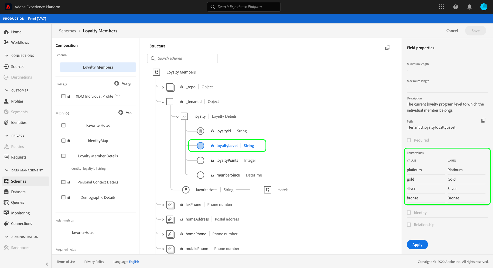

# 在UI中探索XDM資源

在Adobe Experience Platform中，所有Experience Data Model(XDM)資源都儲存在中 [!DNL Schema Library]，包括Adobe提供的標準資源以及貴組織定義的自訂資源。 在Experience Platform UI中，您可以檢視中任何現有架構、類別、混合或資料類型的結構和欄位 [!DNL Schema Library]。 當規劃和準備資料擷取時，這特別有用，因為UI會提供這些XDM資源所提供之每個欄位的預期資料類型和使用案例資訊。

本教學課程涵蓋探索Experience Platform UI中現有結構、類別、混合和資料類型的步驟。

## 查找XDM資源 {#lookup}

在平台UI中，選擇左 **[!UICONTROL 側導覽]** 中的「結構描述」。 「 [!UICONTROL 工作區] 」提供了一個「瀏覽」頁籤，用於探索組織中所有現有的XDM資源，以及用於探索 **[!UICONTROL Mix]** 、 ************ Mixins、MixData類型的附加專用頁籤。

在「瀏 [!UICONTROL 覽] 」索引標籤上，您可以使用篩選圖示(篩選圖示影像)來顯示左側導軌中的控制項，以縮小列出的結果。

例如，要篩選清單以僅顯示Adobe提供的標準資料類型，請分別在 **[!UICONTROL Type]** 和OwnerSections下選擇 **[!UICONTROL Datatype]** 和 **[!UICONTROL Adobe]** , **[!UICONTROL 分別選擇Type]** 和OwnerSections。

「 **[!UICONTROL Included in Profile]** 」（包含在描述檔中）切換可讓您篩選結果，僅顯示在「Real-time Customer Profile」（即時客戶描述檔）中啟 [用的方案中使用的資源](../../profile/home.md)。

您也可以使用搜尋列，將結果縮小為名稱與搜尋查詢相符的資源。

找到要瀏覽的資源後，請從清單中選擇其名稱，以在畫布中查看其結構。

## 在畫布中探索XDM資源 {#explore}

選取資源後，其結構就會在畫布中開啟。

包含子屬性的所有物件類型欄位在首次出現在畫布時，預設會收合。 若要顯示任何欄位的子屬性，請選取其名稱旁的圖示。

### 系統產生的欄位 {#system-fields}

某些架構欄位的前置有下划線，如 `_repo` 和 `_id`。 這些代表欄位的預留位置，系統會在擷取資料時自動產生並指派。

因此，在將這些欄位匯入平台時，大部分的欄位應排除在資料結構之外，主要例外是欄位，您組織下建立的所有XDM欄位都必須與欄位同名。 `_{TENANT_ID}`

### 資料類型 {#data-types}

對於畫布中顯示的每個欄位，其對應的資料類型會顯示在其名稱旁，一覽表示該欄位預期擷取的資料類型。

附加方括弧(`[]`)的任何資料類型都表示該特定資料類型的陣列。 例如，String **[!UICONTROL \[]的資料類]** 型表示欄位需要字串值的陣列。 付款項 **[!UICONTROL \[]的數]據類型表示符合付款項資料類型** 的對象陣列。

如果陣列欄位基於對象類型，則可以在畫布中選擇其表徵圖以顯示每個陣列項的預期屬性。

### [!UICONTROL 欄位屬性] {#field-properties}

當您選取畫布中任何欄位的名稱時，右側欄位會更新，以顯示「欄位屬性」下方該欄位的詳 **[!UICONTROL 細資訊]**。 這可包含欄位預期使用案例、預設值、模式、格式的說明，以及欄位是否必要等等。

如果您正在檢查的欄位是列舉欄位，右側欄位也會顯示欄位預期接收的可接受值。

### 身分欄位 {#identity}

在檢查包含身份欄位的方案時，這些欄位在畫布中以指紋表徵圖(指紋圖)突出顯示。 如果選擇身份欄位的名稱，則可以查看其他資訊，如 [身份名稱空間](../../identity-service/namespaces.md) ，以及該欄位是否是架構的主要身份。

### 關係欄位 {#relationship}

關係欄位也會在畫布中唯一反白標示，顯示欄位所參照之目標架構的名稱。 如果選擇關係欄位的名稱，則可以查看目標方案的主標識的標識名稱空間。

>[!NOTE]
>
>有關在XDM結構 [中使用關係的詳細資訊](./create-schema-ui.md) ，請參閱在UI中建立關係的教程。

## 後續步驟

本檔案說明如何在Experience Platform UI中探索現有的XDM資源。 有關方案工作區和不同功能的詳細 [!UICONTROL 資訊] ，請參 [!DNL Schema Editor]閱方案創 [建教程](./create-schema-ui.md)。