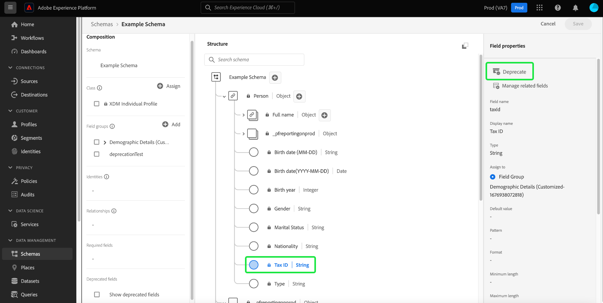

# 棄用UI中的XDM欄位

Experience Data Model (XDM)可在您業務需求變更時，靈活地管理資料模型，方法是在擷取資料後停用結構描述欄位。 不想要的欄位可以棄用，從UI檢視中將其移除，也可以在下游UI中隱藏它們。 方便之處是，結構編輯器中的核取方塊可讓您顯示已棄用的欄位，並可視需要取消棄用它們。

由於預設會從UI隱藏已棄用的欄位，這會簡化結構編輯器中的結構描述，並防止不需要的欄位新增到下游相依性，例如區段產生器、歷程設計器等。 欄位棄用也可回溯相容。 使用已棄用欄位（例如區段和查詢）的其他系統將繼續依預期評估。 如果在現有區段中使用了已棄用的欄位，則會正常處理該欄位，這表示該欄位會如預期地在區段產生器畫布中顯示，或根據已棄用欄位中可用的任何資料進行評估。 這是不中斷的變更，不會對任何現有資料流程造成負面影響。

>[!NOTE]
>
>將資料內嵌到結構描述中之前，您可以移除不必要的欄位群組。 請參閱以下說明檔案： [如何從結構描述中移除欄位群組](../ui/resources/schemas.md#remove-fields) 以取得詳細資訊。

一旦將資料內嵌到結構描述中，您就無法再從結構描述中移除欄位而不進行重大變更。 在這種情況下，您可以使用來取代結構描述或自訂資源中不需要的欄位 [結構描述編輯器](./create-schema-ui.md) 或 [結構描述登入API](https://developer.adobe.com/experience-platform-apis/references/schema-registry/).

本文介紹如何使用Experience Platform使用者介面中的結構描述編輯器來取代不同XDM資源的欄位。 如需使用API來棄用XDM欄位的步驟，請參閱以下教學課程： [使用結構描述登入API取代XDM欄位](./field-deprecation-api.md).

## 棄用欄位 {#deprecate}

若要棄用自訂欄位，請導覽至您要編輯之結構描述的結構描述編輯器。 從中選擇要棄用的欄位 [!UICONTROL 結構] 區段，接著是 **[!UICONTROL 棄用]** 從 [!UICONTROL 欄位屬性].

系統會顯示一個對話方塊，確認您的選擇並通知您該欄位將從聯合結構描述的UI檢視中移除，並隱藏在下游UI中。 若要完成動作，請選取 **[!UICONTROL 確認]**.

該欄位現在已從UI檢視中移除。

>[!NOTE]
>
>一旦棄用，下游UI (例如區段控制面板、Customer Journey Analytics和Adobe Journey Optimizer)就不會再將棄用的欄位顯示為工作流程的一部分。 不過，下游UI可選擇視需要顯示已棄用的欄位，並繼續將棄用的欄位視為正常欄位。 如需詳細資訊，請參閱各自的檔案。 使用已棄用欄位的查詢和區段將繼續按預期執行。

## 顯示已棄用的欄位 {#show-deprecated}

若要檢視先前已棄用的欄位，請導覽至結構描述編輯器中的相關結構描述。 選取 **[!UICONTROL 顯示已棄用的欄位]** 核取方塊(位於 [!UICONTROL 組合] 區段。

已棄用的欄位現在顯示在UI檢視中。 選取 **[!UICONTROL 儲存]** 以確認您的設定。

## 取消棄用欄位 {#undeprecate-fields}

若要復原已棄用的欄位，請先 [顯示已棄用的欄位](#show-deprecated) 如上所述，然後從編輯器的 [!UICONTROL 結構] 區段。 接下來，選取 **[!UICONTROL 取消棄用]** 從 [!UICONTROL 欄位屬性] 側欄後接 **[!UICONTROL 儲存]**.

此 [!UICONTROL 取消棄用欄位] 對話方塊隨即顯示。 若要確認變更，請選取 **[!UICONTROL 確認]**.

![此 [!UICONTROL 取消棄用欄位] 對話方塊中的「確認」會反白顯示。](../images/tutorials/field-deprecation/undeprecate-field-dialog.png)

欄位現在在UI檢視中以及下游UI中顯示為標準。 同樣地，您現在可以選擇棄用欄位。

## 後續步驟

本檔案說明如何使用結構描述編輯器UI棄用XDM欄位。 如需為自訂資源設定欄位的詳細資訊，請參閱以下指南： [在API中定義XDM欄位](./custom-fields-api.md). 如需管理描述元的詳細資訊，請參閱 [描述項端點指南](../api/descriptors.md).
