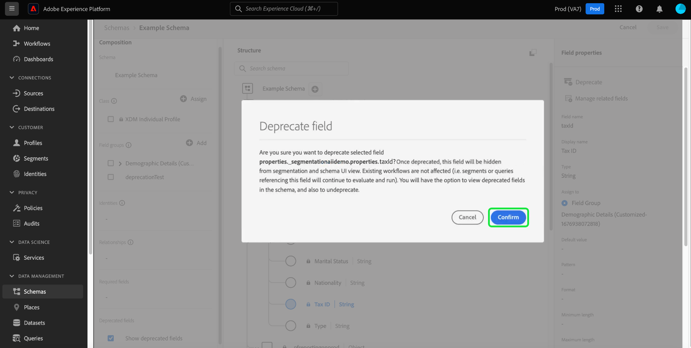

# 棄用UI中的XDM欄位

體驗資料模型(XDM)通過在資料被攝取後取消架構欄位，讓您能夠靈活地管理您的資料模型，以適應業務需要的變化。 不需要的欄位可以被棄用，以便從UI視圖中刪除它們，也可以從下游UI中隱藏它們。 方便地，「架構編輯器」中的複選框允許您顯示不建議使用的欄位，並且如有必要，您還可以對這些欄位進行理解。

預設情況下，當不建議使用的欄位從UI中隱藏時，這將優化架構編輯器中的架構，並防止不需要的欄位被添加到下游依賴項中，如段生成器、行程設計器等。 欄位棄用也向後相容。 使用過時欄位的其他系統（如段和查詢）將繼續按照預期對這些欄位進行評估。 如果已棄用的欄位在現有段中使用，則它將被正常處理，這意味著該欄位將按段生成器畫布中的預期顯示，或根據已棄用欄位中可用的任何資料進行計算。 這是不會中斷的更改，不會對任何現有資料流產生負面影響。

>[!NOTE]
>
>在將資料導入架構之前，可以刪除不必要的欄位組。 請參閱 [如何從架構中刪除欄位組](../ui/resources/schemas.md#remove-fields) 的子菜單。

資料被引入到架構後，您不能再從架構中刪除欄位，而不進行中斷更改。 在這種情況下，您可以使用 [架構編輯器](./create-schema-ui.md) 或 [架構註冊表API](https://developer.adobe.com/experience-platform-apis/references/schema-registry/)。

本文檔介紹如何使用Experience Platform用戶介面中的架構編輯器來棄用不同XDM資源的欄位。 有關使用API棄用XDM欄位的步驟，請參見上的教程 [使用架構註冊表API棄用XDM欄位](./field-deprecation-api.md)。

## 棄用欄位 {#deprecate}

要棄用自定義欄位，請導航到要編輯的架構的架構編輯器。 從中選擇要棄用的欄位 [!UICONTROL 結構] 畫布的下一部分，然後 **[!UICONTROL 棄用]** 從 [!UICONTROL 欄位屬性]。

將顯示一個對話框，確認您的選擇並通知您將從聯合架構的UI視圖中刪除該欄位，並從下游UI中隱藏。 要完成操作，請選擇 **[!UICONTROL 確認]**。

現在，該欄位將從UI視圖中刪除。

>[!NOTE]
>
>一旦棄用，下游UI(如分段儀表板、Customer Journey Analytics和Adobe Journey Optimizer)將不再將棄用的欄位作為其工作流的一部分顯示。 但是，下游UI可以選擇在需要時顯示不建議使用的欄位，並繼續將不建議使用的欄位視為正常欄位。 有關詳細資訊，請參閱各自的文檔。 使用已棄用欄位的查詢和段將繼續按預期運行。

## 顯示不建議使用的欄位 {#show-deprecated}

要查看以前不建議使用的欄位，請導航到架構編輯器中的相關架構。 選擇 **[!UICONTROL 顯示不建議使用的欄位]** 複選框 [!UICONTROL 組合] 的子菜單。

不建議使用的欄位現在顯示在UI視圖中。 選擇 **[!UICONTROL 保存]** 確認設定。

## 未預處理欄位 {#undeprecate-fields}

要撤消已棄用的欄位，請首先 [顯示已棄用欄位](#show-deprecated) 如上所述，從編輯器的 [!UICONTROL 結構] 的子菜單。 下一步，選擇 **[!UICONTROL 不足]** 從 [!UICONTROL 欄位屬性] 邊欄後跟 **[!UICONTROL 保存]**。

的 [!UICONTROL 未預處理欄位] 對話框。 要確認更改，請選擇 **[!UICONTROL 確認]**。

![的 [!UICONTROL 未預處理欄位] 對話框，其中加亮確認。](../images/tutorials/field-deprecation/undeprecate-field-dialog.png)

該欄位現在在UI視圖和下游UI中顯示為標準。 同樣，您現在可以選擇棄用該欄位。

## 後續步驟

本文檔介紹了如何使用架構編輯器UI棄用XDM欄位。 有關為自定義資源配置欄位的詳細資訊，請參見上的指南 [定義API中的XDM欄位](./custom-fields-api.md)。 有關管理描述符的詳細資訊，請參見 [描述符端點指南](../api/descriptors.md)。
