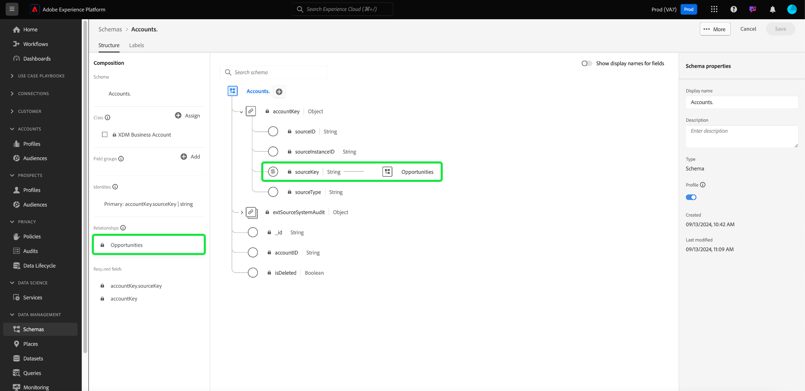

# 在 Real-Time Customer Data Platform B2B 版本中定義兩個方案之間的多對一關係 {#relationship-b2b}

>[!CONTEXTUALHELP]
>id="platform_xdm_b2b_reference_schema"
>title="參考方案"
>abstract="選取要建立關係的方案。根據方案的類別，方案還可能和 B2B 內容中的其他實體存在現有關係。請查看文件以了解 B2B 方案類別彼此間的關係。"

Adobe Real-time Customer Data Platform B2B Edition提供數個Experience Data Model (XDM)類別，可擷取基本B2B資料實體，包括[帳戶](../classes/b2b/business-account.md)、[機會](../classes/b2b/business-opportunity.md)、[行銷活動](../classes/b2b/business-campaign.md)等。 透過根據這些類別建立結構描述並啟用它們以用於[即時客戶設定檔](../../profile/home.md)，您可以將不同來源的資料合併到稱為聯合結構描述的統一表示中。

不過，聯合結構描述只能包含共用相同類別的結構描述所擷取的欄位。 這就是結構描述關係的用處。 透過在B2B結構描述中實作關係，您可以說明這些業務實體如何彼此關聯，並可在下游細分使用案例中包含來自多個類別的屬性。

下圖提供不同B2B類別在基本實作中如何相互關聯的範例：

本教學課程涵蓋在Real-Time CDP B2B Edition中定義兩個結構描述之間多對一關係的步驟。

>[!NOTE]
>
>如果您未使用Real-time Customer Data Platform B2B Edition或想建立一對一的關係，請改為參閱[建立一對一關係](./relationship-ui.md)指南。
>
>本教學課程著重於如何在Platform UI中手動建立B2B結構描述之間的關係。 如果您從B2B來源連線引進資料，您可以使用自動產生公用程式來建立所需的結構描述、身分和關係。 如需使用自動產生公用程式[的詳細資訊，請參閱B2B名稱空間和結構描述的來原始檔](../../sources/connectors/adobe-applications/marketo/marketo-namespaces.md)。

## 快速入門

此教學課程需要您實際瞭解[!DNL XDM System]以及[!DNL Experience Platform] UI中的結構描述編輯器。 在開始本教學課程之前，請先檢閱下列檔案：

* Experience Platform](../home.md)中的[XDM系統： [!DNL Experience Platform]中XDM及其實作的概觀。
* [結構描述組合的基本概念](../schema/composition.md)： XDM結構描述的建置區塊簡介。
* [使用 [!DNL Schema Editor]](create-schema-ui.md)建立結構描述：此教學課程涵蓋如何在UI中建立和編輯結構描述的基本知識。

## 定義來源和參考結構描述

您應已建立將在關係中定義的兩個結構描述。 為了示範，本教學課程會建立商機（在「[!DNL Opportunities]」結構描述中定義）與其相關聯的商業帳戶（在「[!DNL Accounts]」結構描述中定義）之間的關係。

結構描述關聯性由&#x200B;**來源結構描述**&#x200B;中的專用欄位表示，該欄位參照&#x200B;**參考結構描述**&#x200B;的主要身分欄位。 在接下來的步驟中，&quot;[!DNL Opportunities]&quot;做為來源結構描述，而&quot;[!DNL Accounts]&quot;做為參考結構描述。

### 了解 B2B 關係中的身分

>[!CONTEXTUALHELP]
>id="platform_xdm_b2b_identity_namespace"
>title="參考身分命名空間"
>abstract="適用於參考方案的主要身分識別欄位的命名空間 (類型)。參考方案必須有一個已建立的主要身分識別欄位才能參與關係。請查看文件以了解有關 B2B 關係中身分識別的詳細資訊。"

為了建立關係，參考結構描述必須具有定義的主要身分。 為B2B實體設定主要身分時，請記住，如果您跨不同系統或位置收集字串型實體ID，則這些ID可能會重疊，這可能會導致Platform中的資料衝突。

為了解決這個問題，所有標準B2B類別都包含符合[[!UICONTROL B2B Source]資料型別](../data-types/b2b-source.md)的「key」欄位。 此資料型別提供B2B實體的字串識別碼欄位，以及有關識別碼來源的其他內容資訊。 其中一個欄位`sourceKey`串連資料型別中其他欄位的值，以產生實體的完整唯一識別碼。 此欄位一律應用作B2B實體結構描述的主要身分識別。

>[!NOTE]
>
>當[將XDM欄位設定為身分](../ui/fields/identity.md)時，您必須提供身分名稱空間來定義下方的身分。 這可以是Adobe提供的標準名稱空間，或貴組織定義的自訂名稱空間。 實際上，名稱空間只是內容字串，您可以設定為您喜歡的任何值，前提是這對於貴組織分類身分型別很有意義。 如需詳細資訊，請參閱[身分識別名稱空間](../../identity-service/features/namespaces.md)的概觀。

為方便參考，以下幾節將說明在定義關係之前，本教學課程中使用的每個結構描述的結構。 請留意已在結構描述結構中定義主要身分的位置，以及這些身分使用的自訂名稱空間。

### [!DNL Opportunities]結構描述

來源結構描述&quot;[!DNL Opportunities]&quot;是以[!UICONTROL XDM商業機會]類別為基礎。 類別`opportunityKey`提供的其中一個欄位做為結構描述的識別碼。 具體來說，`opportunityKey`物件下的`sourceKey`欄位設定為名為[!DNL B2B Opportunity]的自訂名稱空間下的結構描述主要身分。

如在&#x200B;**[!UICONTROL 結構描述屬性]**&#x200B;下所見，此結構描述已在[!DNL Real-Time Customer Profile]中啟用。

### [!DNL Accounts]結構描述

參考結構描述&quot;[!DNL Accounts]&quot;是以[!UICONTROL XDM帳戶]類別為基礎。 根層級`accountKey`欄位包含的`sourceKey`在名為[!DNL B2B Account]的自訂名稱空間下充當其主要身分。 此結構描述也已啟用以供設定檔使用。

## 為來源方案定義關係欄位 {#relationship-field}

>[!CONTEXTUALHELP]
>id="platform_xdm_b2b_relationship_name_current"
>title="目前方案中的關係名稱"
>abstract="說明從目前方案到參考方案的關係的標籤 (例如，「相關帳戶」)。此標籤會用於設定檔和分段中，以從相關 B2B 實體將內容提供給資料。請查看文件以了解有關建置 B2B 方案關係的詳細資訊。"

>[!CONTEXTUALHELP]
>id="platform_xdm_b2b_relationship_name_reference"
>title="參考方案中的關係名稱"
>abstract="說明從參考方案到目前方案的關係的標籤 (例如，「相關機會」)。此標籤會用於設定檔和分段中，以從相關 B2B 實體將內容提供給資料。請查看文件以了解有關建置 B2B 方案關係的詳細資訊。"

為了定義兩個結構描述之間的關係，來源結構描述必須具有專用欄位，以指示參考結構描述的主要身分。 標準B2B類別包含常用相關商業實體的專用來源索引鍵欄位。 例如，[!UICONTROL XDM商業機會]類別包含相關帳戶(`accountKey`)與相關行銷活動(`campaignKey`)的來源金鑰欄位。 不過，如果您需要超過預設的元件，也可以使用自訂欄位群組，將其他[!UICONTROL B2B Source]欄位新增到結構描述中。

>[!NOTE]
>
>目前，從來源結構描述到參考結構描述只能定義多對一和一對一關係。 對於一對多關係，您必須在代表「許多」的結構描述中定義關係欄位。

若要設定關聯欄位，請選取畫布中相關欄位旁的箭頭圖示（）。 在[!DNL Opportunities]結構描述的情況下，這是`accountKey.sourceKey`欄位，因為目標是與帳戶建立多對一關係。

會出現一個對話方塊，可讓您指定有關關係的詳細資訊。 關聯性型別會自動設定為&#x200B;**[!UICONTROL 多對一]**。

在&#x200B;**[!UICONTROL 參考結構描述]**&#x200B;下，使用搜尋列來尋找參考結構描述的名稱。 當您反白參考結構描述名稱時，**[!UICONTROL 參考身分名稱空間]**&#x200B;欄位會自動更新為結構描述主要身分的名稱空間。

在&#x200B;**[!UICONTROL 來自目前結構描述的關係名稱]**&#x200B;和&#x200B;**[!UICONTROL 來自參考結構描述的關係名稱]**&#x200B;下，分別提供來源和參考結構描述內容中的關係易記名稱。 完成後，選取&#x200B;**[!UICONTROL 儲存]**&#x200B;以套用變更並儲存結構描述。

畫布會重新出現，關聯欄位現在會以您先前提供的好記名稱標籤。 此關係名稱也會列在左側邊欄下方，以方便參考。

如果您檢視參考結構描述的結構，關係標籤會出現在結構描述的主要身分欄位旁和左側邊欄中。

## 後續步驟

依照此教學課程，您已使用[!DNL Schema Editor]成功建立兩個結構描述之間的多對一關係。 一旦使用以這些結構描述為基礎的資料集擷取資料，且已在設定檔資料存放區中啟用該資料，您就可以將這兩個結構描述的屬性用於[多類別細分使用案例](../../rtcdp/segmentation/b2b.md)。
