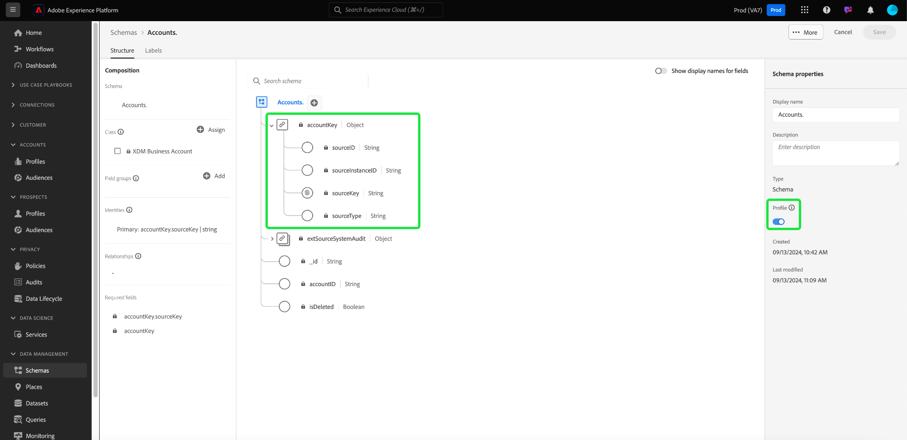

# 在Real-time Customer Data Platform B2B版中定義兩個結構之間的多對一關係 {#relationship-b2b}

>[!CONTEXTUALHELP]
>id="platform_xdm_b2b_reference_schema"
>title="參考結構"
>abstract="選擇要建立關係的架構。 根據架構的類別，它也可能與B2B內容中的其他實體有現有關係。 請參閱本檔案，了解B2B架構類別彼此之間的關聯。"

Adobe Real-time Customer Data Platform B2B Edition提供數種擷取基本B2B資料實體的Experience Data Model(XDM)類別，包括 [帳戶](../classes/b2b/business-account.md), [商機](../classes/b2b/business-opportunity.md), [行銷活動](../classes/b2b/business-campaign.md)、等。 根據這些類別建立結構，並啟用這些結構以用於 [即時客戶個人檔案](../../profile/home.md)，您可以將不同來源的資料合併為統一表示法，稱為聯合架構。

但是，聯合架構只能包含由共用相同類別的結構所擷取的欄位。 這是架構關係的來源。 在B2B結構中實作關係，您便可以說明這些業務實體彼此間的關係，並可在下游細分使用案例中納入多個類別的屬性。

下圖提供在基本實施中不同B2B類如何彼此關聯的範例：

本教學課程涵蓋定義Real-Time CDP B2B版中兩個結構之間多對一關係的步驟。

>[!NOTE]
>
>若您未使用Real-time Customer Data Platform B2B Edition，或想要建立一對一關係，請參閱 [建立一對一關係](./relationship-ui.md) 。
>
>本教學課程著重於如何在Platform UI中手動建立B2B結構之間的關係。 如果您要從B2B來源連線匯入資料，可使用自動產生公用程式來建立必要的結構、身分和關係。 如需詳細資訊，請參閱B2B命名空間和結構描述的來源檔案 [使用自動生成實用程式](../../sources/connectors/adobe-applications/marketo/marketo-namespaces.md).

## 快速入門

本教學課程需要深入了解 [!DNL XDM System] 和 [!DNL Experience Platform] UI。 開始本教學課程之前，請檢閱下列檔案：

* [XDM系統Experience Platform](../home.md):XDM及其實作概述 [!DNL Experience Platform].
* [結構構成基本概念](../schema/composition.md):介紹XDM結構的建置組塊。
* [使用 [!DNL Schema Editor]](create-schema-ui.md):本教學課程說明如何在UI中建立和編輯結構描述的基本知識。

## 定義源和目標架構

您應已建立將在關係中定義的兩個結構。 為了演示，本教程建立了業務機會(定義於[!DNL Opportunities]「方案」)及其相關業務帳戶(定義於「[!DNL Accounts]&quot;架構)。

架構關係由 **來源綱要** 會參考 **目的地綱要**. 在下列步驟中，「[!DNL Opportunities]&quot;用作源架構，而&quot;[!DNL Accounts]」可作為目標架構。

### 了解B2B關係中的身分

>[!CONTEXTUALHELP]
>id="platform_xdm_b2b_identity_namespace"
>title="參考身分命名空間"
>abstract="參考架構的主要身分欄位的命名空間（類型）。 引用架構必須具有已建立的主標識欄位，才能參與關係。 請參閱本檔案，深入了解B2B關係中的身分。"

為了建立關係，目標架構必須具有定義的主要身份。 為B2B實體設定主要身分時，請記住，如果您跨不同系統或位置收集字串型實體ID，可能會重疊，這可能會在Platform中導致資料衝突。

為此，所有標準B2B類別都包含符合 [[!UICONTROL B2B源] 資料類型](../data-types/b2b-source.md). 此資料類型提供B2B實體字串識別碼的欄位，以及識別碼來源的其他內容資訊。 其中一個領域， `sourceKey`，串連資料類型中其他欄位的值，以產生實體的唯一識別碼。 此欄位應一律作為B2B實體結構的主要身分。

>[!NOTE]
>
>當 [將XDM欄位設為身分](../ui/fields/identity.md)，您必須提供身分命名空間，以在下定義身分。 這可以是Adobe提供的標準命名空間，或您的組織定義的自訂命名空間。 實際上，命名空間只是內容字串，只要對貴組織來說對分類身分類型有意義，就可以設為您喜歡的任何值。 請參閱 [身分識別命名空間](../../identity-service/namespaces.md) 以取得更多資訊。

為了參考，以下幾節將說明定義關係之前本教學課程中使用的每個架構的結構。 請留意主要身分識別在架構結構中的定義位置，以及其使用的自訂命名空間。

### [!DNL Opportunities] 綱要

源架構「[!DNL Opportunities]」是以 [!UICONTROL XDM業務機會] 類別。 類提供的欄位之一， `opportunityKey`，可作為結構的識別碼。 具體而言， `sourceKey` 欄位 `opportunityKey` 在名為的自訂命名空間下，物件會設為架構的主要身分識別 [!DNL B2B Opportunity].

如下所示 **[!UICONTROL 架構屬性]**，此架構可在 [!DNL Real-Time Customer Profile].

### [!DNL Accounts] 綱要

目標架構「[!DNL Accounts]」是以 [!UICONTROL XDM帳戶] 類別。 根層級 `accountKey` 欄位包含 `sourceKey` 在稱為的自訂命名空間下作為主要身分識別 [!DNL B2B Account]. 此架構也已啟用，可在「設定檔」中使用。

## 為源架構定義關係欄位 {#relationship-field}

>[!CONTEXTUALHELP]
>id="platform_xdm_b2b_relationship_name_current"
>title="當前架構的關係名稱"
>abstract="描述從當前架構到引用架構（如「相關帳戶」）的關係的標籤。 此標籤用於「設定檔」和「分段」，以提供相關B2B實體資料的內容。 請參閱本檔案，以進一步了解如何建立B2B架構關係。"

>[!CONTEXTUALHELP]
>id="platform_xdm_b2b_relationship_name_reference"
>title="引用架構的關係名稱"
>abstract="描述從引用架構到當前架構（如「相關機會」）的關係的標籤。 此標籤用於「設定檔」和「分段」，以提供相關B2B實體資料的內容。 請參閱本檔案，以進一步了解如何建立B2B架構關係。"

要定義兩個架構之間的關係，源架構必須具有引用目標架構主要標識的專用欄位。 標準B2B類包括常用相關業務實體的專用源密鑰欄位。 例如， [!UICONTROL XDM業務機會] 類包含相關帳戶的源密鑰欄位(`accountKey`)和相關促銷活動(`campaignKey`)。 不過，您也可以新增其他 [!UICONTROL B2B源] 欄位（如果需要的元件超過預設元件），請使用自訂欄位群組將欄位傳送至架構。

>[!NOTE]
>
>目前，從源架構到目標架構只能定義多對一和一對一關係。 對於一對多關係，您必須在表示「多」的結構中定義關係欄位。

要設定關係欄位，請選擇箭頭表徵圖()旁邊。 若 [!DNL Opportunities] 架構，此為 `accountKey.sourceKey` 欄位，因為目標是與帳戶建立多對一關係。

此時將顯示一個對話框，允許您指定關係的詳細資訊。 關係類型會自動設定為 **[!UICONTROL 多對一]**.

在 **[!UICONTROL 參考結構]**，請使用搜尋列來尋找目標架構的名稱。 反白顯示目標架構的名稱時， **[!UICONTROL 參考身分命名空間]** 欄位會自動更新架構主要身分識別的命名空間。

在 **[!UICONTROL 當前架構的關係名稱]** 和 **[!UICONTROL 引用架構中的關係名稱]**，請分別在來源和目的地結構內容中提供關係的好記名稱。 完成後，請選取 **[!UICONTROL 儲存]** 以應用更改並保存架構。

畫布會重新顯示，「關係」欄位現在會以您先前提供的好記名稱標示。 關係名稱也會列在左側邊欄下方，以方便參考。

如果您檢視目標架構的結構，關係標籤會出現在架構的主要身分欄位旁和左側邊欄中。

## 後續步驟

依照本教學課程，您已使用 [!DNL Schema Editor]. 使用以這些結構為基礎的資料集匯入資料，且該資料已在設定檔資料存放區中啟動後，您就可以將這兩個結構的屬性用於多類別劃分使用案例。 如需詳細資訊，請參閱Real-Time CDP B2B版的相關檔案。
