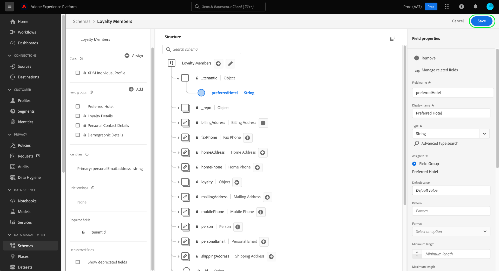
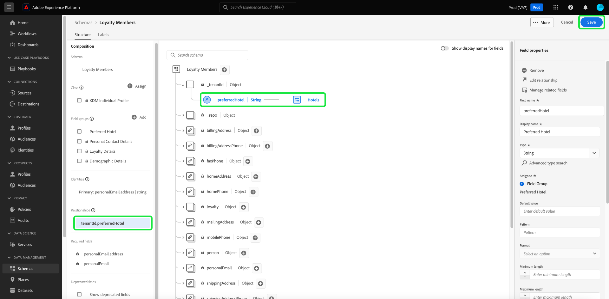

# 使用[!DNL Schema Editor]定義兩個結構之間的關係

瞭解客戶之間的關係以及客戶與品牌之間跨不同通道的互動是Adobe Experience Platform的重要組成部分。 在[!DNL Experience Data Model](XDM)結構中定義這些關係可讓您獲得客戶資料的複雜見解。

雖然架構關係可以通過使用union架構和[!DNL Real-time Customer Profile]來推斷，但這僅適用於共用相同類的架構。 要在屬於不同類的兩個方案之間建立關係，必須將專用的關係欄位添加到源方案中，該源方案引用目標方案的標識。

本文檔提供了一個教程，用於使用[!DNL Experience Platform]用戶介面中的架構編輯器定義兩個架構之間的關係。 有關使用API定義方案關係的步驟，請參見[上的教程，該教程介紹如何使用方案註冊表API](relationship-api.md)定義關係。

## 快速入門

本教學課程需要對[!DNL XDM System]和[!DNL Experience Platform] UI中的架構編輯器有正確的理解。 在開始本教學課程之前，請先閱讀下列檔案：

* [Experience Platform中的XDM系統](../home.md):XDM及其實施概述於 [!DNL Experience Platform]。
* [架構構成基礎](../schema/composition.md):介紹XDM模式的構建塊。
* [使用 [!DNL Schema Editor]](create-schema-ui.md):教學課程，涵蓋使用的基本知識 [!DNL Schema Editor]。

## 定義源和目標方案

預期您已經建立了將在關係中定義的兩個方案。 為了進行演示，本教程將建立組織忠誠度方案（在&quot;[!DNL Loyalty Members]&quot;方案中定義）的成員與其最愛的酒店（在&quot;[!DNL Hotels]&quot;方案中定義）之間的關係。

>[!IMPORTANT]
>
>為建立關係，兩個方案都必須已定義主要身份，並且必須為[!DNL Real-time Customer Profile]啟用。 如果需要有關如何相應配置方案的指導，請參見架構建立教程中關於[啟用方案以用於Profile](./create-schema-ui.md#profile)的章節。

方案關係由&#x200B;**源方案**&#x200B;內的專用欄位表示，該欄位引用&#x200B;**目標方案**&#x200B;內的另一個欄位。 在後續步驟中，&quot;[!DNL Loyalty Members]&quot;將作為源模式，而&quot;[!DNL Hotels]&quot;將作為目標模式。

為便於參考，以下幾節將介紹在定義關係之前本教程中使用的每個架構的結構。

### [!DNL Loyalty Members] 架構

源模式&quot;[!DNL Loyalty Members]&quot;基於[!DNL XDM Individual Profile]類，是在[教程中為在UI](create-schema-ui.md)中建立模式而構建的模式。 它在其`_tenantId`名稱空間下包含`loyalty`物件，其中包含數個忠誠度特定欄位。 其中一個欄位`loyaltyId`作為[!UICONTROL Email]命名空間下模式的主標識。 如&#x200B;**[!UICONTROL Schema Properties]**&#x200B;下所示，此架構已啟用，可用於[!DNL Real-time Customer Profile]。

### [!DNL Hotels] 架構

目標方案&quot;[!DNL Hotels]&quot;基於自定義&quot;[!DNL Hotels]&quot;類，並包含描述酒店的欄位。 `hotelId`欄位是自訂`hotelId`命名空間下之架構的主要身分。 與[!DNL Loyalty Members]架構一樣，此架構也已為[!DNL Real-time Customer Profile]啟用。

## 建立關係混合

>[!NOTE]
>
>僅當源架構沒有專用字串類型欄位用作目標架構的引用時，才需要此步驟。 如果此欄位已在源方案中定義，請跳至定義關係欄位](#relationship-field)的下一步。[

為了定義兩個方案之間的關係，源方案必須具有專用欄位以用作目標方案的引用。 通過建立新混音，可以將此欄位添加到源模式。

首先，在&#x200B;**[!UICONTROL Mixins]**&#x200B;部分中選擇&#x200B;**[!UICONTROL Add]**。

出現[!UICONTROL Add Mixin]對話框。 從此處選擇&#x200B;**[!UICONTROL Create new mixin]**。 在出現的文字欄位中，輸入新混音的顯示名稱和說明。 完成後選取「**[!UICONTROL Add mixin]**」。

 

畫布會重新顯示，「[!DNL Favorite Hotel]」會出現在&#x200B;**[!UICONTROL Mixins]**&#x200B;區段中。 選擇混音名稱，然後選擇根級別`Loyalty Members`欄位旁的&#x200B;**[!UICONTROL Add field]**。

在畫布中，`_tenantId`命名空間下方會顯示新欄位。 在&#x200B;**[!UICONTROL Field properties]**&#x200B;下，提供欄位名稱和欄位顯示名稱，並將其類型設為&quot;[!UICONTROL String]&quot;。

完成後，選擇&#x200B;**[!UICONTROL Apply]**。

更新的`favoriteHotel`欄位會出現在畫布中。 選擇&#x200B;**[!UICONTROL Save]**&#x200B;以完成對架構的更改。

## 為源方案{#relationship-field}定義關係欄位

在源架構定義了專用的參考欄位後，可以將其指定為關係欄位。

在畫布中選取`favoriteHotel`欄位，然後在&#x200B;**[!UICONTROL Field properties]**&#x200B;下方向下捲動，直到出現&#x200B;**[!UICONTROL Relationship]**&#x200B;核取方塊。 選中該複選框可顯示配置關係欄位所需的參數。

選擇&#x200B;**[!UICONTROL Reference schema]**&#x200B;的下拉式清單，並選擇關係的目標模式（在此示例中為&quot;[!DNL Hotels]&quot;）。 如果為[!DNL Profile]啟用了目標模式，則&#x200B;**[!UICONTROL Reference identity namespace]**&#x200B;欄位將自動設定為目標模式主標識的名稱空間。 如果架構未定義主標識，則必須從下拉菜單中手動選擇要使用的命名空間。 完成後選取「**[!UICONTROL Apply]**」。

`favoriteHotel`欄位現在會在畫布中反白顯示為關係，顯示目標架構的名稱和參考身分名稱空間。 選擇&#x200B;**[!UICONTROL Save]**&#x200B;以保存更改並完成工作流。

## 後續步驟

在本教學課程之後，您已使用[!DNL Schema Editor]成功建立兩個結構之間的一對一關係。 有關如何使用API定義關係的步驟，請參閱[上的教程，該教程介紹如何使用方案註冊表API](relationship-api.md)定義關係。
