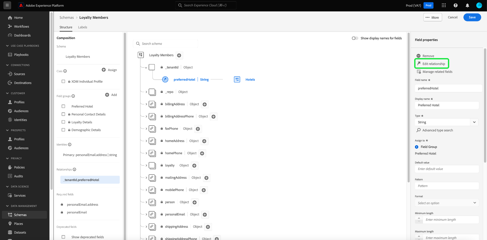

# 使用 [!DNL Schema Editor] 定義兩個結構描述之間的一對一關係 {#relationship-ui}

>[!CONTEXTUALHELP]
>id="platform_schemas_relationships"
>title="結構描述關係"
>abstract="屬於不同類別的結構描述可藉由關係欄位建立內容連結，進而讓您能夠建置更複雜的分段規則。如需有關結構描述關係的詳細資訊，請查看此文件。"

>[!CONTEXTUALHELP]
>id="platform_xdm_1to1_reference_schema"
>title="參考結構描述"
>abstract="選取要建立關係的結構描述。此結構描述可能和目前結構描述屬於不同類別。如需有關結構描述關係的詳細資訊，請查看此文件。"

>[!CONTEXTUALHELP]
>id="platform_xdm_1to1_identity_namespace"
>title="參考身分識別命名空間"
>abstract="適用於參考結構描述的主要身分識別欄位的命名空間 (類型)。參考結構描述必須有一個已建立的主要身分識別欄位才能參與關係。如需有關結構描述關係的詳細資訊，請查看此文件。"

瞭解客戶之間的關係以及他們跨不同管道與您品牌的互動，是Adobe Experience Platform的重要一環。 在[!DNL Experience Data Model] (XDM)結構描述的結構中定義這些關係，可讓您獲得有關客戶資料的複雜見解。

雖然結構描述關聯性可透過使用聯合結構描述和[!DNL Real-Time Customer Profile]來推斷，但這僅適用於共用相同類別的結構描述。 若要在屬於不同類別的兩個結構描述之間建立關係，必須將專用關係欄位新增到來源結構描述中，該來源結構描述會參考其他相關結構描述的身分。

>[!NOTE]
>
>如果來源和目的地結構描述都屬於相同類別，則不應該使用專用關聯性欄位&#x200B;****。 在此情況下，請使用聯合結構描述UI來檢視關係。 有關如何執行此動作的說明，請參閱聯合結構描述UI指南的[檢視關係](../../profile/ui/union-schema.md#view-relationships)區段。

本檔案提供在[!DNL Experience Platform]使用者介面中使用結構描述編輯器來定義兩個結構描述之間關係的教學課程。 如需使用API定義結構描述關係的步驟，請參閱有關[使用結構描述登入API定義關係的教學課程](relationship-api.md)。

>[!NOTE]
>
>如需如何在Adobe Real-time Customer Data Platform B2B edition中建立多對一關係的步驟，請參閱[建立B2B關係](./relationship-b2b.md)指南。

## 快速入門

此教學課程需要您實際瞭解[!DNL XDM System]以及[!DNL Experience Platform] UI中的結構描述編輯器。 在開始本教學課程之前，請先檢閱下列檔案：

* Experience Platform](../home.md)中的[XDM系統： [!DNL Experience Platform]中XDM及其實作的概觀。
* [結構描述組合的基本概念](../schema/composition.md)： XDM結構描述的建置區塊簡介。
* [使用 [!DNL Schema Editor]](create-schema-ui.md)建立結構描述：涵蓋使用[!DNL Schema Editor]基本知識的教學課程。

## 定義來源和參考結構描述

您應已建立將在關係中定義的兩個結構描述。 為了示範，本教學課程會建立組織的熟客方案（定義在「[!DNL Loyalty Members]」結構描述中）成員與其最愛的飯店（定義在「[!DNL Hotels]」結構描述中）之間的關係。

>[!IMPORTANT]
>
>為了建立關聯性，兩個結構描述都必須定義主要身分並啟用[!DNL Real-Time Customer Profile]。 如果您需要如何適當地設定結構描述的指引，請參閱結構描述建立教學課程中[啟用結構描述以用於設定檔](./create-schema-ui.md#profile)的區段。

結構描述關聯性由&#x200B;**來源結構描述**&#x200B;中的專用欄位表示，該欄位指向&#x200B;**參考結構描述**&#x200B;中的另一個欄位。 在接下來的步驟中，&quot;[!DNL Loyalty Members]&quot;將會是來源結構描述，而&quot;[!DNL Hotels]&quot;將會做為參考結構描述。

以下幾節說明在定義關係之前，本教學課程中使用的每個結構描述的結構。

### [!DNL Loyalty Members]結構描述

來源結構描述&quot;[!DNL Loyalty Members]&quot;以[!DNL XDM Individual Profile]類別為基礎，包含描述熟客方案成員的欄位。 其中一個欄位`personalEmail.addess`會當作[!UICONTROL 電子郵件]名稱空間下結構描述的主要身分。 如在&#x200B;**[!UICONTROL 結構描述屬性]**&#x200B;下所見，此結構描述已在[!DNL Real-Time Customer Profile]中啟用。

### [!DNL Hotels]結構描述

參考結構描述&quot;[!DNL Hotels]&quot;以自訂&quot;[!DNL Hotels]&quot;類別為基礎，並包含描述飯店的欄位。 為了參與關聯性，參考結構描述也必須定義主要身分並啟用[!UICONTROL 設定檔]。 在這種情況下，`_tenantId.hotelId`會使用自訂&quot;[!DNL Hotel ID]&quot;身分名稱空間，作為結構描述的主要身分。

為設定檔](../images/tutorials/relationship/hotels.png)啟用![

>[!NOTE]
>
>若要瞭解如何建立自訂身分識別名稱空間，請參閱[身分識別服務檔案](../../identity-service/features/namespaces.md#manage-namespaces)。

## 建立關係欄位群組

>[!NOTE]
>
>只有在您的來源結構描述沒有專用字串型別欄位來當作參考結構描述主要身分的指標時，才需要執行此步驟。 若此欄位已在您的來源結構描述中定義，請跳到下一個步驟[定義關聯性欄位](#relationship-field)。

為了定義兩個結構描述之間的關係，來源結構描述必須具有將指示參考結構描述的主要身分的專用欄位。 您可以建立新的結構描述欄位群組或擴充現有的結構描述欄位群組，將此欄位新增至來源結構描述。

在[!DNL Loyalty Members]結構描述中，將會新增新的`preferredHotel`欄位，以表示忠誠會員偏好公司造訪的飯店。 首先，請選取來源結構描述名稱旁的加號圖示(**+**)。

新的欄位預留位置會顯示在畫布中。 在&#x200B;**[!UICONTROL 欄位屬性]**&#x200B;底下，提供欄位名稱和欄位顯示名稱，並將其型別設定為&quot;[!UICONTROL 字串]&quot;。 在&#x200B;**[!UICONTROL 指派給]**&#x200B;下，選取要擴充的現有欄位群組，或輸入唯一名稱以建立新的欄位群組。 在此情況下，會建立新的&quot;[!DNL Preferred Hotel]&quot;欄位群組。

完成後，選取&#x200B;**[!UICONTROL 套用]**。

更新的`preferredHotel`欄位會顯示在畫布中，位於`_tenantId`物件下方，因為它是自訂欄位。 選取&#x200B;**[!UICONTROL 儲存]**&#x200B;以完成您對結構描述的變更。

## 為來源結構描述定義關係欄位 {#relationship-field}

一旦您的來源結構描述定義了專用參考欄位後，您就可以將其指定為關係欄位。

>[!NOTE]
>
>只能對字串或字串陣列欄位支援關係。

在畫布中選取`preferredHotel`欄位，然後在&#x200B;**[!UICONTROL 欄位屬性]**&#x200B;側邊欄中選取&#x200B;**[!UICONTROL 新增關係]**。

[!UICONTROL 新增關係]對話方塊就會顯示。 從這個對話方塊，您可以設定設定關係欄位所需的引數。 對於Real-Time CDP B2C使用者，您只能&#x200B;**在**&#x200B;設定來源和參考結構描述之間的一對一關係。

>[!NOTE]
>
>如果您有Real-Time CDP B2B edition的存取權，您可以使用畫布的右邊欄控制項來定義關係欄位，並使用[相同對話方塊](./relationship-b2b.md#relationship-field)建立多對一關係。

使用&#x200B;**[!UICONTROL 參考結構描述]**&#x200B;的下拉式清單，並選取關聯性的參考結構描述（此範例中為&quot;[!DNL Hotels]&quot;）。

>[!NOTE]
>
>參考結構描述下拉式選單中只會包含主要身分的結構描述。 此保護措施可防止您意外與尚未正確設定的結構描述建立關係。

參考結構描述的身分名稱空間（在此案例中為&quot;[!DNL Hotel ID]&quot;）會自動填入&#x200B;**[!UICONTROL 參考身分名稱空間]**&#x200B;下。 完成時選取&#x200B;**[!UICONTROL 套用]**。

`preferredHotel`欄位現在會在畫布中反白為關聯性，顯示參考結構描述的名稱。 選取&#x200B;**[!UICONTROL 儲存]**&#x200B;以儲存變更並完成工作流程。

![結構描述編輯器，反白顯示關聯性參考和[儲存]。](../images/tutorials/relationship/relationship-save.png)

### 編輯現有的關係欄位 {#edit-relationship}

若要變更參考結構描述，請選取具有現有關聯性的欄位，然後在&#x200B;**[!UICONTROL 欄位屬性]**&#x200B;側邊欄中選取&#x200B;**[!UICONTROL 編輯關聯性]**。

[!UICONTROL 編輯關係]對話方塊就會顯示。 從此處，您可以依照定義關聯性欄位](#relationship-field)的[中概述的程式，或刪除關聯性。 選取&#x200B;**[!UICONTROL 刪除關係]**&#x200B;以移除與參考結構描述的關係。

## 篩選和搜尋關係 {#filter-and-search}

您可以從[!UICONTROL 結構描述]工作區的[!UICONTROL 關係]索引標籤，篩選及搜尋結構描述中的特定關係。 您可以使用此檢視快速找到並管理您的關係。 請閱讀[探索結構描述資源](../ui/explore.md#lookup)上的檔案，以取得篩選選項的詳細說明。

![結構描述工作區中的[關聯性]索引標籤。](../images/tutorials/relationship-b2b/relationship-tab.png)

## 後續步驟

依照此教學課程，您已使用[!DNL Schema Editor]成功建立兩個結構描述之間的一對一關係。 如需有關如何使用API定義關係的步驟，請參閱有關[使用結構描述登入API定義關係的教學課程](relationship-api.md)。
