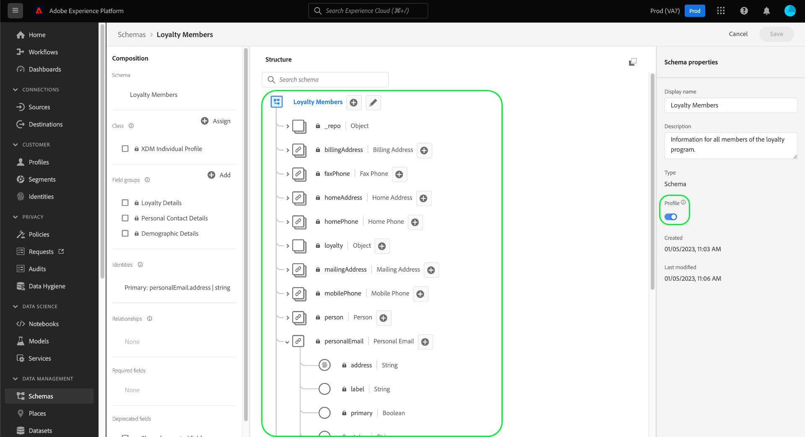

# 使用 [!DNL Schema Editor] {#relationship-ui}

>[!CONTEXTUALHELP]
>id="platform_schemas_relationships"
>title="結構關係"
>abstract="屬於不同類別的結構可透過關係欄位根據內容連結，讓您建立更複雜的分段規則。 如需結構關係的詳細資訊，請參閱本檔案。"

>[!CONTEXTUALHELP]
>id="platform_xdm_1to1_reference_schema"
>title="參考結構"
>abstract="選擇要建立關係的架構。 此架構可以是與當前架構不同的類。 如需結構關係的詳細資訊，請參閱本檔案。"

>[!CONTEXTUALHELP]
>id="platform_xdm_1to1_identity_namespace"
>title="參考身分命名空間"
>abstract="參考架構的主要身分欄位的命名空間（類型）。 引用架構必須具有已建立的主標識欄位，才能參與關係。 如需結構關係的詳細資訊，請參閱本檔案。"

了解客戶之間的關係，以及客戶在不同管道與品牌互動的能力，是Adobe Experience Platform的重要一環。 在 [!DNL Experience Data Model] (XDM)結構可讓您對客戶資料獲得複雜的深入分析。

而架構關係則可透過使用聯合架構和 [!DNL Real-Time Customer Profile]，此欄位僅適用於共用相同類別的結構。 要在屬於不同類的兩個架構之間建立關係，必須將專用的關係欄位添加到源架構中，該源架構引用其他相關架構的標識。

本檔案提供教學課程，以使用 [!DNL Experience Platform] 使用者介面。 如需使用API定義結構關係的步驟，請參閱 [使用結構註冊表API定義關係](relationship-api.md).

>[!NOTE]
>
>如需在Adobe Real-time Customer Data Platform B2B版中建立多對一關係的步驟，請參閱 [建立B2B關係](./relationship-b2b.md).

## 快速入門

本教學課程需要深入了解 [!DNL XDM System] 和 [!DNL Experience Platform] UI。 開始本教學課程之前，請檢閱下列檔案：

* [XDM系統Experience Platform](../home.md):XDM及其實作概述 [!DNL Experience Platform].
* [結構構成基本概念](../schema/composition.md):介紹XDM結構的建置組塊。
* [使用 [!DNL Schema Editor]](create-schema-ui.md):本教學課程說明使用 [!DNL Schema Editor].

## 定義源和引用架構

您應已建立將在關係中定義的兩個結構。 為了示範，本教學課程會建立組織忠誠計畫成員之間的關係(定義於[!DNL Loyalty Members]」)及其最愛的酒店(定義於「[!DNL Hotels]&quot;架構)。

>[!IMPORTANT]
>
>若要建立關係，兩個結構都必須定義主要身分，並啟用 [!DNL Real-Time Customer Profile]. 請參閱 [啟用結構以用於配置檔案](./create-schema-ui.md#profile) 如果您需要如何據以設定結構的指引，請參閱結構建立教學課程。

架構關係由 **來源綱要** 指向 **參考綱要**. 在下列步驟中，「[!DNL Loyalty Members]&quot;將是源架構，而&quot;[!DNL Hotels]「 」將作為參考架構。

在定義關係之前，以下幾節將說明本教學課程中使用的每個架構的結構。

### [!DNL Loyalty Members] 綱要

源架構「[!DNL Loyalty Members]」是以 [!DNL XDM Individual Profile] 類別，包含描述忠誠計畫成員的欄位。 其中一個領域， `personalEmail.addess`，可做為結構的主要身分，位於 [!UICONTROL 電子郵件] 命名空間。 如下所示 **[!UICONTROL 架構屬性]**，此架構可在 [!DNL Real-Time Customer Profile].

### [!DNL Hotels] 綱要

引用架構「[!DNL Hotels]「 」是以自訂「[!DNL Hotels]」類，包含描述酒店的欄位。 為了參與關係，引用架構還必須定義主標識，並為 [!UICONTROL 設定檔]. 在這種情況下， `_tenantId.hotelId`使用自訂「[!DNL Hotel ID]「身分命名空間。

>[!NOTE]
>
>若要了解如何建立自訂身分識別命名空間，請參閱 [Identity服務檔案](../../identity-service/namespaces.md#manage-namespaces).

## 建立關係欄位組

>[!NOTE]
>
>只有在源架構沒有專用的字串類型欄位用作指向引用架構的主要標識的指針時，才需要執行此步驟。 如果源架構中已定義此欄位，請跳到 [定義關係欄位](#relationship-field).

為了定義兩個架構之間的關係，源架構必須有一個專用欄位，該欄位將指示引用架構的主要身份。 通過建立新架構欄位組或擴展現有架構欄位組，可以將此欄位添加到源架構。

若 [!DNL Loyalty Members] 綱要，新 `preferredHotel` 欄位將會新增，以指出忠誠會員在公司造訪時偏好的酒店。 首先，選取加號圖示(**+**)。

畫布中會顯示新欄位預留位置。 在 **[!UICONTROL 欄位屬性]**，請提供欄位名稱和顯示名稱，並將其類型設為「[!UICONTROL 字串]」。 在 **[!UICONTROL 指派給]**，選擇要擴展的現有欄位組，或鍵入唯一名稱以建立新欄位組。 在此案例中，新「[!DNL Preferred Hotel]「 」欄位組已建立。

完成後，請選取 **[!UICONTROL 套用]**.

已更新 `preferredHotel` 欄位會顯示在畫布中，位於 `_tenantId` 物件，因為它是自訂欄位。 選擇 **[!UICONTROL 儲存]** 完成對架構的變更。

## 為源架構定義關係欄位 {#relationship-field}

在源架構定義了專用的引用欄位後，您可以將其指定為關係欄位。

>[!NOTE]
>
>下列步驟說明如何使用畫布中的右欄控制項來定義關係欄位。 如果您有Real-Time CDP B2B Edition的存取權，您也可以使用 [相同對話](./relationship-b2b.md#relationship-field) 和建立多對一關係時一樣。

選取 `preferredHotel` 欄位，然後向下捲動 **[!UICONTROL 欄位屬性]** 直到 **[!UICONTROL 關係]** 複選框。 選取核取方塊以顯示設定關係欄位所需的參數。

選取下拉式清單 **[!UICONTROL 參考結構]** 並選擇關係的引用架構(&quot;[!DNL Hotels]&quot;)。 在 **[!UICONTROL 參考身分命名空間]**，請選取參考架構之身分欄位的命名空間(在此例中為「[!DNL Hotel ID]「)。 選擇 **[!UICONTROL 套用]** 完成時。

此 `preferredHotel` 欄位現在會在畫布中以關係的形式強調顯示，並顯示參考架構的名稱。 選擇 **[!UICONTROL 儲存]** 以儲存變更並完成工作流程。

## 後續步驟

依照本教學課程，您已使用 [!DNL Schema Editor]. 如需如何使用API定義關係的步驟，請參閱 [使用結構註冊表API定義關係](relationship-api.md).
