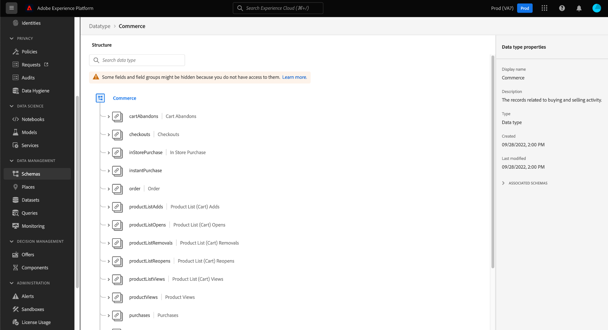

# 探索UI中的結構描述資源

在Adobe Experience Platform中，所有體驗資料模型(XDM)結構描述資源都會儲存在 [!DNL Schema Library]，包括Adobe提供的標準資源及貴組織定義的自訂資源。 在Experience PlatformUI中，您可以檢視中任何現有結構、類別、欄位群組或資料型別的結構和欄位 [!DNL Schema Library]. 這在計畫和準備資料擷取時特別有用，因為UI會提供關於這些XDM資源提供的每個欄位的預期資料型別和使用案例的資訊。

本教學課程涵蓋在Experience PlatformUI中探索現有結構描述、類別、欄位群組和資料型別的步驟。

## 查詢結構描述資源 {#lookup}

在Platform UI中選取 **[!UICONTROL 方案]** ，位於左側導覽器中。 此 [!UICONTROL 方案] 工作區提供 **[!UICONTROL 瀏覽]** 索引標籤以探索您組織中的所有結構描述，以及其他用於探索的專用索引標籤 **[!UICONTROL 類別]**， **[!UICONTROL 欄位群組]**、和 **[!UICONTROL 資料型別]** （分別）。

篩選圖示()在左側邊欄中顯示控制項，以縮小列出的結果。 顯示的控制項會因所列的資源型別而異。

例如，若要篩選清單以僅顯示Adobe提供的標準資料型別，請選取 **[!UICONTROL 資料型別]** 和 **[!UICONTROL Adobe]** 在 **[!UICONTROL 型別]** 和 **[!UICONTROL 所有者]** 區段。

此 **[!UICONTROL 包含在設定檔中]** 切換可讓您篩選結果，只顯示用於已啟用「 」以供使用的結構描述的資源 [即時客戶個人檔案](../../profile/home.md). 此 **[!UICONTROL 顯示臨時結構描述]** 切換篩選使用名稱空間僅供單一資料集使用的欄位建立的結構描述清單。

![此 [!UICONTROL 方案] 工作區 [!UICONTROL 瀏覽] 索引標籤中反白顯示篩選面板。](../images/ui/explore/filter.png)

當資源列在 **[!UICONTROL 類別]**， **[!UICONTROL 欄位群組]**，或 **[!UICONTROL 資料型別]** 標籤，您可以選取 **[!UICONTROL Adobe]** 以僅顯示標準資源或 **[!UICONTROL 客戶]** 以僅顯示貴組織建立的資源。

您也可以使用搜尋列進一步縮小結果的範圍。

搜尋結果中顯示的資源會先依標題比對排序，然後依說明比對排序。 反過來，符合這些類別的單字越多，資源在清單中顯示的位置就越高。

找到要探索的資源後，從清單中選取其名稱，以在畫布中檢視其結構。

## 在畫布中探索XDM資源 {#explore}

選取資源後，其結構會在畫布中開啟。

所有包含子屬性的物件型別欄位首次出現在畫布中時，預設會收合。 若要顯示任何欄位的子屬性，請選取其名稱旁的圖示。

### 系統產生的欄位 {#system-fields}

有些欄位名稱的前置字元為底線，例如 `_repo` 和 `_id`. 這些代表系統將在擷取資料時自動產生並指派之欄位的預留位置。

因此，大部分這些欄位在擷取至Platform時應從資料結構中排除。 此規則的主要例外為 [`_{TENANT_ID}` 欄位](../api/getting-started.md#know-your-tenant_id)，貴組織下建立的所有XDM欄位都必須命名於此。

### 資料類型 {#data-types}

對於畫布中顯示的每個欄位，其對應的資料型別會顯示在名稱旁邊，以指出該欄位預期擷取的資料型別。

任何附加了方括弧(`[]`)代表該特定資料型別的陣列。 例如，資料型別為 **[!UICONTROL 字串]\[]** 表示欄位需要字串值的陣列。 資料型別 **[!UICONTROL 付款專案]\[]** 表示符合下列條件的物件陣列： [!UICONTROL 付款專案] 資料型別。

如果陣列欄位是以物件型別為基礎，您可以在畫布中選取其圖示，以顯示每個陣列專案的預期屬性。

### [!UICONTROL 欄位屬性] {#field-properties}

當您選取畫布中任何欄位的名稱時，右側欄會更新，顯示底下該欄位的詳細資訊 **[!UICONTROL 欄位屬性]**. 其中包括欄位預期使用案例、預設值、模式、格式、欄位是否為必填等內容的說明。

如果您要檢查的欄位是列舉欄位，右側邊欄也會顯示欄位預期會收到的可接受值。

### 身分欄位 {#identity}

檢查包含身分欄位的結構描述時，這些欄位會列在左側邊欄中，位於類別或欄位群組（提供這些欄位給結構描述）下方。 在左側邊欄中選取身分欄位名稱，以顯示畫布中的欄位，無論其巢狀深度為何。

身分欄位在畫布中會以指紋圖示強調顯示()。 如果您選取身分欄位名稱，則可檢視其他資訊，例如 [身分名稱空間](../../identity-service/features/namespaces.md) 以及欄位是否為結構描述的主要身分。

>[!NOTE]
>
>請參閱以下指南： [定義身分欄位](./fields/identity.md) 以取得身分欄位及其與下游Platform服務關係的詳細資訊。

### 關係欄位 {#relationship}

如果您檢查包含關係欄位的結構描述，該欄位將會列在下的左側邊欄中 **[!UICONTROL 關係]**. 在左側邊欄中選取關係欄位名稱，以顯示畫布中的欄位，無論其巢狀深度為何。

關聯性欄位在畫布中也以唯一方式反白顯示，顯示該欄位連結到的參考結構描述名稱。 如果您選取關係欄位的名稱，即可在右側邊欄中檢視參照結構描述主要身分的身分名稱空間。

>[!NOTE]
>
>請參閱上的教學課程 [在UI中建立關係](../tutorials/relationship-ui.md) 以取得在XDM結構描述中使用關係的詳細資訊。

## 後續步驟

本檔案說明如何在Experience Platform UI中探索現有的XDM資源。 有關不同功能的詳細資訊， [!UICONTROL 方案] 工作區和 [!DNL Schema Editor]，請參閱 [[!UICONTROL 方案] 工作區概觀](./overview.md).
