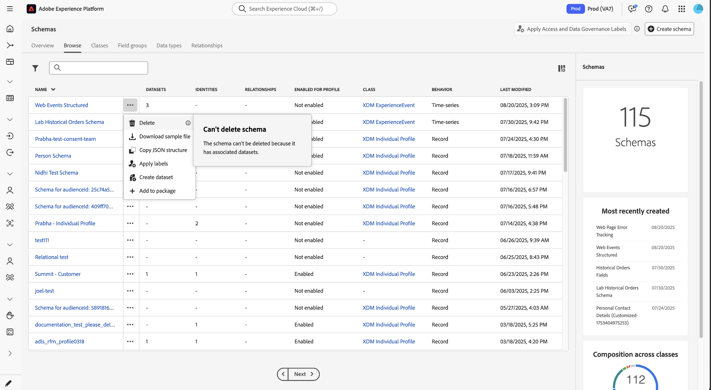
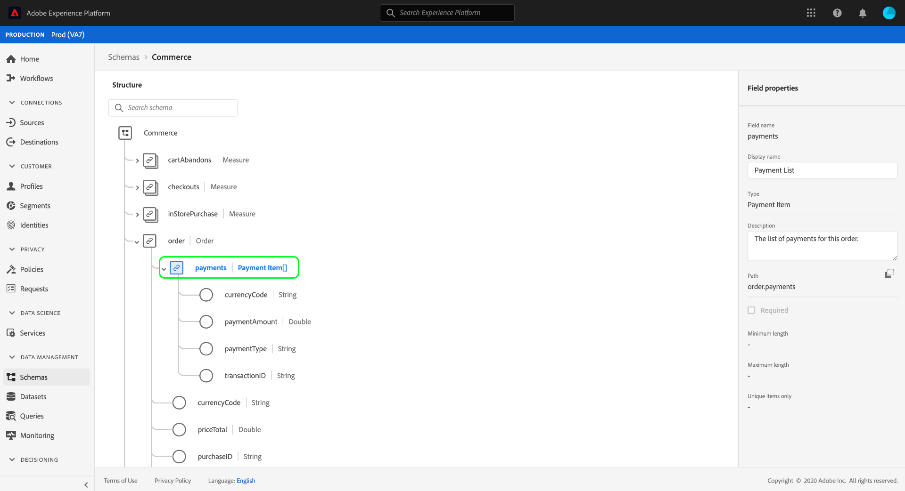
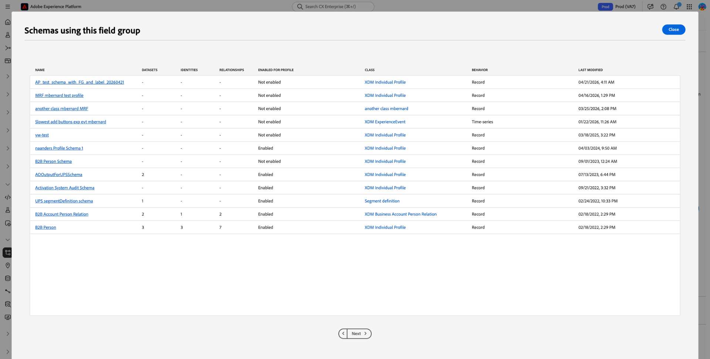

# 探索UI中的結構描述資源

在Adobe Experience Platform中，所有Experience Data Model (XDM)結構描述資源都儲存在[!DNL Schema Library]中，包括Adobe提供的標準資源以及您組織定義的自訂資源。 在Experience Platform UI中，您可以檢視[!DNL Schema Library]中任何現有結構描述、類別、欄位群組或資料型別的結構和欄位。 這在計畫和準備資料擷取時特別有用，因為UI會提供關於這些XDM資源提供的每個欄位的預期資料型別和使用案例的資訊。

本教學課程涵蓋在Experience Platform UI中探索現有結構描述、類別、欄位群組和資料型別的步驟。

## 查詢結構描述資源 {#lookup}

在Experience Platform UI中，選取左側導覽中的&#x200B;**[!UICONTROL Schemas]**。 [!UICONTROL Schemas]工作區提供&#x200B;**[!UICONTROL Browse]**&#x200B;索引標籤以探索您組織中的所有結構描述，以及其他專用索引標籤以分別探索&#x200B;**[!UICONTROL Classes]**、**[!UICONTROL Field groups]**、**[!UICONTROL Data types]**&#x200B;和&#x200B;**[!UICONTROL Relationships]**。

篩選圖示（）在左側邊欄中顯示控制項，以縮小列出的結果。 資源篩選器可分別用於&#x200B;**[!UICONTROL Browse]**&#x200B;和&#x200B;**[!UICONTROL Relationships]**&#x200B;標籤上的結構描述和關係。 在&#x200B;**[!UICONTROL Field groups]**&#x200B;索引標籤上，使用[欄位群組中繼資料和篩選](#field-group-metadata-and-filtering)中說明的篩選，依相容的類別和產業標籤來縮小清單。

在[!UICONTROL Schemas]工作區的[!UICONTROL Browse]索引標籤上，您可以篩選結構描述詳細目錄。 使用&#x200B;**[!UICONTROL Included in Profile]**&#x200B;切換可僅顯示已啟用在[即時客戶個人檔案](../../profile/home.md)中使用的結構描述。 使用&#x200B;**[!UICONTROL Show adhoc schemas]**&#x200B;切換來篩選使用名稱空間為僅供單一資料集使用的欄位建立的結構描述清單。

![反白顯示篩選面板的[!UICONTROL Schemas]工作區[!UICONTROL Browse]索引標籤。](../images/ui/explore/filters.png)

在[!UICONTROL Schemas]工作區的[!UICONTROL Relationship]標籤上，您可以根據四個條件篩選關係清單。 篩選器包括[!UICONTROL Source schema]、[!UICONTROL Destination schema]、[!UICONTROL Source class]和[!UICONTROL Destination class]。 下表提供篩選的說明。

| 篩選 | 說明 |
|-----------------------------------|------------|
| [!UICONTROL Source schema] | 若要檢視所選結構描述是起點或「來源」的所有關係，請從[!UICONTROL Source schema]下拉式選單中選取結構描述。 |
| [!UICONTROL Destination schema] | 若要檢視所選結構描述為目標或「目的地」的所有關係，請從[!UICONTROL Destination schema]下拉式選單中選取結構描述。 |
| [!UICONTROL Source class] | 若要根據起始結構描述的類別篩選關係，請從[!UICONTROL Source class]下拉式選單中選取類別。 |
| [!UICONTROL Destination class] | 若要顯示以特定類別的結構描述結尾的關係，請從[!UICONTROL Destination class]下拉式選單中選取類別。 |

{style="table-layout:auto"}

![反白顯示篩選區段的[關係]索引標籤。](../images/ui/explore/relationships-filter.png)

您也可以使用搜尋列進一步縮小結果的範圍。

![搜尋欄位反白顯示的[結構描述]工作區的[瀏覽]索引標籤。](../images/ui/explore/search.png)

搜尋結果中顯示的資源會先依標題比對排序，然後依說明比對排序。 反過來，符合這些類別的單字越多，資源在清單中顯示的位置就越高。

找到要探索的資源後，從清單中選取其名稱，以在畫布中檢視其結構。

## 管理結構描述、類別、欄位群組和資料型別：動作和刪除 {#xdm-resource-actions}

當您需要管理或刪除XDM資源，或動作（例如刪除）無法使用，而您需要瞭解原因時，請使用此區段。

### 在何處尋找動作（內嵌與詳細資訊頁面） {#where-to-find-actions}

若要執行刪除、匯出或複製資源等動作，請使用下列其中一個進入點：

在&#x200B;**[!UICONTROL Browse]**、**[!UICONTROL Classes]**、**[!UICONTROL Field groups]**&#x200B;和&#x200B;**[!UICONTROL Data types]**&#x200B;索引標籤上，管理動作在兩個位置都可使用：

- **內嵌在資料表**&#x200B;中：每個資源列都包含一個動作功能表（例如，**[!UICONTROL …]**），可讓您直接存取可用的動作。

- **資源詳細檢視**：若要存取詳細檢視中的完整動作，您必須選取&#x200B;**自訂（租使用者定義的）**&#x200B;資源。 標準（Adobe提供）資源的動作有限，不會顯示刪除、複製JSON結構或新增到封裝等選項。 從詳細目錄選取自訂資源以開啟其詳細資料檢視，然後使用頁面標頭中的&#x200B;**[!UICONTROL More]**&#x200B;功能表來存取相同的可用動作。

![資源詳細資料檢視標題顯示[更多]功能表，其中包含可用的動作，例如[刪除]、[複製JSON結構]和[下載範例檔案]。](../images/ui/explore/more-actions.png)

這些動作在支援的資源型別（結構描述、類別、欄位群組和資料型別）的兩個進入點之間是一致的。

### 可用動作 {#available-actions}

根據資源型別和您的許可權，可能提供下列動作：

- **[!UICONTROL Delete]** — 從您的組織永久移除自訂資源（當限制允許時）。 如果封鎖刪除，請參閱[限制](#delete-constraints)。
- **[!UICONTROL Download sample file]** — 根據資源結構產生範例資料檔案。 逐步： [產生範例XDM資料](./sample.md)。
- **[!UICONTROL Copy JSON structure]** — 複製JSON格式的資源定義，以重複使用、匯出或檢查。 逐步： [匯出XDM結構描述](./export.md)。
- **[!UICONTROL Add to package]** — 將資源包含在沙箱套件中，以便跨沙箱匯出或匯入。 逐步執行：[將物件匯出至封裝](../../sandboxes/ui/sandbox-tooling.md#export-objects)。

下列專案適用於不同的資源型別：

- 對於&#x200B;**自訂（租使用者定義的）**&#x200B;結構描述、類別、欄位群組和資料型別，上述所有動作都可使用。
- 針對&#x200B;**標準（Adobe定義）**&#x200B;類別、欄位群組和資料型別：
   - 只有&#x200B;**[!UICONTROL Download sample file]**&#x200B;可用。
   - **刪除**、**複製JSON結構**&#x200B;和&#x200B;**新增至封裝**&#x200B;無法使用。

### 刪除行為 {#delete-behavior}

當您想要移除不再需要的自訂資源時，請使用&#x200B;**[!UICONTROL Delete]**&#x200B;動作。

>[!IMPORTANT]
>
> 刪除資源會將其從組織中永久移除，且無法復原。 由於使用方式、許可權或系統限制，無法刪除某些資源。

若要刪除資源：

1. 在表格中找出資源或開啟其詳細資料檢視。
2. 選取動作功能表（**[!UICONTROL …]**&#x200B;或&#x200B;**[!UICONTROL More]**）。
3. 選擇「**[!UICONTROL Delete]**」。
4. 再次選取&#x200B;**[!UICONTROL Delete]**，確認對話方塊中的動作。

資源在確認後將從您的組織中永久移除。

如果資源無法進行刪除，此選項會以工具提示的形式顯示並停用，說明無法執行動作的原因。

### 限制（資料集、設定檔、RBAC、租使用者與全域） {#delete-constraints}

如果無法使用或停用&#x200B;**[!UICONTROL Delete]**&#x200B;等動作，通常是因為下列條件之一：

- **許可權(RBAC)**：您必須有必要的許可權（例如&#x200B;**[!UICONTROL Manage Schemas]**）才能執行管理動作。 如果缺少許可權，動作會顯示為停用，並附上工具提示。 若要瞭解許可權的設定方式，請參閱[存取控制UI概觀](../../access-control/ui/overview.md)。

- **資料集關聯**：無法刪除一或多個資料集所使用的資源（例如與資料集關聯的結構描述）。 若要識別及移除資料集相依性，請參閱[刪除資料集](../../catalog/datasets/user-guide.md#delete)。

- **設定檔啟用**：無法刪除為即時客戶設定檔啟用的結構描述。 如需設定檔啟用如何影響結構描述的指引，請參閱[規劃即時客戶設定檔啟用](../schema/profile-enablement-planning.md)。

- **租使用者與全域資源**：可以刪除租使用者定義的（自訂）資源（受條件約束），但無法刪除標準（Adobe提供的）類別、欄位群組和資料型別。

這些限制會直接反映在UI中。 當動作無法使用時，其會顯示為停用，並包含說明特定限制的工具提示。

如果您無法刪除資源，請檢閱上述條件以決定您是否需要更新許可權、移除相依性或調整您的資料模型。

如需畫布中的其他結構描述編輯工作流程，請參閱[在UI中建立和編輯結構描述](./resources/schemas.md)。

## 在畫布中探索XDM資源 {#explore}

選取資源後，其結構會在畫布中開啟。

所有包含子屬性的物件型別欄位首次出現在畫布中時，預設會收合。 若要顯示任何欄位的子屬性，請選取其名稱旁的圖示。

### 標準類別和欄位群組指標 {#standard-class-and-field-group-indicator}

在結構描述編輯器中，標準（Adobe產生的）類別和欄位群組會以掛鎖圖示（）表示。掛鎖會顯示在類別或欄位群組名稱旁的左側邊欄中，也會顯示在架構圖表中，屬於系統產生資源之一部分的任何欄位旁邊。

請參閱[將自訂欄位新增到標準欄位群組](./resources/schemas.md)檔案以取得指引。 您無法編輯標準類別。

### 系統產生的欄位 {#system-fields}

某些欄位名稱的前置字元為底線，例如`_repo`和`_id`。 這些代表系統將在擷取資料時自動產生並指派之欄位的預留位置。

因此，大部分這些欄位在擷取至Experience Platform時應該從資料結構中排除。 此規則的主要例外是[`_{TENANT_ID}`欄位](../api/getting-started.md#know-your-tenant_id)，在您組織下建立的所有XDM欄位都必須位於該欄位之下。

### 資料類型 {#data-types}

對於畫布中顯示的每個欄位，其對應的資料型別會顯示在名稱旁邊，以指出該欄位預期擷取的資料型別。

任何附加了方括弧(`[]`)的資料型別都代表該特定資料型別的陣列。 例如，**[!UICONTROL String]\[]**&#x200B;的資料型別表示欄位需要字串值的陣列。 **[!UICONTROL Payment Item]\[]**&#x200B;的資料型別表示符合[!UICONTROL Payment Item]資料型別的物件陣列。

如果陣列欄位是以物件型別為基礎，您可以在畫布中選取其圖示，以顯示每個陣列專案的預期屬性。

### [!UICONTROL Field properties] {#field-properties}

當您選取畫布中任何欄位的名稱時，右邊欄會更新，以在&#x200B;**[!UICONTROL Field properties]**&#x200B;下顯示該欄位的詳細資訊。 其中包括欄位預期使用案例、預設值、模式、格式、是否需要欄位等的說明。 當您探索欄位群組時，所選欄位的標籤相關詳細資料也會顯示在這裡；請參閱結構檢視中的[標籤](#field-group-labels-in-structure)。

如果您要檢查的欄位是列舉欄位，右側邊欄也會顯示欄位預期會收到的可接受值。

### 身分識別欄位 {#identity}

檢查包含身分欄位的結構描述時，這些欄位會列在左側邊欄中，位於類別或欄位群組（提供這些欄位給結構描述）下方。 在左側邊欄中選取身分欄位名稱，以顯示畫布中的欄位，無論其巢狀深度為何。

畫布中的身分欄位會以指紋圖示（）強調顯示。 如果您選取身分欄位名稱，則可以檢視其他資訊，例如[身分名稱空間](../../identity-service/features/namespaces.md)，以及該欄位是否為結構描述的主要身分。

>[!NOTE]
>
>請參閱[定義身分欄位](./fields/identity.md)的指南，以取得身分欄位及其與下游Experience Platform服務關係的詳細資訊。

### 關係欄位 {#relationship}

如果您要檢查包含關聯性欄位的結構描述，該欄位將會列在&#x200B;**[!UICONTROL Relationships]**&#x200B;下的左側邊欄中。 在左側邊欄中選取關係欄位名稱，以顯示畫布中的欄位，無論其巢狀深度為何。 關聯性欄位在畫布中也以唯一方式反白顯示，顯示該欄位連結到的參考結構描述名稱。 對於具有B2B功能的組織，在這些情況下，可以寫入自訂關係名稱並將顯示在畫布上。

若要檢視參考結構描述主要身分的身分名稱空間，請選取關聯性欄位，然後在[!UICONTROL Field properties]側邊欄中選取&#x200B;**[!UICONTROL Edit relationship]**。 關聯性的引數會顯示在顯示的[!UICONTROL Edit relationship]對話方塊中。

![顯示關聯性引數的[編輯關聯性]對話方塊。](../images/ui/explore/edit-relationship-dialog.png)

請參閱有關[在UI](../tutorials/relationship-ui.md)中建立關聯性的教學課程，以瞭解在XDM結構描述中使用關聯性的詳細資訊。

## 探索欄位群組：使用和中繼資料 {#explore-field-groups}

瀏覽至&#x200B;**[!UICONTROL Schemas]** > **[!UICONTROL Field groups]**&#x200B;以探索欄位群組。 在&#x200B;**[!UICONTROL Field groups]**&#x200B;索引標籤中，其他功能可協助您瞭解欄位群組在不同結構描述中的使用位置及其包含的內容，例如相容性、必要欄位（會強制執行擷取要求）和治理訊號。

這些功能可幫助您在進行變更之前評估影響，並在架構設計期間更有效地識別相關欄位群組。

### 檢視欄位群組的結構描述使用情況 {#view-schema-usage-for-field-groups}

從&#x200B;**[!UICONTROL Field groups]**&#x200B;表格中，選取欄位群組以開啟其詳細資料檢視。 畫布會更新以顯示欄位群組結構，而屬性邊欄會顯示所選資源的相關額外資訊。

#### 使用此欄位群組的結構描述

在右側屬性邊欄中，**[!UICONTROL Schemas using this field group]**&#x200B;區段會列出目前包含欄位群組的結構描述。

- 如果欄位群組由三個或更少的結構描述使用，則會顯示所有結構描述名稱。
- 如果超過三個結構描述使用此清單，則只會顯示一些名稱，以及檢視完整清單的選項。

選取結構描述名稱，以在新索引標籤中開啟其詳細資料檢視，並檢查欄位群組在該結構描述中的實施方式。

#### 檢視更多和完整的結構描述清單

如果存在的結構描述多於可以內嵌顯示的結構描述，請選取&#x200B;**[!UICONTROL View more]**&#x200B;以開啟完整的對話方塊。

![使用此欄位群組區段的結構描述中的[檢視更多]選項。](../images/ui/explore/view-more-schemas.png)

**[!UICONTROL Schemas using this field group]**&#x200B;對話方塊隨即顯示，顯示使用欄位群組的完整結構描述清單。

在&#x200B;**[!UICONTROL Schemas using this field group]**&#x200B;對話方塊中，您可以：

- 瀏覽使用欄位群組的所有結構描述
- 翻閱大型結果集
- 選取結構描述，以在新索引標籤中開啟其詳細資料檢視

您可以檢視結構描述詳細資訊，例如，結構描述名稱、類別和其他屬性。

此工作流程僅適用於&#x200B;**影響分析和探索**。 它不會修改結構或欄位群組。 若要變更結構描述結構，請參閱[在UI中建立和編輯結構描述](./resources/schemas.md)。

### 欄位群組中繼資料和篩選 {#field-group-metadata-and-filtering}

**[!UICONTROL Field groups]**&#x200B;索引標籤提供中繼資料和篩選工具，協助您在選取欄位群組之前找到並評估欄位群組。

#### 瀏覽表格和篩選器

欄位群組清查表包含直接在清單檢視中公開中繼資料的其他欄，例如&#x200B;**[!UICONTROL Compatible classes]**，指示欄位群組可以套用至哪些類別。 欄位群組只能根據它們代表的資料行為（例如以記錄為基礎的或時間序列資料），新增到使用列出的相容類別之一的結構描述中。 當欄位群組與所有類別相容時，表格可能會顯示&#x200B;**[!UICONTROL All]**。 **[!UICONTROL Industry tags]**&#x200B;說明分類欄位群組以進行探索。

若要調整清單，請選取篩選圖示（）以開啟左側邊欄中的篩選面板。 下圖顯示左側邊欄中開啟的濾鏡面板。

![顯示相容類別、產業標籤和篩選面板的[欄位群組]索引標籤。](../images/ui/explore/field-group-filters.png)

在篩選器面板中，您可以：

- **[!UICONTROL Compatible classes]** — 使用下拉式清單，依類別相容性篩選欄位群組
- **[!UICONTROL Industry tags]** — 使用核取方塊依一或多個產業類別篩選

瀏覽時，在表格中選取一列以更新資訊邊欄。 資訊邊欄會顯示如相容類別和產業標籤等中繼資料，因此您不需要開啟欄位群組即可檢閱重要詳細資訊。

#### 欄位群組詳細資料中繼資料

開啟欄位群組時，屬性邊欄會顯示與資源相關的其他中繼資料。

屬性邊欄可顯示下列中繼資料：

- **[!UICONTROL Compatible classes]** — 欄位群組可以擴充的類別
- **[!UICONTROL Required attributes]** — 資料擷取期間欄位群組要求時，必須具有有效值的屬性。 需求取決於資料結構，而具有遺失或無效必要值的記錄無法驗證
- **[!UICONTROL Labels]** — 標籤未顯示在欄位群組層級。 選取欄位以在&#x200B;**[!UICONTROL Field properties]**&#x200B;邊欄中檢視標籤詳細資訊

此資訊可協助您在使用或修改欄位群組之前瞭解限制和需求。

#### 結構檢視中的標籤

當在畫布中開啟欄位群組時，您可以直接在結構中檢視標籤資訊。 選取設定圖示（） 並啟用&#x200B;**[!UICONTROL Show labels on tree]**&#x200B;以在畫布的欄位上顯示標籤指標。

在畫布中選取欄位以檢視&#x200B;**[!UICONTROL Field properties]**&#x200B;邊欄中的標籤詳細資訊，包括套用至該欄位的標籤。

標籤會依類別（例如身分和敏感標籤）分組，以顯示套用至資料的治理或存取相關限制。

這些指標僅供顯示，不會變更結構描述結構。 如需詳細資訊，請參閱[管理結構描述](../tutorials/labels.md)的資料使用標籤。

## 後續步驟

本檔案說明如何在Experience Platform UI中探索現有的XDM資源。 如需[!UICONTROL Schemas]工作區與[!DNL Schema Editor]之不同功能的詳細資訊，請參閱[[!UICONTROL Schemas]工作區概觀](./overview.md)。
