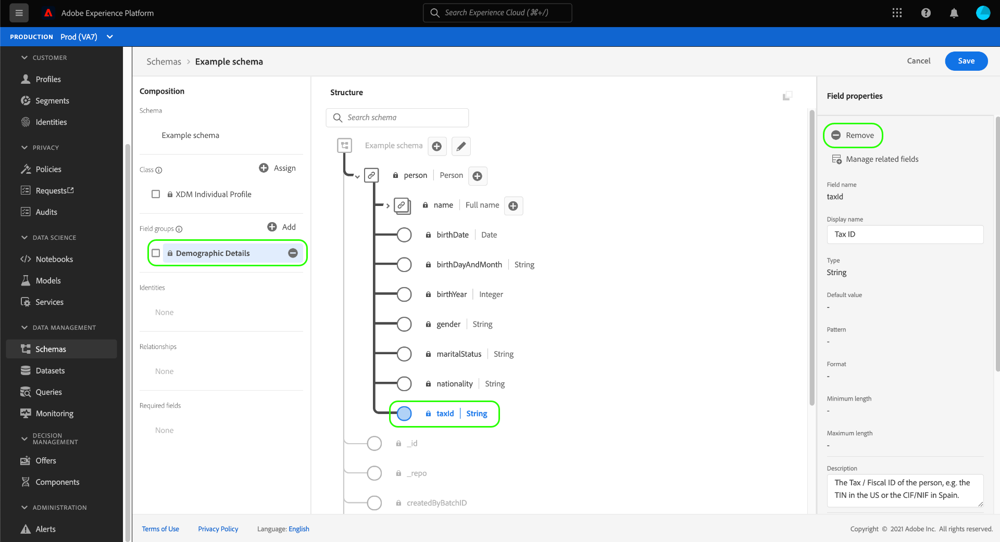

# 結構描述編輯器中的欄位式工作流程

Adobe Experience Platform提供一組強大的標準化功能 [欄位群組](../schema/composition.md#field-group) 用於Experience Data Model (XDM)結構描述。 這些欄位群組背後的結構和語意經過精心設計，以符合各種細分使用案例和Platform中其他下游應用程式。 您也可以定義自己的自訂欄位群組，以滿足獨特的業務需求。

將欄位群組新增到結構描述時，該結構描述會繼承該群組包含的所有欄位。 不過，您現在可以將個別欄位新增到結構描述中，而無需包含關聯的欄位群組中，您可能不一定要使用的其他欄位。

本指南說明在Platform UI中新增個別欄位至結構描述的不同方法。

## 先決條件

本教學課程假設您熟悉 [XDM結構描述的組成](../schema/composition.md) 以及如何在平台UI中使用結構描述編輯器。 若要繼續，您應該啟動以下流程： [建立新結構描述](./resources/schemas.md) 並將它指派給標準類別，再繼續本指南。

## 移除從標準欄位群組新增的欄位 {#remove-field-group}

將標準欄位群組新增到結構描述後，您可以移除任何您不需要的標準欄位。

>[!NOTE]
>
>從標準欄位群組中移除欄位只會影響正在處理的結構描述，不會影響欄位群組本身。 如果您移除一個結構描述中的標準欄位，這些欄位仍然可在採用相同欄位群組的所有其他結構描述中使用。

在以下範例中，標準欄位群組 **[!UICONTROL 人口統計細節]** 已新增至結構描述。 若要移除單一欄位，例如 `maritalStatus`，選取畫布中的欄位，然後選取「 」 **[!UICONTROL 移除]** 在右側邊欄中。

如果您想要移除多個欄位，可以整體管理欄位群組。 在畫布中選取屬於群組的欄位，然後選取 **[!UICONTROL 管理相關欄位]** 在右側邊欄中。

會出現一個對話方塊，顯示相關欄位群組的結構。 在此，您可以使用提供的核取方塊來選取或取消選取所需的欄位。 滿意後，選取 **[!UICONTROL 確認]**.

畫布會重新出現，架構結構中只會顯示選取的欄位。

## 直接將標準欄位新增到結構描述

您可以將標準欄位群組中的欄位直接新增到結構描述，而無需預先知道其對應的欄位群組。 若要將標準欄位新增到結構描述，請選取加號(**+**)圖示加以識別（位於畫布中的結構描述名稱旁）。 一個 **[!UICONTROL 未命名的欄位]** 結構描述結構中會顯示預留位置，而右側邊欄會更新，顯示設定欄位的控制項。

在 **[!UICONTROL 欄位名稱]**，開始輸入您要新增的欄位名稱。 系統會自動搜尋符合查詢的標準欄位，並將其列在下 **[!UICONTROL 建議的標準欄位]**，包括他們所屬的欄位群組。

雖然有些標準欄位會共用相同的名稱，但其結構可能會依其來源欄位群組而有所不同。 如果標準欄位巢狀內嵌在欄位群組結構的父物件中，則新增子欄位時，父欄位也會包含在結構描述中。

選取預覽圖示()，檢視其欄位群組的結構，並更能瞭解其巢狀結構。 若要將標準欄位新增到結構描述，請選取加號圖示()。

畫布更新以顯示新增到結構描述的標準欄位，包括它巢狀內嵌在欄位群組結構下的任何父欄位。 欄位群組的名稱也會列在 **[!UICONTROL 欄位群組]** 在左側邊欄中。 如果您想從相同的欄位群組新增更多欄位，請選取 **[!UICONTROL 管理相關欄位]** 在右側邊欄中。

## 直接將自訂欄位新增到結構描述

與標準欄位的工作流程類似，您也可以將自己的自訂欄位直接新增到結構描述。

若要將欄位新增至結構的根層級，請選取加號(**+**)圖示加以識別（位於畫布中的結構描述名稱旁）。 一個 **[!UICONTROL 未命名的欄位]** 結構描述結構中會顯示預留位置，而右側邊欄會更新，顯示設定欄位的控制項。

開始輸入您要新增的欄位名稱，系統就會自動開始搜尋相符的標準欄位。 若要建立新的自訂欄位，請選取最上方的附加選項 **([!UICONTROL 新欄位])**.

從這裡，提供欄位的顯示名稱和資料型別。 在 **[!UICONTROL 指派欄位群組]**，您必須選取要與新欄位產生關聯的欄位群組。 開始輸入欄位群組的名稱，如果您之前已輸入 [已建立自訂欄位群組](./resources/field-groups.md#create) 它們會顯示在下拉式清單中。 或者，您可以在欄位中輸入唯一名稱，以建立新的欄位群組。

>[!WARNING]
>
>如果您選取現有的自訂欄位群組，則採用該欄位群組的任何其他結構描述在您儲存變更後，也將繼承新新增的欄位。 因此，如果您想要此型別的傳輸，請僅選取現有的欄位群組。 否則，您應該選擇建立新的自訂欄位群組。

完成後，選取 **[!UICONTROL 套用]**.

新欄位會新增到畫布中，並在 [租使用者ID](../api/getting-started.md#know-your-tenant_id) 以避免與標準XDM欄位衝突。 與新欄位相關聯的欄位群組也會顯示在下方 **[!UICONTROL 欄位群組]** 在左側邊欄中。

>[!NOTE]
>
>依預設，所選自訂欄位群組提供的其餘欄位會從結構描述中移除。 如果要將其中一些欄位新增到結構描述中，請選取屬於群組的欄位，然後選取 **[!UICONTROL 管理相關欄位]** 在右側邊欄中。

### 將自訂欄位新增至標準欄位群組的結構

如果您使用的結構描述具有由標準欄位群組提供的物件型別欄位，您可以將自己的自訂欄位新增到該標準物件。 選取加號(**+**)圖示加以存取（位於物件的根目錄旁）。

>[!IMPORTANT]
>
>在一個結構描述中新增到欄位群組的任何欄位也會出現在採用相同欄位群組的所有其他結構描述中。

請參閱 [在UI指南中建立和編輯方案](./resources/schemas.md#custom-fields-for-standard-groups) 以取得新增自訂欄位的詳細資訊。

## 後續步驟

本指南涵蓋Platform UI中結構描述編輯器的全新欄位式工作流程。 如需在UI中管理綱要的詳細資訊，請參閱 [UI總覽](./overview.md).
