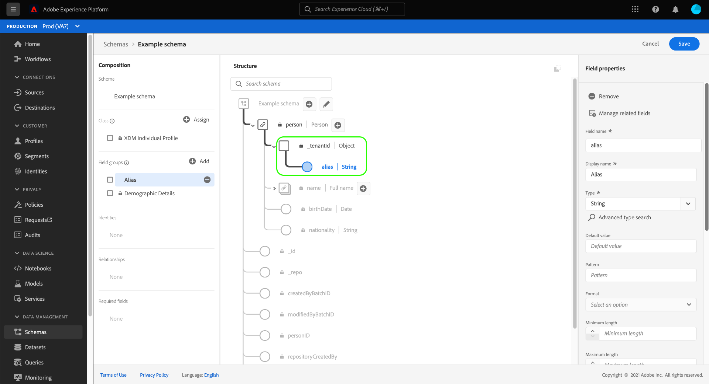

# 結構編輯器（測試版）中的欄位型工作流程

>[!IMPORTANT]
>
>本測試版檔案中描述的工作流程現在已可在Adobe Experience Platform中使用。 如需結構編輯器中欄位式工作流程的最新指引，請參閱 [結構UI指南](./resources/schemas.md) 。 本指南即將移除。

Adobe Experience Platform提供一套完善的標準化 [欄位群組](../schema/composition.md#field-group) 以用於Experience Data Model(XDM)結構。 這些欄位群組背後的結構和語義都經過精心定制，以滿足Platform中各種不同的細分使用案例和其他下游應用程式。 您也可以定義自己的自訂欄位群組，以滿足獨特的業務需求。

將欄位組添加到架構時，該架構將繼承該組中包含的所有欄位。 不過，您現在可以將個別欄位新增至您的結構，而不需要從相關聯的欄位群組加入其他欄位，您不一定會使用這些欄位。

本指南涵蓋將個別欄位新增至Platform UI結構的不同方法。

## 先決條件

本教學課程假設您熟悉 [XDM結構的構成](../schema/composition.md) 以及如何使用Platform UI中的結構編輯器。 接下來，您應開始 [建立新架構](./resources/schemas.md) 並將其指定給標準類，然後再繼續閱讀本指南。

## 移除從標準欄位群組新增的欄位 {#remove-field-group}

將標準欄位群組新增至結構後，您就可以移除任何您不需要的標準欄位。

>[!NOTE]
>
>從標準欄位組中刪除欄位只會影響正在處理的架構，而不會影響欄位組本身。 如果刪除一個架構中的標準欄位，則這些欄位仍可用於採用相同欄位群組的所有其他架構中。

在以下範例中，標準欄位群組 **[!UICONTROL 人口統計詳細資料]** 已新增至結構。 移除單一欄位，例如 `taxId`，選取畫布中的欄位，然後選取 **[!UICONTROL 移除]** 在右側邊欄。

如果要移除多個欄位，您可以整體管理欄位群組。 在畫布中選取屬於群組的欄位，然後選取 **[!UICONTROL 管理相關欄位]** 在右側邊欄。

將出現一個對話框，顯示有關欄位組的結構。 從這裡，您可以使用提供的核取方塊來選取或取消選取您需要的欄位。 滿足後，選擇 **[!UICONTROL 確認]**.

畫布會重新顯示，只有選取的欄位會顯示在架構結構中。

## 直接將標準欄位新增至結構

您可以直接將標準欄位群組中的欄位新增至結構，而不需要預先知道其對應的欄位群組。 若要將標準欄位新增至結構，請選取加號(**+**)圖示（位於畫布中結構名稱旁）。 安 **[!UICONTROL 無標題欄位]** 預留位置會顯示在架構結構中，而右側邊欄會更新，以顯示用以設定欄位的控制項。

在 **[!UICONTROL 欄位名稱]**，開始輸入您要新增的欄位名稱。 系統會自動搜尋符合查詢的標準欄位，並將其列在 **[!UICONTROL 建議的標準欄位]**，包括其所屬的欄位群組。

雖然某些標準欄位具有相同名稱，但其結構可能會因其來源欄位群組而異。 如果在欄位組結構中的父對象內嵌套了標準欄位，則如果添加了子欄位，則父欄位也將包含在架構中。

選取預覽圖示()，以檢視其欄位群組的結構，並更清楚了解其可能巢狀化的方式。 若要將標準欄位新增至結構，請選取加號圖示()。

畫布會更新，顯示新增至架構的標準欄位，包括欄位群組結構內巢狀的任何父欄位。 欄位群組的名稱也列在 **[!UICONTROL 欄位群組]** 在左側邊欄。 如果要從相同欄位群組新增更多欄位，請選取 **[!UICONTROL 管理相關欄位]** 在右側邊欄。

## 直接將自訂欄位新增至結構

與標準欄位的工作流程類似，您也可以將自己的自訂欄位直接新增至結構。

若要將欄位新增至架構的根層級，請選取加號(**+**)圖示（位於畫布中結構名稱旁）。 安 **[!UICONTROL 無標題欄位]** 預留位置會顯示在架構結構中，而右側邊欄會更新，以顯示用以設定欄位的控制項。

開始在要添加的欄位名稱中鍵入，系統會自動開始搜索匹配的標準欄位。 若要改為建立新自訂欄位，請選取附加在 **([!UICONTROL 新欄位])**.

從此處，提供欄位的顯示名稱和資料類型。 在 **[!UICONTROL 分配欄位組]**，您必須為要關聯的新欄位選取欄位群組。 開始鍵入欄位組的名稱，如果您之前 [建立自訂欄位群組](./resources/field-groups.md#create) 它們會出現在下拉式清單中。 或者，您也可以在欄位中輸入唯一名稱，以改為建立新欄位群組。

>[!WARNING]
>
>如果您選取現有的自訂欄位群組，則使用該欄位群組的任何其他結構也會在您儲存變更後繼承新新增的欄位。 因此，如果要此傳播類型，則僅選擇現有欄位組。 否則，您應該選擇建立新的自訂欄位群組。

完成後，請選取 **[!UICONTROL 套用]**.

新欄位會新增至畫布，並以您的 [租用戶ID](../api/getting-started.md#know-your-tenant_id) 以避免與標準XDM欄位衝突。 您與新欄位關聯的欄位群組也會顯示在 **[!UICONTROL 欄位群組]** 在左側邊欄。

>[!NOTE]
>
>依預設，所選自訂欄位群組提供的其餘欄位會從架構中移除。 如果要將其中一些欄位添加到架構，請選擇屬於該組的欄位，然後選擇 **[!UICONTROL 管理相關欄位]** 在右側邊欄。

### 將自訂欄位新增至標準欄位群組的結構

如果您正在處理的結構具有標準欄位組提供的對象類型欄位，則您可以將自己的自定義欄位添加到該標準對象。 選取加號(**+**)圖示，並在右側邊欄中提供自訂欄位的詳細資訊。

套用變更後，新欄位會顯示在標準物件的租用戶ID命名空間底下。 此巢狀命名空間可防止欄位群組本身內的欄位名稱衝突，以避免在使用相同欄位群組的其他結構中中斷變更。

## 後續步驟

本指南說明Platform UI中結構編輯器的新欄位式工作流程。 如需在UI中管理結構的詳細資訊，請參閱 [UI概述](./overview.md).
