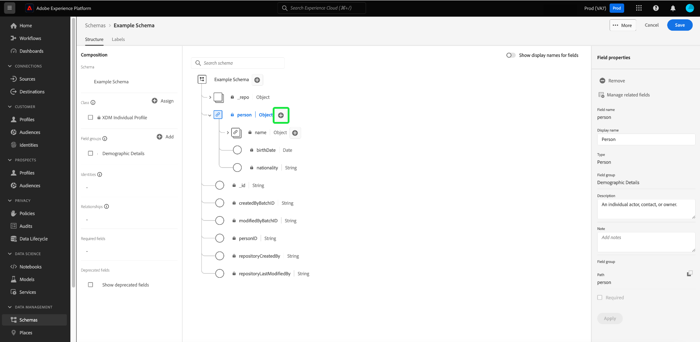

# 結構編輯器中的欄位型工作流程

Adobe Experience Platform提供一組完善的標準化[欄位群組](../schema/composition.md#field-group)，以用於Experience Data Model(XDM)結構。 這些欄位群組背後的結構和語義都經過精心定制，以滿足Platform中各種不同的細分使用案例和其他下游應用程式。 您也可以定義自己的自訂欄位群組，以滿足獨特的業務需求。

將欄位組添加到架構時，該架構將繼承該組中包含的所有欄位。 不過，您現在可以將個別欄位新增至您的結構，而不需要從相關聯的欄位群組加入其他欄位，您不一定會使用這些欄位。

本指南涵蓋將個別欄位新增至Platform UI結構的不同方法。

## 先決條件

本教學課程假設您熟悉XDM結構](../schema/composition.md)的[組成，以及如何在Platform UI中使用結構編輯器。 接下來，您應開始[建立新架構](./resources/schemas.md)並將其指派給標準類的過程，然後再繼續閱讀本指南。

## 移除從標準欄位群組新增的欄位

將標準欄位群組新增至結構後，您就可以移除任何您不需要的標準欄位。

>[!NOTE]
>
>從標準欄位組中刪除欄位只會影響正在處理的架構，而不會影響欄位組本身。 如果刪除一個架構中的標準欄位，則這些欄位仍可用於採用相同欄位群組的所有其他架構中。

在以下範例中，標準欄位群組&#x200B;**[!UICONTROL 人口統計詳細資料]**&#x200B;已新增至架構。 若要移除單一欄位，例如`taxId`，請選取畫布中的欄位，然後在右側邊欄中選取&#x200B;**[!UICONTROL Remove]**。

如果要移除多個欄位，您可以整體管理欄位群組。 在畫布中選取屬於群組的欄位，然後選取右側邊欄中的「管理相關欄位&#x200B;]**」 。**[!UICONTROL 

將出現一個對話框，顯示有關欄位組的結構。 從這裡，您可以使用提供的核取方塊來選取或取消選取您需要的欄位。 滿足後，選擇&#x200B;**[!UICONTROL 添加欄位]**。

畫布會重新顯示，只有選取的欄位會顯示在架構結構中。

## 直接將自訂欄位新增至結構

如果您先前已建立[自訂欄位群組](./resources/field-groups.md#create)，則可直接將自訂欄位新增至架構，而無須預先將自訂欄位個別新增至自訂欄位群組。

>[!WARNING]
>
>將自訂欄位新增至結構時，您仍必須選取現有的自訂欄位群組，才能與其關聯。 這表示若要直接將自訂欄位新增至結構，您至少必須先在您目前使用的沙箱中定義一個自訂欄位群組。 此外，使用該自訂欄位群組的任何其他結構也會在您儲存變更後繼承新新增的欄位。

若要將欄位新增至架構的根層級，請在畫布中選取架構名稱旁的加號(**+**)圖示。 架構結構中會顯示&#x200B;**[!UICONTROL 未命名欄位]**&#x200B;預留位置，而右側邊欄會更新，顯示用以設定欄位的控制項。

使用右側邊欄中的控制項來提供欄位的名稱、顯示名稱和資料類型。 在&#x200B;**[!UICONTROL 分配欄位組]**&#x200B;下，選擇要與新欄位關聯的自定義欄位組。

完成後，選擇&#x200B;**[!UICONTROL Apply]**。

新欄位會新增至畫布，並且會以您的[租用戶ID](../api/getting-started.md#know-your-tenant_id)命名，以避免與標準XDM欄位產生衝突。 您與新欄位相關聯的欄位群組也會顯示在左側欄的&#x200B;**[!UICONTROL 欄位群組]**&#x200B;下方。

>[!NOTE]
>
>依預設，所選自訂欄位群組提供的其餘欄位會從架構中移除。 如果要將其中一些欄位添加到架構中，請選擇屬於該組的欄位，然後在右側欄位中選擇&#x200B;**[!UICONTROL 管理相關欄位]**。

### 將欄位添加到標準欄位組的結構

如果您正在處理的結構具有標準欄位組提供的對象類型欄位，則您可以將自己的自定義欄位添加到該標準對象。 選取物件根目錄旁的加號(**+**)圖示，並在右側邊欄中提供自訂欄位的詳細資訊。

套用變更後，新欄位會顯示在標準物件的租用戶ID命名空間底下。 此巢狀命名空間可防止欄位群組本身內的欄位名稱衝突，以避免在使用相同欄位群組的其他結構中中斷變更。

## 後續步驟

本指南說明Platform UI中結構編輯器的新欄位式工作流程。 如需有關在UI中管理結構的詳細資訊，請參閱[UI概述](./overview.md)。
