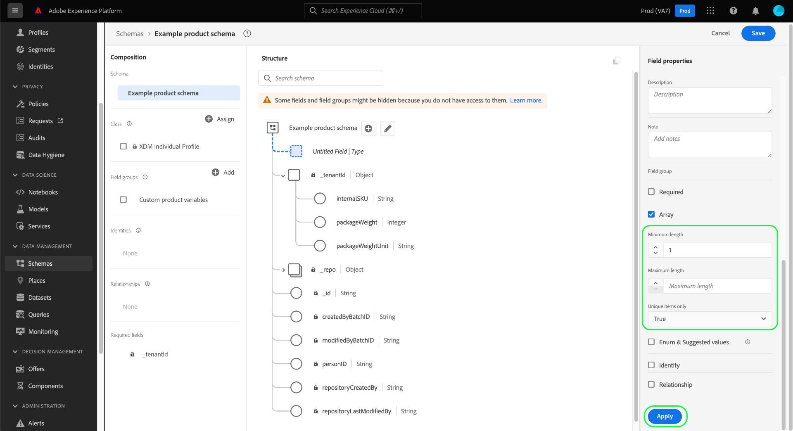

# 在UI中定義陣列欄位

在Adobe Experience Platform用戶介面中定義「體驗資料模型」(XDM)欄位時，可將該欄位指定為陣列。

陣列的內容取決於 [!UICONTROL 類型] 的下界。 例如，如果 [!UICONTROL 類型] 已設定為「[!UICONTROL 字串]&quot;，將該欄位設定為陣列將將該欄位指定為字串陣列。 如果欄位 [!UICONTROL 類型] 設定為多欄位資料類型，如「」[!UICONTROL 郵政地址]然後變成符合資料類型的郵政地址對象。

等你 [在UI中定義了新欄位](./overview.md#define)，可通過選擇 **[!UICONTROL 陣列]** 的子菜單。

選中該複選框後，右滑軌中會顯示附加控制項，允許您選擇進一步限制陣列。 如果不想強制執行特定約束，請將欄位留空。

陣列的其他配置控制如下：

| 欄位屬性 | 說明 |
| --- | --- |
| [!UICONTROL 最小長度] | 陣列必須包含的最小項數，才能成功接收。 |
| [!UICONTROL 長度上限] | 陣列必須包含的最大項數，才能成功接收。 |
| [!UICONTROL 僅唯一項] | 如果設定為「」[!UICONTROL 真]&quot;，陣列中的每個項必須唯一，才能成功接收。 |

{style="table-layout:auto"}

配置完欄位後，選擇 **[!UICONTROL 應用]** 將更改應用到架構。

畫布將更新以反映對欄位所做的更改。 請注意，畫布中欄位名稱旁邊顯示的資料類型後面附加了一對方括弧(`[]`)，表示該欄位表示該資料類型的陣列。

## 後續步驟

本指南介紹如何在UI中定義陣列欄位。 請參閱 [定義UI中的欄位](./overview.md#special) 瞭解如何在 [!DNL Schema Editor]。
