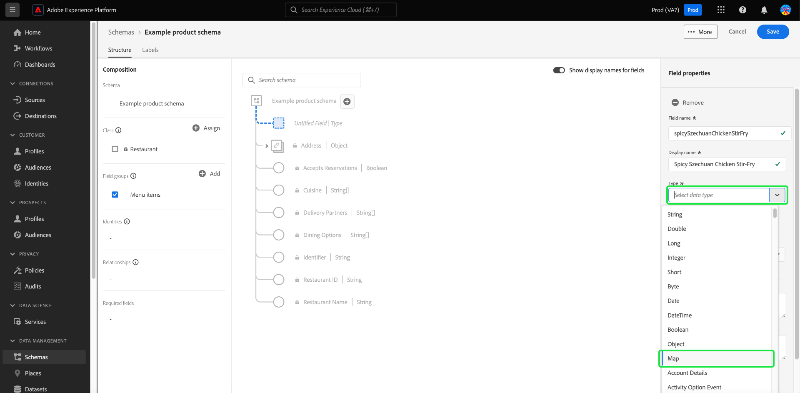

# 在使用者介面中定義對應欄位

Adobe Experience Platform可讓您完全自訂自訂Experience Data Model (XDM)類別、結構描述欄位群組和資料型別的結構。

您也可以在結構描述編輯器中定義對應欄位，以模型化和動態資料結構，或儲存索引鍵值配對的集合。 地圖資料結構允許根據唯一識別碼來組織和存取資訊的位置進行有效且快速的查詢、插入和刪除。

在Platform使用者介面(UI)中定義新欄位時，請使用 **[!UICONTROL 型別]** 下拉式清單並選取「**[!UICONTROL 地圖]**」從清單中。

A [!UICONTROL 對應值型別] 屬性隨即顯示。 此值須用於 [!UICONTROL 地圖] 資料型別。 對應的可用值包括 [!UICONTROL 字串] 和 [!UICONTROL 整數]. 從可用選項的下拉式清單中選取值。

![具有的結構描述編輯器 [!UICONTROL 對應值型別] 反白顯示的下拉式清單。](../../images/ui/fields/special/map-value-type.png)

設定好子欄位後，您必須將其指派給欄位群組。 使用 **[!UICONTROL 欄位群組]** 下拉式功能表或搜尋欄位，然後選取 **[!UICONTROL 套用]**. 您可以使用相同的程式繼續將欄位新增至物件，或選取 **[!UICONTROL 儲存]** 以確認您的設定。

>[!NOTE]
>
>Platform UI在擷取對應型別欄位索引鍵的方式上有所限制。 雖然物件型別欄位可以展開，但地圖會顯示為單一欄位。 透過結構描述登入API建立的對應欄位（非字串或整數資料型別）會顯示為&quot;[!UICONTROL 複雜]「資料型別。

## 後續步驟

閱讀本檔案後，您現在可以在Platform UI中定義對應欄位。 請記住，您只能使用類別和欄位群組來將欄位新增到結構描述。 若要進一步瞭解如何在UI中管理這些資源，請參閱建立和編輯指南 [類別](../resources/classes.md) 和 [欄位群組](../resources/field-groups.md).

如需功能的詳細資訊， [!UICONTROL 方案] 工作區，請參閱 [[!UICONTROL 方案] 工作區概觀](../overview.md).
