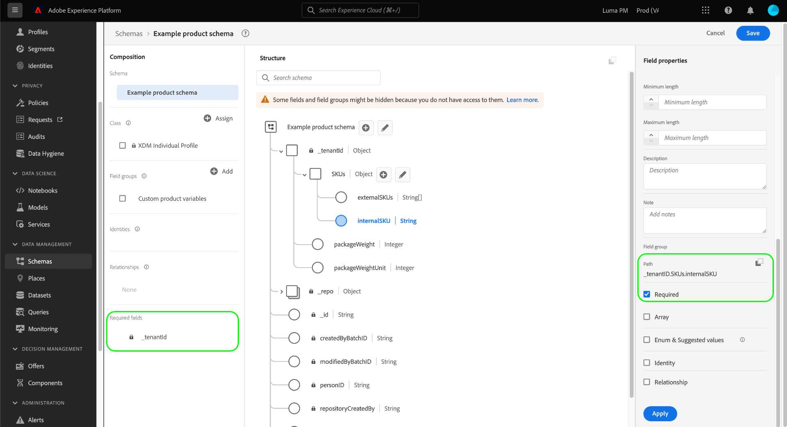

# 在UI中定義必填欄位

在Experience Data Model(XDM)中，必填欄位指出必須提供有效值，才能在資料擷取期間接受特定記錄或時間序列事件。 必要欄位的常見使用案例包括使用者身分資訊和時間戳記。

當在Adobe Experience Platform使用者介面中定義新欄位[時，您可以選取右側邊欄中的&#x200B;**[!UICONTROL 必要]**&#x200B;核取方塊，將其設為必要欄位。 ](./overview.md#define)選擇&#x200B;**[!UICONTROL Apply]**&#x200B;以將更改應用到架構。

如果欄位是租用戶ID物件下的根層級屬性，其路徑會立即顯示在左側邊欄的&#x200B;**[!UICONTROL 必填欄位]**&#x200B;下。

但是，如果將必填欄位巢狀內嵌在未標示為必要本身的物件中，則巢狀欄位不會顯示在左側邊欄的&#x200B;**[!UICONTROL 必填欄位]**&#x200B;下。

在以下範例中， `loyaltyId`欄位是根據需要設定的，但其父對象`loyalty`不是。 在此情況下，即使將子欄位`loyaltyId`標示為必要，如果在擷取資料時排除`loyalty`，也不會發生驗證錯誤。 換言之，雖然`loyalty`為選用項目，但在包含`loyaltyId`欄位的事件中必須包含欄位。

如果您希望結構中的巢狀欄位一律為必要欄位，您也必須視需要設定所有父欄位（租用戶ID物件除外）。

## 後續步驟

本指南說明如何在UI中定義必要欄位。 請參閱[定義UI](./overview.md#special)中欄位的概觀，了解如何定義[!DNL Schema Editor]中的其他XDM欄位類型。
