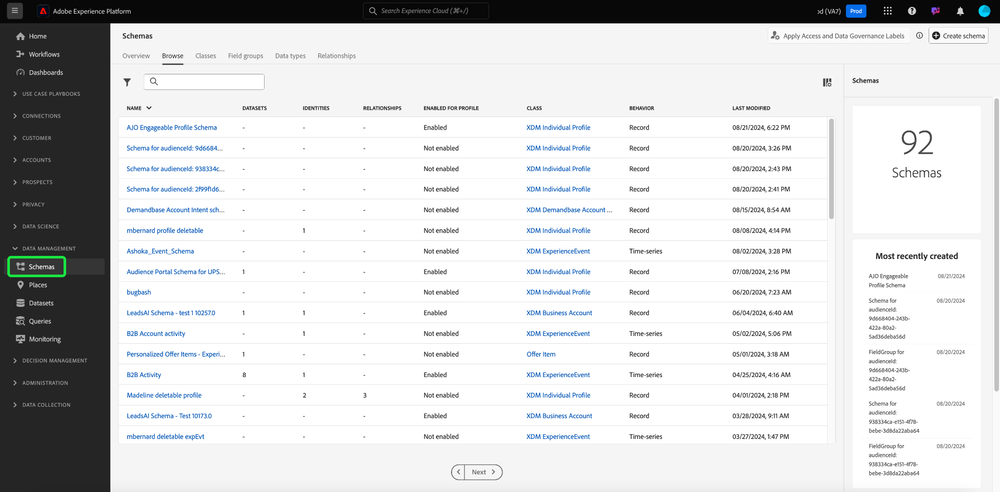

# [!UICONTROL Schemas] UI概觀

Adobe Experience Platform用戶介面中的[!UICONTROL Schemas]工作區允許您管理Experience Data Model(XDM)資源，包括方案、類、方案欄位組和資料類型。 您可以檢視和探索Adobe所提供的核心資源，並為您的組織建立自訂資源和結構。

若要存取平台UI中的工作區，請選取左側導軌中的&#x200B;**[!UICONTROL Schemas]**。

## 快速入門

如果您是第一次使用工作區，請從[中的指南開始，探索UI](./explore.md)中的現有資源，以熟悉不同的標籤和架構畫布。

還建議您按照[架構建立教程](../tutorials/create-schema-ui.md)建立示例架構，並獲得[!DNL Schema Editor]在進程中功能的完整指南。

## 建立和管理XDM資源

[!UICONTROL Schemas]工作區提供強大的工具，讓您建立和自訂組織的XDM資源。 請參閱以下文檔以瞭解如何在UI中建立和編輯每種資源類型：

* [結構描述](./resources/schemas.md)
* [類別](./resources/classes.md)
* [欄位群組](./resources/field-groups.md)
* [資料類型](./resources/data-types.md)

## 定義XDM欄位

類別、欄位群組和資料類型都會將欄位提供給架構。 在將欄位添加到這些資源時，可以從標準欄位類型清單中進行選擇，也可以為某些使用案例定義專用欄位。 有關詳細資訊，請參閱UI](./fields/overview.md)中[定義XDM欄位的指南。

## 後續步驟

本檔案提供平台UI中[!UICONTROL Schemas]工作區的簡介。 請參閱本概述中連結的檔案，以進一步瞭解如何管理您的架構和其他XDM資源。
