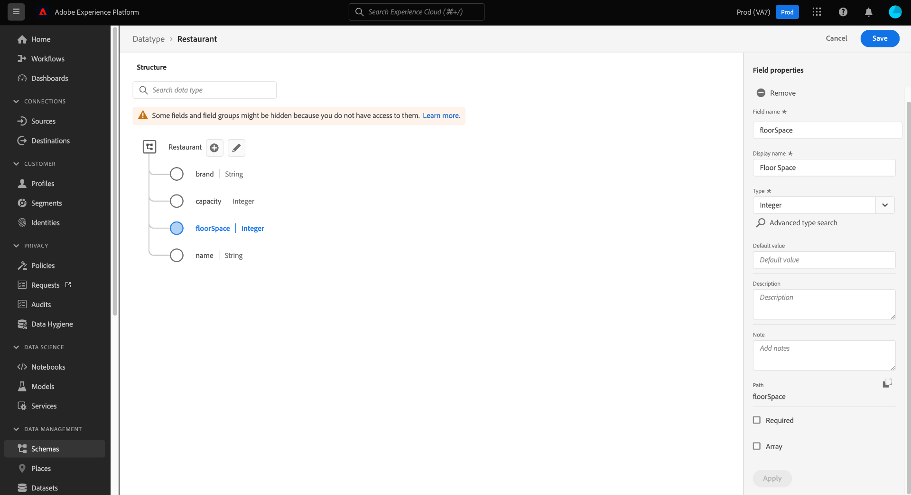

# 使用UI建立及編輯資料型別

在體驗資料模型(XDM)中，資料型別是包含多個子欄位的可重複使用欄位。 雖然與結構描述欄位群組類似，因為它們允許一致地使用多欄位結構，但資料型別更靈活，因為它們可以包含在結構描述結構中的任何位置，而欄位群組只能新增到根層級。

Adobe Experience Platform提供許多標準資料型別，可用於涵蓋各種常見的體驗管理使用案例。 不過，您也可以定義自己的自訂資料型別，以滿足獨特的業務需求。

本教學課程涵蓋在Platform使用者介面中建立和編輯自訂資料型別的步驟。

## 先決條件

本指南需要實際瞭解XDM系統。 請參閱 [XDM概觀](../../home.md) 介紹XDM在Experience Platform生態系統內的角色，以及 [結構描述組合基本概念](../../schema/composition.md) 瞭解資料型別對XDM結構描述的貢獻。

雖然本指南不需要，但建議您也參閱以下主題的相關教學課程： [在UI中構成結構描述](../../tutorials/create-schema-ui.md) 熟悉 [!DNL Schema Editor].

## 開啟 [!DNL Schema Editor] （資料型別）

在Platform UI中選取 **[!UICONTROL 結構描述]** 在左側導覽以開啟 [!UICONTROL 結構描述] 工作區，然後選取 **[!UICONTROL 資料型別]** 標籤。 隨即顯示可用資料型別清單，包括由Adobe定義的資料型別以及貴組織建立的資料型別。

從這裡，您有兩個選項：

- [建立新的資料型別](#create)
- [選取要編輯的現有資料型別](#edit)

### 建立新的資料型別 {#create}

從 **[!UICONTROL 資料型別]** 索引標籤，選取 **[!UICONTROL 建立資料型別]**.

此 [!DNL Schema Editor] 會出現，在畫布中顯示新資料型別的目前結構。 在編輯器的右側，您可以為資料型別提供顯示名稱和可選描述。 請確定您為資料型別提供唯一且簡潔的名稱，因為這是將資料型別新增至結構描述時識別資料型別的方式。

本教學課程會建立描述餐廳屬性的資料型別，因此該資料型別的顯示名稱為「餐廳」。

從這裡，您可以直接跳至 [下一節](#add-fields) 以開始將欄位新增至新資料型別。

### 編輯現有的資料型別

>[!NOTE]
>
>一旦在已啟用用於即時客戶個人檔案的結構描述中使用了現有的資料型別，此後只能對該資料型別進行非破壞性變更。 請參閱 [結構描述演化規則](../../schema/composition.md#evolution) 以取得詳細資訊。

只能編輯您的組織定義的自訂資料型別。 若要縮小顯示的清單範圍，請選取篩選圖示()以顯示篩選控制項，依據為 [!UICONTROL 所有者]. 選取 **[!UICONTROL 客戶]** 以僅顯示貴組織擁有的自訂資料型別。

從清單中選取您要編輯的資料型別，以開啟右側邊欄，顯示資料型別的詳細資訊。 在右側邊欄中選取資料型別的名稱，以在下列位置開啟其結構： [!DNL Schema Editor].

## 新增欄位至資料型別 {#add-fields}

若要開始將欄位新增至資料型別，請選取 **加(+)** 圖示加以存取（位於畫布的根層級欄位旁）。 下方會顯示新欄位，而右側邊欄會更新，以顯示新欄位的控制項。

使用右側邊欄中的控制項來設定新欄位的詳細資訊。 請參閱指南： [在UI中定義欄位](../fields/overview.md#define) 瞭解如何設定欄位並將其新增至資料型別的具體步驟。

餐廳資料型別需要字串欄位來代表餐廳名稱。 因此， [!UICONTROL 欄位名稱] 設為「name」，且 [!UICONTROL 型別] 設為&quot;[!UICONTROL 字串]「。 選取 **[!UICONTROL 套用]** 以將變更套用至欄位。

視需要繼續新增更多欄位至資料型別。 範例Restaurant資料型別現在有品牌、座位容量和樓層空間的額外欄位。

除了基本欄位外，您也可以在自訂資料型別中巢狀內嵌其他資料型別。 例如，Restaurant資料型別需要代表屬性實體位址的欄位。 在此案例中，您可以新增指派了標準資料型別&quot;[!UICONTROL 郵寄地址]「。

這說明了資料型別在描述您的資料方面可以有多大的彈性：資料型別可以使用欄位，這些欄位也是資料型別，其本身可以包含進一步的資料型別等等。 這可讓您在XDM結構描述中抽象化並重複使用常見資料模式，更輕鬆地表示複雜的資料結構。

將欄位新增至資料型別後，請選取 **[!UICONTROL 儲存]** 以儲存變更並將資料型別新增至 [!DNL Schema Library].

## 將資料型別新增至結構描述

建立資料型別後，您就可以開始在結構描述中使用它。 由於XDM結構描述是由類別和零個或多個欄位群組所組成，因此資料型別提供的欄位無法直接新增到結構描述中。 反之，它們必須包含在類別或欄位群組中。

首先，請遵循以下涉及的步驟 [將欄位新增至類別](./classes.md#add-fields) 或 [新增欄位至欄位群組](./field-groups.md#add-fields). 或者，您可以開始 [將欄位直接新增到結構描述](./schemas.md#add-individual-fields) 並從中選擇父類別或欄位群組。 當您選擇 **[!UICONTROL 型別]** 對於新欄位，從下拉式選單中選取您的資料型別名稱。

## 將多欄位物件轉換為資料型別 {#convert}

當您建立物件型別欄位時，在 [!DNL Schema Editor]，您可以將該欄位轉換為資料型別，以便在不同類別或欄位群組中使用相同欄位結構。

若要將物件型別欄位轉換為資料型別，請選取畫布中的欄位。 在轉換欄位之前，請確定 **[!UICONTROL 顯示名稱]** 描述物件將包含的資料，因為這會成為資料型別的名稱。 當您準備好轉換欄位時，請選取 **[!UICONTROL 轉換為新資料型別]** 在右側邊欄中。

畫布會更新「」中欄位的資料型別[!UICONTROL 物件]」至新資料型別。 現在，您可以透過從以下專案選取此資料型別，將此結構重複用於其他類別和欄位群組： **[!UICONTROL 型別]** 下拉式清單。

## 後續步驟

本指南說明如何使用Platform UI建立和編輯資料型別。 如需功能的詳細資訊， [!UICONTROL 結構描述] 工作區，請參閱 [[!UICONTROL 結構描述] 工作區概觀](../overview.md).

若要瞭解如何使用管理資料型別 [!DNL Schema Registry] API，請參閱 [資料型別端點指南](../../api/data-types.md).
