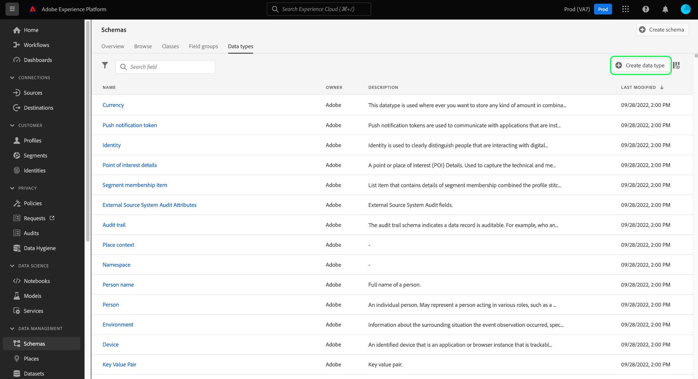
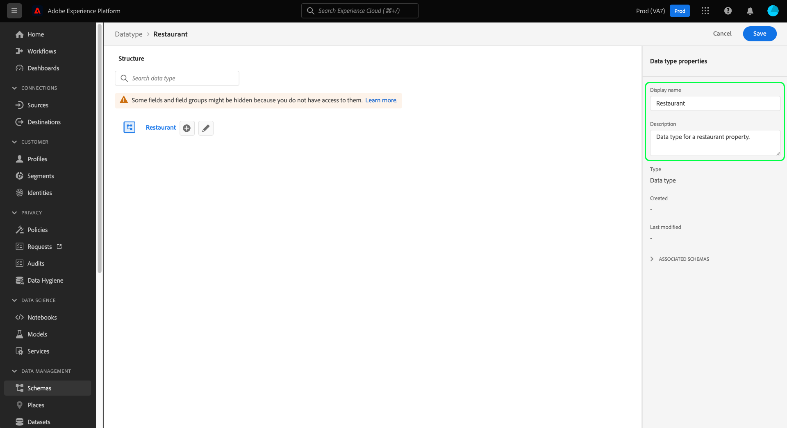

# 使用UI建立和編輯資料類型

在Experience Data Model(XDM)中，資料類型與基本常值欄位的使用方式相同，可用作類別或架構欄位群組中的參考類型欄位，主要差異在於資料類型可定義多個子欄位。 雖然與允許一致使用多欄位結構的欄位群組類似，但資料類型更有彈性，因為它們可以包含在架構結構中的任何位置，而欄位群組只能新增在根層級。

Adobe Experience Platform提供許多標準資料類型，可用於涵蓋各種常見的體驗管理使用案例。 不過，您也可以定義您自己的自訂資料類型，以滿足您獨特的業務需求。

本教學課程涵蓋在平台使用者介面中建立和編輯自訂資料類型的步驟。

## 先決條件

本指南需要對XDM System有充分的瞭解。 有關XDM在Experience Platform生態系統中的角色介紹，請參閱[XDM概述](../../home.md)，有關資料類型對XDM架構的貢獻的[架構構成基礎](../../schema/composition.md)。

雖然本指南不是必要的，但建議您也要遵循在UI](../../tutorials/create-schema-ui.md)中構成架構的[教學課程，以熟悉[!DNL Schema Editor]的各種功能。

## 開啟[!DNL Schema Editor]資料類型

在平台UI中，選擇左側導覽中的&#x200B;**[!UICONTROL Schemas]**&#x200B;以開啟[!UICONTROL Schemas]工作區，然後選擇&#x200B;**[!UICONTROL Data types]**&#x200B;標籤。 此時將顯示可用資料類型的清單，包括由Adobe定義的資料類型以及由您的組織建立的資料類型。

從這裡，您有兩個選擇：

- [建立新的資料類型](#create)
- [選擇要編輯的現有資料類型](#edit)

### 建立新資料類型{#create}

從&#x200B;**[!UICONTROL Data types]**&#x200B;標籤中，選擇&#x200B;**[!UICONTROL Create data type]**。

出現[!DNL Schema Editor]，顯示畫布中新資料類型的當前結構。 在編輯器的右側，可提供顯示名稱及資料類型的選用說明。 確保為資料類型提供唯一且簡潔的名稱，這是將資料類型添加到架構時如何標識的名稱。

本教學課程會建立描述餐廳屬性的資料類型，因此資料類型的顯示名稱為「Restaurant」。

從這裡，您可以跳至[下一節](#add-fields)開始將欄位添加到新資料類型。

### 編輯現有的資料類型

只能編輯您組織定義的自訂資料類型。 若要縮小顯示的清單，請選取篩選圖示（），以顯示根據[!UICONTROL Owner]篩選的控制項。 選擇&#x200B;**[!UICONTROL Customer]**&#x200B;以僅顯示您組織擁有的自訂資料類型。

從清單中選取您要編輯的資料類型，以開啟右側邊欄，顯示資料類型的詳細資訊。 在右邊欄中選擇資料類型的名稱，以在[!DNL Schema Editor]中開啟其結構。

## 將欄位添加到資料類型{#add-fields}

若要開始將欄位新增至資料類型，請選取畫布中根層級欄位旁的&#x200B;**plus(+)**&#x200B;圖示。 下方會顯示新欄位，右側欄位會更新以顯示新欄位的控制項。

使用右側欄中的控制項來設定新欄位的詳細資料。 有關如何配置欄位並將其添加到資料類型的具體步驟，請參閱UI](../fields/overview.md#define)中[定義欄位的指南。

餐廳資料類型需要字串欄位來代表餐廳的名稱。 因此，[!UICONTROL Field name]設為&quot;name&quot;，而[!UICONTROL Type]設為&quot;[!UICONTROL String]&quot;。 選擇&#x200B;**[!UICONTROL Apply]**&#x200B;將更改應用到欄位。

視需要繼續新增更多欄位至資料類型。 「餐廳」資料類型範例現在包含品牌、座位容量和佔地面積的額外欄位。

除了基本欄位外，您也可以在自訂資料類型中巢狀內嵌其他資料類型。 例如，Restaurant資料類型需要一個代表屬性實際位址的欄位。 在此案例中，您可以新增新的「地址」欄位，此欄位已指派標準資料類型「[!UICONTROL Postal address]」。

這說明在描述資料時，資料類型有多靈活：資料類型可以採用欄位，這些欄位也是資料類型，而這些欄位本身可以包含其他資料類型，依此類推。 這可讓您在XDM架構中抽象和重複使用常用資料模式，以更輕鬆地呈現複雜的資料結構。

在將欄位添加到資料類型後，選擇&#x200B;**[!UICONTROL Save]**&#x200B;以保存更改並將資料類型添加到[!DNL Schema Library]。

## 將資料類型添加到類或欄位組

建立資料類型後，您就可以開始在結構中使用它。 由於XDM架構由類和零個或多個欄位組組成，因此不能直接將資料類型提供的欄位添加到架構中。 但是，必須將其包含在類或欄位組中。

首先，執行將欄位添加到[類或[將欄位添加到欄位組](./field-groups.md#add-fields)中涉及的步驟。 ](./classes.md#add-fields)為新欄位選擇&#x200B;**[!UICONTROL Type]**&#x200B;時，請從下拉菜單中選擇資料類型的名稱。

## 將多欄位物件轉換為資料類型{#convert}

在[!DNL Schema Editor]中建立具有多個子欄位的對象類型欄位時，可以將該欄位轉換為資料類型，以便在不同的類或欄位組中使用相同的欄位結構。

若要將物件類型欄位轉換為資料類型，請選取畫布中的欄位。 在轉換欄位之前，請確定&#x200B;**[!UICONTROL Display name]**&#x200B;是物件將包含的資料的描述性，因為這會成為資料類型的名稱。 當您準備好轉換欄位時，請選取右側邊欄中的&#x200B;**[!UICONTROL Convert to new data type]**。

畫布會將欄位的資料類型從「[!UICONTROL Object]」更新為新的資料類型。 子欄位旁邊還有小的鎖定表徵圖，表示它們不再是單個欄位，而是多欄位資料類型的一部分。 現在，在定義新欄位時，可從&#x200B;**[!UICONTROL Type]**&#x200B;下拉式清單中選擇此資料類型，以在其他類和欄位組中重複使用此結構。

## 後續步驟

本指南涵蓋如何使用平台UI建立和編輯資料類型。 有關[!UICONTROL Schemas]工作區功能的詳細資訊，請參閱[[!UICONTROL Schemas]工作區概述](../overview.md)。

要瞭解如何使用[!DNL Schema Registry] API管理資料類型，請參閱[資料類型端點指南](../../api/data-types.md)。
