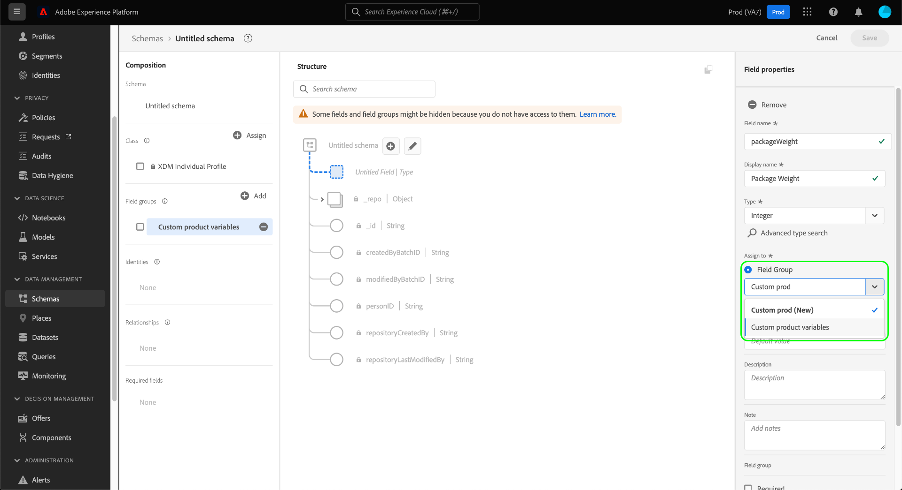

# 在 UI 中建立和編輯方案欄位 {#ui-create-and-edit}

>[!CONTEXTUALHELP]
>id="platform_schemas_fieldgroup_filter"
>title="標準或自訂欄位群組篩選器"
>abstract="可用欄位群組清單已根據其建立方式預先進行篩選。選取選項按鈕，在「標準」和「自訂」選項之間進行選擇。標準選項顯示由 Adobe 建立的實體，而自訂選項顯示在您的組織內建立的實體。請參閱文件以了解更多有關建立和編輯欄位群組的資訊。"

在Experience Data Model (XDM)中，結構描述欄位群組是可重複使用的元件，可定義一或多個實作特定功能的欄位，例如個人詳細資料、飯店偏好設定或地址。 欄位群組是要包含在實作相容類別的結構描述中。

欄位群組會根據欄位群組代表的資料行為（記錄或時間序列），定義其相容的類別。 這表示並非所有欄位群組都可用於所有類別。

Adobe Experience Platform提供許多標準欄位群組，涵蓋廣泛的行銷使用案例。 不過，您也可以建立和編輯自己的自訂欄位群組，以在XDM結構描述中定義與您的業務相關的其他概念。 本指南概述如何在Platform UI中建立、編輯及管理組織的自訂欄位群組。

## 先決條件 {#prerequisites}

本指南需要實際瞭解XDM系統。 請參閱 [XDM概覽](../../home.md) 介紹XDM在Experience Platform生態系統內的角色，以及 [結構描述組合的基本面](../../schema/composition.md) 瞭解欄位群組對XDM結構描述的貢獻。

雖然本指南並非必要，但建議您也參閱相關的教學課程： [在UI中構成結構描述](../../tutorials/create-schema-ui.md) 熟悉 [!DNL Schema Editor].

## 建立新的欄位群組 {#create}

若要建立新的欄位群組，您必須先選取要新增該欄位群組的結構描述。 您可以選擇 [建立新結構描述](./schemas.md#create) 或 [選取要編輯的現有結構描述](./schemas.md#edit).

一旦您在中開啟結構描述 [!DNL Schema Editor]，選取 **[!UICONTROL 新增]** 在 [!UICONTROL 欄位群組] 區段。

在出現的對話方塊中，選取 **[!UICONTROL 建立新欄位群組]**. 您可以在此處提供 **[!UICONTROL 顯示名稱]** 和 **[!UICONTROL 說明]** 用於欄位群組。 完成後，選取 **[!UICONTROL 新增欄位群組]**.

此 [!DNL Schema Editor] 會重新出現，新欄位群組會列在左側邊欄中。 由於這是全新的欄位群組，目前未提供任何欄位給結構描述，因此畫布保持不變。 您現在可以開始 [新增欄位至欄位群組](#add-fields).

## 篩選欄位群組 {#filter}

可用欄位群組清單已根據其建立方式預先進行篩選。預設設定會顯示由Adobe定義的欄位群組。 不過，您也可以篩選清單以顯示貴組織建立的清單。 選取選項按鈕以選擇 [!UICONTROL 標準] 和 [!UICONTROL 自訂] 選項。 此 [!UICONTROL 標準] 選項會顯示由Adobe建立的實體，以及 [!UICONTROL 自訂] 選項會顯示在您組織內建立的實體。

![此 [!UICONTROL 欄位群組] 的標籤 [!UICONTROL 方案] 工作區，使用 [!UICONTROL 標準] 和 [!UICONTROL 自訂] 反白顯示。](../../images/ui/resources/field-groups/standard-and-custom-field-groups.png)

## 編輯現有欄位群組 {#edit}

>[!NOTE]
>
>只有貴組織定義的自訂欄位群組才能完全編輯和自訂。 對於由Adobe定義的核心欄位群組，只能在個別結構描述的內容中編輯其欄位的顯示名稱。 請參閱以下小節： [編輯結構欄位的顯示名稱](./schemas.md#display-names) 以取得詳細資訊。
>
>儲存自訂欄位群組並在結構描述中使用以進行資料擷取後，之後只能對欄位群組進行附加變更。 請參閱 [結構描述演化的規則](../../schema/composition.md#evolution) 以取得詳細資訊。

若要編輯現有的欄位群組，您必須先開啟採用 [!DNL Schema Editor]. 您可以 [選取要編輯的現有結構描述](./schemas.md#edit)，或您可以 [建立新結構描述](./schemas.md#create) 並新增相關欄位群組。

在編輯器中開啟結構描述後，您就可以開始 [新增欄位至欄位群組](#add-fields).

## 新增欄位至欄位群組 {#add-fields}

>[!NOTE]
>
>本節重點介紹如何新增欄位至自訂欄位群組。 有關如何將自訂欄位新增到標準欄位群組的資訊，請參閱 [結構描述UI指南](./schemas.md#custom-fields-for-standard-groups).

若要新增欄位至自訂欄位群組，請從選取 **加(+)** 圖示加以存取（位於畫布中的結構描述名稱旁）。

一個 **[!UICONTROL 未命名的欄位]** 預留位置會顯示在畫布中，而右側邊欄會更新為顯示控制項，以設定欄位的屬性。 請參閱以下指南： [在UI中定義欄位](../fields/overview.md#define) ，以瞭解如何設定不同欄位型別的具體步驟。

在 **[!UICONTROL 指派給]**，選取 **[!UICONTROL 欄位群組]** 選項，然後使用下拉式清單從清單中選取所需的欄位群組。 您可以開始輸入欄位群組的名稱來縮小結果範圍。

在 **[!UICONTROL 指派給]**，選取 **[!UICONTROL 欄位群組]** 選項，然後使用下拉式清單從清單中選取所需的欄位群組。 您可以開始輸入欄位群組的名稱來縮小結果範圍。

將欄位新增到結構描述後，就會將其指派給所選的欄位群組。 繼續將所需數量的欄位新增至欄位群組。 完成後，選取 **[!UICONTROL 儲存]** 以儲存結構描述和欄位群組。

如果其他結構描述已採用相同的欄位群組，則新新增的欄位會自動出現在這些結構描述中。

## 後續步驟 {#next-steps}

本指南說明如何使用Platform UI建立及編輯欄位群組。 如需功能的詳細資訊， [!UICONTROL 方案] 工作區，請參閱 [[!UICONTROL 方案] 工作區概觀](../overview.md).

若要瞭解如何使用管理欄位群組 [!DNL Schema Registry] API，請參閱 [欄位群組端點指南](../../api/field-groups.md).
